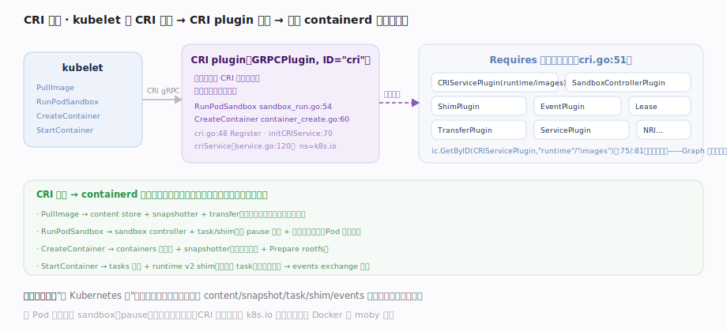
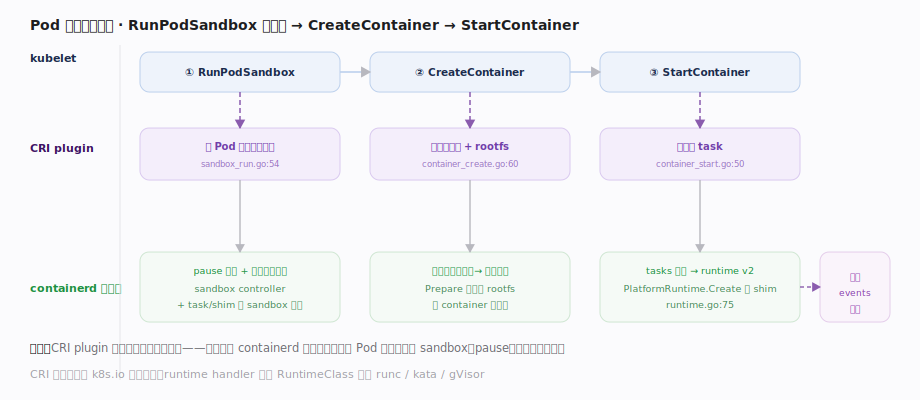
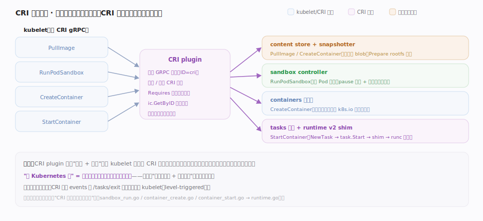

# containerd 核心原理 · 支撑子系统 · CRI 插件

> **定位**：Kubernetes 与 containerd 的桥梁。CRI（Container Runtime Interface）是 kubelet 定义的 gRPC 接口；containerd 内置一个 **CRI plugin**（一个 GRPC 插件）实现它，把 kubelet 的 RunPodSandbox / CreateContainer / PullImage 等调用翻译成对 containerd 内部子系统的操作。它是"一切皆插件 + 依赖注入"的集大成范例。核实基准：`plugins/cri/cri.go`、`internal/cri/server/`。

## 一、CRI plugin：一个插件拉齐十余依赖

图示 CRI 以一个 **GRPCPlugin**（`cri.go:48`，ID=`cri`）接入：`Requires`（`cri.go:51`）列出 CRIService/PodSandbox/SandboxController/Event/Service/Lease/Transfer/Shim 等一整串依赖类型，插件依赖图保证它们先 Init 完成，`initCRIService`（`cri.go:70`）里 `ic.GetByID` 一定取得到。**关键**：CRI plugin 自己不实现容器能力——它把 CRI 调用编排成对既有子系统（content/snapshot/task/…）的调用，是"一切皆插件 + 依赖注入"的集大成范例。CRI 服务本体在 `service.go:120 criService`。调用到子系统的映射见下表。

## 二、Pod 生命周期：RunPodSandbox → CreateContainer → StartContainer

图示 kubelet 三步调用如何落到 containerd 子系统：① **RunPodSandbox** 为 Pod 建 sandbox（pause 容器 + 网络命名空间）作"地基"，Pod 内容器共享其网络；② **CreateContainer** 拉镜像（若无）→ Prepare 快照作 rootfs → 写 container 元数据；③ **StartContainer** 经 tasks 服务落到 `PlatformRuntime.Create` 起 shim。**CRI 层不含任何进程管理代码**，全部复用 runtime v2；容器退出经 events 订阅感知。CRI 对象固定落 `k8s.io` 命名空间，与 Docker 的 `moby` 隔离。三步落点见图与下方映射表。

## 拓展 · CRI 调用到子系统映射

图释薄编排层复用厚子系统：CRI plugin 只翻译/编排，把每个 CRI 调用拆成对既有子系统的调用，自身不含进程管理代码。各调用精确落点见下表。

| kubelet 调用 | CRI plugin 动作 | 复用的 containerd 子系统 | 落点 |
|---|---|---|---|
| PullImage | 拉镜像 | content store + snapshotter + transfer | — |
| RunPodSandbox | 建 Pod 沙箱（pause + 网络） | sandbox controller + task/shim | `sandbox_run.go:54` |
| CreateContainer | 建容器对象 + rootfs | containers 元数据 + snapshotter | `container_create.go:60` |
| StartContainer | 起容器 task | tasks 服务 + runtime v2 shim | `container_start.go:50` → `runtime.go:75` |
| StopPodSandbox | 销毁沙箱 | sandbox controller | `sandbox_stop.go:35` |
| 容器退出感知 | 订阅 exit 事件更新状态 | events exchange | — |

## 调优要点

- 不跑 k8s 的部署可禁用 CRI plugin（`disabled_plugins`）减内存/攻击面。
- CRI 的 runtime handler 可映射到不同 runtime（runc / kata / gVisor），按 RuntimeClass 选择。
- 每个 Pod 一个 sandbox（pause）容器：Pod 密度高时 sandbox 开销不可忽略。
- 镜像拉取在 CRI 侧仍走 content store 去重，跨 Pod 共享层。

## 常见误区

- **containerd 天生就是给 k8s 用的**：CRI 只是众多插件之一；containerd 也直接服务 Docker/ctr。
- **CRI plugin 自己实现容器运行**：它是编排层，把 CRI 调用翻译成对既有子系统的操作，不含新的容器引擎。
- **kubelet 直接调 containerd 的 task 服务**：kubelet 只说 CRI；CRI plugin 才转成 containerd 内部调用。
- **Pod 里的容器各自独立网络**：同 Pod 容器共享 sandbox（pause 容器）的网络命名空间。

## 一句话总纲

**CRI plugin 是 containerd 里实现 kubelet CRI 接口的一个 gRPC 插件：它经 Requires 声明并注入 runtime、image、sandbox、events 等十余个依赖，把 RunPodSandbox / CreateContainer / PullImage 等 k8s 调用编排成对 containerd 既有子系统（content/snapshot/task/shim）的操作——"给 Kubernetes 用"因此只是加一个编排插件、复用全部核心能力，这正是插件化架构价值的集中体现。**
