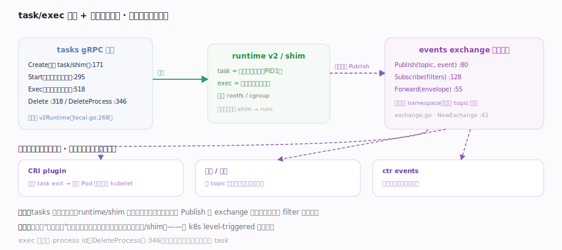
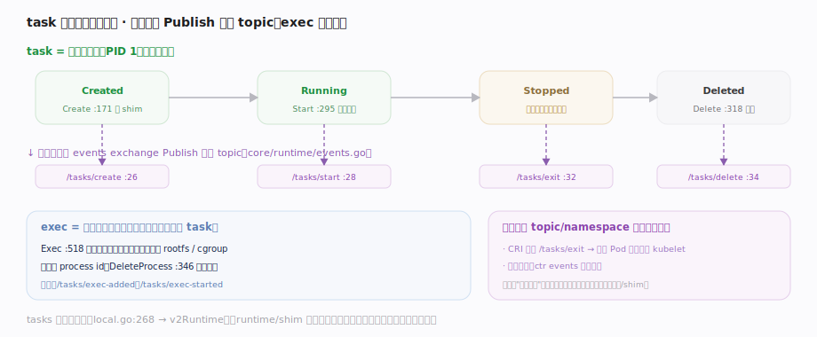

# containerd 核心原理 · 支撑子系统 · task/exec 与事件总线

> **定位**：容器的运行时操作面（task = 运行中的容器、exec = 容器内新进程）与全局可观测面（events 事件总线）。tasks gRPC 服务把 Create/Start/Exec/Delete 派发到 runtime v2；每一步状态变化经 events exchange 扇出给所有订阅者。核实基准：`plugins/services/tasks/local.go`、`core/events/exchange/exchange.go`。

## 一、task 操作派发 + 事件扇出

图示两个面：**操作面** tasks gRPC 服务提供 Create（起 task/shim）、Start（起主进程）、Exec（容器内新进程）、Delete/DeleteProcess 方法族，服务本身不干活——把请求下派到 runtime v2 的 `PlatformRuntime` 去操作 shim；**可观测面** events exchange：子系统状态变化经 `Publish` 发事件，订阅方经 `Subscribe` 按 filter 收流。**task 与 exec 之别**：task 是容器主进程（PID 1），exec 是同命名空间里额外起的进程、共享 rootfs 与 cgroup。方法与事件 topic 落点见下表。

## 二、task 状态机与事件发射：每步转移对应一个 topic

图示 task 主进程生命周期 **Created→Running→Stopped→Deleted**，每步转移都向 events exchange Publish 一个固定 topic（`/tasks/create·start·exit·delete`）。**exec 独立记账**：有自己的 process id，`DeleteProcess` 单独清理、不影响主 task。订阅侧按 topic/namespace 过滤各取所需——CRI 订阅 `/tasks/exit` 更新 Pod 状态、监控计数、ctr events 观察。**事件是"变化通知"而非真源**（真源在元数据库/shim），丢事件不致命，与 k8s level-triggered 相通。

## 深化 · 事件驱动与运行时的解耦

- **Publish/Subscribe 解耦生产者与消费者**：task 退出时运行时 Publish 一个 exit 事件，谁关心谁订阅（CRI 用它更新 Pod 状态、监控用它计数）——生产者不需知道有哪些消费者。
- **事件是通知不是真源**：事件用于"感知变化后去查真实状态"，丢事件不致命（真源在元数据库/shim）；这与 k8s 的 level-triggered 精神相通。
- **CRI 的容器退出感知**：CRI plugin 订阅 task exit 事件，据此更新它维护的 Pod/容器状态，再回报给 kubelet。
- **exec 独立记账**：exec 进程有自己的 process id，`DeleteProcess`（`plugins/services/tasks/local.go:346`）单独清理，不影响容器主 task；而删除整个 task 走 `Delete`（`plugins/services/tasks/local.go:318`）并最终调 `PlatformRuntime.Delete`（`core/runtime/runtime.go:82`）回收 shim 侧资源与退出码。

## 深化 · exchange 与 PlatformRuntime API

| 接口 | 落点 | 作用 |
|---|---|---|
| NewExchange | `exchange.go:41` | 建全局事件总线 |
| Publish / Subscribe / Forward | `exchange.go:80` · `:128` · `:55` | 发事件 / 按 filter 收流 / 转发 envelope |
| Publisher / Subscriber | `core/events/events.go:68` · `:78` | 生产者 / 消费者接口 |
| PlatformRuntime | `core/runtime/runtime.go:71` | Create `:75` 起 shim · Get `:77` 取 task · Delete `:82` 回收退出码 |

## 拓展 · task 操作与对应事件

| 操作 | tasks 服务方法 | 典型事件 topic |
|---|---|---|
| 创建 task | Create（local.go:171） | /tasks/create |
| 启动 | Start（:295） | /tasks/start |
| 容器内执行 | Exec（:518） | /tasks/exec-added, exec-started |
| 主进程退出 | （运行时上报） | /tasks/exit |
| 删除 task | Delete（:318） | /tasks/delete |

## 调优要点

- 事件订阅过多会放大扇出开销（每事件复制给每个订阅者）；用 filter 精确订阅所需 topic/namespace。
- exec 进程也占资源且共享容器 cgroup：大量 exec（探针、调试）会影响容器本身。
- task 操作经 shim，延迟受 shim 响应影响；批量操作注意超时设置。

## 常见误区

- **container 对象存在就等于容器在跑**：container 是元数据，必须创建并 Start 一个 task 才真正运行。
- **exec 会新建一个容器**：exec 只在已有容器的命名空间里起新进程，共享 rootfs/cgroup。
- **事件是可靠消息队列**：事件是尽力通知，用于触发"去查真源"，不保证不丢；关键状态以元数据库/shim 为准。
- **订阅者崩了会阻塞生产者**：exchange 扇出解耦，消费端问题不应反压核心路径。

## 一句话总纲

**task 是容器的运行实例、exec 是容器内新起的进程，tasks gRPC 服务把 Create/Start/Exec/Delete 派发给 runtime v2 去操作 shim；每一步状态变化经 events exchange 以 Publish/Subscribe 扇出给按 topic/namespace 过滤的订阅者——事件是解耦的"变化通知"而非真源，CRI、监控、ctr events 都靠它感知容器生命周期。**
