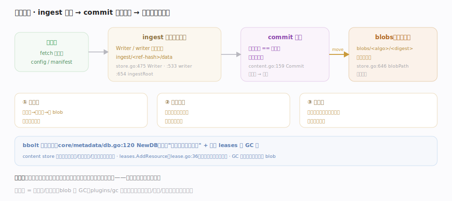
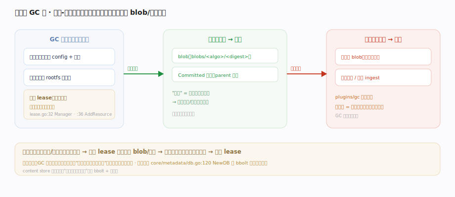

# containerd 核心原理 · 支撑子系统 · 内容寻址存储与元数据

> **定位**：containerd 的存储真源。content store 以**内容寻址**（摘要即路径）保存所有 blob——镜像层、配置、清单都按其 sha256 存 `blobs/<algo>/<digest>`，不可变、天然去重；bbolt 元数据库统管对象引用与命名空间，租约 leases 作为 GC 根防止误删。核实基准：`plugins/content/local/store.go`、`core/content/content.go`、`core/metadata/db.go`、`core/leases/lease.go`。

## 一、内容寻址：ingest 暂存 → commit 校验入库

图示 content store 的**两段式写入**：数据先经 `Writer` 写进临时 **ingest 目录**（边写边算摘要），`Commit`（`content.go:159`）**校验实算摘要 == 期望摘要**、一致才原子改名进最终 `blobs/<algo>/<digest>`——**摘要即路径**。这带来三个硬性质：① **不可变**（内容变→摘要变→新 blob，永不覆盖）；② **天然去重**（同层被多镜像引用只存一份）；③ **可校验**（读回时摘要即完整性凭据）。校验不符即拒绝，临时数据留在 ingest 供清理，绝不污染 `blobs/`。各阶段落点见下表。

## 二、租约作 GC 根：bbolt 记账 + 标记-清除

content store 只管 blob 字节，**"谁在用这个 blob"记在 bbolt 元数据库**（`NewDB` `core/metadata/db.go:120`）里，它把 content store 与各 snapshotter 包成带命名空间、带引用记账的视图。**GC 是标记-清除**：从根（镜像、容器、租约）出发标记可达的 blob/快照，未标记的由 `plugins/gc` 清除——内容寻址让这步极简，因为"引用"就是一个摘要字符串，无需扫描内容。**租约 = 临时 GC 根**（`lease.go:32/:36`）：拉取、解包这类多步操作期间先建 lease 挂住中间物，防止 GC 在操作未完成时误删；完成后镜像对象成为新根、lease 释放。故删镜像只是删引用，磁盘要等 GC 扫描后才回收。

## 深化 · 一次 blob 写入的状态流转

内容寻址存储的写入不是"打开文件直接写"，而是一条带校验闸门的短状态机，正是这条闸门保证了"库里永远没有名不副实的 blob"：

| 阶段 | 落点 | 关键动作 |
|---|---|---|
| 取写入器 | `Writer` `plugins/content/local/store.go:475` | 按 ref 建/复用一个 ingest 写入器 |
| 暂存写入 | `ingestRoot` `plugins/content/local/store.go:654` | 数据流进 `ingest/<ref-hash>/data`，边写边算摘要 |
| 校验固化 | `Commit` `core/content/content.go:159` | 实算摘要 == 期望摘要才放行 |
| 定址落库 | `blobPath` `plugins/content/local/store.go:646` | 原子改名进 `blobs/<algo>/<digest>` |
| 读回校验 | `ReaderAt` `core/content/content.go:60` | 按 `desc.Digest` 定位，摘要即完整性凭据 |

若 `Commit` 时实算摘要与期望不符（下载损坏、被篡改），写入被拒、临时数据留在 ingest 供清理，绝不会污染 `blobs/`——这条校验闸门保证"库里永远没有名不副实的 blob"。

## 拓展 · 磁盘布局

| 路径 | 内容 | 性质 |
|---|---|---|
| `<root>/blobs/sha256/<encoded>` | 已提交的不可变 blob | 内容寻址 · 去重 · 只读 |
| `<root>/ingest/<ref-hash>/data` | 写入中的临时数据 | commit 校验通过后移入 blobs |
| `<root>/ingest/<ref-hash>/ref` | ingest 的起始 ref 名 | 唯一定位进行中的写入 |
| bbolt `meta.db` | 命名空间 / 对象 / 引用 / 租约 | 记账"谁引用了哪个摘要" |

## 调优要点

- 内容寻址天然去重：多镜像共享基础层时磁盘占用远小于总和；不要按镜像数估算磁盘。
- ingest 目录残留：异常中断的拉取会留下 `ingest/*`，可安全清理未 commit 的临时数据。
- bbolt 是单写者事务库：元数据写竞争高时是瓶颈，海量对象场景关注 `meta.db` 大小与压缩。
- 删除镜像不等于立即释放磁盘：需 GC 扫描无引用 blob 后才回收。

## 常见误区

- **content store 会更新/覆盖 blob**：内容寻址、摘要即路径，永不覆盖；"改一个字节"就是一个全新 blob。
- **删镜像马上省磁盘**：删的是引用/元数据；blob 由 GC 按可达性回收。
- **content store 自己知道谁在用某层**：它只管字节，引用记在 bbolt 元数据库 + 租约里。
- **两个镜像的相同层存两份**：同摘要只存一份，天然去重。

## 一句话总纲

**containerd 的存储真源是内容寻址的 content store：所有 blob 按 sha256 存 `blobs/<algo>/<digest>`，写入经 ingest 暂存、commit 校验摘要后入库——不可变、天然去重、可校验；bbolt 元数据库记账"谁引用了哪个摘要"、租约作为 GC 根防止多步操作中途误删，GC 再按可达性回收无引用的 blob。**
