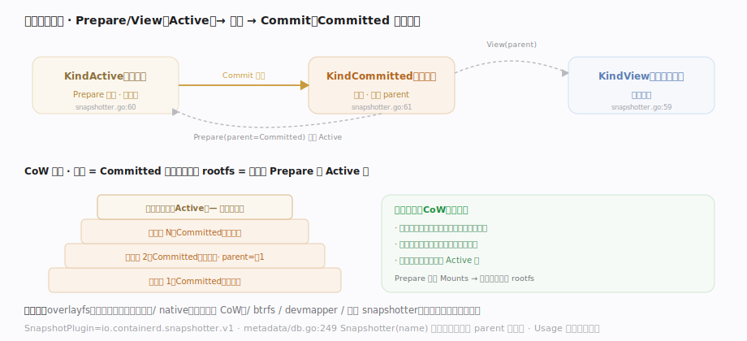
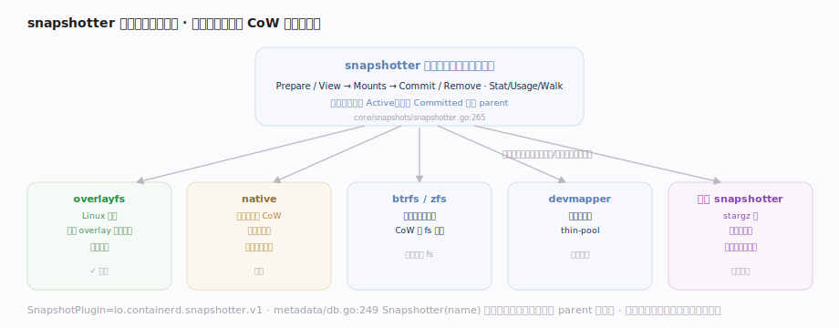
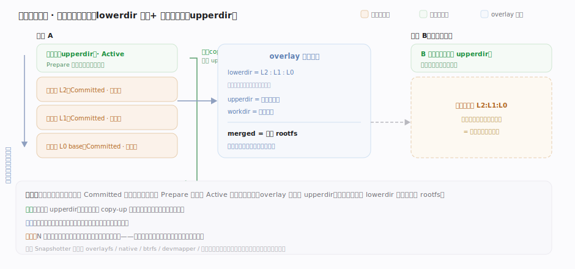

# containerd 核心原理 · 支撑子系统 · 快照 snapshotter 与 CoW

> **定位**：容器的可写根文件系统由 **snapshotter** 用**写时复制（CoW）**层栈组织。镜像的每一层是一个只读 **Committed** 快照，容器启动时在其上 `Prepare` 一个可写 **Active** 快照作为 rootfs——改动只落在这一薄层，底层镜像层跨容器共享。核实基准：`core/snapshots/snapshotter.go`、`core/metadata/db.go`。

## 一、快照生命周期：Prepare/View → 挂载 → Commit

图示快照的**三种 Kind** 与**单向生命周期**：`Prepare`/`View` 以某 Committed 快照为 parent 建一个 Active（可写／只读）快照并返回 **Mounts**，运行时挂载即得 rootfs、写因 CoW 只落这一薄层；`Commit` 把 Active 固化成新的 Committed 快照、`Remove` 释放 key。**不变量**：只有 Committed 能作 parent，Active 是进行中的可写事务，二者不可逆混用。这套抽象把镜像层与容器可写层统一成快照——镜像是 N 个链式 Committed 快照、容器 rootfs 是在顶层上 Prepare 的 Active 层（图右下 CoW 层栈）。八个方法的落点见下表。

## 二、snapshotter 可插拔：同一接口，多种 CoW 后端

图示八方法闭环事务背后是一个**可插拔接口**（`SnapshotPlugin`）：overlayfs（Linux 默认、内核联合挂载）、native（纯拷贝无 CoW、仅兜底）、btrfs/zfs（文件系统级快照）、devmapper（块级）、远程 snapshotter（stargz 懒加载）都实现同一接口、可按内核与文件系统能力替换。**选型是性能关键**——直接决定容器拉起延迟与磁盘占用；元数据层 `metadata/db.go:249 Snapshotter(name)` 再为每个实现包一层命名空间与 parent 链记账，供 GC 判可达性。

## 深化 · snapshotter 接口方法与落点

| 方法 | 作用 | 落点 |
|---|---|---|
| Prepare | 建可写 Active 快照 | `core/snapshots/snapshotter.go:309` |
| View | 建只读快照 | `core/snapshots/snapshotter.go:324` |
| Mounts | 取回挂载描述 | `core/snapshots/snapshotter.go:293` |
| Commit | 固化成 Committed | `core/snapshots/snapshotter.go:334` |
| Remove | 释放 key/快照 | `core/snapshots/snapshotter.go:342` |
| Usage/Stat | 记账与查询 | `core/snapshots/snapshotter.go:286` · `:271` |
| Walk | 遍历快照 | `core/snapshots/snapshotter.go:352` |

八个方法构成一条闭环事务：`Prepare`/`View` 开事务拿 Mounts，用完要么 `Commit` 固化、要么 `Remove` 丢弃——中间态永远是 Active，可达性交给元数据层的 bbolt 引用与 GC 判定。

## 拓展 · 从镜像到容器 rootfs

图释写时复制层栈：镜像层链作 overlay 的 lowerdir（只读、跨容器共享），容器可写层作 upperdir，写只落顶层（copy-up）、读自上而下穿透。逐层落点见下表。

| 步骤 | 快照操作 | 结果 |
|---|---|---|
| 1 | 解包镜像第 1 层 | Prepare→写入→Commit → Committed 快照 A |
| 2 | 解包第 2 层（parent=A） | Prepare(parent=A)→写→Commit → Committed 快照 B |
| … | 逐层链式 | 镜像 = Committed 快照链 |
| N | 启动容器 | Prepare(parent=顶层) → Active 快照（容器 rootfs） |
| N+1 | 容器运行 | 读穿透到底层、写只落 Active 层（CoW） |

## 调优要点

- snapshotter 选型是性能关键：overlayfs 通用高效；native 无 CoW（拷贝、慢、占空间大）仅作兜底；远程 snapshotter 可实现镜像懒加载大幅缩短启动。
- overlay 层数过深会增加联合挂载开销；精简镜像层数有收益。
- 快照与内容存储共享 GC：删容器/镜像后，无引用的快照才被回收。

## 常见误区

- **容器启动会复制整个镜像**：只在顶层 Prepare 一个空可写层（CoW），底层只读共享，不复制。
- **Active 快照能当别的容器的父层**：只有 Committed 快照能作 parent；Active 是进行中的可写层。
- **所有平台都用 overlayfs**：snapshotter 可插拔，按内核/文件系统能力选 overlayfs / native / btrfs / devmapper 等。
- **snapshotter 直接管理 blob**：它管文件系统层，镜像 blob 在 content store；unpack 把 blob 解成快照层。

## 一句话总纲

**snapshotter 用写时复制的层栈统一表达镜像层与容器可写层：镜像每层是一个只读 Committed 快照、链式串成 parent 关系，容器启动时在顶层上 Prepare 一个 Active 可写快照作 rootfs、返回 Mounts 供运行时挂载，写只落这一薄层、底层跨容器共享——overlayfs/native/btrfs 等实现同一接口可插拔替换，启动快、磁盘省。**
