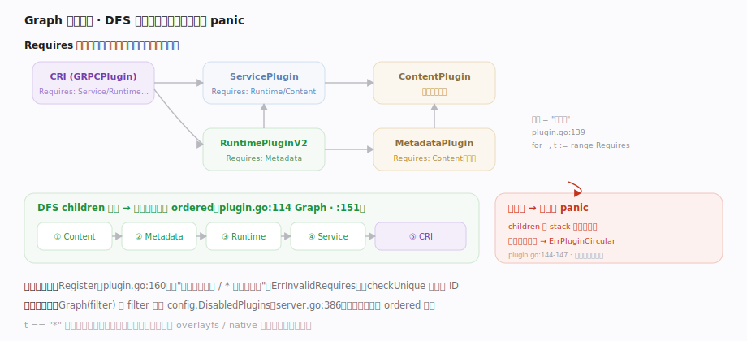

# containerd 核心原理 · 支撑子系统 · 插件化架构与守护进程

> **定位**：containerd 的**定义性特质与灵魂**——一切皆插件。守护进程启动时把所有已注册插件按 `Requires` 依赖关系**拓扑排序**，再依次 `Init`，后装的插件从共享 plugin set 里取到先装好的依赖实例（依赖注入）。禁用某插件即裁剪对应能力；第三方实现注册对应 `plugin.Type` 即融入。核实基准：`cmd/containerd/server/server.go`、`vendor/github.com/containerd/plugin/plugin.go`、`plugins/types.go`。

## 一、依赖图装配：注册 → 拓扑排序 → Init 注入

图示守护进程装配三步：`server.New` 先 `LoadPlugins`→`registry.Graph` 把全局注册表按依赖**拓扑排序**（被依赖者在前），再逐个 `NewContext`（注入目录与地址）→ `Init` → 放进**共享 plugin set**。**关键机制**：后装插件在 `InitFn` 里经 `ic.Get`/`ic.GetByID` 从这个 set 取到先装好的依赖——这就是 containerd 的依赖注入容器。非必需插件 Init 失败即跳过（daemon 继续），`required` 插件失败则整体启动失败。三步落点（`:161`/`:166`/`:189`/`:190`）标注在图上。

## 二、Graph 拓扑排序：DFS 先装被依赖者，环依赖即 panic

图示 `plugin.go` 的排序机制：每个插件只用 `Requires []Type` 声明**需要哪些类型**、不绑实现（overlayfs/native 因此可互换）；`Graph`（`plugin.go:114`）对每个插件 DFS 递归，**先把依赖装进 `ordered` 再装自己**，产出"根在前、叶在后"的初始化顺序。`children` 用 stack 记递归路径，依赖已在栈中即 `panic(ErrPluginCircularDependency)`——**环依赖在启动期而非运行时暴露**。注册期还会拒绝非法 `Requires` 与重复 ID；`Graph(filter)` 按 `config.DisabledPlugins` 剔除被禁插件、按需裁剪子系统。

## 拓展 · 一个插件的注册长相（CRI GRPC plugin）

`plugins/cri/cri.go:48` 是"依赖注入"的最佳范例——一个 GRPC plugin 声明它需要的一整串依赖类型：

| 字段 | 值 | 含义 |
|---|---|---|
| Type | `plugins.GRPCPlugin` | 它是个 gRPC 服务插件 |
| ID | `"cri"` | 类型内唯一标识 |
| Requires | CRIServicePlugin / PodSandboxPlugin / SandboxControllerPlugin / EventPlugin / ServicePlugin / LeasePlugin / TransferPlugin / ShimPlugin … | 依赖的子系统类型（`cri.go:51`） |
| InitFn | `initCRIService` | 实例化函数，内部 `ic.GetByID(CRIServicePlugin,"runtime")`（`cri.go:75`）取依赖 |

装配时 Graph 保证这些 Requires 里的插件都在 CRI 之前 Init 完成，`initCRIService` 一定能取到。

## 调优要点

- `disabled_plugins`（config.toml）按需裁剪：不跑 CRI 的场景可禁用，减内存与攻击面（`server.go:386`）。
- `required_plugins`：把关键插件列为必需，缺失即启动失败而非静默降级（`server.go:157/:223`）。
- 插件 root/state 目录由 `NewContext` 按 `config.Root/config.State + id` 注入（`server.go:170`），迁移数据要连带这些子目录。

## 常见误区

- **插件按注册顺序初始化**：实为按 `Requires` 拓扑排序（`registry.Graph`），被依赖者一定先装。
- **插件之间直接 import 调用**：应经 `Requires` 声明 + `ic.Get` 注入，保持类型解耦、可互换、可裁剪。
- **禁用插件要改代码**：改 `config.toml` 的 `disabled_plugins` 即可，Graph 的 filter 会剔除。
- **环依赖运行时才报错**：`children` 在装配期就 `panic(ErrPluginCircularDependency)`。

## 一句话总纲

**containerd 把每个子系统都做成一个声明了 `Requires` 依赖类型的插件；守护进程启动时 `registry.Graph` 用 DFS 把它们按依赖拓扑排序（被依赖者在前、环依赖即 panic），再依次 `Init` 并把结果放进共享 plugin set，后装插件经 `ic.Get` 取到先装好的依赖——这套"依赖图装配 + 注入"就是 containerd 可插拔、可扩展、可裁剪的灵魂。**
