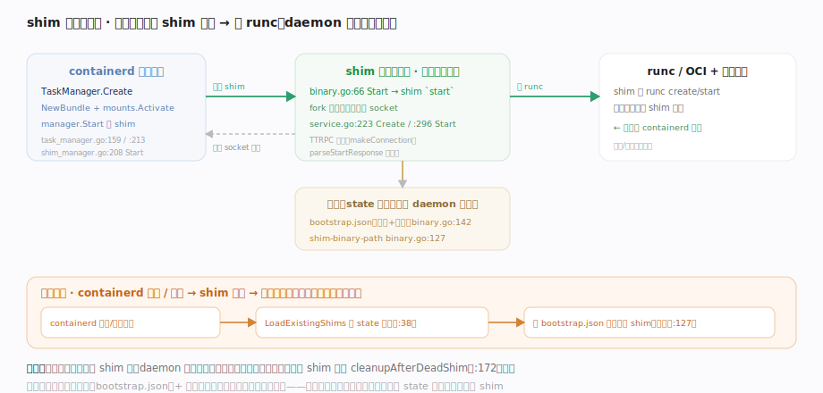
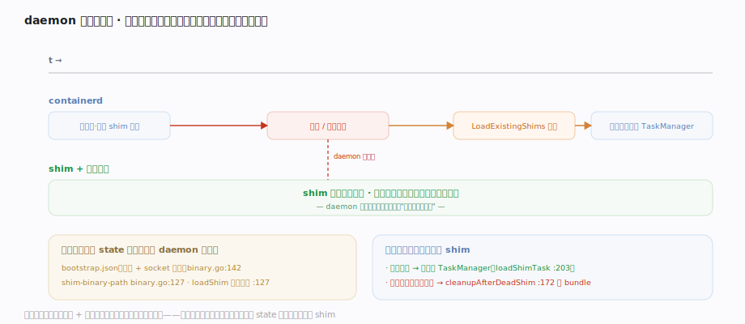

# containerd 核心原理 · 支撑子系统 · 运行时 v2 shim

> **定位**：containerd 与真实容器之间的隔离层，也是"守护进程重启状态一致"这条设计张力的答案。runtime v2 为**每个容器（或 sandbox）启动一个独立的 shim 进程**；shim 再调 runc（OCI runtime）拉起容器。容器进程挂在 shim 名下而非 containerd 名下——**containerd 可随时重启/升级而容器不死**。核实基准：`core/runtime/v2/task_manager.go`、`core/runtime/v2/shim_manager.go`、`core/runtime/v2/binary.go`、`core/runtime/v2/shim_load.go`。

## 一、创建任务：起 bundle → 启动 shim 进程 → shim 调 runc

图示创建链：task 服务把 Create 下派到 TaskManager——先 `NewBundle` 在 state 目录建 **bundle**（OCI spec + rootfs 挂载）、激活挂载，再 `manager.Start` **启动 shim 进程**：shim 二进制以 `start` 动作自己 fork 出常驻进程并回传 socket 地址，containerd 经 TTRPC 连上、让 shim 调 runc create/start 拉起容器。**结果**：一个独立 shim 守着一个容器，containerd 只持有到它的连接。各步落点（`task_manager.go:159/:213/:232`、`binary.go:66`）见图与拓展表。

## 二、重启接管：容器全程不中断，按落盘参数重连

图示 shim 架构的**核心价值**：daemon 重启时间线上，shim 与容器进程全程独立存活、不随 daemon 生死中断。机制是两处落盘 + 一段重连——`writeBootstrapParams` 把协议/地址写进 bundle 的 `bootstrap.json`（落 state 目录、不随 containerd 消失），重启时 `LoadExistingShims` 用落盘参数重连仍在运行的 shim、接管回 TaskManager；**只清真死的 shim**（连接失败才 `cleanupAfterDeadShim`）。代价：持久化连接态 + 重连逻辑 + 每容器一进程的内存开销。落点见图与拓展表。

## 拓展 · shim 生命周期方法

| 阶段 | containerd 侧 | shim 侧 / 底层 |
|---|---|---|
| 启动 shim | shim_manager.go:208 Start | shim 二进制 `start` fork 常驻进程 |
| 创建容器 | task_manager.go:232 shimTask.Create | service.go:223 Create → runc create |
| 启动容器 | tasks 服务 Start | service.go:296 Start → runc start |
| exec 进程 | tasks 服务 Exec | shim 在容器内起新进程 |
| 删除 | task_manager.go:304 Delete | shim 杀容器、清理、退出 |
| 重启接管 | shim_load.go:38 LoadExistingShims | 读 bootstrap.json 重连 |

## 调优要点

- 每容器一 shim 进程有内存开销：高密度节点关注 shim 总占用；可选支持 sandbox 级共享 shim（一个 shim 管一组容器）降低开销。
- 升级 containerd 无需杀容器，但**必须保留 state 目录**（含 bootstrap.json / bundle），否则重启后无法接管 → 变成孤儿 shim。
- runtime 可按容器指定（`opts.Runtime`）：runc、kata（VM 隔离）、gVisor 等都以 shim 形式接入。

## 常见误区

- **容器进程是 containerd 的子进程**：容器挂在独立 shim 上；containerd 只持有到 shim 的连接。
- **重启 containerd 会杀掉容器**：shim 独立存活，重启后 `LoadExistingShims` 按 bootstrap.json 重连接管。
- **containerd 直接调 runc**：containerd 启动 shim，shim 才调 runc（OCI）；隔了一层进程。
- **一个 shim 管所有容器**：runtime v2 默认每容器/每 sandbox 一个 shim 进程，故障隔离。

## 一句话总纲

**runtime v2 为每个容器启动一个独立 shim 进程：task_manager 建 bundle、Start 拉起 shim 二进制（它 fork 常驻进程并回传 socket），containerd 经 TTRPC 连上、让 shim 调 runc 拉起容器；关键是 shim 把连接参数落盘 bootstrap.json，containerd 重启后用 LoadExistingShims 重连接管仍存活的 shim——容器进程挂在 shim 而非 daemon 名下，于是 containerd 可平滑升级而容器不死。**
