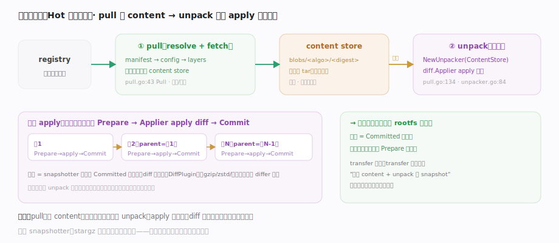
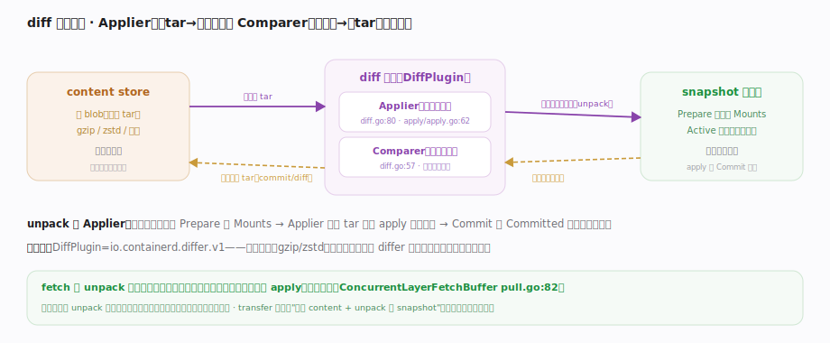
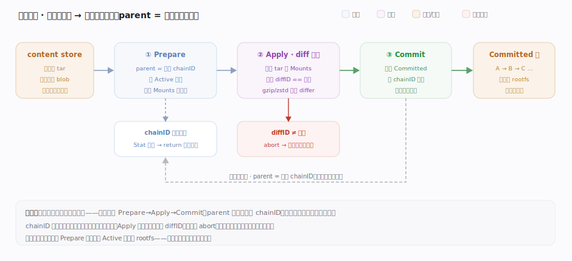

# containerd 核心原理 · 支撑子系统 · 镜像拉取与解包

> **定位**：Hot 流的第一段——把远端镜像变成本地可运行的 rootfs。分两步：**pull** 把镜像的 manifest/config/layer 按内容寻址落进 content store；**unpack** 把每个压缩层经 `diff.Applier` 解包、apply 成 snapshotter 的一个快照层。核实基准：`client/pull.go`、`core/unpack/unpacker.go`、`core/diff/diff.go`。

## 一、pull → unpack：从远端到快照层

图示 pull→unpack 两段：`Pull`（`client/pull.go:43`）经 resolver 解析引用，fetch manifest→config→各 layer，**所有字节按内容寻址落进 content store**（去重、可断点、可校验）；若 `pullCtx.Unpack` 为真则构造 `unpack.NewUnpacker`（`pull.go:134`），它持有 `Snapshotter` 与 `Applier`，**对每层在前一层快照上 Prepare 一个 Active 快照、用 Applier 把 diff apply 进去、再 Commit 成 Committed 快照**。逐层链式后镜像就成了 snapshotter 里一条 Committed 快照链，容器启动时在其顶层 Prepare 可写层即得 rootfs。逐层三步落点见下表。

## 二、diff 也是插件：Applier 与 Comparer 双向对称

图示 unpack 真正干活的 **diff 插件**（`DiffPlugin`）：`Applier`（`diff.go:80`、实现 `apply/apply.go:62`）是解包方向——把 content store 里的层 tar 解压 apply 到 Prepare 返回的挂载点；`Comparer`（`diff.go:57`）是对称的生成方向——比较两个文件系统生成层 tar。**压缩格式（gzip/zstd）、加密层由不同 differ 处理，解压逻辑不写死在核心**。fetch 与 unpack 因内容寻址而解耦、可流水线并发；已有摘要的层不重拉、已存在的快照层可跳过——这就是跨镜像复用。新式拉取走 transfer 服务，把"拉到 content + unpack 到 snapshot"封装成一次可插拔传输。

## 深化 · 逐层解包：Prepare → Apply → Commit 的一趟

unpack 的核心循环把"一个压缩层"变成"一个只读快照"，三步严格有序（chainID 已存在则整层跳过；Apply 顺带校验解压后 diffID，不符即 abort）：

| 步骤 | 落点 | 动作 |
|---|---|---|
| Prepare | `core/unpack/unpacker.go:79`（Snapshotter） | 以前一层为 parent 建 Active 快照，拿 Mounts |
| Apply | `core/diff/diff.go:80`（Applier 接口）· `core/diff/apply/apply.go:62`（`fsApplier.Apply` 实现） | 把该层 tar 解压 apply 到挂载点 |
| Commit | `core/unpack/unpacker.go:75`（Platform 驱动） | 固化成 Committed 快照，作下一层 parent |
| 统筹 | `image.Unpack` `client/image.go:301` | 对 manifest 每一层重复上述三步 |

**关键在于顺序与幂等**：层必须自底向上依次 apply（上层的 whiteout/覆盖依赖下层已就位）；若某层对应的 Committed 快照已存在（别的镜像解包过同一层），这一趟可整体跳过——这正是内容寻址+快照链带来的跨镜像复用。

## 拓展 · 一次 pull 的数据流

| 阶段 | 动作 | 落点 |
|---|---|---|
| resolve | 解析镜像引用 → 拿到 manifest 摘要 | — |
| fetch manifest/config | 按摘要下载 | content store（blob） |
| fetch layers | 并发下载各层（压缩 tar） | content store（去重） |
| unpack 逐层 | Prepare→Applier.apply→Commit | snapshotter（Committed 链） |
| 完成 | 镜像对象引用 config + 快照链 | 元数据库记引用 |

## 调优要点

- 镜像拉取常是启动瓶颈：内容寻址去重 + 并发 fetch（`ConcurrentLayerFetchBuffer`）+ 本地缓存能显著提速。
- 远程 snapshotter（如 stargz）可让镜像"懒加载"——不必拉全层即可启动，改写这条 pull/unpack 路径。
- 层数与层大小影响 unpack 时间；精简镜像、合并层有收益。
- 拉取失败留下的 ingest 临时数据可清理（见内容存储篇）。

## 常见误区

- **pull 会把镜像解压到一个目录**：pull 只把压缩层按摘要落 content store；解包成快照是 unpack 单独一步。
- **每次 pull 都全量下载**：内容寻址去重，已有摘要的层直接复用不重拉。
- **unpack 直接操作镜像 blob**：unpack 经 diff.Applier 把层内容 apply 到 snapshotter 的快照挂载点。
- **解压格式写死在 containerd**：diff 是可插拔插件，gzip/zstd/加密层由不同 differ 处理。

## 一句话总纲

**镜像拉取分两步：pull 把 manifest/config/layer 按内容寻址落进 content store（去重、可校验、可断点），unpack 再对每层在前一层快照上 Prepare、用可插拔的 diff.Applier 把层内容 apply 进去、Commit 成 Committed 快照——逐层链式后镜像就成了 snapshotter 里的快照链，这是容器 rootfs 的来源，也是 Hot 运行流的第一段。**
