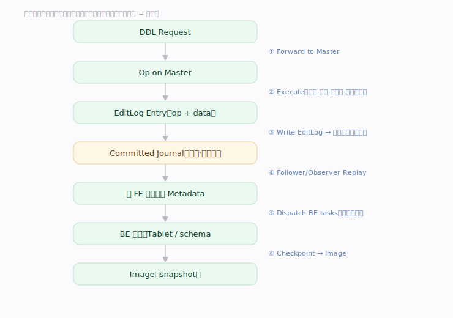
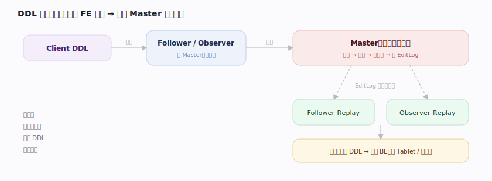
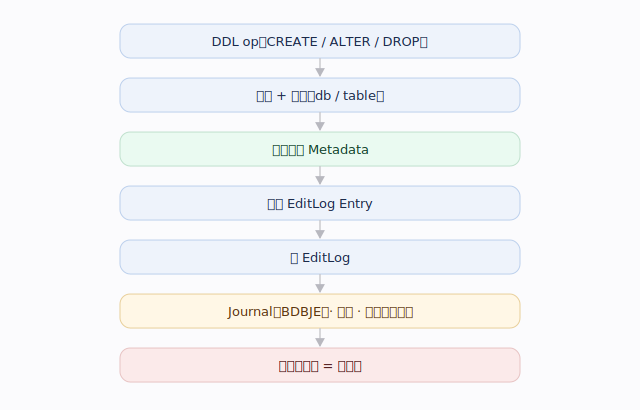
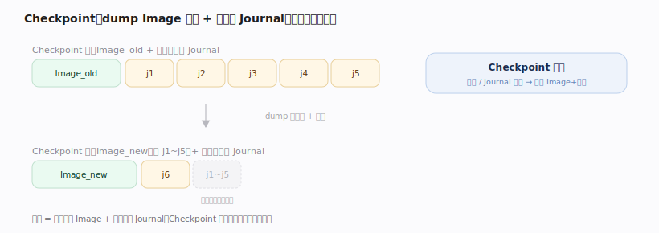
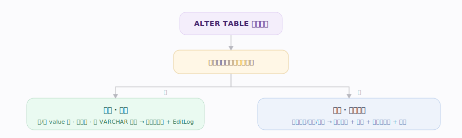
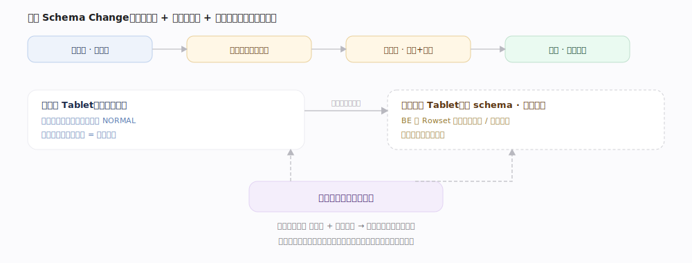
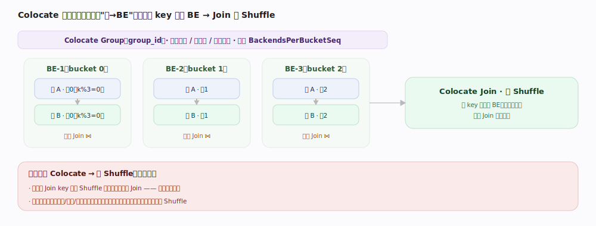
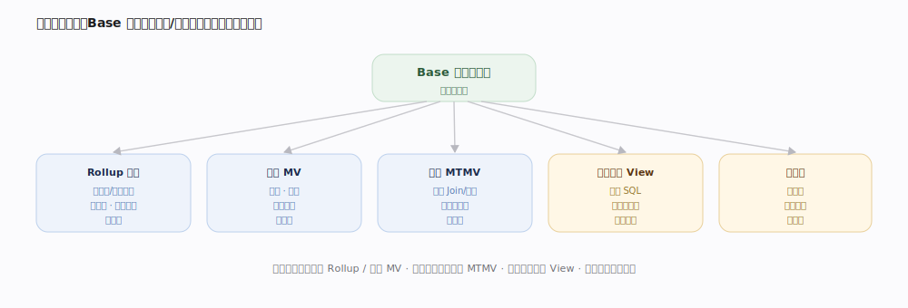

# Doris 核心原理 · DDL 数据定义（CREATE / ALTER / DROP）

> **定位**：DDL 是接口主线之一，核心落在 **元数据** 能力域（变更的持久化与全集群复制）；涉及数据的变更还会驱动 **存储引擎** 与 **后台任务**（异步数据搬迁）。

## 生命周期总览

---

## 阶段一 · 接入与转发：单写多读

非 Master 的 FE 收到写类语句时不本地执行，而是把原语句透明**转发给 Master** 再取回结果：`MasterOpExecutor.execute`（`fe/fe-core/src/main/java/org/apache/doris/qe/MasterOpExecutor.java:57`）经 RPC `forward` 到 Master 执行、并同步 Journal 位点，保证"单点写"。

---

## 阶段二 · 执行并写 EditLog（核心）

Master 改完内存后,把变更序列化成一条 op 记录写入 Journal(统一出口 `EditLog.logEdit`,不同 DDL 对应不同 op)。写入经 BDBJE 复制到多数派 Follower 后才算"提交"。

---

## 阶段三 · Replay 与最终一致

Follower/Observer 按 Journal 位点顺序拉取、Replay 到本地内存 Metadata。

---

## 阶段四 · 涉及数据的 DDL：下发 BE

Schema Change、Rollup、物化视图等触及数据的 DDL,Master 改元数据的同时向 **BE** 下发任务(建 Tablet、转换数据、构建索引),由异步作业驱动,BE 完成后回报。

**CREATE TABLE 是"同步建 Tablet"的特例**:FE 内存组装表对象后,为每个 Tablet 的每个 Replica 选定 BE、下发建 Tablet 任务,**同步阻塞等待所有 BE 回报建好或超时**,之后才写 EditLog 并返回成功。

## 深化 · 涉数据 DDL 的同步 / 异步之分

| 类别 | 典型 DDL | BE 下发 | FE 是否阻塞等 |
|---|---|---|---|
| 异步作业 | Schema Change / Rollup / 物化视图 | 建 Tablet + 转换数据 + 构建索引 | 否,作业驱动、BE 回报 |
| 同步特例 | CREATE TABLE | 建空 Tablet 副本 | 是,全副本回报或超时才写 EditLog |

---

## 阶段五 · Checkpoint：日志压缩与恢复

`Checkpoint`（`fe/fe-core/src/main/java/org/apache/doris/master/Checkpoint.java:53`）是周期守护线程：`runAfterCatalogReady`（`Checkpoint.java:80`）在独立内存中 `loadImage`（`:141`）旧镜像、`replayJournal`（`:142`）追平增量，再 `saveImage`（`:149`）生成新 Image，之后即可截断该位点前的旧 Journal，控制回放长度与内存。

---

## 深化 · Schema Change 轻重之分

| 维度 | 轻量 Lightweight | 重量 Heavyweight |
|---|---|---|
| 典型变更 | 加/删 value 列、改列名、改 VARCHAR 长度 | 改列类型、改主键、改列序、改排序键 |
| 数据文件 | 不重写 | 逐文件重写 |
| 耗时 | 秒级 | 分钟 ~ 天 |
| 额外存储 | 无 | 转换期近翻倍 |
| 机制 | 改元数据 + EditLog | 影子索引 + 双写 + 异步作业 |

轻/重的判定与重量作业的建立都在 `SchemaChangeHandler`：能否轻量在 `SchemaChangeHandler.java:297` 一带判定（加/删 value 列、改列名等走轻量），重量变更由 `createJob`（`SchemaChangeHandler.java:1278`）建立影子索引作业。

---

## 深化 · 重量 Schema Change 的影子索引与双写

| 阶段 | 动作 |
|---|---|
| 待执行 | 建影子索引 Tablet（平行于原索引） |
| 等事务（分水岭） | 等分水岭位点前的事务完成；之后新写入靠**双写**兜底 |
| 执行中 | 逐文件读基线 → 列映射转换 → 写影子；不改排序键"直接转"，改了则"重排序转" |
| 完成 / 翻牌 | 副本健康则影子索引转正替换原索引；多数副本失败则取消回滚 |

---

## 深化 · 两级数据划分与对象层级

| 层级 | 划分依据 | 作用 |
|---|---|---|
| Partition 分区 | 时间/范围/枚举 | 分区裁剪、生命周期管理（TTL/冷热） |
| Bucket / Tablet 分桶 | Hash / Random | 并行、副本、均衡的最小单位 |
| Replica 副本 | 按 Tag 分布 | 可用性与读吞吐 |

分区类型：

| 类型 | 依据 | 用途 |
|---|---|---|
| 无分区 | 整表一个隐式分区 | 小表 |
| Range | 范围（常按时间） | 时序 / 生命周期分层 |
| List | 枚举值列表 | 离散维度 |
| 动态分区 | 按时间滚动自动增删 | 时序自维护 |
| 自动分区 | 写入时按分区键值自动建 | 免预建分区 |

Colocate 表组：同组表共享"桶→BE"分布，使 Join 免 Shuffle。

---

## 拓展 · 结构对象全景

| 对象 | 存数据 | 更新方式 | 多表 | 查询命中 | 适用 |
|---|:--:|---|:--:|---|---|
| Rollup 上卷 | 是（派生） | 随基表 | 否 | 自动路由 | 固定维度聚合加速 |
| 同步物化视图 | 是 | 实时随基表 | 否 | 透明改写 | 单表加速 |
| 异步物化视图 | 是 | 按策略刷新 | 是 | 透明改写 | 多表预计算 |
| 逻辑视图 View | 否 | — | 是 | 查询时展开 | 逻辑复用 |
| 临时表 | 是（会话级） | — | — | — | 中间结果 |

---

## 拓展 · DROP 软删除与回收站

| 方式 | BE 上 Tablet | 可恢复性 | 适用 |
|---|---|---|---|
| DROP（默认） | 延迟删除（回收站过期或汇报时） | 保留期内可 `RECOVER` | 常规删除、防误删 |
| DROP ... FORCE | 立即物理删除 | 不可逆 | 确认无需后彻底清理 |

---

## 调优要点（关键开关）

- 表属性 `light_schema_change`：启用轻量 Schema Change（加/删列秒级）。
- 动态分区：`dynamic_partition.enable / time_unit / start / end / prefix / buckets`。
- 自动分区：`AUTO PARTITION BY`（写入时按值自动建分区）。
- `colocate_with`：加入 Colocate 表组（同组同分布，Join 免 Shuffle）。
- 分桶数：建表 `BUCKETS auto` 或手动指定，决定并行度上限；单个 Tablet 数据量宜控制在合理区间（过多小 Tablet 抬高元数据与调度开销，过少限制并行）。
- `replication_num` / `replication_allocation`：副本数与按 Tag（资源组/机房）的副本分布。
- 回收站：`catalog_trash_expire_second` 控软删除保留期，权衡可恢复性与占用。
- 重量变更并发：Schema Change / Rollup 作业受并发上限约束，避免同时搬迁挤占后台资源。

---

## 常见误区与工程要点

- **DDL 不是所有节点瞬时生效**：只读节点有复制延迟，刚建对象可能短暂不可见。
- **高频建表 / 小 DDL 伤系统**：元数据单点写吞吐有限，应合并 DDL；海量小表 / 超多分区是元数据反模式。
- **涉及数据的变更是异步作业**：Schema Change 等要搬迁数据、耗时占后台资源；重量变更期间表存储近乎翻倍，需预留磁盘。
- **改列类型 / 改主键 / 改列序是重量操作**：能用轻量加列表达的需求不要走重写路径。
- **DROP 默认可恢复但非永久**：回收站过期即真正删除，重要误删要在保留期内 `RECOVER`；`FORCE` 不可逆。
- **CTAS 是"建表 + 导入"两步**：中途导入失败会回滚删表，大结果集要评估耗时与资源。

---

## 源码锚点（jdolap-engine 分支核实）

> 下列 `file:行号` 在用户 Doris 分支 FE 侧 grep 核实，串起"转发→执行→写日志→回放→Checkpoint→建表/变更"主线。

- **转发写请求到 Master**：`fe/fe-core/src/main/java/org/apache/doris/qe/MasterOpExecutor.java:57`（`execute`，非 Master 节点 RPC forward）。
- **建表入口**：`fe/fe-core/src/main/java/org/apache/doris/datasource/InternalCatalog.java:1203`（`createTable`，按引擎分派）。
- **OLAP 建表主体**：`InternalCatalog.java:2349`（`createOlapTable`，组装表对象、下发建 Tablet）。
- **同步等 BE 建好**：`InternalCatalog.java:2102`（`MarkedCountDownLatch`，阻塞等所有 Tablet 回报或超时）。
- **实际发建 Tablet 任务**：`InternalCatalog.java:3402`（`createTablets`）。
- **EditLog 统一出口**：`fe/fe-core/src/main/java/org/apache/doris/persist/EditLog.java:1585`（`logEdit`）。
- **建表日志 op**：`EditLog.java:1673`（`logCreateTable`）；变更作业 `EditLog.java:2158`（`logAlterJob`）；改属性 `EditLog.java:2185`（`logModifyTableProperty`）。
- **变更分派**：`fe/fe-core/src/main/java/org/apache/doris/alter/Alter.java:639`（`processAlterTable`）。
- **Schema Change handler**：`fe/fe-core/src/main/java/org/apache/doris/alter/SchemaChangeHandler.java:140`（类）、`:1278`（`createJob` 建影子索引作业）。
- **Checkpoint 守护**：`fe/fe-core/src/main/java/org/apache/doris/master/Checkpoint.java:80`（`runAfterCatalogReady`）、`:149`（`saveImage`）。

---

## 一句话总纲

**元数据变更是"单点写、全序复制、多点回放"的状态机演进：任何 FE 收到 DDL 转发给 Master；Master 校验加锁、改内存、写 EditLog 复制多数派（提交点）；Follower/Observer 按序 Replay 达成一致，涉及数据的 DDL 再下发 BE；Checkpoint 定期生成 Image 并截断旧日志。**
