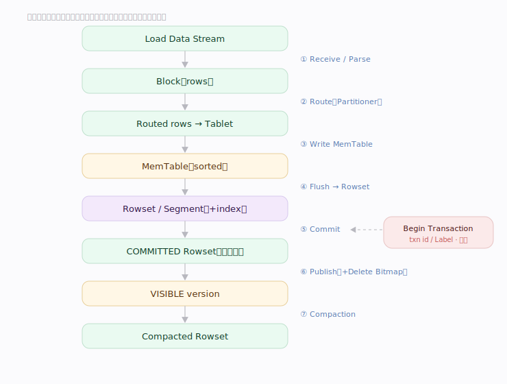
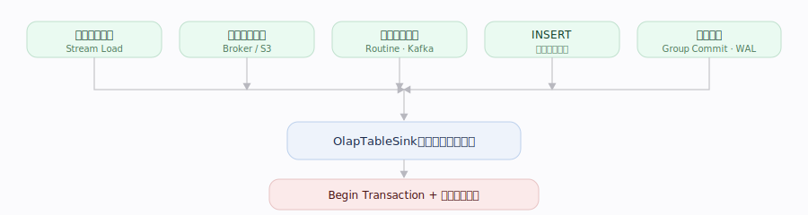
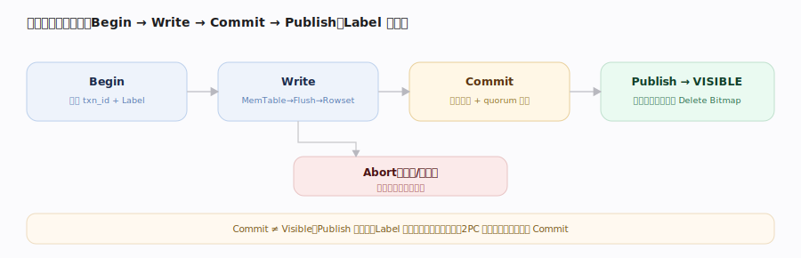
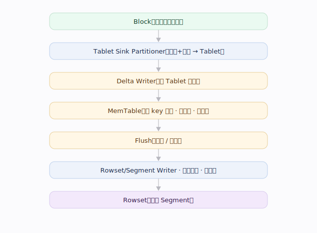
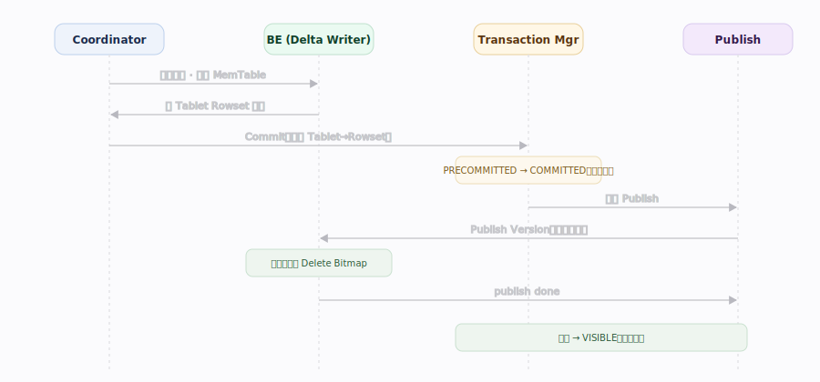
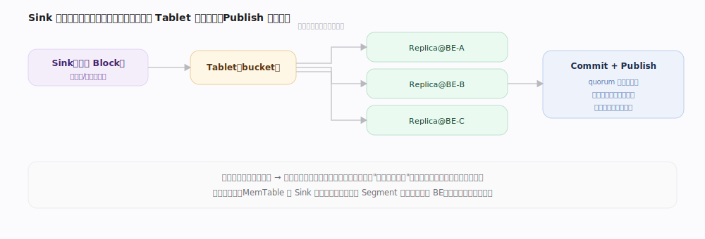
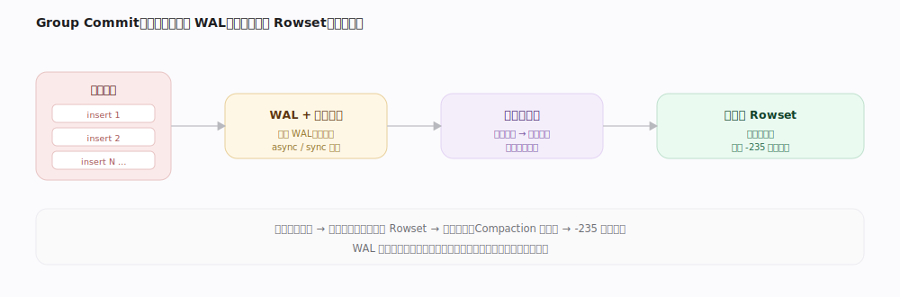
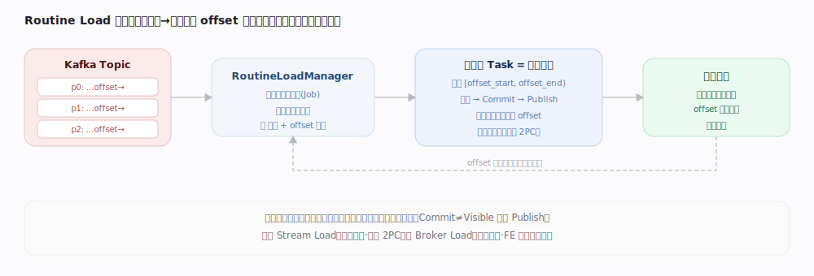
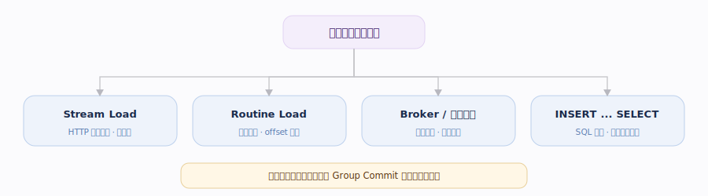

# Doris 核心原理 · DML 数据操纵（INSERT / UPDATE / DELETE / Load）

> **定位**：DML 是接口主线之一，以 **事务一致性** 为骨架，依赖 **存储引擎**（落盘 Rowset）与 **执行引擎**（并行写入），后台由 **后台任务** 做 Compaction，受 **资源与负载管理** 约束。

## 生命周期总览

---

## 阶段一 · 导入方式与接入

---

## 阶段二 · 事务状态机（2PC）

---

## 阶段三 · 写入路径：Route → MemTable → Rowset

---

## 阶段四 · 提交、发布与主键更新

---

## 阶段五 · 后台 Compaction

新数据可见后，持续导入产生大量小 Rowset。

---

## 补充：数据副本的写入与版本对齐

每个 **Tablet** 有多 **Replica**，一次导入需写入其多副本、达约定成功数（多数派/全部）才算该 Tablet 写成功；Publish 时各副本按同一版本号对齐。

---

## 深化 · Sink 分发与副本一致性

Sink 按分区/分桶算出每行归属 Tablet，把同一行**复制发往该 Tablet 所有副本 BE**（同序数据 → 各副本独立排序去重得逐字节一致）。

高吞吐路径可让 **MemTable 在 Sink 节点构建**、把已排序 Segment 流式发往存储 BE（免各副本重复排序），由会话开关控制。

---

## 深化 · UPDATE / DELETE 与并发控制

| 操作 | 机制 | 前提 / 裁决 | 适用 |
|---|---|---|---|
| UPDATE | 写新值 + Delete Bitmap 标记旧行 | 主键（MoW）表 | 行级更新 |
| 部分列更新 | 只写变更列、其余列保留 | 主键表，未写列有默认值或取旧行 | 宽表少量列更新 |
| 条件 DELETE | 谓词标记 / 删除数据集，不重写全量 | — | 按条件删 |
| 并发同键写 | 按 **sequence 列**值高者胜 | 指定 sequence 列 | 乱序写入定最终值 |
| Group Commit | 先落 WAL 再异步/同步攒批入库 | — | 高频小写合并 |

---

## 拓展 · 导入方式的调度差异

| 导入方式 | 数据来源 | 事务发起 | 断点 / 幂等 | 适用 |
|---|---|---|---|---|
| Stream Load | HTTP 同步推流 | 客户端，单次一事务 | Label 幂等，可选 2PC | 实时小批、低延迟 |
| Broker / 对象存储 Load | 远端文件（HDFS/S3） | FE 异步调度分发 | Label 幂等 | 大批量离线 |
| Routine Load | 消息队列持续消费 | FE 周期拆子任务、每批一事务 | offset 断点续传 | 流式精确一次 |
| INSERT ... SELECT | SQL 查询结果 | Coordinator 内部开事务 | Label 幂等 | 引擎内加工写回 |
| Group Commit | 上述之上攒批 | 合并进一个批次 | WAL 保障 | 高频小写降版本数 |

---

## 拓展 · 导入错误码与写入约束

| 错误码 | 含义 | 触发 | 应对 |
|---|---|---|---|
| -235 TOO_MANY_VERSION | Tablet 版本数超上限 | 小批高频写、Compaction 追不上 | 攒批 / Group Commit、提 Compaction 并发 |
| -238 TOO_MANY_SEGMENTS | 单 Rowset Segment 过多 | 单批数据过大 / 倾斜 | 拆批、调分桶、控单批大小 |
| -230 VERSION_ALREADY_MERGED | 请求版本已被合并 | 读到已 Compaction 掉的旧版本 | 重取快照后重试 |

---

## 拓展 · 导入最佳实践与精确一次

- **攒批**：单批建议数十 MB~GB，避免小批高频（产生大量小 Rowset、放大 Compaction）；高频场景用 **Group Commit** 自动攒批。
- **并发**：按 Tablet 数与 BE 资源设并发，过高造成写倾斜与内存压力。
- **精确一次**：同批用固定 **Label** 幂等重试；Routine Load（Kafka）按 offset 断点续传；Stream Load 可选 2PC 与外部系统对齐。
- **容错**：`max_filter_ratio` 控可容忍坏行、错误明细见 error URL；攒批期 **WAL** 保证不丢、重启可恢复。

---

## 调优要点（关键开关）

- 表属性 `replication_num`：副本数（默认 3）；`enable_unique_key_merge_on_write`：主键写时合并。
- Stream Load `max_filter_ratio`：容错阈值；`strict_mode`：严格模式（类型不合规是否拒绝）。
- `group_commit`（off / sync_mode / async_mode）：攒批导入，缓解高频小写。
- 主键并发：`function_column.sequence_col` 指定 sequence 列做冲突裁决。
- 部分列更新：`partial_columns=true`（只写变更列）。

---

## 常见误区与工程要点

- **"Commit 成功"≠"查得到"**：必须 Publish 才 VISIBLE；两阶段导入若外部不触发最终提交，事务会悬挂占资源。
- **小批高频写入是反模式**：产生大量小 Rowset，Compaction 追不上则版本数堆积，触发"版本过多"写拒绝——应攒批或用 Group Commit。
- **主键更新非原地改**：写新行 + Delete Bitmap 标记旧行，代价在 Publish 期前置；乱序写入需 sequence 列裁决，否则"最后写入"未必是"最新值"。
- **Label 保留期要适中**：过短会误判重复导入、过长占元数据。
- **部分列更新有前提**：主键表才支持，且未写的列需有默认值或来自旧行，否则报错。
- **导入并发与副本数联动**：副本越多写放大越大；写倾斜（个别热 Tablet）会拖慢整批。

---

## 源码锚点（jdolap-engine 分支核实）

> 下列 `file:行号` 均在用户 Doris 分支源码 grep 核实，串起"接入 → 2PC 事务 → 写 MemTable/Rowset → Publish 可见（主键算 Delete Bitmap）"。

- **导入接入**：`fe/fe-core/src/main/java/org/apache/doris/load/StreamLoadHandler.java:229`（`generatePlan`，Stream Load 生成写入计划）。
- **INSERT 开事务**：`fe/fe-core/src/main/java/org/apache/doris/nereids/trees/plans/commands/insert/OlapInsertExecutor.java:105`（`beginTransaction`）。
- **INSERT 收尾**：`OlapInsertExecutor.java:215`（`onComplete`）。
- **2PC Begin**：`fe/fe-core/src/main/java/org/apache/doris/transaction/DatabaseTransactionMgr.java:313`（`beginTransaction`）。
- **2PC Commit（只记元数据 + quorum 校验）**：`DatabaseTransactionMgr.java:775`（`commitTransaction`）。
- **Publish 令版本可见**：`DatabaseTransactionMgr.java:1111`（`finishTransaction`）、`:2350`（`updateVisibleVersionAndTime`）。
- **BE 写入**：`be/src/olap/delta_writer.h:132`（`write`）。
- **BE 落盘构建 Rowset**：`delta_writer.h:138`（`build_rowset`）、`:140`（`commit_txn`）。
- **MemTable 排序去重**：`be/src/olap/memtable.h:172`（`MemTable`）、`:257`（`_sort`）。
- **MemTable flush 成 Block/Segment**：`memtable.h:192`（`to_block`）。
- **主键 MoW 算 Delete Bitmap**：`be/src/olap/base_tablet.cpp:528`（`calc_delete_bitmap`）。
- **Publish 期标记旧行**：`base_tablet.cpp:1404`（`update_delete_bitmap`）。

---

## 一句话总纲

**写入以事务为骨架：Begin Transaction 下发计划；按 partition+bucket 路由后写 MemTable、Flush 成 Segment 并归入 Rowset；Commit 只记元数据并做副本 quorum 校验，必须经 Publish Version 才 VISIBLE（主键表此时算 Delete Bitmap）；此后 Compaction 长期维护。**
