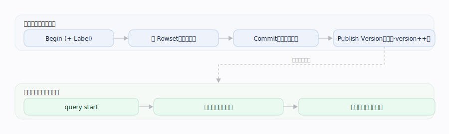
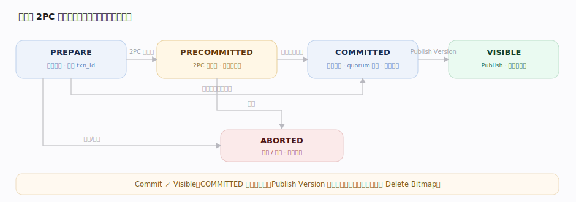
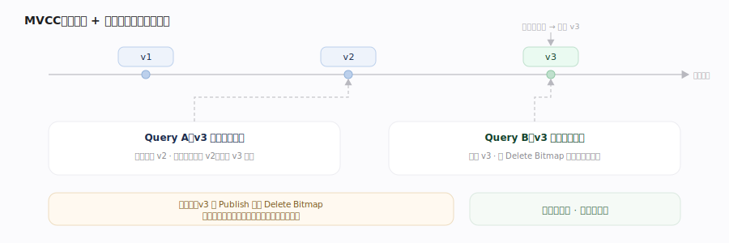
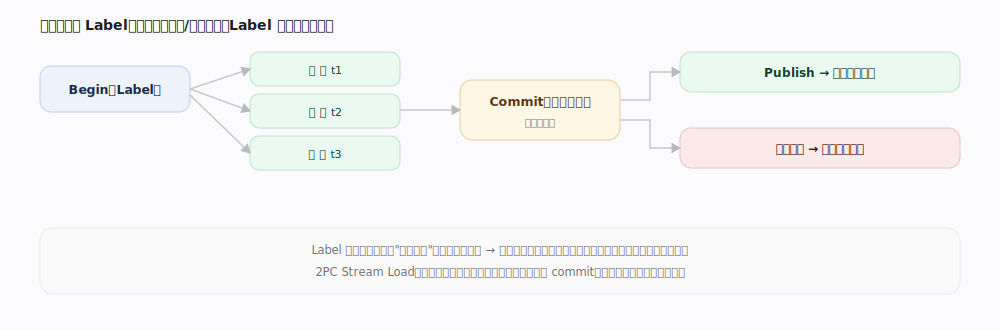
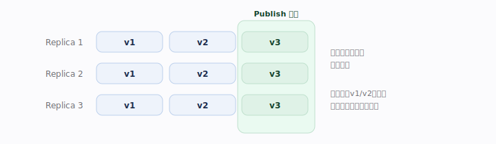
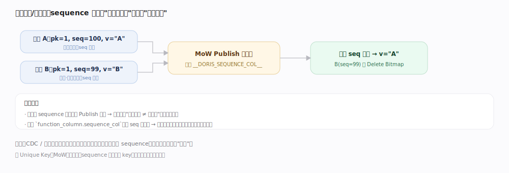

# Doris 核心原理 · 支撑主线 · 事务与一致性

> **定位**：事务一致性**建立在元数据主线之上**——事务状态与 Tablet 版本号靠 EditLog 持久化并复制到多数派。本线是"语义与协议"，元数据是其"持久化与复制机制"。

## 一、Write Transaction × Read Snapshot

---

## 二、Transaction 状态机（2PC）

---

## 三、Version 与多版本可见性（MVCC）

---

## 补充：一致性契约（精确表述）

| 契约 | 表述 | 边界 |
|---|---|---|
| Snapshot Consistency | 一次查询锁定一个 Version 读到底 | 单查询内一致 |
| Read-Your-Writes | 同会话内自己已提交并发布的写随后可读 | 路由到一致位置 |
| Bounded Eventual | 只读节点因复制延迟可能短暂读不到 | 跨节点、最终收敛 |

---

## 深化 · 多表事务 与 Label 生命周期

**多表事务**：一事务内对多表 begin/写/commit，同时可见或同时回滚（维度表↔事实表联动）。

---

## 深化 · 版本链、多副本对齐与旧版本回收

---

## 拓展 · 隔离级别与可见性（精确表述）

| 维度 | 语义 | 裁决 |
|---|---|---|
| 读隔离 | 快照隔离（Snapshot）：锁定一个已发布版本读到底 | 无幻读、不受并发写影响 |
| 写-写 | 同分区并发导入各为独立事务 | 最终值由 Publish 顺序决定 |
| 主键并发 | 同键并发写 | 由 sequence 列裁决 |
| 可见性原子性 | 一批导入整体 VISIBLE 或整体不可见 | 绝不读到半批 |
| 事务锁 | 无跨行事务锁 / 长事务 | 靠 MVCC 版本，读写互不阻塞 |

---

## 深化 · 2PC 各阶段：持久化 vs 可见

| 阶段 | 持久化内容 | 数据可见 |
|---|---|---|
| PREPARE | 事务登记（txn_id / Label） | 否 |
| PRECOMMITTED | 数据落盘（Rowset），2PC 预提交 | 否 |
| COMMITTED | 元数据记提交 + 副本 quorum 校验 | 否 |
| VISIBLE | Publish Version 翻牌（主键此时算 Delete Bitmap） | 是 |

**Commit ≠ Visible**：COMMITTED 只保证"数据已持久化"，Publish 才保证"可见"。

**外部 2PC 的用途**：PRECOMMITTED 这个"落盘但不可见、可提交可回滚"的中间态，正是给 Flink / Spark 等外部系统做**端到端 exactly-once** 用的——外部框架在自己的 checkpoint 里先让 Doris 预提交，checkpoint 成功再触发 Commit、失败则 Abort，把两侧的成败绑定为一个原子决策（对应 Stream Load `two_phase_commit`）。

---

## 调优要点（关键开关）

- Stream Load `two_phase_commit`：两阶段导入（预提交 + 外部触发提交）。
- 事务超时与 **Label 保留期**：过短误判重复、过长占元数据。
- `group_commit`：攒批降低事务/小文件开销。
- 主键并发：`function_column.sequence_col` 指定 sequence 列裁决乱序写。

---

## 常见误区与工程要点

- **Commit ≠ Visible**：Publish Version 才是可见开关。
- **两阶段导入的 PRECOMMITTED 需外部触发 Commit**：否则事务悬挂。
- **长事务与海量小事务都伤系统**：前者拖住旧版本回收，后者放大日志与元数据压力。

---

## 源码锚点（jdolap-engine 核实）

> FE 路径前缀 `fe/fe-core/src/main/java/org/apache/doris/transaction/`；BE 路径前缀 `be/src/olap/`。

| 机制 | 源码位置 | 说明 |
|---|---|---|
| Begin 入口 | `GlobalTransactionMgr.java:162` → `DatabaseTransactionMgr.java:313` `beginTransaction` | 登记 txn_id / Label，初始状态置 `PREPARE`（`TransactionState.java:334`） |
| Label 幂等去重 | `DatabaseTransactionMgr.java:343` `unprotectedGetTxnIdsByLabel`（:220） | 同 requestId 抛 `DuplicatedRequestException`（:361）、Label 已被非中止事务占用抛 `LabelAlreadyUsedException`（:364） |
| 状态机枚举（2PC） | `TransactionStatus.java:21-26` | `UNKNOWN/PREPARE/COMMITTED/VISIBLE/ABORTED/PRECOMMITTED`；切换入口 `TransactionState.java:512` `setTransactionStatus` |
| PRECOMMITTED（外部 2PC） | `DatabaseTransactionMgr.java:405` `preCommitTransaction2PC` | 落盘但不可见的中间态，供外部框架 checkpoint 绑定 |
| Commit + quorum 校验 | `DatabaseTransactionMgr.java:775` `commitTransaction` | 每 Tablet 成功副本不足 `loadRequiredReplicaNum` 抛 `TabletQuorumFailedException`（:651） |
| Publish 翻牌可见 | `DatabaseTransactionMgr.java:1111` `finishTransaction`；quorum 复核 `finishCheckQuorumReplicas`（:1372） | COMMITTED→VISIBLE 的可见开关 |
| Publish 后台派发 | `PublishVersionDaemon.java:90` `publishVersion` → :108 `traverseReadyTxnAndDispatchPublishVersionTask` | FE 周期扫描 ready 事务、下发 PublishVersionTask |
| BE 执行 Publish | `engine_publish_version_task.cpp:97` `EnginePublishVersionTask::execute` | BE 侧应用版本；主键表在此算 Delete Bitmap（埋点 :60 `tablet_publish_delete_bitmap`） |
| Abort / 回滚 | `DatabaseTransactionMgr.java:1747` `abortTransaction`、:1793 `abortTransaction2PC` | 失败或超时回滚 |
| MVCC Version | `olap_common.h:227` `struct Version{first,second}`；版本链裁剪 `version_graph.h:60` `capture_consistent_versions` | 读快照锁定一个 Version 沿版本链取一致集合 |
| 主键 Delete Bitmap | `tablet_meta.h:418` `class DeleteBitmap` | Publish 时标记被覆盖行，实现主键 MVCC 可见性 |
| BE 侧提交（跨引用 DML） | `be/src/olap/delta_writer.h:138` `build_rowset`、:140 `commit_txn` | 写入侧把 MemTable 落成 Rowset 并向 FE 上报 commit，供 2PC 汇总 |

---

## 一句话总纲

**事务与一致性靠 Version 连接两条线：写事务原子提交、经 Publish Version 翻牌可见；读快照锁定一个 Version 读到底、不受并发写影响。**
