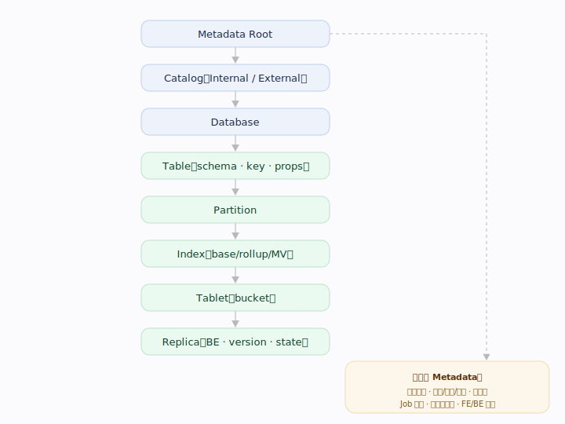
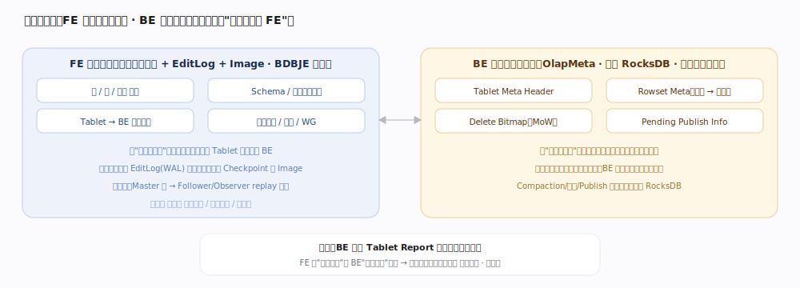
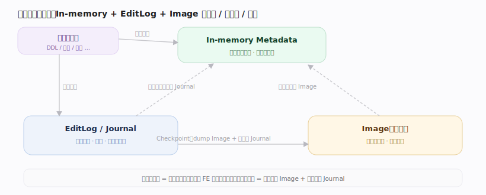
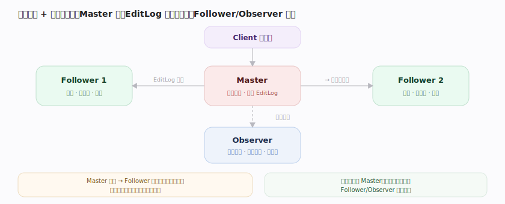
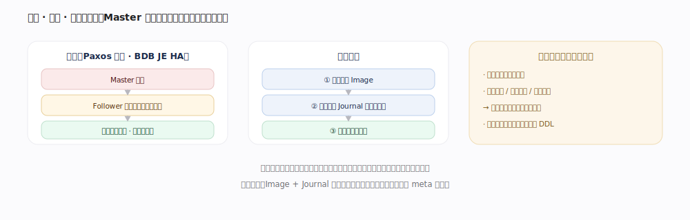
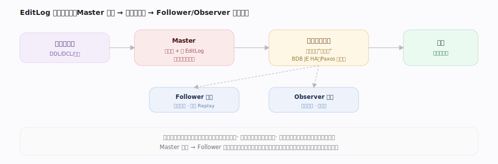

# Doris 核心原理 · 支撑主线 · 元数据

> **定位**：元数据是底座能力域之一（全局状态的根），几乎所有线都依赖它——事务状态、权限、Workload Group、副本位置、物化定义都存在这里；异步部分（Checkpoint）由 **后台任务** 承接。

## 一、元数据组织架构（Metadata Organization）

---

## 一·补　两层元数据（FE 逻辑 / BE 物理）

元数据分两层。**FE 全局逻辑元数据**（库/表/分区、Schema/物化定义、Tablet→BE 副本分布、事务/权限/WG）走"全内存 + EditLog + Image + BDBJE 复制",记的是"有哪些对象、每个 Tablet 该在哪些 BE";**BE 本地物理元数据**存在每块数据盘的 **OlapMeta（内嵌 RocksDB）** 里,记的是"本机盘上到底有哪些版本、哪些文件"。二者靠 **Tablet Report 对账**（FE"逻辑应有" vs BE"物理实有"）保持一致（见 集群自愈 · 对账）。下文 §二~§七聚焦 FE 这一层。

## 深化 · 两层元数据的载体与内容

| 层 | 载体 | 记录内容 | 何时改动 |
|---|---|---|---|
| FE 逻辑元数据 | 全内存 + EditLog + Image + BDBJE 复制 | 库/表/分区、Schema/物化定义、Tablet→BE 副本分布、事务/权限/WG | DDL/事务/调度 |
| BE 物理元数据 | 每盘 OlapMeta(内嵌 RocksDB) | Tablet Meta Header、Rowset Meta(版本→文件)、Delete Bitmap、Pending Publish Info | 导入/Compaction/Publish 落本地 |
| 一致性 | Tablet Report 对账 | FE"逻辑应有" vs BE"物理实有" 周期比对 | 差异触发 Clone/删除 |

---

## 二、持久化三位一体（In-memory + EditLog + Image）

| 组件 | 角色 | 特性 |
|---|---|---|
| In-memory | 服务所有读 | 全量常驻内存、最快 |
| EditLog / Journal | 记录每次变更 | 增量、全序、多数派持久 |
| Image | 某位点全量快照 | 恢复起点、截断旧日志 |

---

## 三、单写多读与复制（Master / Follower / Observer）

| 角色 | 可写 | 参与选主/多数派 | 用途 |
|---|:--:|:--:|---|
| Master | 是 | 是 | 唯一写入点，串行化所有元数据变更 |
| Follower | 否 | 是 | 元数据冗余 + 选主候选，读扩展 |
| Observer | 否 | 否 | 只读扩展、异地容灾，不影响选主 |

---

## 补充：读一致性与路由

只读节点存在**有界复制延迟**。

---

## 深化 · 选主 · 恢复 · 元数据压力

复制组用 **Paxos 家族协议（BDB JE HA）**：Master 宕机后 Follower 基于已提交位点选出新 Master、对客户端透明，已提交变更不丢。角色切换在 `Env.transferToMaster`（`fe/fe-core/src/main/java/org/apache/doris/catalog/Env.java:1636`）与 `transferToNonMaster`（`Env.java:2008`）；成为 Master 前先 `replayJournal(-1)` 追平（`Env.java:1666`）。

---

## 深化 · EditLog 的全序、提交点与幂等回放

| 性质 | 含义 | 保障 |
|---|---|---|
| 全序 | 每条日志有单调递增日志号，全局有序 | 所有 FE 同序回放才收敛（状态机复制前提） |
| 提交点 | 复制到多数派才算提交 | 持久性 + 选主时判"哪些已提交不能丢" |
| 幂等回放 | 回放与正向执行严格对称、可重复 | 每个写操作须有配对回放逻辑 |

---

## 拓展 · 备份与灾备

- **备份**：定期备份元数据目录（Image + Journal）；Image 是快照、Journal 是增量，二者齐全才能恢复到最新。
- **恢复**：新 Master 加载最近 Image、回放后续 Journal 到最新位点即可对外。
- **多副本 FE**：Follower 提供元数据冗余与选主；跨机房可部署 Observer 扩展读或异地容灾。
- **数据侧备份**：`BACKUP` / `RESTORE` 把表数据备份到远端仓库，与元数据备份配合实现整体灾备。

---

## 深化 · 重启恢复流程

| 步 | 动作 |
|---|---|
| ① 加载 Image | 读最近全量快照进内存 |
| ② 回放 Journal | 按位点顺序 Replay Image 之后的增量 EditLog |
| ③ 追平 | 到达最新已提交位点 |
| ④ 对外服务 | 选主后 Master 可读写，Follower/Observer 只读 |

---

## 调优要点（关键开关）

- 元数据目录（`meta_dir`：image + bdb journal）是备份关键，务必定期备份。
- `SHOW FRONTENDS`：看各 FE 角色与回放进度（journal id 落后量判延迟）。
- 强一致读元数据走 Master；能容忍延迟的读分散到 Observer 扩展吞吐。
- 控分片规模（避免海量小表/超多分区）以降元数据内存与选主/回放压力。

---

## 常见误区与工程要点

- **单点写限制元数据写吞吐**：别当高频 OLTP 元数据存储用。
- **只读节点有复制延迟**：强一致读元数据应读 Master。
- **元数据目录是备份关键**：Image + Journal 丢失将难恢复，务必定期备份。

---

## 源码锚点（jdolap-engine 分支核实）

> FE 侧串起"内存树 + EditLog + Image 三位一体"，BE 侧为本地 RocksDB 元数据；均已在用户分支 grep 核实。

- **EditLog 统一出口**：`fe/fe-core/src/main/java/org/apache/doris/persist/EditLog.java:1585`（`logEdit`）。
- **Journal 写多数派**：`fe/fe-core/src/main/java/org/apache/doris/journal/bdbje/BDBJEJournal.java:130`（`write(JournalBatch)`）。
- **提交点（已 finalize 位点）**：`BDBJEJournal.java:706`（`getFinalizedJournalId`）。
- **回放 Journal**：`fe/fe-core/src/main/java/org/apache/doris/catalog/Env.java:3081`（`replayJournal`）。
- **加载 Image**：`Env.java:2205`（`loadImage`）。
- **保存 Image**：`Env.java:2564`（`saveImage`）。
- **选主切换**：`Env.java:1636`（`transferToMaster`）、`Env.java:2008`（`transferToNonMaster`）。
- **Checkpoint 守护**：`fe/fe-core/src/main/java/org/apache/doris/master/Checkpoint.java:80`（`runAfterCatalogReady`）。
- **BE 本地元数据（RocksDB）**：`be/src/olap/olap_meta.cpp:77`（`OlapMeta::init` 打开 RocksDB）、`:156`（`put`）。
- **Tablet Header 持久化**：`be/src/olap/tablet_meta_manager.cpp:90`（`TabletMetaManager::save`）。
- **Delete Bitmap / Pending Publish 落盘**：`tablet_meta_manager.cpp:236`（`save_delete_bitmap`）、`:172`（`save_pending_publish_info`）。

---

## 一句话总纲

**元数据是一棵 Catalog→DB→Table→Partition→Index→Tablet→Replica 的层次树（加事务/权限/资源/作业等全局状态），靠 In-memory + EditLog + Image 三位一体持久化：Master 单点写、EditLog 复制多数派（提交点），Follower/Observer 按序 Replay 一致，Checkpoint 定期生成 Image 并截断旧日志。**
