# Doris 核心原理 · 支撑主线 · 存储引擎

> **定位**：存储引擎是底座能力域之一（与元数据并列为地基），为 DQL/DML 提供数据组织与读写；异步部分（Compaction、清理）由 **后台任务** 承接。

## 一、数据组织架构（Data Organization）

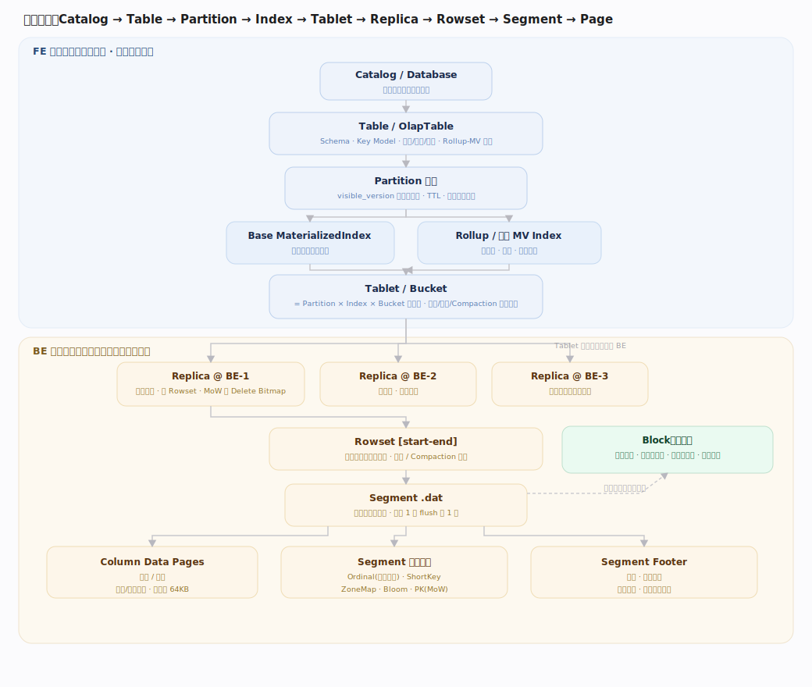

---

## 二、三种数据模型（Data Model）

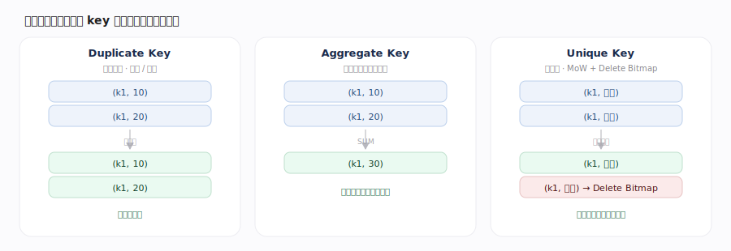

| 模型 | 写入行为 | 更新 | 加速 | 适用 |
|---|---|---|---|---|
| Duplicate | 保留每行原样 | 不支持 | 明细扫描 | 日志/明细 |
| Aggregate | 同键按聚合函数合并 | 预聚合累加 | 预聚合下推 | 固定维度汇总 |
| Unique | 键唯一、保留最新 | 支持（MoW） | 主键点查/更新 | 实时更新维表 |

---

## 三、索引体系：多级"可跳过"（Skip Chain）

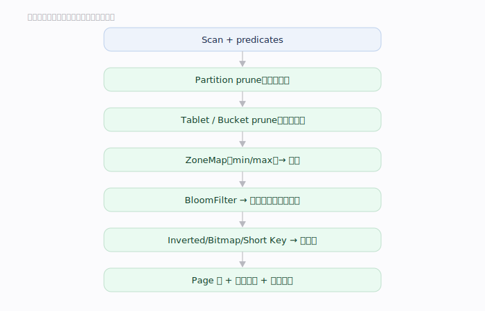

| 索引 | 粒度 | 判定 | 适用 |
|---|---|---|---|
| Short Key / 前缀 | 排序键前缀 | 定位有序区间 | 高频前缀过滤 |
| ZoneMap | Page/Segment | min/max 跳过 | 范围查询 |
| BloomFilter | 列 | 判"一定不存在" | 高基数等值 |
| Inverted 倒排 | 词/token | 命中候选行 | 文本/日志检索 |
| Bitmap | 列 | 位运算过滤 | 低基数枚举 |
| Page Index | Page 内 | 字典 filter + 延迟物化 | 减少解码 |
| Ordinal | 每列 | 行号 → 页内偏移 | 定位数据页（基础索引） |
| Primary Key | 主键（MoW） | 有序二分定位 rowid | 主键点查/更新 |
| NGram BloomFilter | 列 | n-gram 概率过滤 | LIKE / 子串 |
| ANN | 向量列 | 近似最近邻 topK | 向量检索 |

各索引原理：

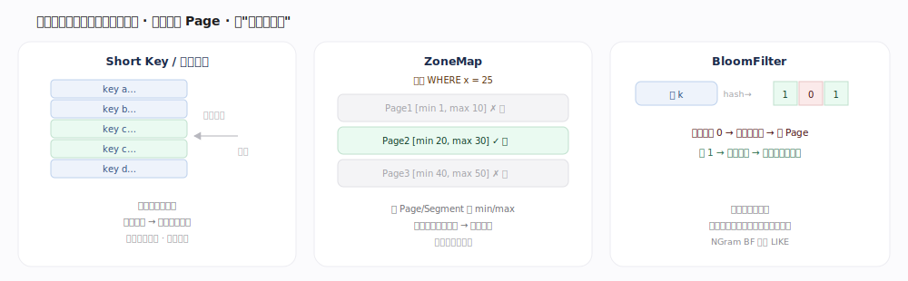

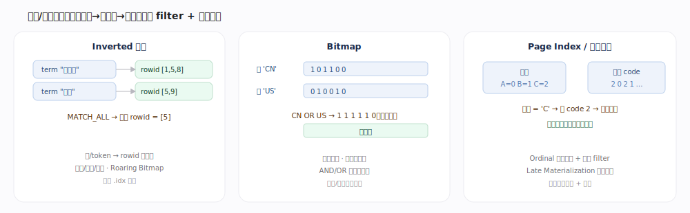

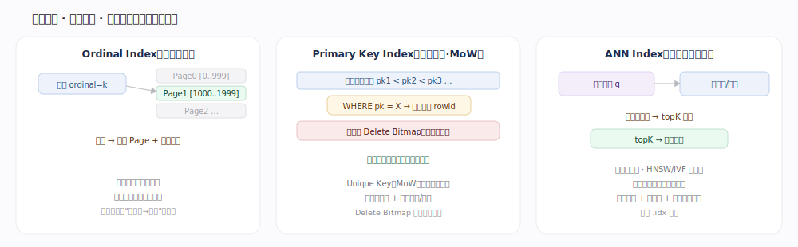

---

## 四、列存与编码压缩（Columnar）

数据**列式**存储：同列连续，便于按需读列、高压缩、向量化；每列 Encoding + Compression 双层压缩，按 key 有序（区间跳过/归并基础）。

| 编码 | 适用列 | 原理 |
|---|---|---|
| PLAIN | 通用兜底 | 原样存 |
| DICT 字典 | 低基数 | 存字典 id，重复值高压缩 |
| RLE 行程 | 连续重复 / 布尔 | 存值 + 游程长度 |
| BIT_SHUFFLE | 数值列 | 按位重排提升压缩率 |

外层再叠 LZ4 / ZSTD 块压缩。

---

## 五、读取路径（取数）

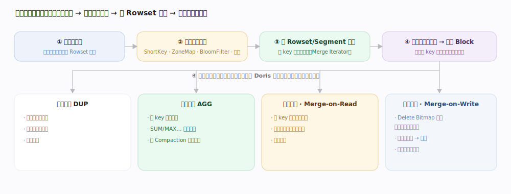

读取把一批不可变 Rowset **现场还原成一份逻辑视图**：按查询版本选中覆盖该版本的 Rowset 集合 → 每个 Segment 走索引裁剪跳掉无关行 → 跨 Rowset/Segment 按 key 有序堆归并 → 按数据模型收口同一 key 的多版本。**归并路数越多越慢**,这正是"小 Rowset 多拖慢查询"的根因,也是 Compaction 的意义。

| 模型 | 读侧收口 | 读性能 |
|---|---|---|
| Duplicate 明细 | 不去重,直接输出 | 最快 |
| Aggregate 聚合 | 读时按 key 聚合 | 中 |
| Unique · MoR | 现场取最新版本 | 慢 |
| Unique · MoW | Delete Bitmap 预屏蔽旧行,免读时去重 | 快 |

---

## 补充：内表之外——External Storage

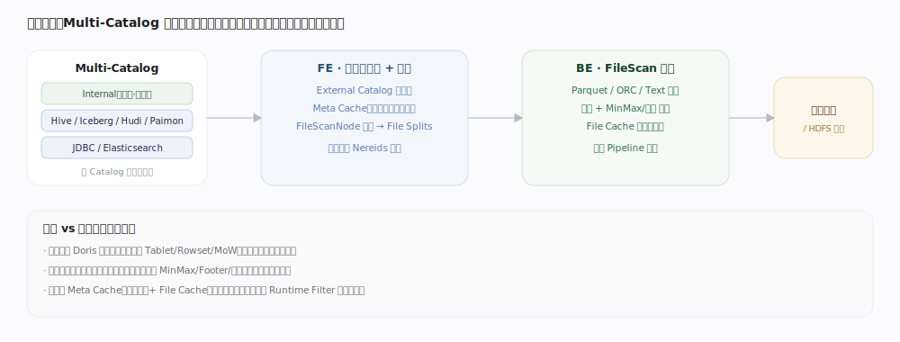

本引擎全权管理 **内表**（自组织为 Tablet/Replica/Rowset/Segment）。

---

## 深化 · 冷热分层（Storage Policy）

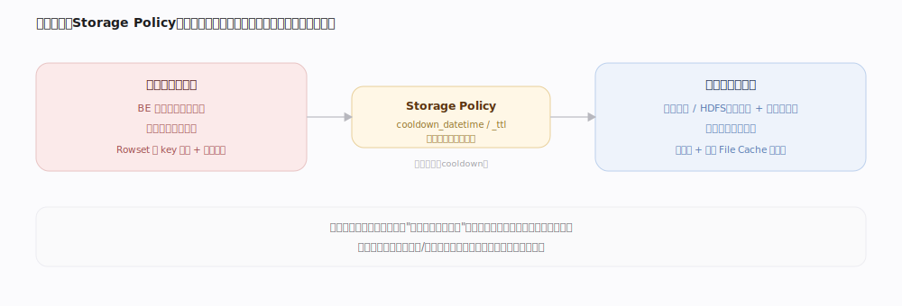

存储不止"全放本地"。

---

## 深化 · 主键模型的两种实现（读时合并 vs 写时合并）

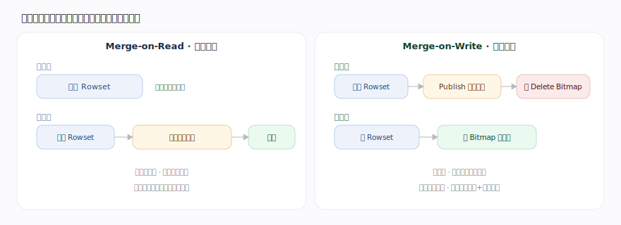

| 实现 | 写入 | 读取 | 读放大 | 适用 |
|---|---|---|---|---|
| Merge-on-Read | 只追加（快） | 同键多版本现场归并去重 | 明显 | 写多读少 |
| Merge-on-Write | Publish 期算 Delete Bitmap（重） | 按 Bitmap 跳旧行、免归并 | 接近明细表 | 高频更新 + 高频查询 |

---

## 深化 · 部署形态与文件缓存

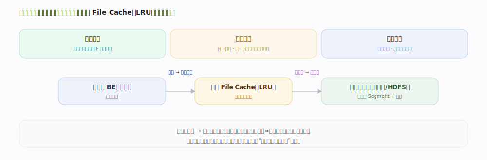

| 形态 | 数据位置 | 弹性 | 读延迟 | 适用 |
|---|---|---|---|---|
| 存算一体 | 本地盘（多副本） | 扩缩需搬数据 | 本地最快 | 稳定高性能 |
| 冷热分层 | 热数据本地 + 冷数据远端 | 冷数据省本地盘 | 冷数据稍慢 | 长周期历史数据 |
| 存算分离 | 共享存储（对象存储/HDFS） | 计算无状态、分钟级扩缩不搬数据 | 远端 + 本地 File Cache 兜底 | 弹性/多租户 |

---

## 拓展 · 建表设计要点（工程经验）

| 决策 | 原则 | 收益 / 风险 |
|---|---|---|
| 排序键 / 前缀索引 | 列顺序即排序，高频过滤/低基数列放前（默认前若干列 / 36 字节） | ZoneMap 与前缀跳过最有效 |
| 分桶数 | 单 Tablet 数据量适中（经验百 MB~GB），桶数 ≈ 数据量/单桶目标，对齐并行度 | 过多小 Tablet 抬元数据与调度开销 |
| 分桶键 | 选高基数、Join/聚合常用列 | 支撑 Colocate / Bucket Shuffle |
| 索引选择 | 高基数等值→Bloom；文本→倒排；低基数枚举→Bitmap | 按查询模式取舍，勿滥建 |

---

## 调优要点（关键开关）

- 表属性 `replication_num`（副本数）、分桶数（BUCKETS）、`compression`（压缩算法）。
- 索引：`bloom_filter_columns`（布隆）、`CREATE INDEX ... USING INVERTED`（倒排）、建表列顺序即前缀/排序键（默认前 36 字节 / 3 列）。
- 冷热分层：`STORAGE POLICY` + `cooldown_datetime` / `storage_cooldown_ttl`（冷数据下沉对象存储）。
- 主键：`enable_unique_key_merge_on_write`；点查：`store_row_column`（行存）。

---

## 常见误区与工程要点

- **索引不是越多越好**：增写入与存储成本，低选择率列收益有限。
- **Bucket Key 设计决定上限**：影响并行度与 Join 是否免 Shuffle，是建表关键决策。
- **Unique Key 有代价**：写放大与去重内存开销，非更新场景优先 Duplicate/Aggregate。

---

## 源码锚点（jdolap-engine 分支核实）

> 下列 `file:行号` 在用户 Doris 分支 BE `be/src/olap` 下 grep 核实，覆盖组织、读取、Compaction、主键索引。

- **Tablet 主对象**：`be/src/olap/tablet.h:113`（`Tablet`，一个分桶副本的读写单元）。
- **按版本选 Rowset**：`be/src/olap/tablet.h:192`（`capture_rs_readers`，读时按版本选覆盖的 Rowset 集）。
- **挑候选做 Cumulative**：`be/src/olap/tablet.h:284`（`pick_candidate_rowsets_to_cumulative_compaction`）。
- **Segment 主对象**：`be/src/olap/rowset/segment_v2/segment.h:85`（`Segment`）。
- **走索引裁剪的迭代器**：`segment.h:103`（`new_iterator`，按 StorageReadOptions 下推谓词）。
- **索引惰性加载**：`segment.h:277`（`_load_index_once`，首次用到才载入短键/ZoneMap 等）。
- **Compaction 基类**：`be/src/olap/compaction.h:64`（`Compaction`）、`:73`（`execute_compact`）。
- **归并降路数**：`compaction.h:105`（`merge_input_rowsets`，把小 Rowset 合并、减少读时归并路数）。
- **主键有序定位**：`be/src/olap/base_tablet.cpp:437`（`lookup_row_key`，主键索引定位 rowid）。
- **MoW 算 Delete Bitmap**：`base_tablet.cpp:528`（`calc_delete_bitmap`）、`:351`（`calc_delete_bitmap_between_segments`）。
- **写入内存态**：`be/src/olap/memtable.h:172`（`MemTable`，行转列、排序去重的内存缓冲）。
- **落盘构建 Rowset（跨引用 DML）**：`be/src/olap/delta_writer.h:138`（`build_rowset`）。

---

## 一句话总纲

**存储引擎把数据按 Table→Partition→Tablet→Replica→Rowset→Segment→Page 分层组织，列存 + Encoding/Compression + 有序 + 多级 Index，让查询逐层裁剪、跳过、少读、少解码。**
