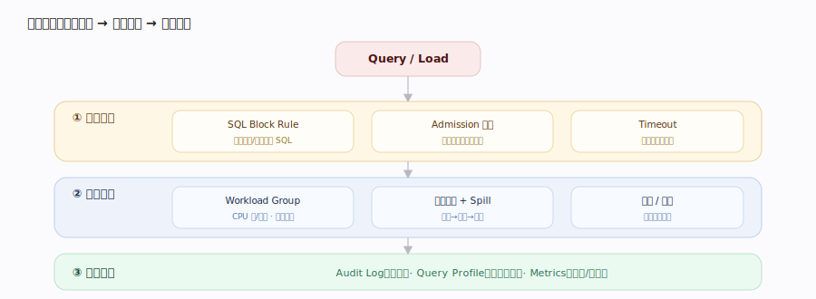
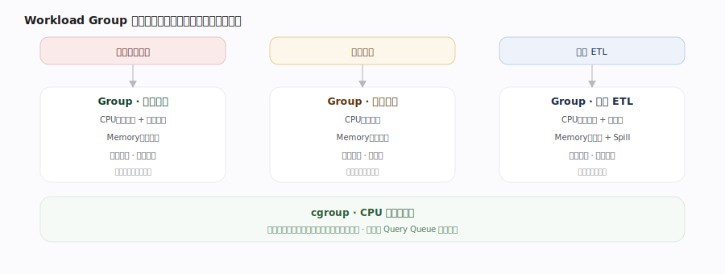
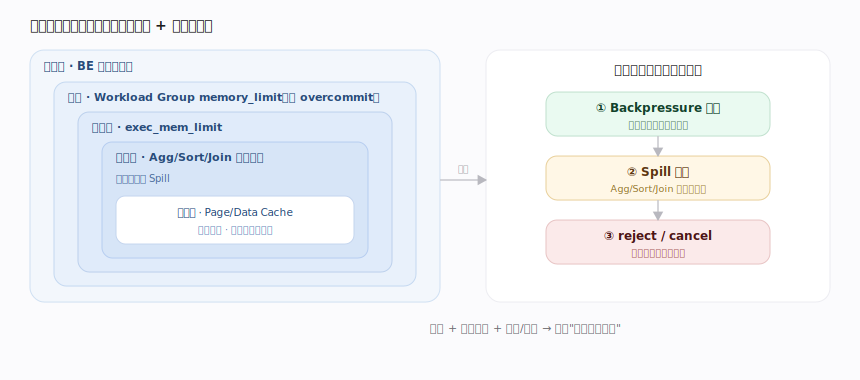
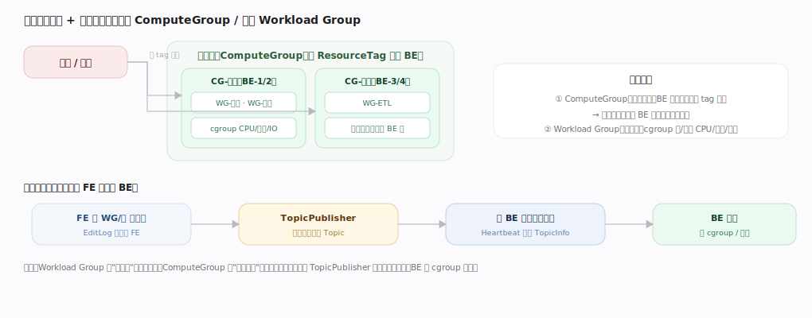
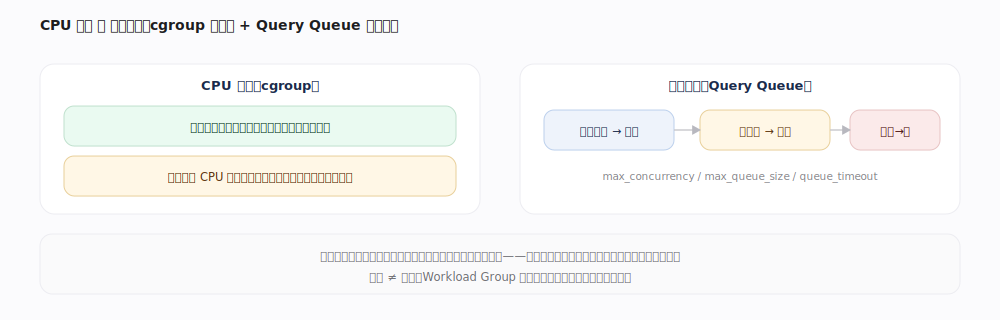
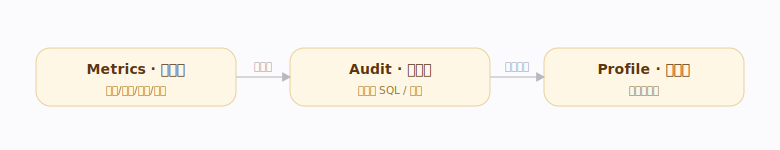

# Doris 核心原理 · 支撑主线 · 资源与负载管理

> **定位**：保障能力域（保稳定）。内存/线程的分配**机制**在执行引擎与存储侧，本线负责其**配额与限流策略**；**可观测性**（Profile、Audit、Metrics）作为诊断贯穿点归入本线"事后审计"。

## 一、治理闭环

---

## 二、Workload Group（多租户隔离）

| 资源 | 软限 | 硬限 | 落地 |
|---|---|---|---|
| CPU | 按权重分配空闲算力 | 设上限、空闲也不超配 | cgroup |
| Memory | 组配额、可选超借 | 到限 Spill / 拒绝 | 内存跟踪 |
| 并发 | — | 超阈值查询排队 | Query Queue + 超时 |

---

## 三、Memory 管理

---

## 四、Admission / SQL Block Rule / Audit

高并发下 **Admission Control** 让超限请求排队而非全涌入；每查询有 Memory 上限与 Timeout。

---

## 深化 · 两级资源划分与下发链路

资源隔离有**两级**，粒度不同、可叠加：

| 层级 | 单位 | 隔离粒度 | 落地 |
|---|---|---|---|
| 节点级 | **ComputeGroup**（按 ResourceTag 分组 BE） | 物理隔离到不同 BE 集，查询按 tag 路由 | 机器划分 |
| 组内 | **Workload Group** | 同批 BE 内按业务分 CPU/内存/并发 | cgroup |

**下发链路**：FE 改 WG/组元数据（EditLog 复制）→ **TopicPublisher** 组织成 Topic → 随 **BE 心跳**携带下发 → BE 落 cgroup / 限流生效（异步、非实时）。

---

## 深化 · Workload Policy（条件式负载治理）

在"事前拦截、事中约束"之外，Workload Policy 提供**运行时按条件自动干预**：

| 条件（WorkloadMetric） | 动作（WorkloadAction） |
|---|---|
| 查询耗时 / 扫描行数 / 内存 超阈值 | `CANCEL_QUERY` 取消 |
| 命中某画像 | `MOVE_QUERY_TO_GROUP` 移到其他资源组 |
| 满足条件 | `SET_SESSION` 调会话变量（如降并行度） |

即"监控指标满足条件 → 自动执行动作"，把过载治理从人工变为策略驱动。

---

## 深化 · CPU 硬限 与 查询排队

CPU 管控落地 **cgroup**：软限按权重分空闲算力，硬限设 CPU 上限（空闲也不超配）实现强隔离。

---

## 深化 · 可观测性三件套（事后审计的落点）

| 信号 | 粒度 | 内容 | 用途 |
|---|---|---|---|
| Query Profile | 单条查询 | 算子耗时、行数、内存峰值、等待、RF 效果 | 慢在哪个算子 |
| Audit Log | 语句留痕 | 用户、耗时、扫描/返回行、缓存命中、错误码 | 找坏 SQL、趋势分析 |
| Metrics | 进程/集群 | 内存水位、并发、排队、Compaction Score、副本健康 | 实时告警、观测 |

---

## 拓展 · 多级内存治理

| 层级 | 配额 / 开关 | 超限动作 |
|---|---|---|
| 进程级 | BE 总内存上限 | 全局回收 / 取消 |
| 查询级 | `exec_mem_limit` | Spill 或取消 |
| 组级 | Workload Group `memory_limit`、`enable_memory_overcommit` | 组内约束 / 是否可超借 |
| 算子级 | Agg/Sort/Join 内存跟踪 | 到阈值触发 Spill |
| 缓存级 | Page/Data Cache 独立配额 | 与查询内存竞争、受限 |

---

## 调优要点（关键开关）

- Workload Group：`cpu_share`（软限权重）/ CPU 硬限（cgroup）、`memory_limit`、`enable_memory_overcommit`。
- 排队：`max_concurrency` / `max_queue_size` / `queue_timeout`——过载排队而非雪崩。
- 内存：`exec_mem_limit`（单查询上限）、`enable_spill`（落盘兜底）。
- 拦截：SQL Block Rule 按扫描量/基数拦坏 SQL；审计与 Profile 事后复盘。

---

## 常见误区与工程要点

- **Workload Group 隔离不等于加速**：保稳定与公平，不提升单查询速度。
- **Memory 硬限过低会误杀正常大查询**：过高又失去保护，按业务画像调参。
- **SQL Block Rule 要基于扫描量/代价**：只按文本匹配易漏拦或误伤。

---

## 源码锚点（jdolap-engine 分支核实）

> 下列 `file:行号` 在用户 Doris 分支 grep 核实，覆盖 WG 管理、查询排队（admission）、随心跳下发链路、BE cgroup 落地。

- **Workload Group 管理（FE）**：`fe/fe-core/src/main/java/org/apache/doris/resource/workloadgroup/WorkloadGroupMgr.java:64`（`WorkloadGroupMgr`）。
- **按会话选组**：`WorkloadGroupMgr.java:143`（`getWorkloadGroup`）。
- **查询排队 / Admission**：`fe/fe-core/src/main/java/org/apache/doris/resource/workloadgroup/QueryQueue.java:37`（`QueryQueue`）、`:104`（`getToken`，取令牌否则排队）。
- **并发上限与排队超时**：`QueryQueue.java:43`（`maxConcurrency`）、`:45`（`queueTimeout`）、`:118`（超并发无空槽则入等待队列/拒绝）。
- **随 BE 心跳下发（Topic 发布线程）**：`fe/fe-core/src/main/java/org/apache/doris/common/publish/TopicPublisherThread.java:43`（类）、`:60`（`addToTopicPublisherList`）。
- **推送 Topic 信息**：`TopicPublisherThread.java:161`（`publishTopicInfo`，把 WG 配置随心跳带到 BE）。
- **BE 侧 WG 对象**：`be/src/runtime/workload_group/workload_group.h:60`（`WorkloadGroup`）、`:73`（`memory_limit`）。
- **BE 建 cgroup 控制器**：`workload_group.h:199`（`create_cgroup_cpu_ctl`）。
- **CPU 硬/软限落地**：`be/src/agent/cgroup_cpu_ctl.h:40`（`update_cpu_hard_limit`）、`:42`（`update_cpu_soft_limit`）。
- **cgroup v1/v2 实现**：`cgroup_cpu_ctl.h:119`（`CgroupV1CpuCtl`）、`:167`（`CgroupV2CpuCtl`）。
- **BE 内存计量器**：`be/src/runtime/memory/mem_tracker_limiter.h:71`（`MemTrackerLimiter`）、`:77`（`Type`，区分 Query/Load/Compaction 等类别）。
- **WG 内存超限处置**：`be/src/runtime/workload_group/workload_group_manager.cpp:316`（`handle_paused_queries`，超限查询暂停/落盘/跨组回收内存）。

---

## 一句话总纲

**资源与负载管理是"事前拦截 + 事中约束 + 事后审计"闭环：Workload Group 按租户隔离 CPU/Memory/Concurrency，Memory 管理用分级额度 + 实时跟踪 + backpressure/Spill 防溢出，Admission 与 Timeout 让过载优雅降级，SQL Block Rule 与 Audit 守两端。**
