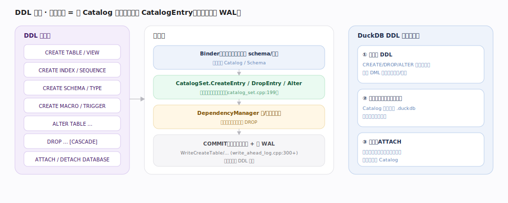
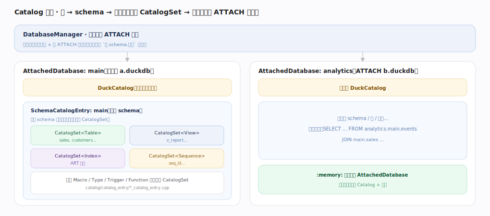
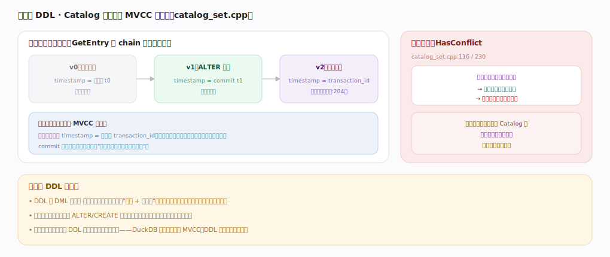
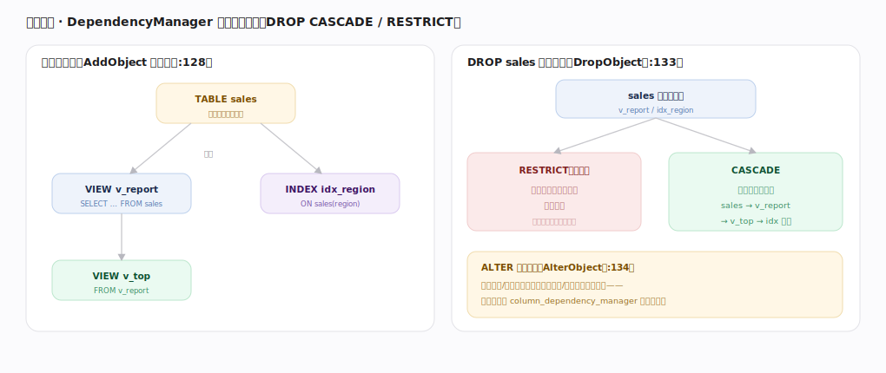
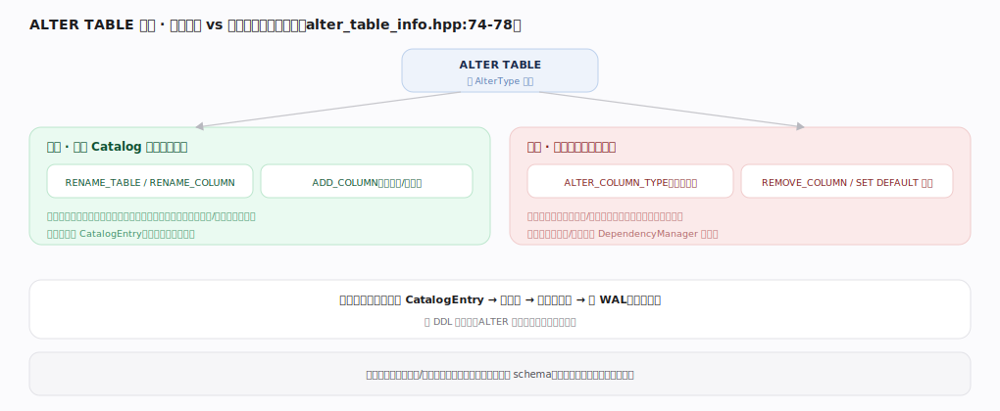

# DuckDB 核心原理 · DDL 数据定义（CREATE / ALTER / DROP）

> **定位**：DDL 是"定义对象"的接口主线，骨架 = `Binder 定位库/schema → CatalogSet 建/删/改版本条目 → DependencyManager 校验依赖 → 事务提交 + 写 WAL`。它以**元数据与 Catalog**为主轴，深度依赖**事务与 MVCC**（Catalog 条目也走版本链，DDL 可回滚），落盘依赖 **WAL + Checkpoint**（后台）。核实基准：主线源码 `duckdb/src`。

## 一、总览：DDL = 在 Catalog 里增删改一个条目

无论 CREATE/ALTER/DROP，本质都是对某个 `CatalogEntry` 的增删改。处理链：Binder 解析对象名、定位目标 Catalog/Schema → `CatalogSet` 建立新版本条目（`catalog_set.cpp:199`）→ `DependencyManager` 登记/校验依赖 → `COMMIT` 使条目版本可见并写 WAL（`WriteCreateTable` 等，`write_ahead_log.cpp:300+`）。DuckDB 的三个特点：**DDL 是事务性的**（可与 DML 一起原子提交/回滚）、**元数据与数据同在一个单文件**（无外部元数据服务）、**支持 ATTACH 多库**同时查询。

---

## 二、Catalog 结构：库 → schema → 按类型分组的 CatalogSet

`DatabaseManager` 管理所有 ATTACH 的库；每个 `AttachedDatabase` 有独立的 `DuckCatalog`，其下按 schema 组织，每个 `SchemaCatalogEntry` 内**按对象类型各挂一个 `CatalogSet`**（Table/View/Index/Sequence/Macro/Type/Trigger/Function……对应 `catalog/catalog_entry/*_catalog_entry.cpp`）。跨库引用用 `库.schema.对象` 三段名，`:memory:` 也是一个 AttachedDatabase（无文件、纯内存）。这套结构让"一个进程里同时开多个库文件并跨库 JOIN"成为自然能力。

---

## 深化 · 事务性 DDL：Catalog 条目也走 MVCC

Catalog 条目与数据行同构地走 MVCC 版本链。`CreateEntry` 把未提交版本的 `timestamp` 设为写它的 `transaction_id`（一个很大的标记值，`catalog_set.cpp:204`），提交时改写为真正的 commit 时间戳；读者用 `GetEntry` 沿链找到"对自己快照可见的最新版本"。并发改同名对象时 `HasConflict`（`catalog_set.cpp:116/230`）检测冲突，后提交者报错回滚（乐观并发）。**价值**：DDL 与 DML 可放进同一事务原子提交——"建表 + 灌数据"要么全成要么全滚，迁移脚本失败自动回退，不留半成品对象。这与很多数据库"DDL 隐式提交、不可回滚"不同。

---

## 深化 · 依赖管理：DROP CASCADE / RESTRICT

`DependencyManager`（`dependency_manager.hpp:84`）在 `AddObject`（`:128`）时登记对象间依赖（视图依赖表、索引依赖列……）。`DROP` 时 `DropObject`（`:133`）判定：默认 **RESTRICT** 有依赖者则报错拒删（防悬空视图）；**CASCADE** 递归删除依赖链。`ALTER` 也经 `AlterObject`（`:134`）校验——改列类型/删列时，依赖该列的视图/索引会被检查，列级依赖由 `column_dependency_manager` 精细追踪。

---

## 深化 · ALTER 路径：改元数据 vs 改数据

`ALTER TABLE` 按 `AlterType`（`alter_table_info.hpp:74-78`）分派，代价分两档：**轻量**（仅改 Catalog 元数据）——`RENAME_TABLE`/`RENAME_COLUMN` 只动目录条目，`ADD_COLUMN` 多数不重写既有数据；**重量**（需触碰列数据）——`ALTER_COLUMN_TYPE` 要按新类型转换/重写该列，`REMOVE_COLUMN` 要清理列存段。两类都生成新版本 CatalogEntry、查依赖、事务内提交、写 WAL，失败不留半改状态。

---

## 拓展 · 主要 CatalogEntry 类型

| 类别 | 条目类型 | 说明 |
|---|---|---|
| 数据对象 | Table / View / Index / Sequence | 表、视图、（ART）索引、序列 |
| 命名空间 | Schema / Type | schema、用户自定义类型 |
| 可调用 | ScalarFunction / TableFunction / AggregateFunction / Macro | 内建与扩展函数、SQL 宏 |
| 其他 | Trigger / PragmaFunction / CopyFunction | 触发器、PRAGMA、COPY 格式 |

---

## 调优要点（关键开关）

- `CHECKPOINT`：DDL 变更也进 WAL，密集建表后可显式 checkpoint 让 Catalog 落定。
- 大表 schema 演进：优先用便宜的 `ADD_COLUMN`；避免频繁 `ALTER_COLUMN_TYPE`/`REMOVE_COLUMN`（重写代价高）。
- `ATTACH … (READ_ONLY)`：只读挂载外部库，避免误写。
- 用事务包裹迁移脚本（`BEGIN; …DDL…; COMMIT;`），失败自动回滚。

---

## 常见误区与工程要点

- **以为 DDL 不能回滚**：DuckDB DDL 是事务性的，可与 DML 混在一个事务里原子提交/回滚。
- **裸 DROP 被依赖对象**：默认 RESTRICT 会报错——要么先删依赖者，要么用 CASCADE。
- **把改列类型当轻量操作**：`ALTER_COLUMN_TYPE` 会重写列数据，大表上很慢，应在建表期定好类型。
- **忘记 Catalog 也在单文件里**：迁移库文件即迁移了全部对象定义，无需额外导出元数据。

---

## 源码锚点（src/catalog · src/storage 精确定位）

> 以下 `文件:行号` 在 duckdb `src` 源码 grep 核实，把 CatalogSet 增删改、依赖校验与 WAL 落盘落到实现。

- **CatalogSet 版本条目**：`src/catalog/catalog_set.cpp:199`（`CreateEntry`，建未提交版本）、`:311`（`AlterEntry`）、`:447`（`DropEntry`）。
- **依赖管理（CASCADE/RESTRICT）**：`src/catalog/dependency_manager.cpp:288`（`CreateDependencies`）、`:316`（`AddObject` 登记依赖）、`:615`（`DropObject`，判 RESTRICT/CASCADE）、`:680`（`AlterObject` 校验列级依赖）。
- **DDL 写 WAL**：`src/storage/write_ahead_log.cpp:300`（`WriteCreateTable`）、`:309`（`WriteDropTable`）、`:468`（`WriteCreateView`）。
- **建 schema / ALTER 物理算子**：`src/catalog/duck_catalog.cpp:96`（`CreateSchema`）、`src/execution/operator/schema/physical_alter.cpp:12`（`PhysicalAlter::GetDataInternal`，执行期落地 ALTER）。

---

## 一句话总纲

**DDL 把 CREATE/ALTER/DROP 统一为对 CatalogEntry 的增删改：Binder 定位库/schema 后，CatalogSet 建立走 MVCC 版本链的新条目（timestamp 从 transaction_id 到 commit 时间戳）、DependencyManager 按 CASCADE/RESTRICT 校验对象依赖，事务提交时条目可见并写 WAL；因目录纳入 MVCC，DDL 与数据一视同仁——可与 DML 同事务原子提交回滚，且元数据与数据同存于一个单文件、支持 ATTACH 多库。**
