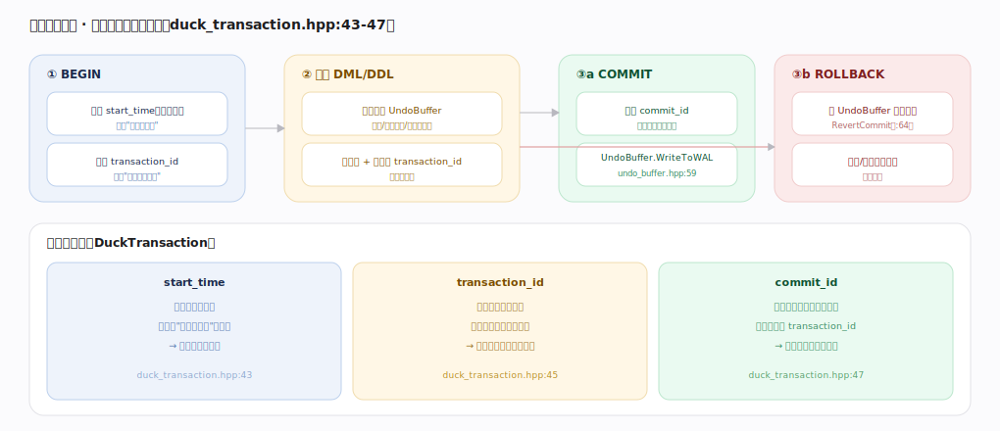
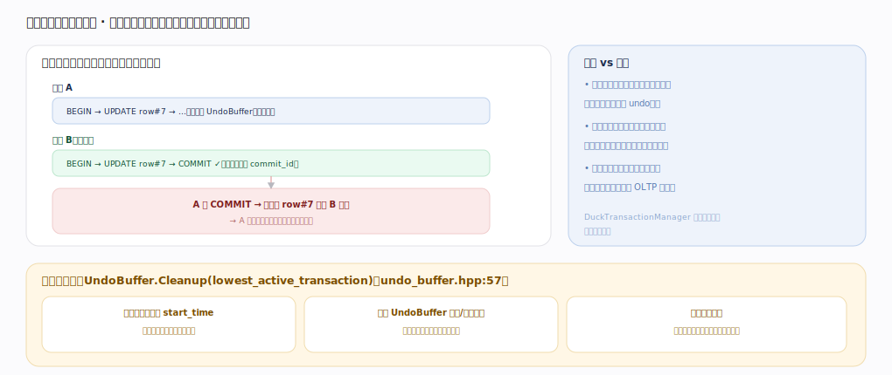

# DuckDB 核心原理 · 支撑能力域 · 事务与 MVCC

> **定位**：保障能力域。提供**快照隔离 + 乐观并发 + UndoBuffer 版本链**的经典 MVCC 事务，是 **DML**（写可见性）与 **DDL**（事务性目录）的正确性底座，并与**后台任务**（旧版本清理）协作。与 DML·MVCC 版本图分工：那里讲"UPDATE/DELETE 的行级版本形态"，本篇讲"事务管理器的时间戳与并发机制"。核实基准：主线源码 `duckdb/src`。

## 一、事务生命周期与三个时间戳

`DuckTransaction`（`duck_transaction.hpp`）带三个时间戳：**start_time**（`:43`，BEGIN 时的快照点，决定看得到哪些已提交版本）、**transaction_id**（`:45`，未提交写的标记值，很大、只有本事务认得）、**commit_id**（`:47`，提交时分配的最终时间戳，替换版本上的 transaction_id，决定对后续事务可见）。生命周期：BEGIN 分配 start_time+transaction_id → 执行期改动记入 UndoBuffer（旧值/删除标记/目录旧版本）、就地写并挂 transaction_id（仅自己可见）→ COMMIT 分配 commit_id 并 `UndoBuffer.WriteToWAL`（`undo_buffer.hpp:59`），或 ROLLBACK 按 UndoBuffer 逆序 `RevertCommit`（`:64`）恢复原状。

---

## 二、乐观并发与旧版本清理

**乐观并发**：不加写锁，读走快照、写记 undo，冲突在提交时检测——若并发事务已改同一行并先提交，后提交者冲突失败并回滚（不是阻塞等待）。这对分析型负载（多读少写、少并发写同行）吞吐高；高并发写同批行的 OLTP 场景则需应用重试。**旧版本清理**：`UndoBuffer.Cleanup(lowest_active_transaction)`（`undo_buffer.hpp:57`）找最低活跃事务的 start_time，早于它的旧版本再无人需要即可回收，释放内存。**长事务的代价**：久不结束会压住清理水位、让版本堆积。

---

## 拓展 · 事务组件

| 组件 | 职责 | 锚点 |
|---|---|---|
| DuckTransaction | 单个事务的时间戳与状态 | `transaction/duck_transaction.cpp` |
| DuckTransactionManager | 分配时间戳、协调提交顺序与冲突判定 | `transaction/duck_transaction_manager.cpp` |
| UndoBuffer | 记录可回滚的旧版本，提交写 WAL、回滚复原、清理回收 | `transaction/undo_buffer.cpp` |
| CommitState / RollbackState / CleanupState | 提交/回滚/清理各阶段的执行 | `transaction/commit_state.cpp` 等 |
| MetaTransaction | 跨多个 ATTACH 库的事务协调 | `transaction/meta_transaction.cpp` |

---

## 调优要点（关键开关）

- 避免长事务：及时 COMMIT/ROLLBACK，让清理水位前移、版本不堆积。
- 批量写用单个大事务而非逐行提交（减少提交开销），但别把它拖成长事务。
- 写热点行的并发场景，预期乐观冲突，应用侧要有重试逻辑。
- 只读分析用只读事务/只读连接，天然无冲突。

---

## 常见误区与工程要点

- **以为写会阻塞读**：MVCC 下读走快照，不被写阻塞；反之亦然。
- **期待写锁排队**：DuckDB 是乐观并发，冲突是"提交失败"而非"等待"，需重试。
- **长事务无害**：长事务压住 `lowest_active_transaction`，旧版本清理不了，内存与文件承压。
- **把 DuckDB 当高并发写库**：它擅长分析（多读、批量写），不适合大量并发写同批行的 OLTP。

---

## 源码锚点（src/transaction 精确定位）

> 以下 `文件:行号` 在 duckdb `src` 源码 grep 核实（克隆 HEAD，与全景所记 commit 对本组文件行号一致），把三时间戳、提交/回滚与版本清理落到实现。

- **三时间戳与句柄**：`src/include/duckdb/transaction/duck_transaction.hpp:36`（`class DuckTransaction`）、`src/include/duckdb/transaction/duck_transaction.hpp:43`（`start_time` 快照点）、`src/include/duckdb/transaction/duck_transaction.hpp:45`（`transaction_id` 未提交标记）、`src/include/duckdb/transaction/duck_transaction.hpp:47`（`commit_id` 提交时间戳）。
- **提交 / 回滚 / 清理**：`src/transaction/duck_transaction.cpp:250`（`Commit`）、`src/transaction/duck_transaction.cpp:314`（`Rollback`）、`src/transaction/duck_transaction.cpp:324`（`Cleanup`，按最低活跃事务回收）、`src/transaction/duck_transaction.cpp:63`（`GetLocalStorage`）。
- **事务管理器时间戳分配**：`src/transaction/duck_transaction_manager.cpp:75`（`StartTransaction`，分配 start_time+transaction_id）、`src/transaction/duck_transaction_manager.cpp:298`（`CommitTransaction`，分配 commit_id）、`src/transaction/duck_transaction_manager.cpp:472`（`RollbackTransaction`）。
- **UndoBuffer 版本链**：`src/transaction/undo_buffer.cpp:176`（`Cleanup`）、`src/transaction/undo_buffer.cpp:190`（`WriteToWAL`）、`src/transaction/undo_buffer.cpp:196`（`Commit`，改写 transaction_id→commit_id）、`src/transaction/undo_buffer.cpp:204`（`RevertCommit`，回滚复原）。

---

## 一句话总纲

**事务与 MVCC 用三个时间戳实现快照隔离——start_time 定"我能看到谁"、transaction_id 标记"我的未提交写"、commit_id 定"我对谁可见"；改动记入 UndoBuffer，提交写 WAL、回滚逆序复原；采用乐观并发（读写互不阻塞、冲突在提交时失败回滚），旧版本按最低活跃事务 start_time 由 Cleanup 回收——为 DML 写可见性与事务性 DDL 提供正确性底座。**
