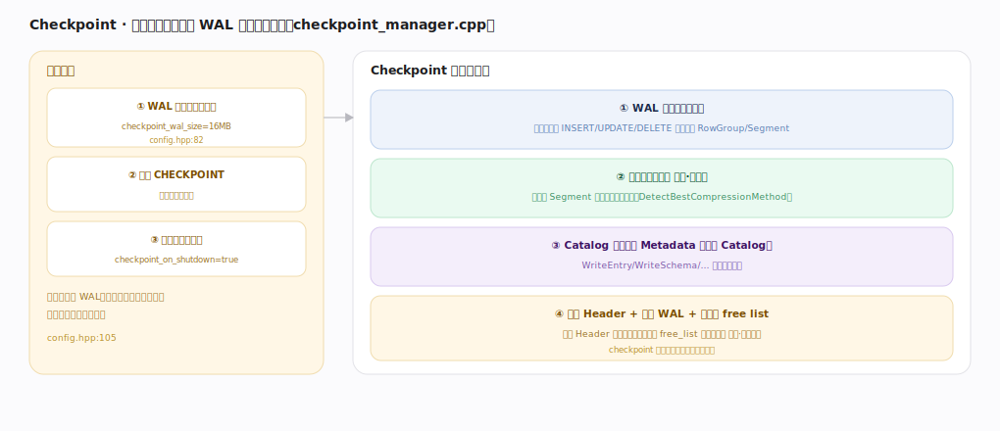
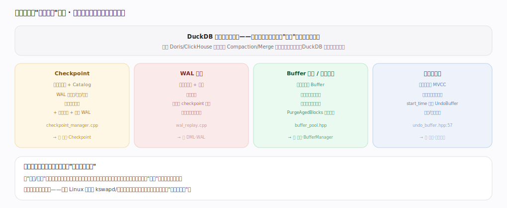

# DuckDB 核心原理 · 支撑能力域 · 后台任务

> **定位**：横切"执行时机"维度（后台/异步），不是独立的大能力域。DuckDB 是单进程嵌入式，后台动作很少且都挂靠在某个能力域下：Checkpoint（存储+Catalog）、WAL 回放（存储+事务）、Buffer 驱逐/溢写清理（内存）、旧版本清理（MVCC）。本篇做**汇总与索引**——每个动作的机制归其所属能力域详述。核实基准：主线源码 `duckdb/src`。

## 一、Checkpoint：后台核心动作

触发时机三种：WAL 超阈值自动（`checkpoint_wal_size=16MB`，`config.hpp:82`）、显式 `CHECKPOINT`、关库时（`checkpoint_on_shutdown=true`，`config.hpp:105`）。Checkpoint 期间做四件事，正是多个能力域动作的汇合点：① WAL 变更写入列存块（落成正式 RowGroup/Segment）；② 列压缩分析（对每个 Segment 选最省编码，见"存储·压缩"）；③ Catalog 序列化进 Metadata 块（见"元数据与 Catalog"）；④ 更新双写 Header + 截断 WAL + 旧块进 free list（见"存储·块管理"）。目标：缩短 WAL、让单文件进入紧致态、加快下次打开回放。

---

## 二、后台任务是"执行时机"维度

把"后台/异步"作为正交的执行时机维度单列，便于统一看清全库的异步部分；但每个动作的机制归它所属能力域。四类后台动作及其挂靠：**Checkpoint**（存储+Catalog，`checkpoint_manager.cpp`）、**WAL 回放**（存储+事务，打开库时重放未 checkpoint 变更，`wal_replay.cpp`）、**Buffer 驱逐/溢写清理**（内存 Buffer，内存压力时驱逐、`PurgeAgedBlocks` 年龄清理，`buffer_pool.hpp`）、**旧版本清理**（MVCC，按最低活跃 `start_time` 回收 UndoBuffer，`undo_buffer.hpp:57`）。对比 Doris/ClickHouse 有独立的 Compaction/Merge 守护线程与调度器——DuckDB 没有那种重后台，正如 Linux 内核里 kswapd/回写分散在各子系统而非一个独立"后台子系统"。

---

## 拓展 · 后台动作与归属能力域

| 后台动作 | 归属能力域 | 触发 | 锚点 |
|---|---|---|---|
| Checkpoint | 存储 + Catalog | WAL 超阈值/显式/关库 | `storage/checkpoint_manager.cpp` |
| WAL 回放 | 存储 + 事务 | 打开库 | `storage/wal_replay.cpp` |
| Buffer 驱逐 | 内存与 Buffer | 内存超 memory_limit | `storage/buffer/buffer_pool.hpp` |
| 临时文件回收 | 内存与 Buffer | 溢写数据用完 | `storage/temporary_file_manager.hpp` |
| 旧版本清理 | 事务与 MVCC | 提交后无人需要旧版本 | `transaction/undo_buffer.hpp:57` |

---

## 调优要点（关键开关）

- `checkpoint_wal_size`：自动 checkpoint 阈值；批量导入可临时调大、结束后显式 `CHECKPOINT`。
- `checkpoint_on_shutdown`：关库是否 checkpoint（默认 true）；批处理短进程可权衡。
- `memory_limit` / `temp_directory`：影响 Buffer 驱逐与溢写清理的频率与落点。
- 避免长事务：让旧版本清理水位前移（见"事务与 MVCC"）。

---

## 常见误区与工程要点

- **找 Compaction 守护线程**：DuckDB 没有 LSM 式后台合并；"整理"主要在 checkpoint 一次完成。
- **只写不 checkpoint**：WAL 膨胀、重启回放慢；导入后显式 `CHECKPOINT`。
- **把后台任务当独立子系统调优**：它是执行时机维度，调优要落到对应能力域的开关。
- **以为 checkpoint 只是刷盘**：它还做压缩分析、Catalog 序列化、块回收——是多域动作的汇合。

---

## 源码锚点（src/storage · src/transaction 精确定位）

> 以下 `文件:行号` 在 duckdb `src` 源码 grep 核实，把 checkpoint、WAL 回放、驱逐与版本清理这些"后台/异步"动作落到各自归属域的实现。

- **Checkpoint 主动作**：`src/storage/checkpoint_manager.cpp:193`（`SingleFileCheckpointWriter::CreateCheckpoint`）、`src/storage/checkpoint_manager.cpp:688`（`WriteTable`，落成正式 RowGroup/Segment）。
- **Checkpoint 触发与 WAL 截断**：`src/storage/storage_manager.cpp:251`（`WALStartCheckpoint`，WAL 超阈值/显式触发）、`src/storage/storage_manager.cpp:284`（`WriteCheckpoint`）。
- **打开库时 WAL 回放**：`src/storage/wal_replay.cpp:206`（`WriteAheadLogDeserializer::ReplayEntry`）、`src/storage/wal_replay.cpp:225`（`ReplayEntry(WALType)` 按类型分派）、`src/storage/wal_replay.cpp:75`（`class WriteAheadLogDeserializer`）。
- **Buffer 驱逐 / 年龄清理**：`src/storage/buffer/buffer_pool.cpp:377`（`EvictBlocks`，内存压力驱逐）、`src/storage/buffer/buffer_pool.cpp:436`（`PurgeAgedBlocks`）。
- **MVCC 旧版本回收**：`src/transaction/undo_buffer.cpp:176`（`UndoBuffer::Cleanup`，按最低活跃事务回收版本链）。

---

## 一句话总纲

**后台任务是横切的"执行时机"维度而非独立大域：单进程 DuckDB 的异步动作很少——Checkpoint（WAL 超 16MB/显式/关库时把变更合并进单文件，附带压缩分析、Catalog 序列化、free list 块回收）、WAL 回放（打开库恢复）、Buffer 驱逐与溢写清理、旧版本回收——每个都挂靠在存储/事务/内存/Catalog 某个能力域下，没有 Doris/ClickHouse 那种独立的重后台合并调度。**
