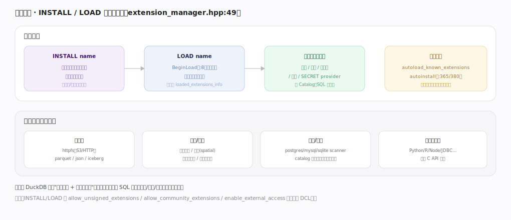
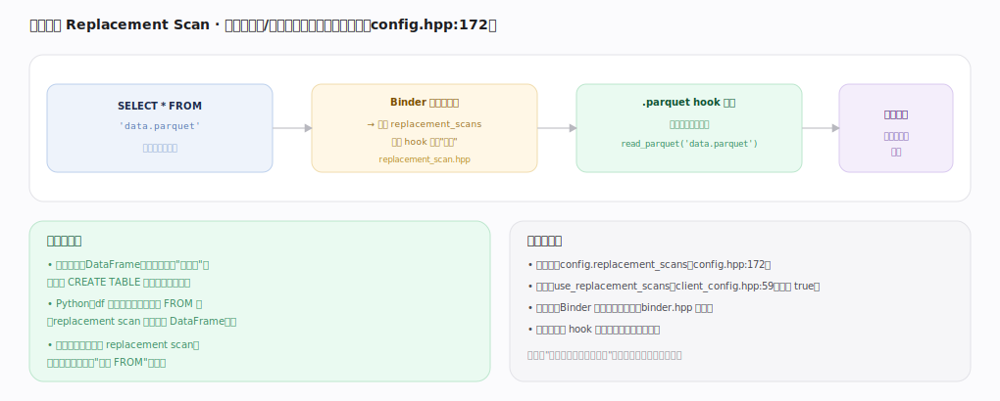

# DuckDB 核心原理 · 支撑能力域 · 扩展机制

> **定位**：保障能力域（可插拔能力）。DuckDB 内核只做 SQL 存算，格式/协议/领域函数/语言绑定通过**扩展**按需装载；`INSTALL`/`LOAD` 与自动加载把扩展能力注册进 **Catalog**，**替换扫描**让"直接 FROM 文件/对象"成为可能。被 **DQL/DML**（外部数据源）与 **DCL**（SECRET provider、扩展信任）依赖。核实基准：主线源码 `duckdb/src`。

## 一、扩展加载

流程：`INSTALL name`（从仓库下载扩展二进制到本地扩展目录，受签名/信任策略约束）→ `LOAD name`（`ExtensionManager::BeginLoad` `extension_manager.hpp:8` 动态载入、调用扩展入口、登记进 `loaded_extensions_info`）→ 扩展入口**注册能力进引擎**（函数/类型/表函数/存储/SECRET provider，进 Catalog 后 SQL 即可用）。**自动加载**：`autoload_known_extensions`/`autoinstall_known_extensions`（`settings.hpp:380/365`）让首次用到的已知扩展自动装载。扩展能提供数据源（httpfs/parquet/json/iceberg）、函数/类型（全文检索/空间/向量相似度）、存储/目录（postgres/mysql/sqlite scanner、catalog 扩展把外部库当目录）、各语言绑定（经 C API）。

---

## 二、替换扫描（Replacement Scan）

`SELECT * FROM 'data.parquet'` 里的名字不是已知表——Binder 解析失败时触发 `replacement_scans`（`config.hpp:172`，`replacement_scan.hpp`），逐个 hook 尝试认领：`.parquet` hook 把它改写为 `read_parquet('data.parquet')` 表函数，再正常执行。价值：文件路径/DataFrame/外部表都能"当表查"，无需先 CREATE TABLE；Python 里 df 变量名可直接出现在 FROM；扩展可注册自己的 replacement scan 让新数据源也享受"直接 FROM"。开关 `use_replacement_scans`（`client_config.hpp:59`，默认 true）。本质是"表名解析的兜底扩展点"。

---

## 拓展 · 扩展相关组件

| 组件 | 职责 | 锚点 |
|---|---|---|
| ExtensionManager | 已加载扩展登记、BeginLoad | `main/extension_manager.hpp:49` |
| ExtensionHelper | 安装/加载/信任校验 | `main/extension_helper.hpp` |
| ReplacementScan | 表名解析兜底改写 | `function/replacement_scan.hpp` |
| C API（duckdb.h） | 扩展与语言绑定的稳定接口 | `include/duckdb.h` |
| SecretManager | 扩展注册 SECRET provider（见 DCL） | `main/secret/secret_manager.hpp` |

---

## 调优要点（关键开关）

- `autoload_known_extensions` / `autoinstall_known_extensions`：便利但联网；受控环境按需关闭。
- `allow_unsigned_extensions` / `allow_community_extensions`：信任策略，生产嵌入应最小化（见 DCL）。
- `use_replacement_scans`：一般保持开启；需要严格表名语义时可关。
- 常用扩展预先 `INSTALL`/`LOAD`，避免查询期首次自动装载的延迟。

---

## 常见误区与工程要点

- **以为所有功能都在内核**：格式/协议/领域函数多在扩展里，需 LOAD 才可用。
- **忽视扩展信任**：不受控地允许不签名/社区扩展等于放开任意本机代码执行——生产要收紧。
- **替换扫描当"魔法"**：它只是 Binder 兜底改写成表函数，性能与显式表函数一致，非额外加速。
- **autoload 联网被防火墙拦**：离线环境需预装扩展或关闭 autoinstall。

---

## 源码锚点（src/main/extension · src/planner 精确定位）

> 以下 `文件:行号` 在 duckdb `src` 源码 grep 核实，把 LOAD/自动加载与替换扫描兜底落到实现。

- **ExtensionManager 登记**：`src/main/extension_manager.cpp:88`（`BeginLoad`，开始载入并登记）、`:46`（`Get`）、`:80`（`ExtensionIsLoaded`）；声明 `src/include/duckdb/main/extension_manager.hpp:49`（`class ExtensionManager`）、`:56`（`BeginLoad`）。
- **动态载入外部扩展**：`src/main/extension/extension_load.cpp:647`（`LoadExternalExtension`）、`:669`（调用 `BeginLoad`）、`:711`（`FinishLoad`，登记进 loaded_extensions_info）。
- **自动加载已知扩展**：`src/main/extension/extension_helper.cpp:206`（`TryAutoLoadExtension`，首次用到时按需 install+load）。
- **替换扫描（表名解析兜底）**：`src/planner/binder/tableref/bind_basetableref.cpp:47`（`Binder::BindWithReplacementScan`）、`:52`（遍历 `config.replacement_scans` 逐 hook 认领）、`:24`（`TryLoadExtensionForReplacementScan`，为未知后缀自动装扩展）。

---

## 一句话总纲

**扩展机制让 DuckDB 内核精简、能力可插拔：INSTALL 下载 + LOAD 动态载入扩展入口，把函数/类型/数据源/存储/SECRET provider 注册进 Catalog（已知扩展可自动加载）；替换扫描（replacement_scans）在 Binder 解析表名失败时把文件路径/DataFrame 等兜底改写成表函数，实现"直接 FROM"——加载与替换都受扩展信任与外部访问策略约束。**
