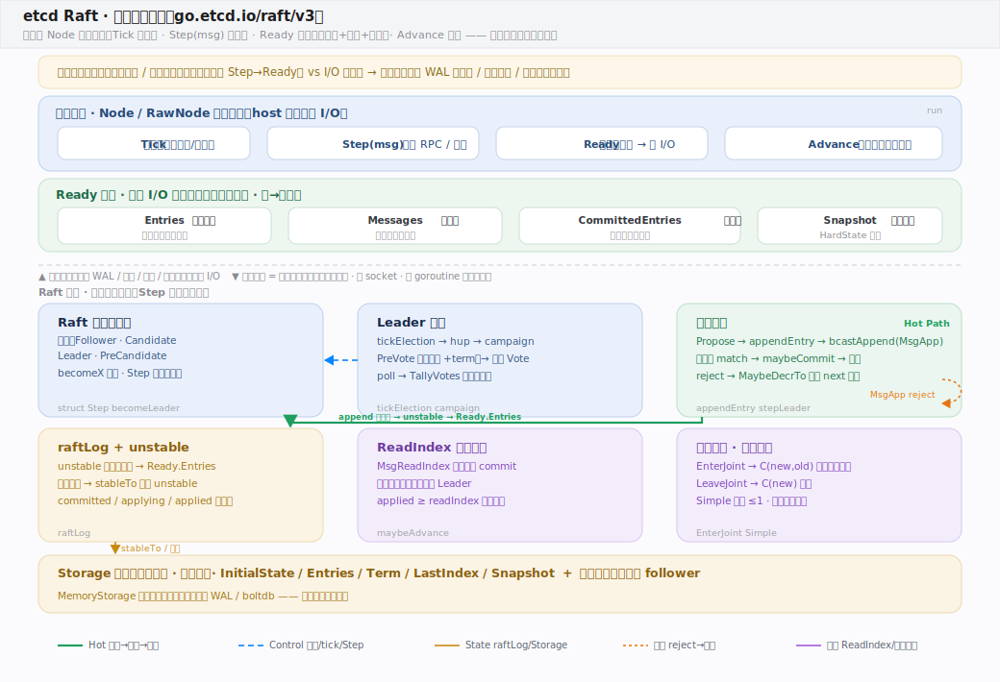
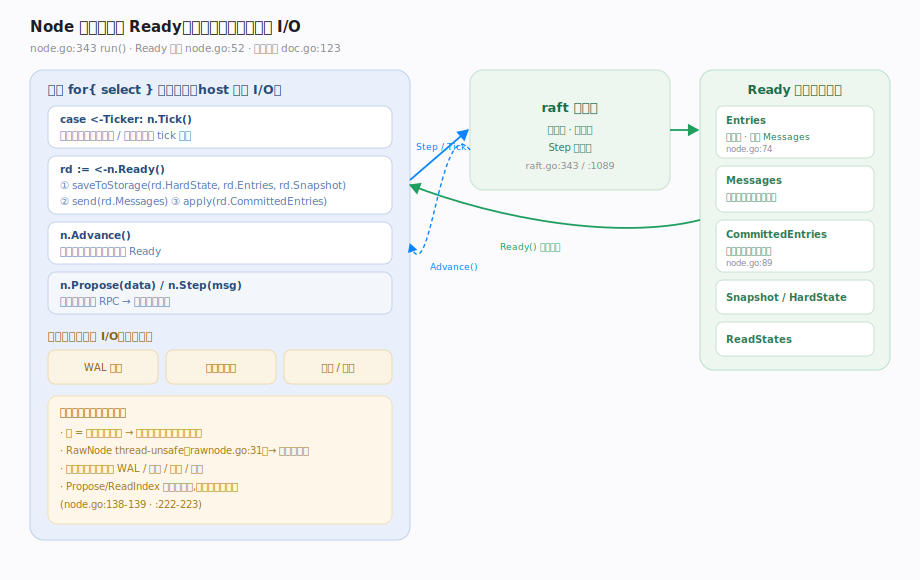

# etcd Raft 核心原理 · 全景主线框架

> 统领全部原理文档：etcd Raft 的 **1 条接口主线（Node 驱动循环与 Ready）+ 7 条支撑能力域**，既无遗漏也无越界。核实基准 = 本地检出 `/Users/zhangdongdong92/workdir/etcd-io/raft`（模块 `go.etcd.io/raft/v3`，`go 1.26`，`go.mod:1-4`）。**判型：共识状态机核**——不是"电池全含"的库，而是最小共识内核：无内置传输、无存储 I/O、无驱动复制的 goroutine。宿主用 `Node` 循环（`Tick`/`Step`/`Ready`/`Advance`）驱动，库产出只读的 `Ready` 待办清单，**所有磁盘与网络 I/O 由宿主承担**。灵魂三条：**Step→Ready 是确定性状态机（可测/可嵌）**、**Ready 结构把 I/O 全外包给宿主**、**成员变更支持联合共识（joint consensus）**。

## 〇、重要澄清：etcd/raft vs hashicorp/raft（读前必看）

“Raft” 有算法与多个实现。本库是 etcd 的 `go.etcd.io/raft/v3`，与 hashicorp 的独立库定位相反：

| | **etcd-io/raft**（本库） | hashicorp/raft |
|---|---|---|
| 形态 | **共识状态机核**，宿主 Node 循环驱动 | **电池全含**的可嵌入库 |
| I/O | **Ready 外包**：宿主做 WAL / 网络 / 线程 | 库注入 Transport/LogStore… 自驱 |
| 并发 | 库不起驱动复制的 goroutine（`RawNode` thread-unsafe） | 库单线程 run + 每 follower 一 goroutine |
| 成员变更 | **支持 joint consensus** + 单步 | 单步（一次 ±1） |
| 接触面 | `Tick/Step/Ready/Advance` | `Apply/AddVoter/Snapshot` |

算法本身（选举、日志复制、多数派提交、快照）两者一致；差异在“状态机核 vs 全含库”“Ready 外包 I/O vs 接口注入自驱”。**本库讲 etcd-io/raft。**

---

## 一、总架构：状态机核 + 宿主驱动的 Ready I/O 环

宿主 `import` 本库，用 `StartNode`（`node.go:271`）或 `RestartNode`（`node.go:281`）启动，内部起唯一的 `go n.run()`。`func (n *node) run()`（`node.go:343`）是一个 `for{ select{} }`：从 `tickc` 收 `Tick`、从 `propc`/`recvc` 收 `Step` 进来的提案与消息、在 `readyc` 上把 `Ready` 交出去、在 `advancec` 上收 `Advance`。库把要做的 I/O 全部塞进只读的 `Ready`（`node.go:52-115`）——`Entries` 待落盘、`Messages` 待发送、`CommittedEntries` 待应用、`Snapshot` 待持久化——宿主做完这些真实 I/O 后调 `Advance()` 推进下一轮。`Storage`（`storage.go:48`）也是宿主实现、库只读的接口。**边界铁律**：边界之上是宿主的 WAL / 网络 / 线程 / 重试；边界之下是纯内存的确定性状态机。

---

## 二、接触面：Node 循环与 Ready 待办

`Node` 接口（`node.go:132-243`）四个核心动作：`Tick()`（`:135`，逻辑时钟）、`Step(ctx,msg)`（`:156`，喂入 RPC/提案）、`Ready() <-chan Ready`（`:164`，取待办）、`Advance()`（`:178`，确认推进）。`Propose`（`:140`）与 `ReadIndex`（`:224`）本质都是特定类型的 `Step`。库反复强调 I/O 是宿主的活：`doc.go:69-86` 明列宿主必须"1. Write HardState/Entries/Snapshot to persistent storage 2. Send all Messages"；规范驱动循环样例见 `doc.go:123-145`。`RawNode`（`rawnode.go:34`）是 thread-unsafe 的底座，`Node` 在其上包一层 channel + goroutine 做并发安全。

---

## 三、七条支撑能力域的分层归位

| 层 | 支撑能力域 | 一句话职责 | 源码锚点 |
|---|---|---|---|
| 内核 | **Raft 状态机核心** | 四态 + `Step` 单入口分派 + `becomeX` | `raft.go:1089` Step、`:933` becomeLeader |
| 共识 | **Leader 选举** | tickElection→hup→campaign、PreVote、TallyVotes | `raft.go:850`、`:1025` campaign |
| 共识 | **日志复制** | appendEntry→bcastAppend、maybeCommit、reject 回退 | `raft.go:812`、`:1275` stepLeader |
| 状态 | **raftLog 与 unstable** | unstable 暂存→Ready.Entries、三水位 | `log.go:25`、`log_unstable.go:37` |
| 状态 | **Storage 与快照** | 宿主实现只读接口、快照追平落后 follower | `storage.go:48`、`raft.go:1840` |
| 只读 | **ReadIndex 线性化读** | 记录 commit、心跳确认领导权、放行读 | `read_only.go:39`、`raft.go:1354` |
| 成员 | **成员变更与联合共识** | EnterJoint→C(new,old)→LeaveJoint、Simple 单步 | `confchange/confchange.go:51`、`:128` |

---

## 四、三条贯穿全库的声明

1. **Step→Ready 是确定性状态机——这是可测/可嵌的根基。** 核心 `raft`（`raft.go:343`）纯内存态，`step`/`tick` 是函数指针（`raft.go:425-426`）；没有隐藏线程。`RawNode` 明言 "thread-unsafe Node"（`rawnode.go:31`），把并发交给宿主，因此可以在测试里同步驱动、断言每一步输出。
2. **Ready 结构把 I/O 全外包给宿主。** `Entries`/`Snapshot`/`HardState` 待落盘（且必须"先落盘再发 Messages"，`node.go:74-80`），`Messages` 待网络投递，`CommittedEntries` 待应用；库自身不 open 文件、不 new socket。提案与读都"可能无声丢失，重试是宿主的责任"（`node.go:138-139`、`:222-223`）。
3. **成员变更支持联合共识。** `EnterJoint`（`confchange/confchange.go:51`）进入两多数派并存的 `C(new,old)`，`LeaveJoint`（`:94`）收敛到 `C(new)`；也支持 `Simple` 单步（`:128`）。这与 hashicorp/raft 只有单步变更形成对照。

---

## 常见误区与工程要点

- **把 etcd/raft 当"能直接跑的共识服务"**：它是纯状态机核，没有网络、没有磁盘、没有驱动复制的线程；必须由宿主写驱动循环并承接全部 I/O。
- **忘了"先持久化再发送"**：`Ready.Entries`/`HardState` 必须先落盘、才能发 `Ready.Messages`（`node.go:74-80`、`doc.go:79-82`），否则违反 Raft 安全性。
- **不调 `Advance()`（同步模式）**：读了 `Ready` 却不 `Advance`，`run()` 不会给下一个 `Ready`（`node.go:435-445`）——除非启用 `AsyncStorageWrites`（此时不可调 Advance，`node.go:176-177`）。
- **以为只有单步成员变更**：etcd/raft 支持 joint consensus，可一次替换多个 voter（`node.go:148-152`）。
- **把 `Propose` 当"提交成功"**：`Propose` 只是投递，可能被丢弃，需宿主重试并等条目出现在 `CommittedEntries`（`node.go:138-139`、`doc.go:152-154`）。

---

## 一句话总纲

**etcd Raft 是 Go 的共识状态机核（go.etcd.io/raft/v3，powers etcd/CockroachDB 等）：宿主用 Node 循环驱动它——`Tick` 走逻辑时钟、`Step(msg)` 喂入提案与 RPC、`Ready()` 取回一批只读待办（`Entries` 待落盘、`Messages` 待发送、`CommittedEntries` 待应用、`Snapshot` 待持久化）、做完真实 I/O 后 `Advance()` 推进；库内部是纯内存的确定性状态机，`Step` 单入口按 term 与四态（Follower/Candidate/Leader/PreCandidate）分派，Leader 把提案 append 进 unstable、`bcastAppend` 广播 MsgApp、多数派 match 后 `maybeCommit` 提交，reject 则回退 next 重探——所有磁盘与网络 I/O 全外包给宿主（换来可测/可嵌），成员变更支持联合共识，这正是 etcd/raft 区别于 hashicorp「电池全含库」的定义性设计。**
