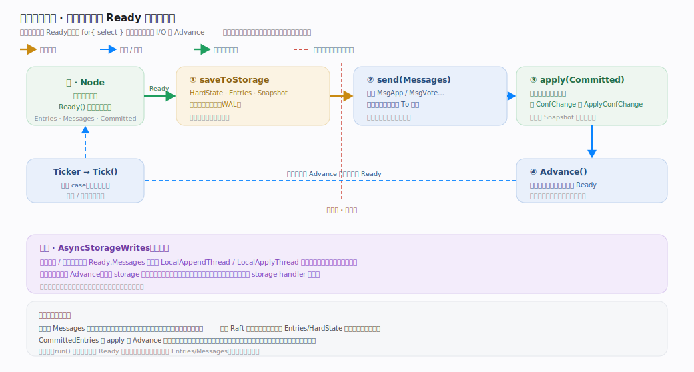

# etcd Raft 核心原理 · 接口主线 · Node 驱动循环与 Ready

> **定位**：这是 etcd/raft 的**定义性设计**——库不自己驱动、不碰 I/O，而是暴露 `Node` 接口的四个动作让宿主驱动。宿主跑一个 `for{ select }` 循环：`Tick()` 走逻辑时钟、`Step(msg)` 喂入提案与 RPC、`Ready()` 取一批只读待办（持久化 + 发送 + 应用）、做完真实 I/O 后 `Advance()` 推进。核实基准：`node.go`（`Node` 接口 :132、`run` :343、`Ready` 结构 :52）、`rawnode.go`、`doc.go`（规范循环 :123）。

## 一、Node 四动作 + Ready 待办清单

**Node 接口**（`node.go:132-243`）的四个核心动作：
- `Tick()`（`node.go:135`）：推进内部逻辑时钟；选举超时与心跳超时都以 tick 为单位（宿主通常用 `time.Ticker` 定期调）。
- `Step(ctx, msg)`（`node.go:156`）：把一条 `pb.Message` 喂进状态机——入站 RPC、`Propose`（`:140`，本质是 `MsgProp`，见 `node.go:471-472`）、`ReadIndex`（`:224`）都归一到 `Step`。
- `Ready() <-chan Ready`（`node.go:164`）：返回一个 channel，宿主从中取出当前的 `Ready`。
- `Advance()`（`node.go:178`）：告诉库"上一个 Ready 我处理完了"，库据此准备下一个 Ready。

**内部实现**：`StartNode`（`node.go:271`）里 `go n.run()` 起唯一 goroutine；`run()`（`node.go:343`）是 `for{ select{} }`，各 channel（`tickc`/`propc`/`recvc`/`readyc`/`advancec`，`node.go:298-307`）对应一个动作。同步模式下，交出 `Ready` 后会 arm `advancec`，宿主不 `Advance` 就拿不到下一个（`node.go:435-445`）。

---

## 二、规范驱动循环（宿主必须做的事）

**图注**：宿主责任在 `doc.go:69-86` 明列，一圈时序即 `Ready() → saveToStorage → send → apply → Advance`（规范样例 `doc.go:123-145`）。三条不变式压在图里：① **持久化屏障**——先落盘 `HardState`/`Entries`，再发 `Messages`，`Ready.Entries` 注释 "to be saved to stable storage BEFORE Messages are sent"（`node.go:74-80`；发送 `node.go:98-110`，顺序约束 `doc.go:79-82`）；② `apply(rd.CommittedEntries)` 把已提交条目喂业务状态机，遇 ConfChange 回调 `ApplyConfChange`（`doc.go:133-139`）；③ **同步模式必须 `Advance()`** 才拿到下一个 Ready。可选的 `AsyncStorageWrites`（`doc.go:172` 起）把持久化/应用也做成 `Ready.Messages` 里指向 `LocalAppendThread`/`LocalApplyThread` 的消息，此时**不再调 `Advance`**（`node.go:176-177`）。

---

## 拓展 · Node 动作与内部 channel 对照

| 动作 | 内部 channel / 处理 | 源码 |
|---|---|---|
| `Tick()` | `tickc`（buffered 128）→ `rn.Tick()` | `node.go:433-434`、`:323` |
| `Propose(data)` | `propc` → `r.Step(MsgProp)` | `node.go:386-393`、`:471` |
| `Step(msg)` | `recvc` → `r.Step(m)` | `node.go:394-399` |
| `Ready()` | `readyc <- rd`，然后 `acceptReady` | `node.go:435-442` |
| `Advance()` | `advancec` → `rn.Advance(rd)` | `node.go:443-445` |
| `ApplyConfChange` | `confc` → `applyConfChange` | `node.go:400-432` |

---

## 调优要点

- **批量化 Ready**：`run()` 注释说明它倾向于攒更大的 Ready 再交出（`node.go:355-362`），减少交互次数；宿主循环里一次处理整批 `Entries`/`Messages`。
- **AsyncStorageWrites**：高并发提案下，用异步存储写把 append/apply 交给独立线程，减少相互阻塞（`doc.go:172` 起）；代价是宿主要自己管两条 storage handler 线程。
- **Tick 频率**：`ElectionTick` 建议 `= 10 * HeartbeatTick`（`raft.go:134`），避免误判失联；tick 实际间隔由宿主的 Ticker 决定。
- **RawNode 直用**：若宿主自己已有事件循环、不需要 channel 层，可直接用 `RawNode`（`rawnode.go:34`，thread-unsafe），省一层 goroutine。

---

## 常见误区与工程要点

- **以为库会自己发消息/落盘**：不会。`Ready.Messages` 得宿主 `send`、`Ready.Entries` 得宿主写盘——库只产出待办。
- **发消息早于落盘**：违反 Raft 安全性。必须"先持久化 `HardState`/`Entries`，再发 `Messages`"（`node.go:74-80`）。
- **同步模式忘了 `Advance()`**：`run()` 在交出 Ready 后 arm `advancec`，不 `Advance` 就没有下一个 Ready（`node.go:435-445`）。
- **异步模式还调 `Advance()`**：`AsyncStorageWrites` 下 `Advance` 会 panic（`rawnode.go` `Advance` 里 `asyncStorageWrites` 判断，`node.go:176-177`）。
- **不重试 `Propose`**：提案可能被静默丢弃，"it is user's job to ensure proposal retries"（`node.go:138-139`）。

---

## 一句话总纲

**Node 驱动循环是 etcd/raft 的定义性接口：库暴露 `Tick`/`Step`/`Ready`/`Advance` 四动作，宿主跑 `for{ select }`——`Tick` 走逻辑时钟、`Step`（含 `Propose`/`ReadIndex`）把消息喂进纯内存状态机、`Ready()` 交出只读待办清单（`Entries` 待落盘、`Messages` 待发送、`CommittedEntries` 待应用、`Snapshot`/`HardState` 待持久化）、宿主按"先持久化再发送再应用"的顺序做完全部真实 I/O 后 `Advance()` 换下一批；库自身不 open 文件、不 new socket、不起驱动复制的线程，把 WAL / 网络 / 并发 / 重试全外包给宿主——这正是它可单测、可嵌入任意宿主的根基。**
