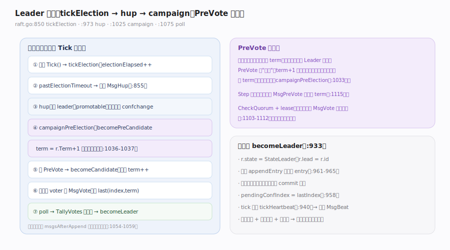
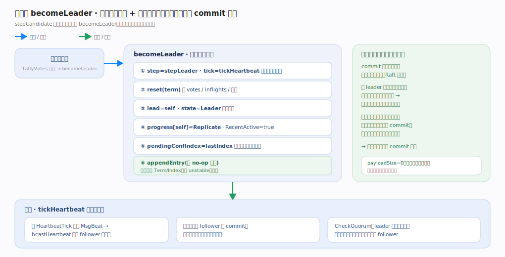

# etcd Raft 核心原理 · 支撑能力域 · Leader 选举

> **定位**：保证任一时刻至多一个 Leader。宿主 `Tick()` 驱动 `tickElection` 累加 `electionElapsed`，超时自发 `MsgHup` → `hup` → `campaign`。默认走 **PreVote**：先 `becomePreCandidate` 用 `term+1` 探路但**不真正自增**，赢得多数 pre-vote 才 `becomeCandidate` 真正 `term++` 并发 `MsgVote`；`poll`/`TallyVotes` 得多数派即 `becomeLeader`。核实基准：`raft.go`（`tickElection` :850、`hup` :973、`campaign` :1025、`poll` :1075、`becomeLeader` :933、`Step` term 裁决 :1097）。**注意**：选举的"计时"也来自宿主的 tick——库不自带定时器。

## 一、选举流程 + PreVote

- **触发**：`tickElection`（`raft.go:850`）在 follower/candidate 上由 `r.tick()` 执行，`electionElapsed++`；`promotable() && pastElectionTimeout()` 时自发 `MsgHup`（`:853-855`）。
- **hup 前置检查**（`raft.go:973`）：已是 leader 则忽略（`:974`）、不可晋升则拒（`:979`）、有未应用的 ConfChange 则不竞选（`:983`）。
- **campaign**（`raft.go:1025`）：`campaignPreElection` 分支先 `becomePreCandidate`（`:1034`），`voteMsg = MsgPreVote`、`term = r.Term + 1`——**PreVote RPC 用未来 term 但此刻不改 `r.Term`**（`:1036-1037`）；否则 `becomeCandidate`（`:1039`）真正用 `r.Term`。随后向所有 voter 发投票请求，携带本地 `last.index`/`last.term`（`:1071`）。给自己的那票不发网络，而是经 `msgsAfterAppend` 在落盘后自我确认（`:1054-1059`）。
- **计票**：`poll`（`raft.go:1075`）→ `r.trk.RecordVote` + `TallyVotes`（`:1081-1082`）；得多数派后（在 `stepCandidate` 里）`becomeLeader`。
- **PreVote 特判**：`Step` 中 "Never change our term in response to a PreVote"（`raft.go:1115-1116`）；CheckQuorum + lease 未过期时，收到更高 term 的 `MsgVote` 直接忽略（`:1103-1112`），进一步防被隔离节点扰动。

---

## 二、当选后 becomeLeader 立即追加空条目

**图注**：`becomeLeader`（`raft.go:933`）的六步动作压进图——设 `step=stepLeader`/`tick=tickHeartbeat`（`:940`）、`reset(term)`、`lead=r.id`/`state=StateLeader`（`:941-942`）、自身 progress 设 Replicate（`:947-948`）、保守设 `pendingConfIndex=lastIndex`（`:958`），并**立即 `appendEntry` 一条空 no-op entry**（`:961-965`）。这条 no-op 是 Raft 论文的经典手法：新 leader 不能直接提交前任期的日志（只能靠本任期条目"顺带"推进 commit），空条目让本任期尽快产生一个可提交点、抬起 commit 水位（`payloadSize=0` 也能被计入）。此后 `tickHeartbeat` 定期发 `MsgBeat`（`:883-885`）带 commit 给 follower、并借 CheckQuorum 自检多数派活性以维持领导权。

---

## 拓展 · 选举相关参数与机制

| 项 | 机制 | 源码 |
|---|---|---|
| 初始状态 | Follower | `raft.go:51` |
| ElectionTick | 建议 = 10 × HeartbeatTick | `raft.go:130-136` |
| HeartbeatTick | leader 每 N tick 发心跳 | `raft.go:137-140` |
| 随机化超时 | [electionTimeout, 2×-1) | `raft.go:418-421` |
| PreVote | `Config.PreVote`，默认建议开 | `raft.go:414`、`:1033` |
| CheckQuorum | leader 自检多数派活性 | `raft.go:413`、`:1281` |
| 空条目 | 当选即 appendEntry(nil) | `raft.go:961` |

---

## 常见误区与工程要点

- **以为谁先超时谁当选**：还要日志足够新（`campaign` 带 `last` index/term，接收方比对）+ 拿到多数票。
- **以为 PreVote 会自增 term**：不会。PreVote 用 `term+1` 只是探路，赢了才在 `becomeCandidate` 真正 `term++`。
- **忽略选举计时来自宿主**：`tickElection` 只在宿主调 `Tick()` 时推进；宿主 Ticker 停了，选举也不会触发。
- **把 CheckQuorum 与 PreVote 混为一谈**：PreVote 防"回归的隔离节点抬 term"，CheckQuorum 让 leader 主动发现自己失去多数并退位（`raft.go:1281-1284`）。
- **未应用 ConfChange 时竞选**：`hup` 会拒绝（`raft.go:983`），避免在配置未定时选举。

---

## 一句话总纲

**Leader 选举由宿主 Tick 驱动：`tickElection` 累加 electionElapsed，超时自发 MsgHup → hup（校验非 leader、可晋升、无未应用 ConfChange）→ campaign；默认 PreVote 先 becomePreCandidate 用 term+1 探路却不真正自增（Step 更特判"绝不因 PreVote 改 term"），赢得多数 pre-vote 才 becomeCandidate 真正 term++、向所有 voter 发带 last(index,term) 的 MsgVote，poll/TallyVotes 得多数即 becomeLeader 并立即追加一条空条目确立本任期 commit 水位、tick 切到心跳——单调任期 + 日志新度 + 一任期一票共同保证选出唯一且含全部已提交日志的 Leader，PreVote 与 CheckQuorum+lease 一起把被隔离节点的扰动降到最低。**
