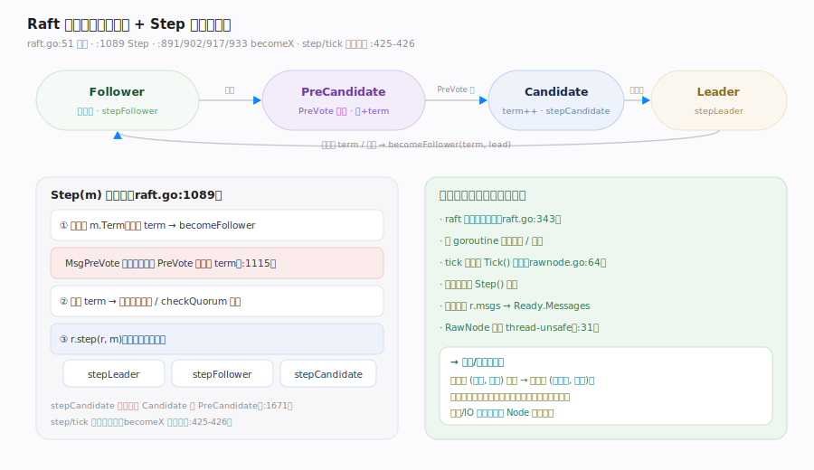
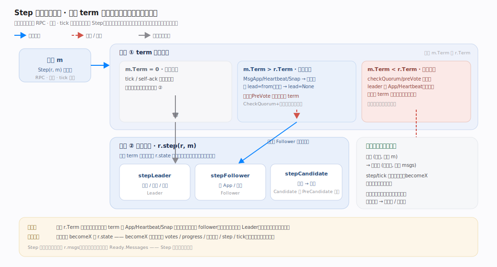

# etcd Raft 核心原理 · 支撑能力域 · Raft 状态机核心

> **定位**：库的内核是一个纯内存、确定性的状态机——四态（`Follower`/`Candidate`/`Leader`/`PreCandidate`）+ 单入口 `Step`。所有消息（提案、RPC、本地 tick 产物）都归一到 `Step`，先做 term 裁决、再按当前状态分派到 `stepLeader`/`stepFollower`/`stepCandidate`。没有驱动复制或计时的 goroutine——`tick` 靠宿主 `Tick()` 推、消息靠宿主 `Step()` 喂。核实基准：`raft.go`（`type raft` :343、`StateType` :51-54/:112、`Step` :1089、`becomeX` :891/:902/:917/:933）。

## 一、四态 + Step 单入口

**四态**（`raft.go:51-54`，`type StateType uint64` :112）：`StateFollower`(iota) / `StateCandidate` / `StateLeader` / `StatePreCandidate`。当前态存在 `r.state`（`raft.go:359`）。状态切换由 `becomeFollower`（`:891`）/`becomeCandidate`（`:902`）/`becomePreCandidate`（`:917`）/`becomeLeader`（`:933`）完成，每个都会重设 `r.step` 与 `r.tick` 这两个**函数指针**（`raft.go:425-426`）——例如 `becomeLeader` 设 `r.step = stepLeader`、`r.tick = r.tickHeartbeat`（`:938-940`）。

## Step 两段式闸门 · 先裁 term，再分派状态

**图注**：`Step`（`raft.go:1089`）是单入口两段式闸门，两段被压进图。**段①·term 统一裁决**（`:1097-1148`）：`m.Term=0` 为本地消息（tick/self-ack）直落段②；`m.Term > r.Term` 通常 `becomeFollower` 退位，`MsgApp`/`MsgHeartbeat`/`MsgSnap` 带更高 term 时记对方为 lead（`:1123-1130`），**PreVote 特例**"Never change our term in response to a PreVote"（`:1115-1116`）；`m.Term < r.Term` 且 checkQuorum/preVote 时对老 leader 的消息特殊处理、其余静默丢弃（`:1133-1148`）。**段②·状态分派**：`r.step(r, m)` 按 `r.state` 落到 `stepLeader`（`:1275`）/`stepFollower`（`:1718`）/`stepCandidate`（`:1673`，同时服务 Candidate 与 PreCandidate）。不变式：分派前必过 term 闸门、term 单调不减；改 `r.state` 只能走 `becomeX` 并同步重置 votes/progress/step/tick。

---

## 二、为什么是"确定性内核"

`raft` 结构（`raft.go:343-437`）是纯内存态：`Term`/`Vote`、`raftLog`、`trk`（ProgressTracker）、`state`、待发消息 `msgs`（`:368`）等，没有任何 I/O 句柄或线程。逻辑时钟靠宿主 `RawNode.Tick`（`rawnode.go:64`）→ `r.tick()` 推进；消息靠宿主 `Step` 喂入；输出攒进 `r.msgs`，由 `readyWithoutAccept` 收进 `Ready.Messages`（`rawnode.go:145`）。`RawNode` 顶部注释直言 "RawNode is a thread-unsafe Node"（`rawnode.go:31`）。**结论**：同一份（状态, 输入消息）→ 确定的（新状态, 输出消息），测试可同步逐步驱动、逐步断言，不依赖真实时钟或网络——这正是 etcd/raft 可测、可嵌的根基，也是它把并发/IO 全推给宿主的前提。

---

## 拓展 · 四态与其 step/tick 绑定

| 状态 | step 函数 | tick 函数 | 进入方式 | 源码 |
|---|---|---|---|---|
| Follower | stepFollower | tickElection | becomeFollower | `raft.go:891` |
| PreCandidate | stepCandidate | tickElection | becomePreCandidate | `raft.go:917` |
| Candidate | stepCandidate | tickElection | becomeCandidate | `raft.go:902` |
| Leader | stepLeader | tickHeartbeat | becomeLeader | `raft.go:933` |

---

## 常见误区与工程要点

- **以为 etcd/raft 有后台线程在跑协议**：没有。核心是被动状态机，全靠宿主 `Tick`/`Step` 驱动。
- **PreCandidate 当成独立 step**：它复用 `stepCandidate`（`raft.go:1671-1673`），区别只在收到的响应消息类型。
- **以为 `Step` 里直接发网络**：`Step` 只把待发消息塞进 `r.msgs`，真正发送是宿主消费 `Ready.Messages`。
- **忽略 term 裁决的先手**：任何消息进 `Step` 先比 term，可能当场退位；这是单调任期与安全性的闸门。
- **直接改 `r.state`**：状态必须走 `becomeX`，因为它们同时重置 votes、progress、随机超时等（见 `reset` `raft.go:781`）。

---

## 一句话总纲

**Raft 状态机核心是一个纯内存、确定性的四态机（Follower/Candidate/Leader/PreCandidate）：一切消息经单入口 `Step` 先做 term 裁决（更高 term 通常退位为 follower，PreVote 例外绝不改 term）、再按当前状态经函数指针 `r.step` 分派到 stepLeader/stepFollower/stepCandidate，状态切换统一走 becomeX 并同时重置 step/tick/votes/progress；库不含驱动复制或计时的 goroutine，tick 靠宿主 Tick 推、消息靠宿主 Step 喂、输出攒进 Ready.Messages——这份"无隐藏线程的确定性"正是 etcd/raft 可单测、可嵌入的根基。**
