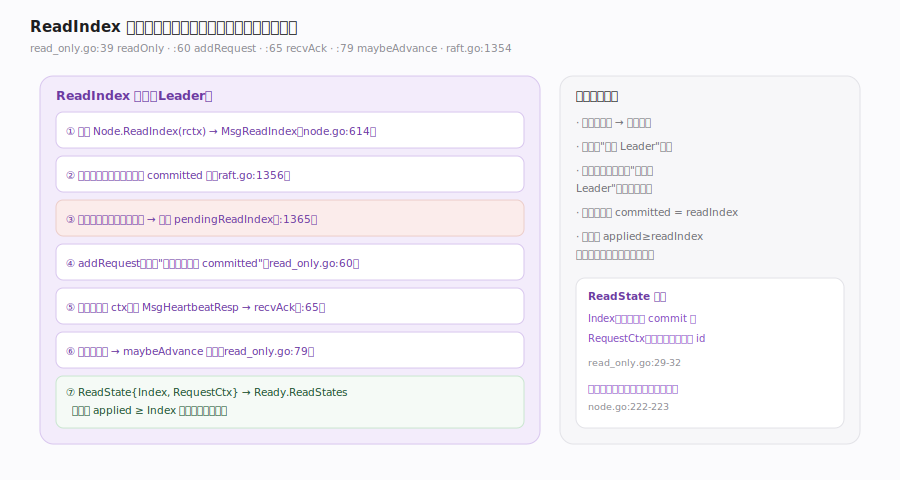

# etcd Raft 核心原理 · 支撑能力域 · ReadIndex 线性化读

> **定位**：横切能力——让宿主在**不写日志**的前提下做线性化读。核心难题是防"陈旧 Leader 读脏"：一个已被网络分区、实际已失去领导权的老 Leader 若直接本地读，可能返回过期数据。ReadIndex 的做法是：记录"收到读请求时的 `committed`"作为 read index，再向多数派发心跳确认"我此刻仍是 Leader"，确认后把 `ReadState{Index, RequestCtx}` 放进 `Ready.ReadStates`；宿主等自己的 `applied ≥ Index` 后即可安全执行该读。核实基准：`read_only.go`（`readOnly` :39、`addRequest` :60、`recvAck` :65、`maybeAdvance` :79）、`raft.go`（`stepLeader` MsgReadIndex :1354）、`node.go`（`ReadIndex` :224/:614）。

## 一、ReadIndex 流程

1. 宿主 `Node.ReadIndex(ctx, rctx)`（`node.go:614`）发一条 `MsgReadIndex`（`rctx` 是请求方给的唯一标识）。
2. Leader `stepLeader` case `MsgReadIndex`（`raft.go:1354`）：若集群只有自己一个 voter（`IsSingleton`，`:1356`），直接用当前 `committed` 回 ReadState。
3. 若**本任期还没提交过任何条目**，暂存进 `pendingReadIndexMessages`（`raft.go:1365-1367`）——因为新 Leader 未提交本任期条目前，commit 水位不可信；待本任期首个条目提交后（`releasePendingReadIndexMessages`，见 `raft.go:1553`）再处理。
4. `readOnly.addRequest`（`read_only.go:60`）记录"收到请求时的 `commitIndex`"作为该请求的 read index。
5. 广播心跳携带 ctx（`bcastHeartbeatWithCtx`，`raft.go:728`），收到 `MsgHeartbeatResp` 时 `recvAck`（`read_only.go:65`）累计确认。
6. `maybeAdvance`（`read_only.go:79`）用 `JointConfig.CommittedIndex` 判断多少读已被多数派确认，放行这些请求。
7. 放行的读变成 `ReadState{Index, RequestCtx}`（`read_only.go:29-32`）进 `Ready.ReadStates`（`rawnode.go:158-160`）；宿主等 `applied ≥ Index` 后执行读，保证读到该点及之前的已提交状态。

---

## 二、为什么这样就线性化

线性化读要求"读到的状态不早于读请求发起时刻已提交的状态"。ReadIndex 抓住两个点：
- **read index = 收到请求时的 committed**：这是一个"读不能早于"的下界。
- **多数派心跳确认领导权**：确保当前节点此刻确实是 Leader（没被分区成陈旧 Leader），因此它的 committed 是全局最新的已提交位。
两者结合：宿主只要等本地 `applied` 追上 read index，就能本地读且满足线性化——全程零日志写、零额外落盘。`ReadOnlyLeaseBased` 是另一种基于租约的选项（`read_only.go:40` 的 `option`），用时间租约替代心跳往返。

---

## 拓展 · ReadIndex 关键结构

| 项 | 作用 | 源码 |
|---|---|---|
| ReadState{Index,RequestCtx} | 交给宿主的读许可 | `read_only.go:29-32` |
| readOnly.unconfirmedReads | 尚未被多数派确认的读队列 | `read_only.go:43` |
| addRequest(commitIndex, req) | 记录请求时的 commit | `read_only.go:60` |
| recvAck(from, ctx) | 心跳回执累计确认 | `read_only.go:65` |
| maybeAdvance | 放行已确认的读 | `read_only.go:79` |
| pendingReadIndexMessages | 本任期未提交前暂存 | `raft.go:1366` |

---

## 常见误区与工程要点

- **以为 ReadIndex 会写日志**：不会，它零日志写；这正是它比"提交一条 no-op 再读"更轻的原因。
- **忽略"本任期须先提交一条"**：新 Leader 在本任期提交首个条目前，读请求会被暂存（`raft.go:1365`），否则 commit 水位不可信。
- **宿主没等 `applied ≥ Index` 就读**：可能读到尚未 apply 的旧状态；`ReadState.Index` 是必须达到的下界。
- **不重试 ReadIndex**：读请求可能无声丢失，"it is user's job to ensure read index retries"（`node.go:222-223`）。
- **RequestCtx 不唯一**：宿主用它区分是哪个读的回执（`read_only.go:24-32`），重复会串号。

---

## 一句话总纲

**ReadIndex 让宿主零日志写地做线性化读：Leader 收到 MsgReadIndex 后先记录"当下 committed"作为 read index（本任期尚未提交任何条目时先暂存），再广播心跳向多数派确认"我此刻仍是 Leader"以排除陈旧 Leader 读脏，maybeAdvance 在多数派确认后把 ReadState{Index,RequestCtx} 放进 Ready.ReadStates；宿主等本地 applied 追上该 Index 即可安全本地读——read index 的下界 + 多数派领导权确认共同保证线性化，全程不写日志、不额外落盘，重试则是宿主的责任。**
