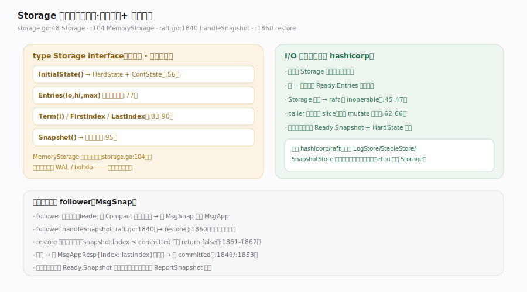

# etcd Raft 核心原理 · 支撑能力域 · Storage 与快照

> **定位**：这是"I/O 全外包"最直白的体现。`Storage`（`storage.go:48`）是一个**宿主实现、库只读**的接口——库通过它读历史日志、term、初始状态与快照，但**从不通过它写盘**；写全靠宿主消费 `Ready.Entries`/`Ready.Snapshot` 自己落盘。落后太多的 follower 由 leader 发 `MsgSnap` 追平，follower `handleSnapshot` → `restore` 恢复日志与配置。核实基准：`storage.go`（`Storage` 接口 :48-96、`MemoryStorage` :104）、`raft.go`（`handleSnapshot` :1840、`restore` :1860）。**对照 hashicorp/raft**：后者用 LogStore/StableStore/SnapshotStore 三件套注入且库自管读写；etcd/raft 只有一个只读 `Storage`，写路径完全在宿主手里。

## 一、Storage 只读接口 + 快照追平

**Storage 接口**（`storage.go:48-96`）：`InitialState()`（`:56`，返回 HardState+ConfState）、`Entries(lo,hi,maxSize)`（`:77`，取区间日志）、`Term(i)`（`:83`）、`LastIndex()`（`:85`）、`FirstIndex()`（`:90`）、`Snapshot()`（`:95`）。顶部注释：接口"may be implemented by the application"（`:42-43`）；若任一方法出错，"the raft instance will become inoperable and refuse to participate in elections"（`:45-47`）。返回的 slice 归 caller 所有、但条目本身不可 mutate（`:62-66`）。`MemoryStorage`（`storage.go:104`）只是参考实现，生产环境宿主通常在其上接 WAL / boltdb。

**关键**：这是"读"接口。日志的**写**（append 落盘）不经 `Storage.Append` 由库触发，而是库把待落盘条目放进 `Ready.Entries`、宿主自己写；`MemoryStorage.Append` 是宿主在处理 `Ready` 时调的（应用侧），不是库调的。

---

## 二、快照追平落后 follower

当某 follower 落后太多、leader 已把它需要的日志 `Compact` 掉时，leader 改发 `MsgSnap` 而非 `MsgApp`：
- follower `handleSnapshot`（`raft.go:1840`）→ `restore(s)`（`:1860`）恢复日志与配置。
- `restore` 拒绝过期快照：`snapshot.Index <= committed` 直接 `return false`（`:1861-1862`）；非 follower 态收到也防御性拒绝（`:1864-1874`）。
- 成功回 `MsgAppResp{Index: lastIndex}`（`raft.go:1849`），失败回 `committed`（`:1853`）。
- 快照的落盘同样经 `Ready.Snapshot`（`node.go:82-87`）由宿主承担；若 `Ready.Messages` 含 `MsgSnap`，宿主发送后须调 `ReportSnapshot`（`node.go:230-240`）回报成败，否则 leader 会一直暂停对该 follower 的探测。

---

## 拓展 · Storage 方法与错误语义

| 方法 | 语义 | 源码 |
|---|---|---|
| InitialState | 恢复 HardState + ConfState（重启用） | `storage.go:56` |
| Entries(lo,hi,max) | [lo,hi) 区间日志，至少返回一条 | `storage.go:77` |
| Term(i) | 条目 i 的 term（含 FirstIndex-1） | `storage.go:83` |
| Snapshot() | 最近快照；未就绪回 ErrSnapshotTemporarilyUnavailable | `storage.go:95`/`:38` |
| ErrCompacted | 请求 index 已被压缩 | `storage.go:28` |
| ErrUnavailable | 请求条目不可得 | `storage.go:36` |

---

## 常见误区与工程要点

- **以为库会调 `Storage` 写日志**：不会。`Storage` 是只读接口；写盘是宿主处理 `Ready.Entries`/`Ready.Snapshot` 的事。
- **mutate 了 `Entries` 返回的条目**：违反约定（`storage.go:62-66`），因为 raft 可能把这些条目经 `Ready` 再转给应用。
- **Storage 报错当普通错误吞掉**：任一方法出错会让 raft 实例失效（`storage.go:45-47`），宿主需负责 cleanup/recovery。
- **发了 `MsgSnap` 不调 `ReportSnapshot`**：leader 会一直暂停对该 follower 的日志探测（`node.go:230-240`）。
- **拿快照当"总能安装"**：`restore` 会拒绝比当前 committed 还旧的快照（`raft.go:1861-1862`）。

---

## 一句话总纲

**Storage 是 etcd/raft "I/O 全外包" 的接口化身：它是宿主实现、库只读的接口（InitialState/Entries/Term/FirstIndex/LastIndex/Snapshot），库只用它读历史与初始状态，绝不通过它写盘——日志与快照的落盘由宿主消费 Ready.Entries/Ready.Snapshot 自己完成；落后太多的 follower 由 leader 发 MsgSnap，follower handleSnapshot→restore 恢复日志与配置并拒绝过期快照，发送 MsgSnap 后宿主须 ReportSnapshot 回报；对照 hashicorp/raft 的 LogStore/StableStore/SnapshotStore 三件套自管读写，etcd/raft 把写路径彻底留给宿主，只保留一个只读 Storage。**
