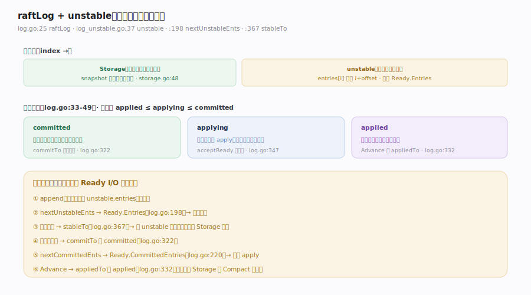
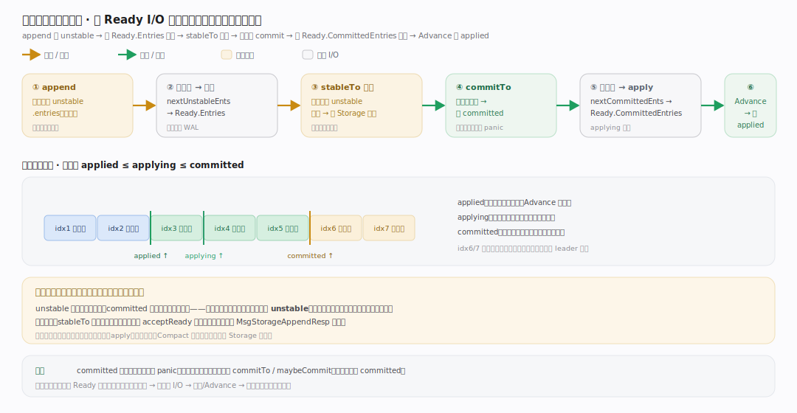

# etcd Raft 核心原理 · 支撑能力域 · raftLog 与 unstable

> **定位**：库的内存日志层。`raftLog` 把日志分成两段——`storage`（宿主实现、已落盘的稳定段）与 `unstable`（内存中尚未落盘的新条目/快照）——并维护三条单调水位 `committed`/`applying`/`applied`（不变式 `applied ≤ applying ≤ committed`）。一条日志的生命周期与 Ready I/O 环紧密耦合：`append` 进 unstable → `nextUnstableEnts` 交 `Ready.Entries` → 宿主落盘后 `stableTo` 清出 → `commitTo` 抬 committed → `nextCommittedEnts` 交 `Ready.CommittedEntries` → 宿主 apply 后 `appliedTo` 抬 applied。核实基准：`log.go`（`raftLog` :25、水位注释 :33-49、`commitTo` :322、`appliedTo` :332、`stableTo` :367、`nextUnstableEnts` :198、`nextCommittedEnts` :220）、`log_unstable.go`（`unstable` :37）。

## 一、内存日志分段 + 三条水位

**分段**：`raftLog`（`log.go:25-64`）持 `storage Storage`（`:27`）与 `unstable unstable`（`:31`）。`unstable`（`log_unstable.go:37-54`）的顶部注释说明它"holds on to new log entries and an optional snapshot until they are handed to a Ready struct for persistence"，并在移交后继续持有直到落盘稳定（`log_unstable.go:24-31`）；`entries[i]` 的 raft 位置是 `i + offset`（`:33/:42-43`）。

**三条水位**（`log.go:33-49`）：
- `committed`（`:35`）：多数派已复制、可提交的最高位；`commitTo`（`:322`）只增不减，若 `tocommit > lastIndex` 直接 panic（日志损坏保护，`:325-326`）。
- `applying`（`:42`）：已交给宿主 apply 但尚未回执的最高位；`acceptApplying`（`:347`）在 `acceptReady` 时前进。
- `applied`（`:49`）：宿主确认已应用的最高位；`appliedTo`（`:332`）在 `Advance` 后推进。

---

## 二、一条日志的生命周期（与 Ready 耦合）

**图注**：一条日志六段流水，与 Ready I/O 环逐段咬合（图上半为流水线、下半为水位轴 `applied ≤ applying ≤ committed`）——① `append` 新条目先进 `unstable.entries`（`log.go:133`，冲突则先 truncate 尾）；② `nextUnstableEnts`（`log.go:198`）→ `Ready.Entries`（`rawnode.go:143`）交宿主落盘；③ 回执后 `stableTo`（`log.go:367`）把该段从内存清出、此后从 `Storage` 可读（`acceptReady` 里 `acceptUnstable()`，`rawnode.go:430`）；④ 多数派复制后 `commitTo` 抬 `committed`（`log.go:322`）；⑤ `nextCommittedEnts`（`log.go:220`）→ `Ready.CommittedEntries`（`rawnode.go:144`）交宿主 apply——注意 "Entries can be committed even when the local raft instance has not durably appended them"（`log.go:216-218`），`allowUnstable` 由是否同步存储写决定（`rawnode.go:443-445`）；⑥ `Advance` 后 `appliedTo` 抬 `applied`（`log.go:332`），快照后 `Storage` 可 `Compact` 旧段。关键正交：**"未落盘(unstable)"与"已提交(committed)"是两件事**——条目可以已提交却仍在 unstable 未落盘。

---

## 拓展 · raftLog 关键方法

| 方法 | 作用 | 源码 |
|---|---|---|
| append | 新条目进 unstable（可能先 truncate 冲突尾） | `log.go:133` |
| maybeAppend | follower 侧带一致性检查的追加 | `log.go:109` |
| nextUnstableEnts | 待落盘的 unstable 条目 → Ready.Entries | `log.go:198` |
| stableTo | 落盘回执后从 unstable 清出 | `log.go:367` |
| commitTo | 抬 committed（只增，越界 panic） | `log.go:322` |
| nextCommittedEnts | 待应用条目 → Ready.CommittedEntries | `log.go:220` |
| appliedTo | 抬 applied（Advance 后） | `log.go:332` |
| maybeCommit | term 匹配 + index 前进才提交 | `log.go:455` |

---

## 常见误区与工程要点

- **以为 unstable = 未提交**：不。unstable 指"未落盘"，与"已提交"正交——条目可以已提交但仍在 unstable（`log.go:216-218`）。
- **applied 与 applying 混淆**：`applying` 是"已交出待应用"，`applied` 是"宿主确认应用完"；两者之间是宿主处理 `CommittedEntries` 的窗口。
- **忘记 stableTo 依赖宿主回执**：同步模式下 `acceptUnstable` 在 `acceptReady` 里做（`rawnode.go:430`）；异步模式靠 `MsgStorageAppendResp` 驱动（`rawnode.go:266` 起）。
- **直接改 committed**：必须走 `commitTo`/`maybeCommit`，它们含越界与 term 保护。
- **以为库自己压缩日志**：日志压缩（Compact）是 `Storage` 实现（宿主）的事，库只维护水位。

---

## 一句话总纲

**raftLog 把日志分成 storage（宿主已落盘的稳定段）与 unstable（内存中未落盘的新条目/快照），并维护三条单调水位 committed/applying/applied（applied ≤ applying ≤ committed）；一条日志的生命周期与 Ready I/O 环逐段咬合：append 进 unstable → nextUnstableEnts 交 Ready.Entries 由宿主落盘 → 回执后 stableTo 清出并转由 Storage 可读 → 多数派复制后 commitTo 抬 committed → nextCommittedEnts 交 Ready.CommittedEntries 由宿主 apply → Advance 后 appliedTo 抬 applied——'未落盘'与'已提交'是正交的两件事，落盘和压缩都由宿主承担，库只在内存里推进水位。**
