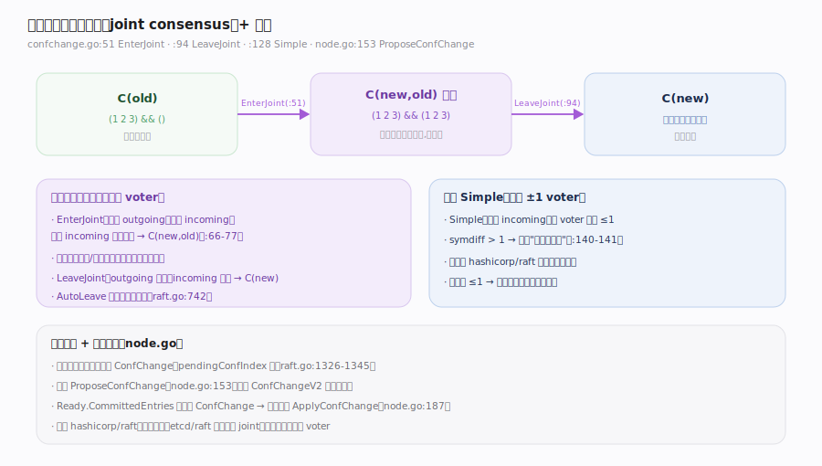

# etcd Raft 核心原理 · 支撑能力域 · 成员变更与联合共识

> **定位**：etcd/raft 与 hashicorp/raft 最鲜明的算法差异之一——它支持**联合共识（joint consensus）**：可以原子地从 `C(old)` 经过一个新旧两多数派并存的中间态 `C(new,old)` 过渡到 `C(new)`，从而一次替换多个 voter；也支持 `Simple` 单步变更（一次 ±1 voter，语义等同 hashicorp/raft）。同一时刻至多一个未决 ConfChange，由 `pendingConfIndex` 门串行化。宿主经 `ProposeConfChange` 发起、在 `Ready.CommittedEntries` 见到 ConfChange 时调 `ApplyConfChange`。核实基准：`confchange/confchange.go`（`EnterJoint` :51、`LeaveJoint` :94、`Simple` :128）、`raft.go`（ConfChange 校验 :1326-1345）、`node.go`（`ProposeConfChange` :153、`ApplyConfChange` :187）。

## 一、联合共识三态 + 两条路径

**联合共识**（对应 Raft 论文 4.3 的 `C_{new,old}`）：
- `EnterJoint`（`confchange/confchange.go:51`）：先校验 outgoing 为空、incoming 非空（`:56-65`），把 outgoing 清空并复制 incoming（`:66-71`，即 `(1 2 3)&&()` → `(1 2 3)&&(1 2 3)`），再对 incoming 施加变更（`:73`），得到 `C(new,old)`。联合期内，**提交与选举都要求新旧两个多数派同时通过**——这保证了过渡期的安全。
- `LeaveJoint`（`confchange/confchange.go:94`）：把 outgoing 置空（`:117`），incoming 成为唯一决策者（`:86-88`），收敛到 `C(new)`。`AutoLeave` 可让库在联合配置提交后自动追加一个离开联合的变更（`raft.go:742` 的 `AutoLeave && newApplied >= pendingConfIndex`）。

**单步 Simple**（`confchange/confchange.go:128`）：只改 incoming，且 voter 增删不超过 1（`symdiff > 1` 直接报错 "more than one voter changed without entering joint config"，`:140-141`）。配置差 ≤1 保证新旧多数派必相交，因此单步也安全——这正是 hashicorp/raft 采用的唯一路径。

---

## 二、串行化门 + 宿主驱动

- **pendingConfIndex 门**：`stepLeader` 处理 `MsgProp` 时，对 ConfChange 做三态校验——`alreadyPending`（还有未应用的变更）、`alreadyJoint`（已在联合态）、`wantsLeaveJoint`（空变更=想离开联合）（`raft.go:1326-1337`）。校验不过就把这条变成 no-op（`:1341`），保证**同一时刻至多一个未决 ConfChange**。
- **宿主发起**：`Node.ProposeConfChange`（`node.go:153`）接受 `pb.ConfChange`（deprecated）或 `pb.ConfChangeV2`；后者"allows arbitrary configuration changes via joint consensus, notably including replacing a voter"（`node.go:148-152`）。
- **宿主应用**：当 `Ready.CommittedEntries` 中出现 ConfChange 类型条目时，宿主**必须**调 `ApplyConfChange`（`node.go:179-187`），返回的 `ConfState` 要记进快照；除非应用决定把它当 no-op 拒绝（`node.go:181-184`）。

---

## 拓展 · 成员变更 API 与语义

| 项 | 语义 | 源码 |
|---|---|---|
| EnterJoint | C(old) → C(new,old) 联合态 | `confchange.go:51` |
| LeaveJoint | C(new,old) → C(new) 收敛 | `confchange.go:94` |
| Simple | 单步 ≤1 voter 变更 | `confchange.go:128` |
| ProposeConfChange | 宿主发起（V2 支持联合） | `node.go:153` |
| ApplyConfChange | 见到 ConfChange 时回调 | `node.go:187` |
| pendingConfIndex | 串行化门，至多一个未决 | `raft.go:1326` |
| AutoLeave | 联合提交后自动离开 | `raft.go:742` |

---

## 常见误区与工程要点

- **以为 etcd/raft 只有单步**：错。它同时支持 joint consensus，可原子替换多个 voter——这是与 hashicorp/raft 的关键差异。
- **在联合态里做 Simple**：会报错（`confchange.go:133-135`）；必须先 `LeaveJoint`。
- **单步一次改多个 voter**：`Simple` 的 `symdiff > 1` 会报错（`confchange.go:140-141`）。
- **忘了 `ApplyConfChange`**：`Ready.CommittedEntries` 里的 ConfChange 必须回调，否则库与应用的配置视图会分叉（`node.go:179-187`）。
- **同时提两个 ConfChange**：`pendingConfIndex` 门会把第二个降级成 no-op（`raft.go:1326-1341`）。
- **重用旧节点 ID**：ID 必须全局唯一且只用一次（`doc.go:167-170`）。

---

## 一句话总纲

**成员变更是 etcd/raft 区别于 hashicorp/raft 的算法亮点：它支持联合共识——EnterJoint 把 C(old) 过渡到新旧两多数派并存的 C(new,old)（联合期提交/选举都需两多数派同时过）、LeaveJoint 收敛到 C(new)，从而原子替换多个 voter；也支持 Simple 单步（一次 ±1，symdiff>1 即报错，语义同 hashicorp）；pendingConfIndex 门保证同一时刻至多一个未决变更，宿主经 ProposeConfChange（V2 开启联合）发起、在 Ready.CommittedEntries 见到 ConfChange 时必须 ApplyConfChange 并把返回的 ConfState 记进快照——单步靠"配置差≤1 使新旧多数派必相交"、联合靠"两多数派同时过"各自保证过渡安全。**
