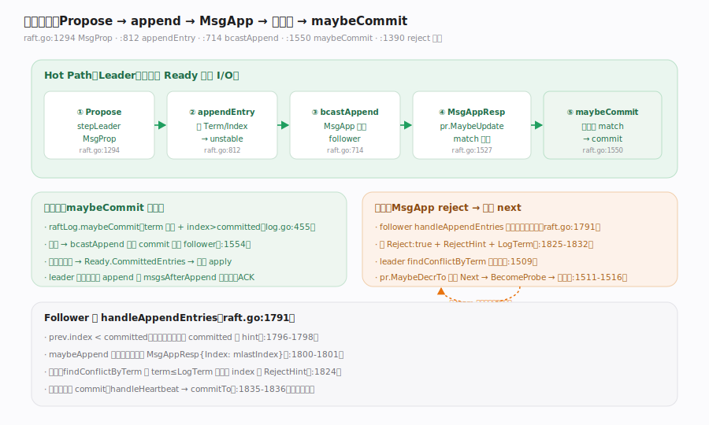
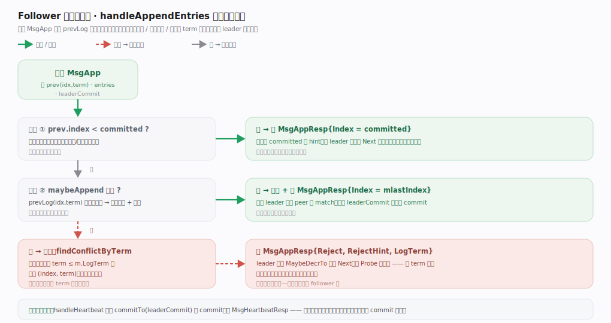

# etcd Raft 核心原理 · 支撑能力域 · 日志复制

> **定位**：写路径的主干（Hot Path）。Leader 收到 `MsgProp` → `appendEntry` 盖 Term/Index 追加进 unstable → `bcastAppend` 向各 follower 发 `MsgApp` → 收 `MsgAppResp` 更新 `match` → 多数派 match 后 `maybeCommit` 提交 → 已提交条目进 `Ready.CommittedEntries` 交宿主 apply。失败时 follower 回 `Reject`+`RejectHint`，leader 按 term 跳跃回退 `Next` 重探。全程真实 I/O（落盘/发送）由宿主经 `Ready` 承接。核实基准：`raft.go`（`stepLeader` MsgProp :1294、`appendEntry` :812、`bcastAppend` :714、`maybeCommit` :775/1550、reject 回退 :1390-1516、`handleAppendEntries` :1791）、`log.go`（`maybeCommit` :455）。

## 一、Hot Path + 失败回退

**Leader 侧主链**：
1. `stepLeader` 收 `MsgProp`（`raft.go:1294`），（ConfChange 校验后）`r.appendEntry(m.Entries...)`（`:1349`），再 `r.bcastAppend()`（`:1352`）。
2. `appendEntry`（`raft.go:812`）为每条盖上 `Term`（`:818`）与递增的 `Index`（`:819`），`r.raftLog.append`（`:834`）进 unstable，并给自己发一条 `MsgAppResp` 自我确认——注释说明这在条目"durably persisted"后才生效（`:835-846`）。
3. `bcastAppend`（`raft.go:714`）遍历除自己外的所有 peer，`sendAppend`（`:605`）发 `MsgApp`。
4. follower 的 `MsgAppResp` 成功分支：`pr.MaybeUpdate(m.Index)`（`raft.go:1527`）前进 match；随后 `r.maybeCommit()`（`:1550`）成功则 `r.bcastAppend()`（`:1554`）把新 commit 播出去。
5. `maybeCommit`（`raft.go:775`）→ `raftLog.maybeCommit`（`log.go:455`）：`at.term!=0 && at.index>committed && matchTerm` 才 `commitTo`（`log.go:459-461`）——**只提交当前 term 的条目**（Raft 论文的 commit 约束）。

**失败回退**：follower `handleAppendEntries`（`raft.go:1791`）一致性检查失败时回 `Reject:true`+`RejectHint`+`LogTerm`（`:1825-1832`）；leader 在 reject 分支用 `findConflictByTerm`（`:1509`）猜跳点，`pr.MaybeDecrTo`（`:1511`）下调 `Next`，`BecomeProbe`（`:1514`）后 `sendAppend` 重探（`:1516`）——按 term 跳跃而非逐条回退，快速对齐分叉日志。

---

## 二、Follower 侧一致性检查

**图注**：`handleAppendEntries`（`raft.go:1791`）是 follower 的两级决策树，压进图。**检查①** `prev.index < committed`：请求落在已提交区，直接回 `MsgAppResp{Index: committed}` 作 hint、让 leader 前移 `Next`（`:1796-1798`）。**检查②** `maybeAppend` 成功：`prevLog(idx,term)` 匹配上→写入并回 `MsgAppResp{Index: mlastIndex}`，leader 据此推进 `match`、以 `leaderCommit` 触发 `maybeCommit`（`:1800-1801`）。**否→冲突**：`findConflictByTerm(hintIndex, m.LogTerm)` 找 term ≤ `m.LogTerm` 的最大 `(index,term)` 作 `RejectHint`，回 `MsgAppResp{Reject, RejectHint, LogTerm}`，leader 侧据此 `MaybeDecrTo` 下调 `Next`、`BecomeProbe` 重探——**按 term 跳跃一步到位**，而非逐条回退（`:1824`）。旁路：心跳 `handleHeartbeat`（`:1835`）只 `commitTo(leaderCommit)` 推进 commit 后回 `MsgHeartbeatResp`，不携带日志（`:1836`）。

---

## 拓展 · 复制相关消息与进度

| 项 | 含义 | 源码 |
|---|---|---|
| MsgApp | 追加日志 RPC（含 prev/entries/commit） | `raft.go:605` sendAppend |
| MsgAppResp | 追加回执（成功带 Index，失败带 RejectHint） | `raft.go:1384` |
| Progress.Match/Next | 每 peer 已匹配 / 下一个待发 index | `raft.go:1511`/`:1527` |
| StateProbe/Replicate | 探测态 / 稳定复制态 | `raft.go:1514`/`:1530` |
| maybeCommit | 多数派 match 且 term 匹配才提交 | `log.go:455` |
| findConflictByTerm | 按 term 跳跃找匹配点 | `raft.go:1509`/`:1824` |

---

## 常见误区与工程要点

- **以为 leader 直接把日志写盘**：不。`appendEntry` 只进内存 unstable，落盘是宿主消费 `Ready.Entries`；leader 对自己那条的"确认"也要等宿主落盘回执（`raft.go:835-846`）。
- **以为能提交旧 term 的条目**：`maybeCommit` 要求 `at.term == r.Term`（`log.go:456-459`），旧 term 条目靠新 term 条目被提交时"顺带"提交。
- **把 reject 当逐条回退**：etcd/raft 用 `findConflictByTerm` 按 term 跳跃（`raft.go:1509`/`:1824`），比逐条快得多。
- **忽略"先落盘再发"**：`Ready.Entries` 必须先持久化再发 `Ready.Messages`（`node.go:74-80`），否则崩溃可能丢已"发送"但未落盘的日志。
- **心跳会带日志**：不会，心跳只推进 commit index（`raft.go:1835-1836`）。

---

## 一句话总纲

**日志复制是 Hot Path：Leader 收 MsgProp 后 appendEntry 盖 Term/Index 追加进内存 unstable（并给自己排一条落盘后生效的自 ACK），bcastAppend 向各 follower 发 MsgApp；follower handleAppendEntries 做一致性检查，成功回 MsgAppResp{Index} 推进 leader 的 match、失败按 findConflictByTerm 回 RejectHint；leader 多数派 match 且条目属当前 term 时 maybeCommit 提交并 bcastAppend 播出新 commit，reject 则 MaybeDecrTo 按 term 跳跃回退 Next 重探——已提交条目经 Ready.CommittedEntries 交宿主 apply，全程的落盘与网络发送都外包给宿主经 Ready 承接。**
