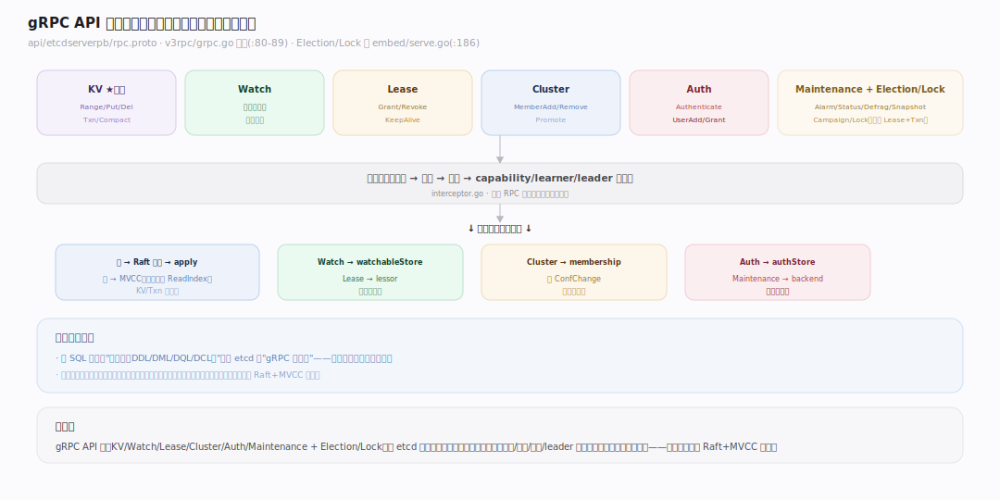
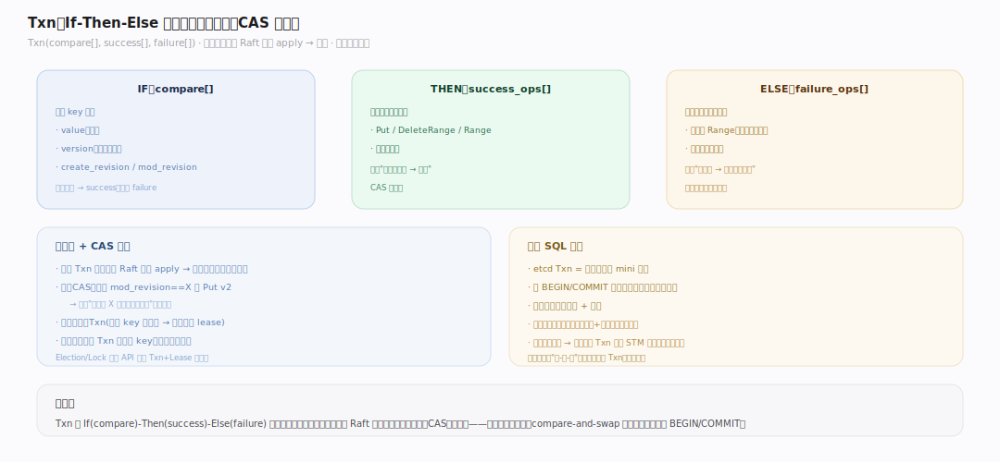
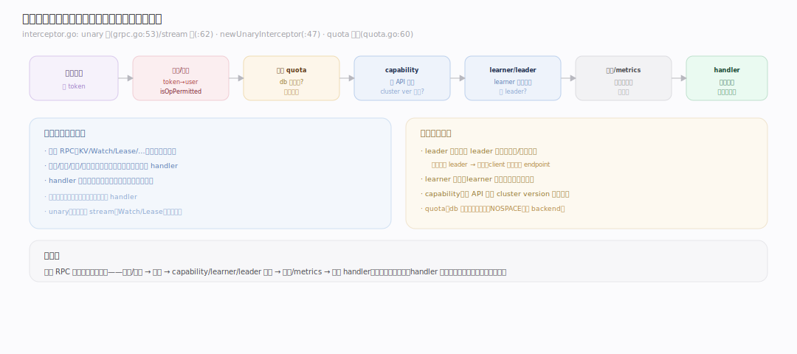
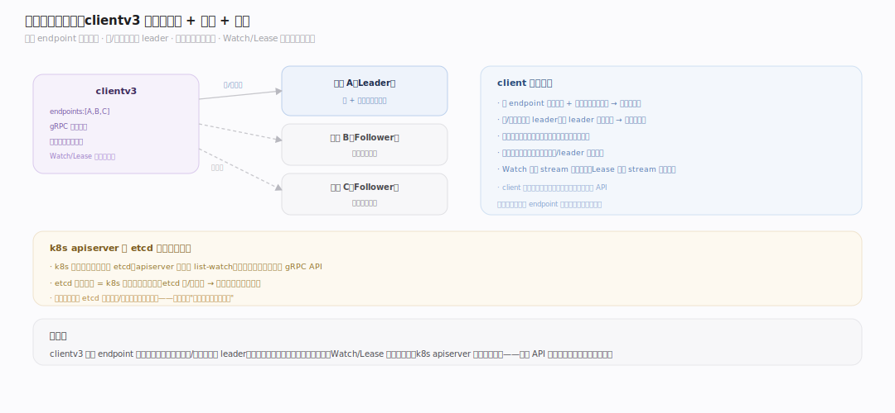

# etcd 原理 · 接触面主线 · gRPC API 族

> **定位**：gRPC API 族是 etcd 的**接触面**——用户/客户端下发一切操作的入口（对应 SQL 引擎的"语句族"）。骨架 = `一组 gRPC 服务（KV/Watch/Lease/Cluster/Auth/Maintenance + Election/Lock）→ 拦截器链（认证/配额/校验）→ 分派到内部能力域`。它是所有支撑主线的汇聚点：KV→[[MVCC 存储]]、写→[[Raft 共识]]、Watch→[[Watch 机制]]、Lease→[[Lease 租约]]、Cluster→[[成员与集群]]、Auth→[[认证与权限]]。核实基准：`~/workdir/etcd/api/etcdserverpb/rpc.proto` + `server/etcdserver/api/v3rpc`（main，v3.8.0-alpha.0）。

## 一、API 全景：七大服务

etcd v3 API 是**基于 gRPC + protobuf** 定义的（`api/etcdserverpb/rpc.proto`）。核心服务在 `server/etcdserver/api/v3rpc/grpc.go` 注册（`:80-89`）：

- **KV**：Range（读）、Put（写）、DeleteRange（删）、**Txn（事务）**、Compact（压缩）——最核心。
- **Watch**：双向流订阅变更（见 [[Watch 机制]]）。
- **Lease**：Grant/Revoke/KeepAlive/TimeToLive（见 [[Lease 租约]]）。
- **Cluster**：MemberAdd/Remove/Update/List/Promote（见 [[成员与集群]]）。
- **Auth**：AuthEnable/Authenticate/UserAdd/RoleGrantPermission…（见 [[认证与权限]]）。
- **Maintenance**：Alarm/Status/Defragment/Snapshot/Hash/MoveLeader——运维接口。

另外 **Election/Lock**（v3election/v3lock）在 `server/embed/serve.go:186` 注册——基于 Lease+Txn 封装的选主与分布式锁高层 API。所有服务共享同一套底层（Raft+MVCC）。

## 二、Txn：多操作原子事务

`Txn`（事务）是 etcd 最强大的原语，结构是 **If-Then-Else**：`Txn(compare[], success_ops[], failure_ops[])`——先判断一组 compare（比较 key 的 value/version/create_rev/mod_rev），全真则执行 success 分支的操作，否则执行 failure 分支。整个 Txn **原子**（作为一个 Raft 条目 apply，要么全成要么全不成）。这是**乐观并发控制（CAS）**的基础：如"若 key 的 mod_revision 还是 X（没被别人改过）则更新它"。分布式锁、选主、compare-and-swap 全靠它。对比 SQL 事务：etcd Txn 是**单次往返的 mini 事务**（无 BEGIN/COMMIT 交互式事务），一次请求带齐条件和操作——因为交互式事务在强一致 + 高并发下代价太高。

## 三、拦截器链：请求的统一管道

每个 RPC 进来先过**拦截器链**（`server/etcdserver/api/v3rpc/interceptor.go`），再到 handler。unary 链（`grpc.go:53`）与 stream 链（`:62`）各一套。关键拦截器：`newUnaryInterceptor`（`interceptor.go:47`）做 **capability 检查**（该 API 在当前 cluster version 是否可用）、**learner 检查**（learner 只能服务部分只读请求）、**leader 检查**（需 leader 的请求若本节点非 leader 则拒绝/转发）；`newLogUnaryInterceptor`（`:79`）记慢请求日志；**quota** 单独在 `quota.go:60` 的 `quotaKVServer.Put` 前检查 db 是否超配额（见 [[backend（boltdb）]]）。**统一管道的价值**：认证授权、配额、可观测、集群状态检查都在此集中处理，handler 只管业务逻辑。

## 深化 · 客户端交互模型

clientv3（官方 Go 客户端）的关键行为：**① endpoint 负载均衡**——client 配多个 endpoint（各成员地址），gRPC 自动在健康的成员间均衡/故障转移。**② 写与线性读定向 leader**：需 leader 的请求由 gRPC 层路由（拦截器发现非 leader 会返回错误，client 重试其他 endpoint）。**③ 串行读可走任意成员**（见 [[线性一致读]]）。**④ 自动重试**：幂等请求（读、部分写）在网络错误/leader 切换时自动重试。**⑤ Watch/Lease 长连接**：Watch 用一条 stream 多路复用、Lease keepalive 用一条 stream 持续心跳——client 库管理这些长连接的重连。**k8s apiserver** 就是 etcd 最大的客户端：它对 etcd 的每次 list-watch、每次资源写都经这套 API，etcd 的可用性 = k8s 控制面的可用性。

## 拓展 · API 边界

| 服务 | 关键方法 | 归属能力域 |
|---|---|---|
| KV | Range/Put/DeleteRange/Txn/Compact | MVCC + Raft |
| Watch | Watch（双向流） | Watch 机制 |
| Lease | Grant/Revoke/KeepAlive | Lease 租约 |
| Cluster | MemberAdd/Remove/Promote | 成员与集群 |
| Auth | Authenticate/UserAdd/… | 认证与权限 |
| Maintenance | Alarm/Status/Defragment/Snapshot | backend/运维 |
| Election/Lock | Campaign/Lock（基于 Lease+Txn） | 高层封装 |

## 调优要点（关键开关）

- `--max-request-bytes`：单请求上限（默认 1.5MB）——大 value 撑大日志/WAL。
- `--max-concurrent-streams`：单连接并发流上限。
- clientv3 配多 endpoint + 合理 DialTimeout/重试：利用故障转移。
- Txn 而非多次单独写：需原子/CAS 时用 Txn，别用"读-改-写"（有竞态）。
- Maintenance.Defragment / Snapshot：运维备份与碎片整理。

## 常见误区与工程要点

- **用"读-改-写"代替 Txn**：多次往返间可能被别人改，有竞态；用 Txn 的 compare 做 CAS 原子更新。
- **期望交互式事务**：etcd Txn 是单次往返的 If-Then-Else，无 BEGIN/COMMIT；复杂多步逻辑要拆成 Txn 或用 STM 库。
- **大 value**：etcd 存元数据、value 宜小（KB 级）；大 value 撑大 db/WAL、拖慢一切。
- **单 endpoint**：配多 endpoint 才有故障转移；单个挂了 client 就断。
- **忽视 leader 定向**：写和线性读需 leader；跨地域时就近 endpoint 未必快（仍要到 leader）。

## 源码锚点（etcd main `88fe81c`；均本地 grep 核实）

- `api/etcdserverpb/rpc.proto:33` `service KV`、`:92` `service Watch`、`:106` `service Lease`、`:163` `service Cluster`、`:205` `service Maintenance`、`:279` `service Auth` — 七大 gRPC 服务定义。
- `server/etcdserver/api/v3rpc/grpc.go:44` `Server(...)` 建 gRPC server；`:53` `chainUnaryInterceptors`（拦截器链）；`:71` `ChainUnaryInterceptor` 装配。
- `server/etcdserver/api/v3rpc/grpc.go:80` `RegisterKVServer(NewQuotaKVServer(s))`，`:81` Watch、`:82` `NewQuotaLeaseServer`、`:83` Cluster、`:84` Auth、`:89` Maintenance 逐一注册。
- `server/etcdserver/api/v3rpc/interceptor.go:47` `newUnaryInterceptor` / `:216` `newStreamInterceptor` — 认证/leader/capability 检查入口。
- `server/etcdserver/api/v3rpc/quota.go:27` `type quotaKVServer` / `:53` `NewQuotaKVServer` / `:40` `quotaAlarmer.check` — 配额包装层。

## 一句话总纲

**gRPC API 族是 etcd 的接触面：一组基于 gRPC+protobuf 的服务（KV/Watch/Lease/Cluster/Auth/Maintenance + 高层 Election/Lock）汇聚所有操作，请求先过拦截器链（认证/授权/配额/capability/leader 检查）再分派到内部能力域（KV→MVCC+Raft、Watch→Watch 机制…）；Txn 是 If-Then-Else 单次往返原子事务、乐观并发（CAS）的基础，支撑锁与选主；clientv3 管多 endpoint 负载均衡、leader 定向、自动重试与长连接。k8s apiserver 是它最大的客户端——这套 API 的可用性即控制面的可用性。**
