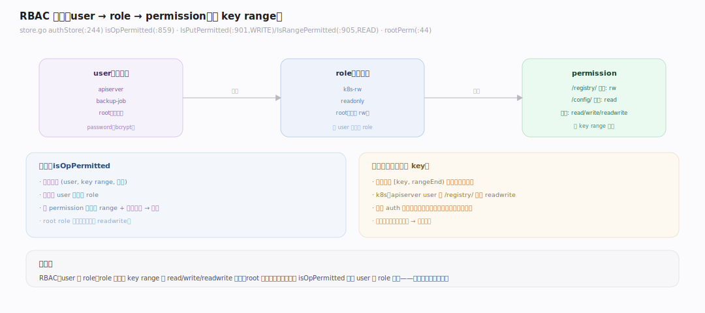
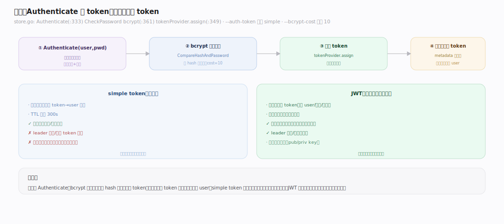
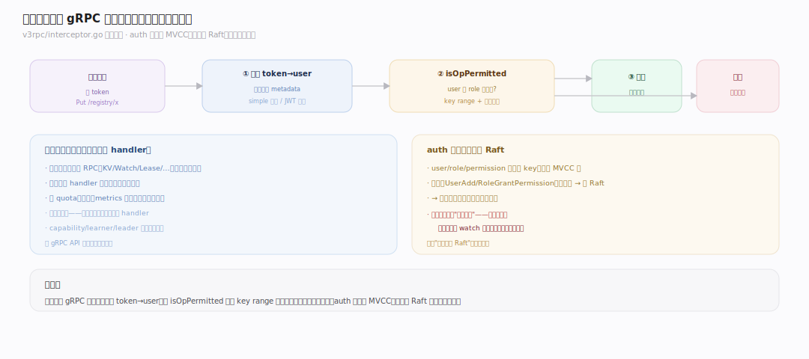
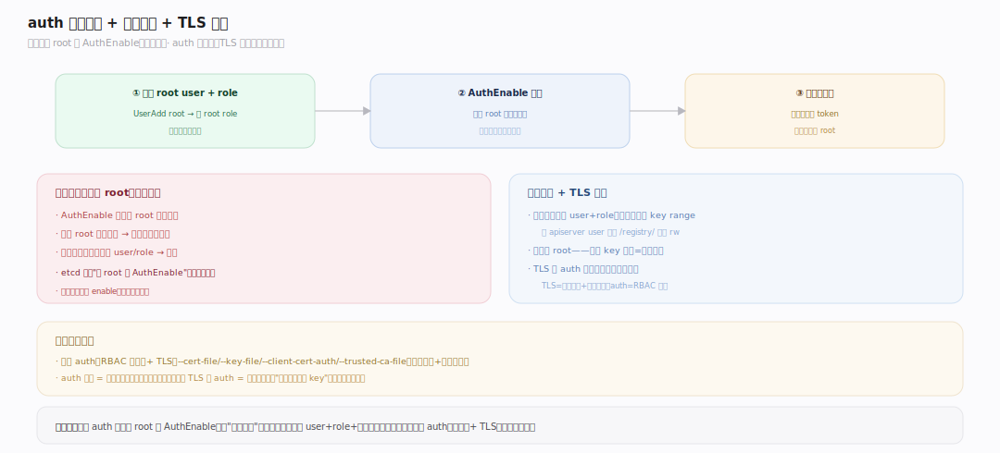

# etcd 原理 · 支撑主线 · 认证与权限（RBAC）

> **定位**：认证与权限是保障能力域——控制"谁能对哪些 key 做什么"。骨架 = `认证（user + password/token 证明身份）→ 授权（role 绑定 key range 权限）→ 每次请求校验`。经 [[gRPC API 族]] 拦截器链在请求入口检查。核实基准：`~/workdir/etcd/server/auth`（main，v3.8.0-alpha.0）。

## 一、RBAC 全景：user → role → 权限

etcd 的权限模型是经典 **RBAC（基于角色的访问控制）**。`authStore`（`server/auth/store.go:244`）管：**user（用户）→ 绑定若干 role（角色）→ role 授予若干 permission（对某 key range 的 read/write/readwrite）**。校验一次操作：`isOpPermitted`（`:859`）——检查该 user 的所有 role 里，是否有 permission 覆盖目标 key range 且权限类型匹配。特殊 `root` role 拥有全局 readwrite（`rootPerm`，`:44`），是超级管理员。权限粒度：`IsPutPermitted`（`:901`，WRITE）、`IsRangePermitted`（`:905`，READ）——按 key **范围**授权（如"只能读 /config/ 前缀"），不是单 key。**默认 auth 关闭**（无认证，任何客户端可读写）；启用后所有请求都要带身份。

---

## 二、认证：password + token

启用 auth 后，客户端先 `Authenticate(user, password)` 换取 **token**，后续请求带 token。密码校验：`CheckPassword`（`store.go:361`）用 **bcrypt**（`bcrypt.CompareHashAndPassword`），存储的是 bcrypt hash 而非明文；`--bcrypt-cost`（默认 **10** = `bcrypt.DefaultCost`，`config.go:552`）控制哈希强度（越高越慢越安全）。token 两种（`--auth-token`，默认 **"simple"**，`config.go:75`）：

- **simple token**：服务端内存里维护 token→user 映射，TTL 默认 300s。简单，但 leader 切换/重启 token 失效、不能跨节点共享。
- **JWT**：自包含签名 token，无状态、可跨节点验证、不依赖服务端存储。生产多节点推荐。

`Authenticate`（`store.go:333`）验密码通过后 `tokenProvider.assign`（`:349`）签发 token。

---

## 三、权限校验：在拦截器链检查

每个请求进来，在 [[gRPC API 族]] 的**拦截器链**（`v3rpc/interceptor.go`）里做认证授权检查（在真正执行前）：① 从请求元数据取 token → 解析出 user。② `isOpPermitted`：遍历 user 的 role，检查是否有 permission 覆盖请求的 key range + 权限类型。③ 通过则执行，否则返回权限错误。**为什么在拦截器**：统一入口、所有 RPC（KV/Watch/Lease/…）都经过，不必每个 handler 重复写。**auth 数据本身也存在 MVCC 里**——user/role/permission 是特殊 key，其变更（AuthUserAdd/RoleGrantPermission 等）也**走 Raft**（改数据要一致），所以权限变更在所有节点一致生效。**注意**：权限检查是"当前快照"——刚撤销的权限对已建立的 watch 流不追溯撤销（需重连）。

---

## 深化 · auth 启用与 root

启用 auth 的**正确顺序**（顺序错会把自己锁在外面）：① 先创建 `root` user 并授予 `root` role（`UserAdd root` → `UserGrantRole root root`）——必须先有 root，否则启用后无人能管理。② `AuthEnable` 开启认证。③ 此后所有请求需认证；管理操作（增删 user/role/权限）需 root 权限。**为什么必须先建 root**：`AuthEnable` 会检查 root 存在，防止"开了认证却没有管理员 → 谁都改不了"的死锁。**权限最小化**：给每个应用建专用 user + role，只授它需要的 key range（如 k8s 的 apiserver 用一个 user，只授 /registry/ 前缀 readwrite）；别都用 root。auth 关闭时无任何检查——**生产必须启用 auth + TLS**（TLS 保传输加密与双向证书认证，auth 保 RBAC 授权，两者互补）。

---

## 拓展 · 认证授权边界

| 类别 | 项 | 说明 |
|---|---|---|
| 模型 | RBAC：user→role→permission | 经典角色授权 |
| 权限类型 | read / write / readwrite | 按 key range |
| 超级用户 | root role | 全局 readwrite |
| 密码 | bcrypt hash | cost 默认 10 |
| token | simple / JWT | 默认 simple；多节点用 JWT |
| 校验点 | gRPC 拦截器链 | 统一入口 |
| auth 数据 | 存 MVCC，变更走 Raft | 全节点一致 |
| 传输安全 | TLS（正交） | 加密 + 证书认证 |

---

## 调优要点（关键开关）

- `--auth-token`：simple（默认，单节点/测试）vs jwt（多节点生产推荐，无状态跨节点）。
- `--bcrypt-cost`：密码哈希强度（默认 10）——高安全场景可调高，代价是认证变慢。
- TLS：`--cert-file`/`--key-file`/`--client-cert-auth`/`--trusted-ca-file`——传输加密 + 双向证书。
- 最小权限：每应用专用 user+role，只授需要的 key range，避免 root 滥用。
- 启用顺序：先建 root → AuthEnable，别反。

## 常见误区与工程要点

- **不启用 auth**：默认无认证，任何能连的客户端可读写全部数据——生产必开 auth + TLS。
- **启用顺序错**：没建 root 就 AuthEnable → 被 etcd 拒绝（防死锁）；必须先 root。
- **都用 root**：违背最小权限；一个 key 泄漏 = 全库沦陷。按应用分 user+role+范围。
- **simple token 用于多节点**：leader 切换/重启失效、不跨节点；多节点用 JWT。
- **以为 TLS = 授权**：TLS 只管传输加密和身份认证，不管"能读写哪些 key"——授权是 RBAC 的事，两者都要。

## 源码锚点（etcd main `88fe81c`；均本地 grep 核实）

- `server/auth/store.go:244` `type authStore` — RBAC 核心；`:44` `rootPerm`（root 全局 readwrite），`:664` 追加 rootPerm 到响应。
- `server/auth/store.go:266` `AuthEnable`（启用须先建 root，防死锁）；`:937` `IsAuthEnabled`。
- `server/auth/store.go:333` `Authenticate`（换 token）→ `:361` `CheckPassword`（bcrypt 校验密码）。
- `server/auth/store.go:859` `isOpPermitted`（遍历 user 的 role 查 range 权限）；`:901` `IsPutPermitted`（WRITE）；`:905` `IsRangePermitted`（READ）。
- `server/etcdserver/api/v3rpc/interceptor.go:47` `newUnaryInterceptor` — 每请求在拦截器链做认证/授权校验。
- `api/etcdserverpb/rpc.proto:279` `service Auth` — 认证相关 gRPC 服务定义。

## 一句话总纲

**认证与权限用经典 RBAC 控制访问：user 绑 role、role 授予对 key range 的 read/write/readwrite 权限，root role 是超级管理员；启用 auth 后客户端先 Authenticate（bcrypt 校验密码）换 token（simple 有状态 / JWT 无状态跨节点），每个请求在 gRPC 拦截器链经 isOpPermitted 校验；auth 数据存 MVCC、变更走 Raft 保全节点一致。启用须先建 root 再 AuthEnable（防死锁），生产必须 auth + TLS 并遵循最小权限。**
