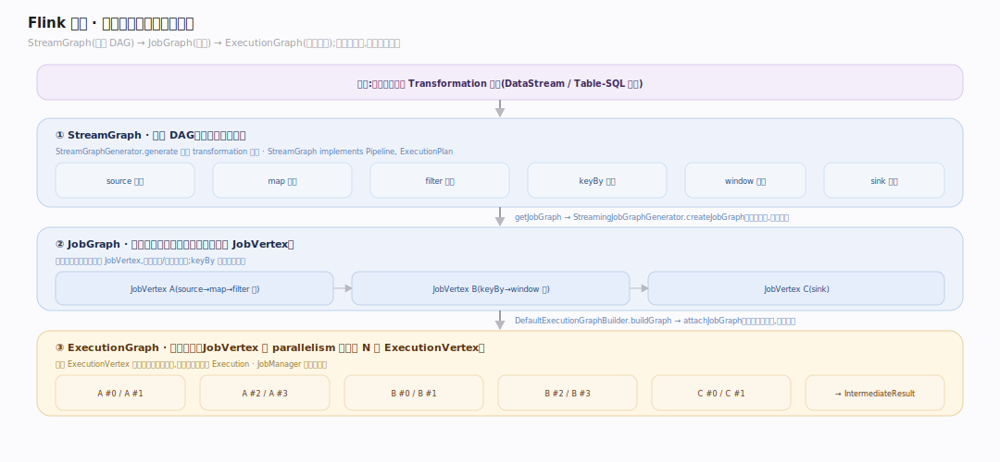
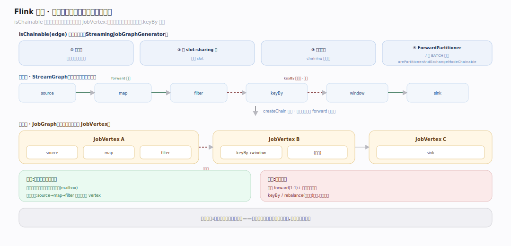
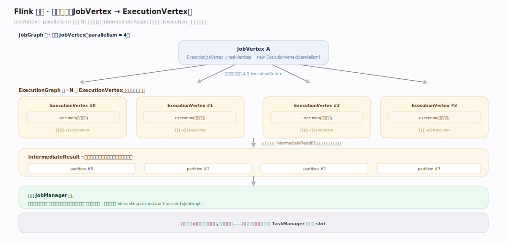

# Flink 原理 · 支撑主线 · 图变换

> **定位**：属"编译能力域"。管从用户 API 到可执行并行图的三级变换:StreamGraph → JobGraph(算子链化)→ ExecutionGraph(并行展开)。接收【接触面】的 transformation 列表、产出给【调度与部署】的物理图。源码基准 **Flink 2.x**(`flink-runtime/.../streaming/api/graph/`、`jobgraph/`、`executiongraph/`)。

用户写的转换要变成"能在多台机器上并行跑、能容错"的物理执行图,中间隔着三级抽象。每一级降一层:逻辑 DAG → 优化过链化的作业图 → 按并行度展开的执行图。理解这三级,就理解了 Flink 怎么把 `map.keyBy.window` 变成分布式任务。

---

## 一、三级变换全景

- **StreamGraph**(逻辑 DAG):`StreamGraphGenerator.generate`(`streaming/api/graph/StreamGraphGenerator.java:253`)遍历 transformation 建图,`StreamGraph implements Pipeline, ExecutionPlan`(`StreamGraph.java:127`)。一个节点 = 一个逻辑算子。
- **JobGraph**(链化后的作业图):`StreamGraph.getJobGraph` → `StreamingJobGraphGenerator.createJobGraph`(`StreamGraph.java:1195`,`StreamingJobGraphGenerator.java:222`)。**算子链化**把可链的相邻算子合并成一个 `JobVertex`(减少线程/序列化开销)。
- **ExecutionGraph**(并行展开):`DefaultExecutionGraphBuilder.buildGraph → attachJobGraph`(`DefaultExecutionGraphBuilder.java:77`,`DefaultExecutionGraph.java:867`)。每个 `JobVertex` 按并行度展开成 N 个 `ExecutionVertex`(`ExecutionJobVertex.java:216`),每次尝试是一个 `Execution`。这是 JobManager 调度的对象。

---

## 二、算子链化：为什么把算子合并

`createChain` 递归(`StreamingJobGraphGenerator.java:629`)判 `isChainable(edge)`(`:1730`):要求**单入边 + 同 slot-sharing 组 + 算子可链 + ForwardPartitioner/非 BATCH 交换**(`arePartitionerAndExchangeModeChainable:1787`)。满足则相邻算子塞进同一 `JobVertex`,在同一线程里直接函数调用传递记录——**免网络、免序列化**。这是 Flink 吞吐的关键优化:一条 `source→map→filter` 常链成一个 vertex。

只有 forward(1:1)+ 非批交换能链;keyBy/rebalance(重分区)会断链(必须跨网络)。

---

## 三、并行展开:JobVertex → ExecutionVertex

`ExecutionJobVertex` 按 parallelism 分配 `taskVertices = new ExecutionVertex[parallelism]`(`ExecutionJobVertex.java:216`),每个 ExecutionVertex 是一个可调度子任务、产 `IntermediateResult[]`(下游消费的数据分区)。物理执行单元 `Execution`(每次尝试一个,失败重试新建)。至此逻辑图完全物化成"哪些子任务、跑在哪、数据往哪流"的可调度形态,交给 JobManager。

客户端触发:`StreamGraphTranslator.translateToJobGraph → streamGraph.getJobGraph`(`flink-clients/.../StreamGraphTranslator.java:50`)。

---

## 拓展 · 图变换关键结构一览

| 结构 | 定义 | 职责 |
|---|---|---|
| StreamGraph | `streaming/api/graph/StreamGraph.java:127` | 逻辑 DAG(一节点一算子) |
| StreamingJobGraphGenerator | `.../StreamingJobGraphGenerator.java:222` | 链化成 JobGraph |
| JobGraph / JobVertex | `jobgraph/JobGraph.java:70` | 链化后的作业图 |
| DefaultExecutionGraph | `executiongraph/DefaultExecutionGraph.java:867` | 并行展开的执行图 |
| ExecutionJobVertex / ExecutionVertex | `executiongraph/ExecutionJobVertex.java:216` | JobVertex → N 个并行子任务 |
| isChainable | `StreamingJobGraphGenerator.java:1730` | 算子链化判定 |
| StreamGraphGenerator.generate | `streaming/api/graph/StreamGraphGenerator.java:253` | 遍历 transformation 建 StreamGraph |
| StreamGraph.getJobGraph | `streaming/api/graph/StreamGraph.java:1195` | 触发链化生成 JobGraph |
| createChain | `StreamingJobGraphGenerator.java:629` | 递归链化相邻可链算子 |
| DefaultExecutionGraphBuilder.buildGraph | `executiongraph/DefaultExecutionGraphBuilder.java:77` | 构建并行展开的执行图 |
| StreamGraphTranslator | `flink-clients/.../StreamGraphTranslator.java:50` | 客户端触发 StreamGraph→JobGraph |

## 调优要点（关键开关）

- **算子链**:默认开;个别算子想独立(便于定位/资源)可 `disableChaining`;想强制起新链 `startNewChain`。
- **slot-sharing 组**:同组算子共享 slot(资源复用);重算子可拆组避免抢占。
- **并行度**:算子级/作业级设 parallelism;≤ maxParallelism(key-group 数)。
- **交换模式**:forward 可链高效;keyBy/rebalance 断链跨网络——布局时注意链断点。

## 常见误区与工程要点

- **误区:一个算子一个线程。** 链化后一整条链在一个线程里跑(mailbox),函数调用传记录,不是每算子一线程。
- **误区:并行度就是机器数。** 并行度是子任务数,多个子任务可共享一个 TaskManager 的多个 slot。
- **误区:所有算子都能链。** 只有 forward(1:1)+ 非批交换 + 同 slot 组能链;重分区(keyBy)必断链。
- **误区:StreamGraph 就是执行图。** 它是逻辑 DAG,还要链化(JobGraph)、并行展开(ExecutionGraph)才可调度。
- **归属提醒**:transformation 来自【接触面】;ExecutionGraph 交给【调度与部署】;链内传记录属【任务执行】,链间跨网络属【网络与数据交换】。

## 一句话总纲

**Flink 把用户 API 经三级变换降成可执行并行图:StreamGraph(逻辑 DAG,一节点一算子)→ JobGraph(算子链化,把 forward+同 slot 组的相邻算子合并成一个 JobVertex 以免网络/序列化)→ ExecutionGraph(每个 JobVertex 按并行度展开成 N 个 ExecutionVertex 子任务,产 IntermediateResult);链化是吞吐关键(链内函数调用传记录),keyBy 等重分区必断链跨网络,展开后的执行图才是 JobManager 调度的对象。**
