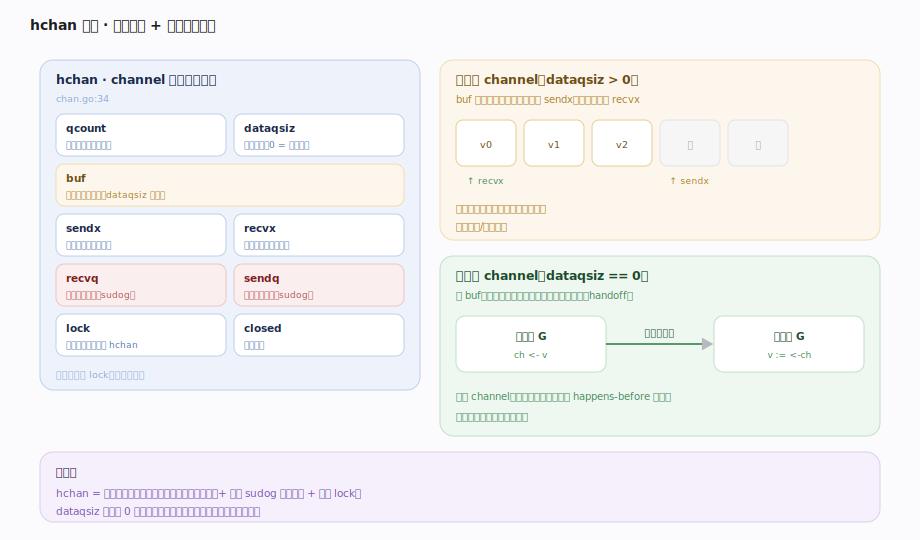
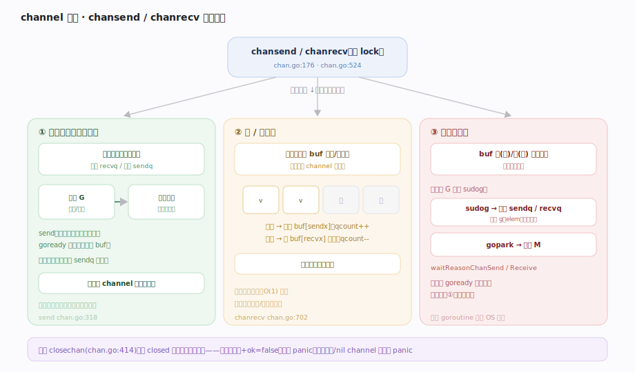
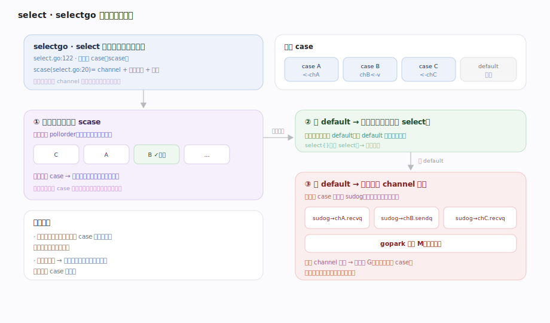
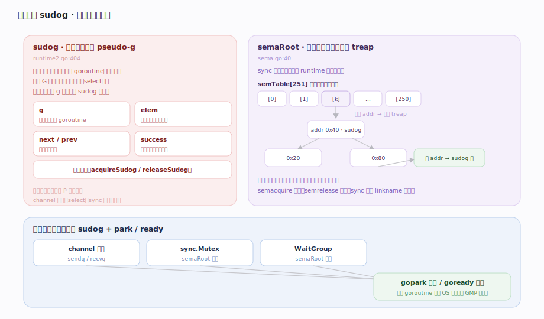
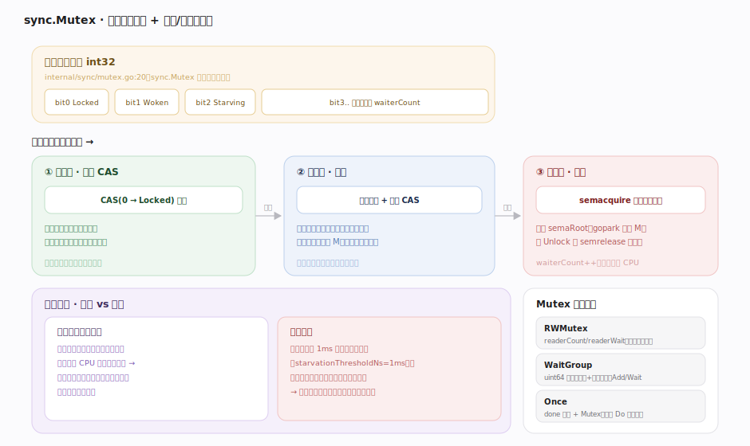
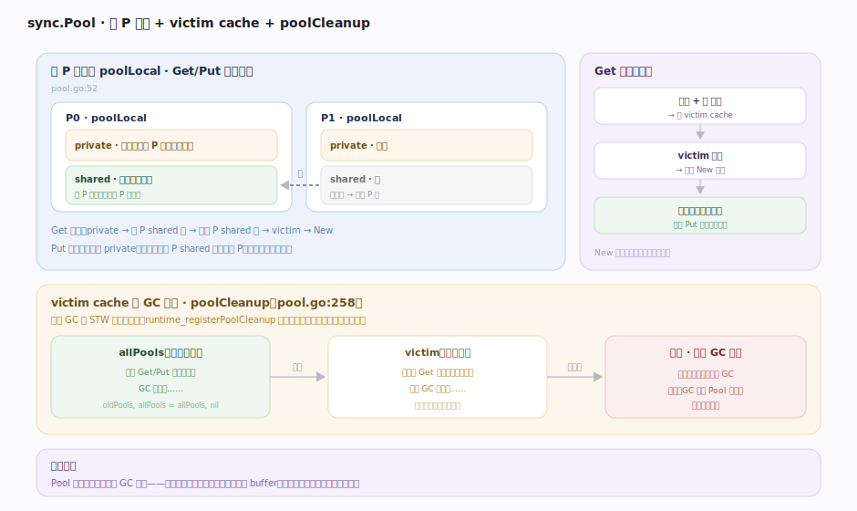
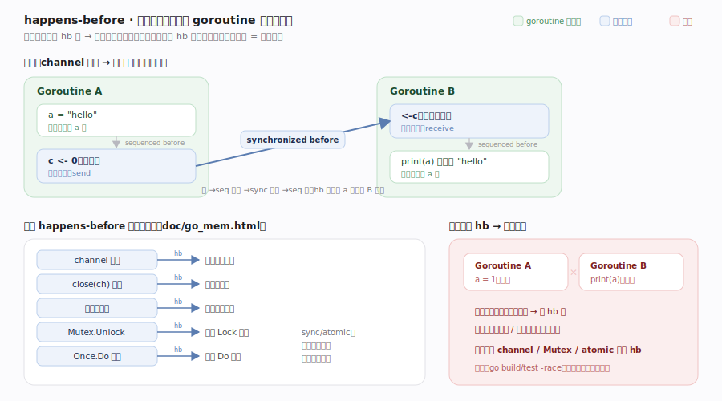

# Go 原理 · 并发原语

> **定位**：本篇讲 Go 的 CSP 式并发原语——channel、select、sync 包，以及底层的信号量与内存模型。属"同步能力域"，向下依赖【GMP调度】的 park/ready（所有阻塞都归到 `gopark`/`goready`）、【分配器】（channel/sudog 分配），与【goroutine 生命周期】互为表里（谁触发阻塞唤醒）。源码基准 **go1.26.4**（`~/workdir/go/src/runtime`、`src/sync`）。

Go 的并发哲学是 **CSP**："不要用共享内存来通信，用通信来共享内存"——首选 **channel** 传递数据所有权，`sync` 包（Mutex 等）作补充。所有阻塞式原语底层都归到调度器的 `gopark`（阻塞让出 M）/`goready`（唤醒入队），阻塞的是 goroutine 而非 OS 线程。

---

## 一、channel：hchan 结构

`hchan`（chan.go:34）是 channel 的运行时表示。关键字段：`qcount`（当前元素数）、`dataqsiz`（缓冲容量，**0 = 无缓冲**）、`buf`（环形缓冲区）、`sendx`/`recvx`（环形读写下标）、`recvq`/`sendq`（收/发**等待队列**，元素是 `sudog`）、`closed`、`lock`（互斥锁保护整个 hchan）。

- **有缓冲 channel**（`dataqsiz > 0`）：`buf` 是环形队列，发送往队尾写、接收从队头读，满/空时才阻塞。
- **无缓冲 channel**（`dataqsiz == 0`）：无 buf，发送必须等到接收者到场**直接手递手**（handoff），否则双方都阻塞——这是"同步 channel"，天然是一次 happens-before 同步点。

---

## 二、发送与接收：chansend / chanrecv

`chansend`（chan.go:176）/`chanrecv`（chan.go:524）各有三条路径（持 `hchan.lock`）：

- **直接传递（最快）**：发送时若 `recvq` 有等待的接收者，`send`（chan.go:318）把值**直接拷到接收者的栈**、`goready` 唤醒它，**不经缓冲区**。接收时对称：`sendq` 有等待发送者就直接收其值。这是无缓冲 channel 的唯一路径，也是有缓冲 channel 有等待者时的快路径。
- **入/出缓冲**：有缓冲且未满/未空，值拷进/拷出 `buf`，不阻塞。
- **阻塞**：缓冲满（发）或空（收）且无对家 → 把当前 G 包成 `sudog` 挂进 `sendq`/`recvq`，`gopark` 让出 M（等待原因 `waitReasonChanSend`/`Receive`）；被对家唤醒后完成收发。

**关闭**（`closechan` chan.go:414）：置 `closed`，唤醒所有等待者——收者拿到零值 + `ok=false`，发者 panic。向已关闭 channel 发送 panic、重复关闭 panic、关闭 nil channel panic。

---

## 三、select：多路复用

`select` 编译成 `selectgo`（select.go:122），在多个 channel 操作里选一个就绪的：

1. 把各 case（`scase` select.go:20：channel + 元素指针 + 方向）按**随机顺序**轮询（防饥饿——避免总选第一个），找已就绪的 case 直接执行。
2. 全不就绪且**有 default** → 执行 default（非阻塞 select）。
3. 全不就绪且**无 default** → 把当前 G 同时挂到**所有** channel 的等待队列（多个 sudog），`gopark`；任一 channel 就绪唤醒它，再从其他队列摘除自己，执行中选的那个 case。

`select{}`（空 select）永久阻塞。select 的随机公平性是刻意设计：多个 case 同时就绪时等概率选择。

---

## 四、信号量与 sudog：阻塞的通用底座

`sudog`（runtime2.go:404）是"**在等待队列里的 goroutine**"的表示（pseudo-g）——一个 G 可能同时在多个队列（select），故不能直接用 g 入队。它记录 `g`、等待的元素 `elem`、`next/prev`、成功标志 `success`。sudog 是池化复用的。

`sync` 包的锁最终建在 runtime 信号量上：`semaRoot`（sema.go:40）是**按地址哈希的等待者平衡树（treap）**，`semTable[251]` 分桶降低竞争。`semacquire`/`semrelease`（sema.go）阻塞/唤醒等待者，`sync` 侧经 `sync_runtime_Semacquire` 等 linkname 调用。channel、Mutex、WaitGroup 的阻塞都汇到这套 sudog + park/ready 机制。

---

## 五、sync 包：Mutex 与朋友们

`sync.Mutex`（1.26 是 `internal/sync.Mutex` 的薄封装，sync/mutex.go:33 → internal/sync/mutex.go:20）：

- **状态压进一个 int32**：`mutexLocked`/`mutexWoken`/`mutexStarving` 位 + 等待者计数。无竞争时一次 CAS 拿锁（极快）；有竞争先自旋几次（等持有者短临界区释放），自旋无果才进信号量排队。
- **两种模式**：**正常模式**（新来者与被唤醒者竞争，吞吐高但可能饿死队首）；**饥饿模式**（某等待者超 `starvationThresholdNs=1ms` 没拿到锁 → 切饥饿，锁直接手递手给队首、新来者不竞争，牺牲吞吐保公平）。

其余：`RWMutex`（rwmutex.go:39，读写锁，`readerCount`/`readerWait`，写者用 `rwmutexMaxReaders` 阻挡新读者）；`WaitGroup`（waitgroup.go:48，一个 uint64 打包"计数+等待者"，`Add`/`Wait`）；`Once`（once.go:20，`done` 原子 + Mutex 保证 `Do` 只跑一次）。

---

## 六、sync.Pool 与 GC 协作

`sync.Pool`（pool.go:52）是对象复用池，减少分配压力（配合【分配器】/【GC】）：

- **每 P 本地**（`poolLocal`）：Get/Put 优先无锁访问当前 P 的本地池（`private` 单槽 + `shared` 无锁双端队列）；本地空则从别的 P 偷。
- **victim cache**（pool.go:58）：**每轮 GC 时 `poolCleanup`（pool.go:258）不直接清空，而是把 `allPools` 降级为 `victim`**（`oldPools, allPools = allPools, nil`），下轮 GC 才真正丢弃。于是对象能存活**两轮 GC**——避免"GC 一来 Pool 全空、缓存命中率暴跌"。
- 通过 `runtime_registerPoolCleanup(poolCleanup)` 注册进 runtime，GC 在 STW 开始时回调。

**Pool 里的对象随时可能被 GC 回收**——只适合"可重建的临时对象"（如 buffer），不能存"必须保留"的状态。

---

## 拓展 · 内存模型（happens-before）

图注：同步动作把两个 goroutine 的操作连成 hb 链，一侧的写就对另一侧的读可见（现行 `doc/go_mem.html` 正式术语为"synchronized before"）。核心保证如下表；**不变量**：无 hb 关系并发读写同一变量即数据竞争，行为未定义。

| 同步动作 | 保证 |
|---|---|
| channel 发送 | happens-before 对应的接收完成 |
| channel 关闭 | happens-before 收到零值 |
| 无缓冲 channel 接收 | happens-before 发送完成（同步点） |
| `Mutex.Unlock` | happens-before 后续 `Lock` 返回 |
| `Once.Do` | 函数完成 happens-before 任何 `Do` 返回 |
| `sync/atomic` | 提供顺序一致的原子操作 |

## 调优要点（关键开关，均源码核实）

- `go build -race` / `go test -race`：数据竞争检测器（运行期插桩，慢 5~10×，但抓竞争极准）。
- `GODEBUG=asyncpreemptoff=1` 等影响锁自旋行为（调试）。
- channel 容量选择：无缓冲 = 强同步握手；有缓冲 = 解耦生产消费速率，但容量过大掩盖背压。
- `sync.Pool` 适用场景：高频短生命临时对象；不适合有状态/必须保留的对象。
- 优先 channel/`context` 传递而非共享内存 + 锁；锁竞争激烈时看 `sync.RWMutex` 或分片锁。

## 常见误区与工程要点

- **误区：channel 一定比锁慢/快。** 各有场景。channel 适合"传递所有权/编排流水线"，Mutex 适合"保护共享状态的小临界区"。无缓冲 channel 收发要两次调度切换。
- **误区：Mutex 只是自旋锁 / 只是信号量。** 是**混合**：无竞争 CAS、短竞争自旋、长竞争入信号量队列，且有正常/饥饿双模式防饿死。
- **误区：sync.Pool 能当缓存用。** 不能。Pool 对象**每轮 GC 会被清理**（victim cache 最多续一轮命），只适合可重建的临时对象。
- **误区：select 会按 case 书写顺序选。** 不。多 case 就绪时**随机等概率**选（防饥饿）。
- **误区：给 channel 加大缓冲能解决所有阻塞。** 掩盖背压而非解决——缓冲满了照样阻塞，且延迟问题被隐藏。
- 归属提醒：所有阻塞的 park/ready 机制在【GMP调度】；sudog/G 状态在【goroutine 生命周期】；Pool 与 GC 的清理时机细节在【GC】。

## 一句话总纲

**Go 奉行 CSP「用通信共享内存」：channel（`hchan` 环形缓冲 + sendq/recvq 等待队列）收发经 `chansend`/`chanrecv` 走「有等待对家则手递手直传 → 否则入/出缓冲 → 再否则包成 sudog 挂队列并 `gopark` 让出 M」，无缓冲 channel 强制收发同步握手；`select` 经 `selectgo` 随机公平轮询多路、全不就绪则同时挂所有 channel 队列；`sync.Mutex` 是「无竞争 CAS + 短竞争自旋 + 长竞争入 semaRoot treap 信号量队列」的混合锁并有正常/饥饿双模式防饿死，`sync.Pool` 用每 P 本地 + victim cache 让对象跨两轮 GC 存活——所有阻塞底层都归到调度器 park/ready（阻塞 goroutine 而非线程），并发正确性由内存模型的 happens-before 关系（channel/锁/atomic）保证、数据竞争用 `-race` 抓。**
