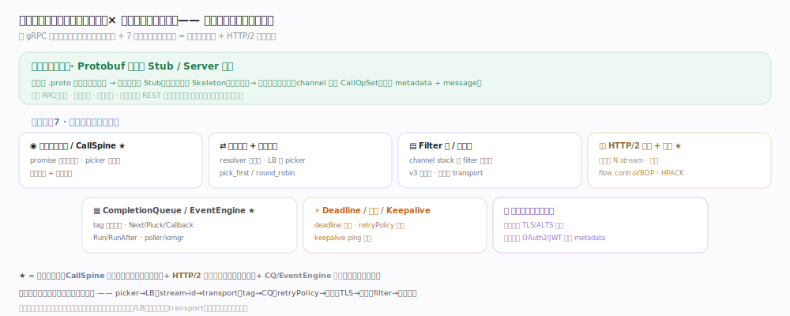
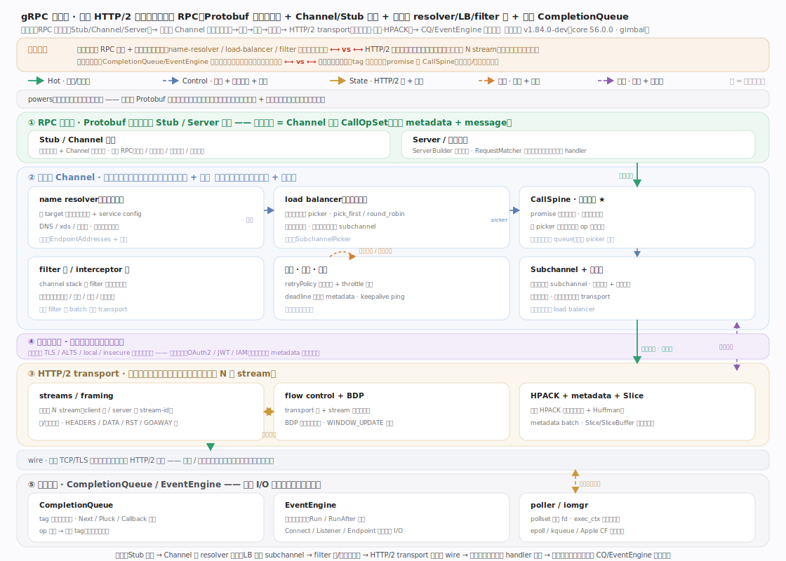
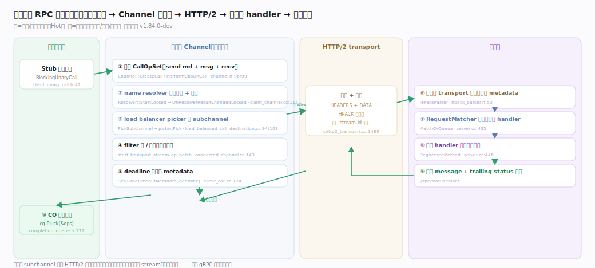
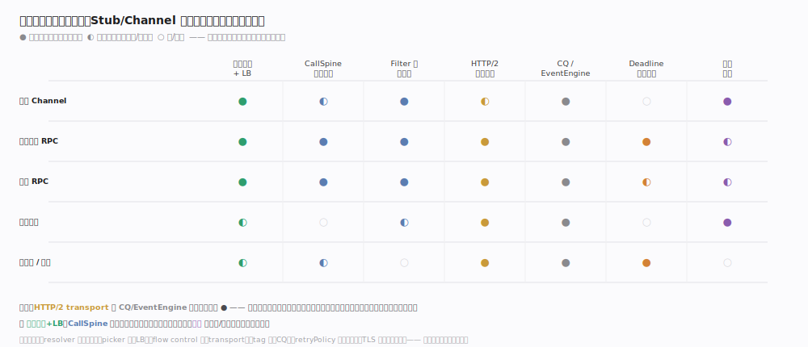

# gRPC 核心原理 · 全景主线框架

> **定位**：通信中间件家族（HTTP/2 RPC 框架）范例。全库总纲——用"接触面 × 能力域"两维把 gRPC 拆成可导航的主线，并点出灵魂：**Protobuf 强类型契约 + Channel/Stub 抽象承载一次调用，客户端 Channel 是一条可插拔装配线（解析→选路→过滤→建连），落到客户端/服务端共用的 HTTP/2 transport（多路复用+流控），事件经异步 CompletionQueue/EventEngine 非阻塞交付**。核实基准：本地 `/Users/zhangdongdong92/workdir/grpc/`，`PACKAGE_VERSION="1.84.0-dev"`（`CMakeLists.txt`）、core `56.0.0`（`src/core/lib/surface/version.cc:25`）、codename "gimbal"（`version.cc:27`）；行号均以 `grep -n` 实测。

## 一、双维模型：接触面 × 能力域

gRPC 的外部**接触面**只有一个：**Protobuf 生成的 Stub / Server 契约**——用户写 `.proto` 定义服务与消息，生成强类型客户端 Stub 与服务端 Skeleton，调用像本地方法（`include/grpcpp/impl/rpc_method.h:29` `RpcMethod`，`:31` 四型 `RpcType`）。这与 REST 截然不同：强契约、二进制帧、单连接多路复用。**能力域**是框架内部公共机制：调用生命周期/CallSpine（灵魂）、名字解析+负载均衡、Filter 栈/拦截链、HTTP/2 传输+流控（灵魂）、CompletionQueue/EventEngine（灵魂）、Deadline/重试/Keepalive、凭证与安全。每个能力域一篇文档；接触面一篇；本篇统摄全局。**正交性检验**：任取核心概念都能唯一归位——`picker` 归 LB、`stream-id` 归 transport、`tag` 归 CQ、`retryPolicy` 归重试、`TLS 握手` 归凭证、`filter` 归拦截链。

## 二、总架构：装配线 + 共用 transport

**RPC 接触面**：`Channel`（`include/grpcpp/channel.h:59`）承载调用，`CreateCall`（`:96`）/`PerformOpsOnCall`（`:99`）把一组 `CallOpSet`（`impl/client_unary_call.h:64`）下发到 core；服务端 `Server`（`src/core/server/server.cc`）用 `RequestMatcherInterface`（`:364`）的 `MatchOrQueue`（`:435`）把入站调用配对给等待的 handler。**客户端 Channel 装配线**：`ClientChannel`（`src/core/client_channel/client_channel.h:40`）内部 = name-resolver（`resolver/resolver.h:49`）解析地址 → load-balancer（`load_balancing/lb_policy.h:96`）产 picker → CallSpine 用 `PickSubchannel`（`load_balanced_call_destination.cc:94`，`:108` `picker.Pick`）选中 `Subchannel`（`client_channel/subchannel.cc`）→ filter 栈（`lib/channel/connected_channel.cc:143`）逐层处理。**共用 transport**：客户端/服务端都落到 HTTP/2（`ext/transport/chttp2/transport/chttp2_transport.cc`），单连接多路复用 N 个 stream。**异步基座**：一切 I/O 与回调经 `CompletionQueue`（`lib/surface/completion_queue.cc`）与 `EventEngine`（`include/grpc/event_engine/event_engine.h:112`）非阻塞交付。**关键约束**：控制面（resolver/LB）与数据面（transport）解耦，三处策略皆可替换——这是 gRPC 可扩展的根基。

## 三、贯穿主线：一次调用的路径（灵魂）

**一次一元 RPC 的十步**：Stub 方法调用（`BlockingUnaryCall`，`client_unary_call.h:42`）→ ① Channel 组装 CallOpSet → ② resolver 解析地址与 service config（`client_channel.cc:1152` `OnResolverResultChangedLocked`）→ ③ LB picker 选 subchannel（`load_balanced_call_destination.cc:108`，无就绪连接则 queue、得新 picker 重试）→ ④ filter 栈/拦截链逐层 → ⑤ deadline 编码进 metadata（`client_call.cc:124` `Set(GrpcTimeoutMetadata, deadline)`）→ transport 帧化上 wire（HEADERS+DATA，HPACK 压缩，分配奇数 stream-id，`chttp2_transport.cc:1489`）→ ⑥ 服务端解帧（`HPackParser`，`hpack_parser.h:53`）→ ⑦ RequestMatcher 配对 handler → ⑧ 方法 handler 执行 → ⑨ 响应 message + trailing status 回帧 → ⑩ 客户端 CQ 交付（`cq.Pluck`，`completion_queue.h:177`）。**同一条连接可并发承载多个这样的调用**（各占一个 stream，互不阻塞）——这是 gRPC 高吞吐的根。

## 四、依赖矩阵：接触面 × 能力域

矩阵显示"发起调用"这条接触面强依赖哪些能力域：任何调用都必过 **CallSpine 装配** + **filter 栈** → 落 **HTTP/2 transport**，而所有异步事件都由 **CompletionQueue/EventEngine** 交付。可见 **HTTP/2 transport** 与 **CQ/EventEngine** 是被依赖度最高的两格——它们塌了全盘皆停，这也解释了为何本库把这两者连同 CallSpine 定为灵魂三支柱。名字解析+LB、CallSpine 是"选谁连、怎么装配"的控制大脑；凭证在建连/安全场景转为强依赖。

## 深化 · 三支柱覆盖自检

| 支柱 | gRPC 落点 | 代表主线 |
|---|---|---|
| 调用装配 | CallSpine promise 化 + picker 选连接 | 支撑_调用生命周期与CallSpine |
| 高效传输 | HTTP/2 多路复用 + 流控 + HPACK | 支撑_HTTP2传输与流控 |
| 异步非阻塞 | CQ（Next/Pluck）+ EventEngine（Run/RunAfter） | 支撑_CompletionQueue与EventEngine |
| 可插拔控制 | resolver 出地址 + LB 产 picker | 支撑_名字解析与负载均衡 |
| 横切装配 | filter 栈 + v3 拦截链 | 支撑_Filter栈与拦截链 |
| 可靠性 | deadline + retryPolicy + keepalive | 支撑_Deadline重试与Keepalive |
| 安全 | 传输凭证握手 + 调用凭证注入 | 支撑_凭证与安全 |

## 拓展 · 与其它家族的同构对照

| 对照维度 | gRPC | 相似家族 | 关键差异 |
|---|---|---|---|
| 接触面契约 | Protobuf Stub/Channel | 家族 REST/HTTP API | gRPC 强类型二进制、单连接多路复用 |
| 可插拔选路 | resolver + load-balancer | 家族 K8s 的 kube-proxy/EndpointSlice | gRPC 选路在客户端进程内、每调用一次 pick |
| 异步事件基座 | CompletionQueue/EventEngine | 家族 Netty EventLoop / libevent | gRPC 用 tag 关联 op 与结果，跨语言统一 |
| 传输复用 | HTTP/2 stream 多路复用 | 家族 HTTP/2 本身 | gRPC 在其上加 message 分帧 + grpc-status trailer |

## 调优要点

- transport 是全局咽喉：连接数、每连接 stream 上限、flow control 窗口决定并发与吞吐。
- CQ/EventEngine 线程模型：CQ 数量与轮询线程数决定事件处理并行度，async server 尤甚。
- resolver/LB 策略：pick_first vs round_robin 影响连接复用与负载分布；service config 可下发。
- keepalive 参数需与中间设备（LB/NAT）空闲超时协调，过激的 ping 会被判滥用（GOAWAY）。

## 常见误区

- **gRPC 每次调用建一条连接**：实为单连接多路复用 N 个 stream，连接由 subchannel 复用。
- **负载均衡在服务端/代理**：gRPC 默认客户端侧 LB，resolver 出地址列表、picker 每次调用挑一个 subchannel。
- **CompletionQueue 是 gRPC 的线程池**：CQ 只是事件交付队列（tag 驱动），线程由应用或 EventEngine 提供。
- **deadline 是客户端本地超时**：deadline 会编码进 metadata 随请求上送，服务端也据此取消，是端到端的。

## 一句话总纲

**gRPC 是一台"像本地函数一样的远程调用机器"：Protobuf 强约束契约，客户端 Channel 是一条可插拔装配线（name-resolver 解析→load-balancer 选连接→filter 栈/拦截链处理→subchannel 建连），落到客户端/服务端共用的 HTTP/2 transport 上以单连接多路复用高效传输，全程事件经异步 CompletionQueue/EventEngine 非阻塞交付——控制面与数据面解耦、三处策略皆可替换，就是贯穿全库的灵魂。**
