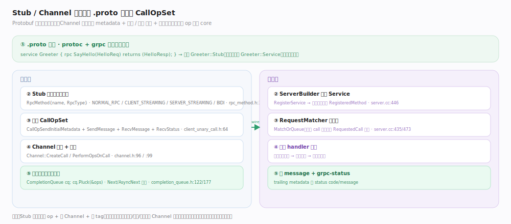
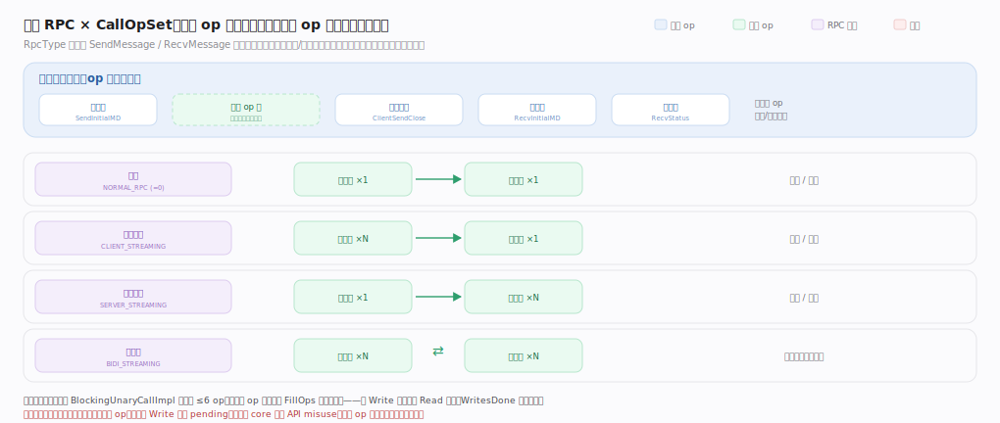
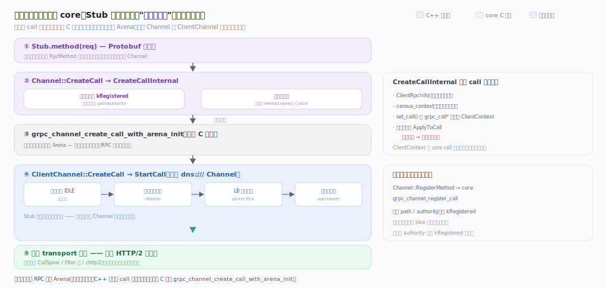
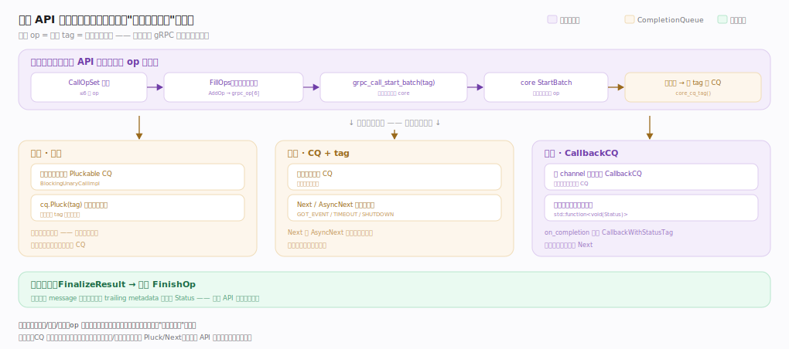

# gRPC 核心原理 · 接触面 · Stub 与 Channel 契约

> **定位**：gRPC 唯一的外部接触面——用户经 Protobuf 生成的强类型 **Stub**（客户端代理）与 **Server 骨架**（服务端），把一次远程调用写得像本地函数。核心机制：调用被组装成一组 `CallOpSet`（发/收 metadata + message + status），交给 `Channel` 下发到 core，结果经 `CompletionQueue` 以 tag 交付。核实基准：`include/grpcpp/impl/rpc_method.h`、`include/grpcpp/channel.h`、`include/grpcpp/impl/client_unary_call.h`、`include/grpcpp/completion_queue.h`、`src/core/server/server.cc`。

## 一、从 .proto 到一次 CallOpSet

用户在 `.proto` 里定义 `service`/`rpc`，`protoc` + gRPC 插件为每方法生成客户端 `Stub` 与服务端 `Service` 骨架。生成代码**不含网络逻辑**，只做三件事：把方法名与流型固化成一个薄描述符 `RpcMethod`（握 `name_`/`method_type_`/`channel_tag_`，`RpcType` 枚举分一元/客户端流/服务端流/双向流四型）、把入参序列化、把调用交给 `Channel`。带 Channel 构造时会预注册方法名拿缓存句柄，省掉每次调用的路径解析（见图）。

**客户端一元路径**：Stub 把六个 op 组装成 `CallOpSet<发首部/发消息/收首部/收消息/宣告写完/收状态>`——恰好覆盖一次一元往返；经 `Channel::CreateCall` 在 core 建 `grpc_call`，临时构造一个 Pluckable CQ，`FillOps` 下发后 `Pluck` 阻塞等这批完成，返回时结果与 `Status` 已就位。**服务端对称侧**：`ServerBuilder` 注册的每方法成 `RegisteredMethod`，入站请求由 `RequestMatcher` 与应用投递的 `RequestedCall` 配对，配对成功交 handler，回消息 + trailing `grpc-status`。各落点见下方深化表。

## 深化 · 生成层与接触面落点

| 元素 | 落点 | 说明 |
|---|---|---|
| 方法描述符 | `RpcMethod` `include/grpcpp/impl/rpc_method.h:29` · `RpcType` 枚举 `:31` · 带 channel 构造 `:51` | 薄描述符 + 预注册句柄 |
| 一元 op 集 | `BlockingUnaryCallImpl` `include/grpcpp/impl/client_unary_call.h:64` · Pluckable CQ `:60` · `Pluck` `:81` | 六 op 覆盖一次往返，阻塞等这批 |
| 建 call | `Channel::CreateCall` `include/grpcpp/channel.h:96` · `PerformOpsOnCall` 已空 `src/cpp/client/channel_cc.cc:193` | 下发下沉进 `FillOps` |
| 服务端配对 | `RegisteredMethod` `src/core/server/server.cc:446` · `RequestMatcherInterface` `:364` · `MatchOrQueue` `:435` · `RequestedCall` `:470` | 入站与投递 call 配对 |

## 深化 · 四型 RPC 与 op 的对应

`RpcType` 只是决定了 `CallOpSet` 里 Send/Recv 消息 op 出现的次数与节奏，其余 op（metadata、close、status）四型共有：

| RPC 类型 | RpcType 枚举 | 发送侧 op 特征 | 典型用途 |
|---|---|---|---|
| 一元 | NORMAL_RPC (=0) | 一次 SendMessage + 一次 RecvMessage | 普通请求/响应 |
| 客户端流 | CLIENT_STREAMING | 多次 SendMessage → 一次 RecvMessage | 上传/聚合 |
| 服务端流 | SERVER_STREAMING | 一次 SendMessage → 多次 RecvMessage | 订阅/推送 |
| 双向流 | BIDI_STREAMING | 收发交织（各自节奏） | 实时会话 |

流式 RPC 的拆批规则与"同方向不可并发挂起两个同型 op（否则 core 返回 API misuse）"的边界见图；落点见下深化表。

## 深化 · 一次调用如何下沉到 core

`Channel::CreateCall` 转调 `CreateCallInternal`（`src/cpp/client/channel_cc.cc:125`），在此分叉：带 `channel_tag()` 且未覆盖 authority 走 **kRegistered**（用注册句柄缓存的 path/authority），否则现场把 `method.name()` 转 slice；两路收敛到同一 C 接口 `grpc_channel_create_call_with_arena_init`（`src/core/lib/surface/channel.cc:158`），为本次调用分配一块 **Arena**（调用级内存竞技场，结束整块释放）。普通 `dns:///` Channel 的 core call 由 `ClientChannel::CreateCall`（`src/core/client_channel/client_channel.cc:902`）承接、`StartCall`（`:981`）驱动：退 IDLE→等 resolver→LB pick→交 transport——**Stub 看不到这层选路，即"像本地函数"的代价被吸收之处**。

| 阶段 | 落点 | 语义 |
|---|---|---|
| C++ 建 call | `Channel::CreateCallInternal` `src/cpp/client/channel_cc.cc:125` | kRegistered / 未注册分叉，收敛到统一 C 接口 |
| 分配 Arena | `grpc_channel_create_call_with_arena_init` `src/core/lib/surface/channel.cc:158` | 一次 RPC 一块 Arena，结束整块释放 |
| 方法注册 | `Channel::RegisterMethod` `channel_cc.cc:196` → `grpc_channel_register_call` `channel.cc:121` | 缓存 path/authority，省每次 slice 拷贝与路径解析 |
| 挂调用上下文 | `set_call` 回填 + `ClientRpcInfo` / `census_context` + 凭证 `ApplyToCall`（失败即取消） | `ClientContext` 是 core call 回填与凭证生效的汇合点 |
| core 承接选路 | `ClientChannel::CreateCall` `client_channel.cc:902` → `StartCall` `:981` | 退 IDLE→resolver→LB pick→transport |

## 深化 · 三套 API 共用装配线，只在交付分叉

`CallOpSet::FillOps`（`include/grpcpp/impl/call_op_set.h:895`）先跑客户端拦截器链，把最多 6 个 op 逐个 `AddOp` 填进 `grpc_op ops[6]`，一次性 `grpc_call_start_batch(call, ops, nops, core_cq_tag())`（`:973`）交 core 入口 `grpc_call_start_batch`（`src/core/lib/surface/call.cc:491`）→ `Call::StartBatch`（`:503`）真正执行。**一批 op = 一个 tag = 一次完成事件**——异步模型的钥匙；完成时 `FinalizeResult`（`:909`）逐个 `FinishOp` 把 message 反序列化、把 trailing metadata 解析成 `Status`。三套 API 组装的 op 集合相同，只在"结果如何交付"分叉。

| API | 交付方式 | 落点 |
|---|---|---|
| 同步 | 每调用一个临时 Pluckable CQ · `cq.Pluck(tag)` 阻塞等这批 | `include/grpcpp/impl/client_unary_call.h:60/81` |
| 异步 | 应用显式持 CQ · `Next`/`AsyncNext` 轮询（GOT_EVENT/TIMEOUT/SHUTDOWN） | `include/grpcpp/completion_queue.h:177/199` |
| 回调 | 用 channel 共享 `CallbackCQ` · 回调线程直接触发 `std::function<void(Status)>` | `include/grpcpp/support/client_callback.h:59/73/80/117` |
| 装配线 | `FillOps`→`grpc_call_start_batch`→core `StartBatch` | `call_op_set.h:895/973` · `src/core/lib/surface/call.cc:491/503` |

## 深化 · ClientContext 承载的调用级契约

`ClientContext` 是每次调用一份的可变旁路，承载 Stub 无法用参数表达的元信息：`AddMetadata`（`src/cpp/client/client_context.cc:119`）把自定义键值插进 `send_initial_metadata_`，最终变成 `CallOpSendInitialMetadata` 的内容；`set_compression_algorithm`（`src/cpp/client/client_context.cc:142`）把压缩算法名以保留 metadata 键下发；`TryCancel`（`src/cpp/client/client_context.cc:154`）在 call 已建时直接 `grpc_call_cancel`、否则置 `call_canceled_` 待建后补取消；`set_call`（`src/cpp/client/client_context.cc:124`）是 core call 回填与凭证生效的汇合点。一个 `ClientContext` 不可跨多次调用复用（除非显式支持），因为它记录了本次调用的 call 指针与取消状态。

## 深化 · CompletionQueue 的三态返回

异步 API 下用户显式持有 CQ，靠轮询 `Next`/`AsyncNext` 取完成事件：

| NextStatus | 含义 | 触发 |
|---|---|---|
| GOT_EVENT | 取到一个完成事件（tag + ok） | op 批次完成投递 |
| TIMEOUT | 截止时间到仍无事件 | AsyncNext 超时 |
| SHUTDOWN | 队列已关闭且排空 | Shutdown 后 |

三态定义于 `include/grpcpp/completion_queue.h:122` 的 `enum NextStatus`。`Next`（`include/grpcpp/completion_queue.h:177`）是 `AsyncNext` 传入无限截止时间的特例，只返回 true/false（GOT_EVENT 为 true，SHUTDOWN/TIMEOUT 均为 false）；`AsyncNext`（`include/grpcpp/completion_queue.h:199`）带截止时间，能区分出 TIMEOUT。同步一元路径用的则是 `Pluck`——只等指定 tag 的那一个事件，天然适合"发一批、等这批"的阻塞语义。

## 调优要点

- 一元同步调用简单，但每调用一个隐藏的 Pluckable CQ（`client_unary_call.h:60`）；高并发用异步 API（显式 CQ + tag）或回调 API（共享 `CallbackCQ`）复用线程，避免频繁建销 CQ。
- 用带 Channel 的 `RpcMethod` 构造让方法名预注册（走 `kRegistered` 路径），省掉每次调用的 slice 拷贝与路径解析。
- 流式 RPC 注意背压：发送快于对端消费会占内存，配合 HTTP/2 flow control 天然限流；同一方向上不要挂起两个同型 op，否则触发 core 层 API misuse。
- 复用 Stub/Channel：Channel 内含连接池、解析器与 LB 装配线，频繁建 Channel 会重复解析与建连、反复退出 IDLE。
- 消息大小上限（max message size）默认有限，超大 payload 需调参或改用流式分片。

## 常见误区

- **Stub 里有网络逻辑**：Stub 只组装 op + 交 Channel + 等 tag，解析/选路/传输都在 Channel 与 `ClientChannel` 内部装配线。
- **一个 Channel 只能一个 RPC**：Channel 可并发承载大量调用，底层单连接多路复用，每次调用各自一块 Arena。
- **PerformOpsOnCall 负责下发 op**：新实现里它是空函数，真正下发的是 `CallOpSet::FillOps → grpc_call_start_batch`。
- **CompletionQueue 会自己起线程处理**：CQ 只是事件交付队列，同步/异步 API 必须由应用线程调 `Next`/`Pluck` 取事件；只有回调 API 由内部回调线程驱动。
- **服务端方法立即被调用**：需先投递 `RequestedCall`，`RequestMatcher` 才能把入站调用 `MatchOrQueue` 配对给它。

## 一句话总纲

**Stub/Channel 契约是 gRPC 唯一的接触面：Protobuf 生成的强类型 Stub 把一次远程调用组装成 `CallOpSet`（发/收 metadata + message + status），经 `Channel::CreateCall` 在 core 建 call、`FillOps → grpc_call_start_batch` 下发批次，结果以 tag 经 `CompletionQueue` 取回；同步、异步、回调三套 API 共用同一装配线，只在结果交付方式上分叉。服务端对称地由 `RequestMatcher` 把入站调用配对给注册方法的 handler——用户看到的是本地函数，复杂度全被 Channel 内部的选路与传输装配线吸收。**
