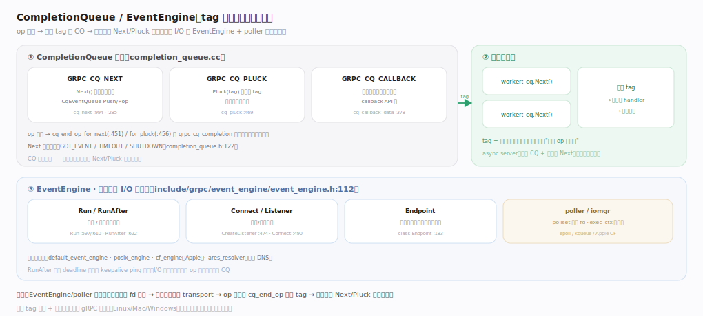
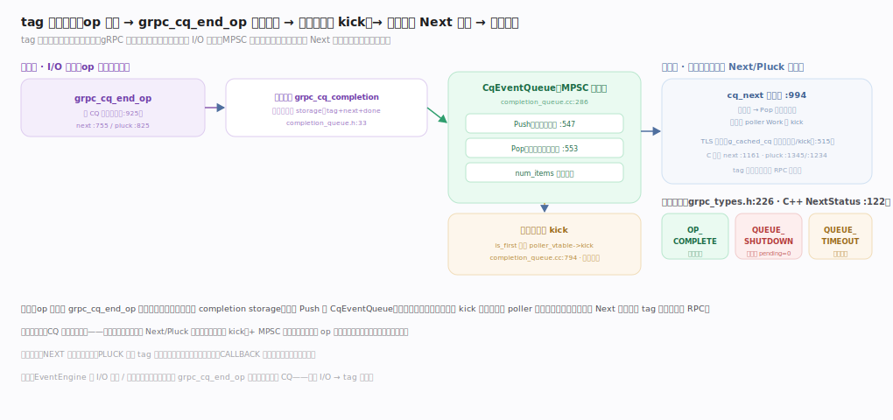

# gRPC 核心原理 · 支撑能力域 · CompletionQueue 与 EventEngine

> **定位**：全库灵魂之一，也是"异步高吞吐 vs 编程模型复杂度"张力的所在——`CompletionQueue` 是 **tag 驱动**的事件交付队列（op 完成即投递一个 tag，应用线程 Next/Pluck 取走），`EventEngine` 是**统一的异步 I/O 与定时抽象**（Run/RunAfter/Connect/Listener/Endpoint），底层由 poller/iomgr 非阻塞驱动。这套模型让 gRPC 跨平台、跨语言共享同一并发骨架。核实基准：`src/core/lib/surface/completion_queue.cc`、`include/grpcpp/completion_queue.h`、`include/grpc/event_engine/event_engine.h`、`src/core/lib/event_engine/`、`src/core/lib/iomgr/`。

## 一、tag 驱动的异步交付

CQ 不是一个"胖对象"，而是围绕一张 `cq_vtable` 函数表做多态：三种完成类型各填一行 `g_cq_vtable[]`——`GRPC_CQ_NEXT` 走无锁 `CqEventQueue`（MPSC，高并发事件循环）、`GRPC_CQ_PLUCK` 走 tag 链表只取指定结果（同步一元）、`GRPC_CQ_CALLBACK` 完成即回调（无需主动取）。三型各自持独立私有状态结构，创建时按 completion_type + polling_type 选中 vtable 拼在对象之后。

图右侧的 `EventEngine` 是新一代统一异步抽象（取代老 iomgr）：`Run/RunAfter` 立即或定时执行闭包、`Connect/CreateListener` 建连与监听、内嵌 `Endpoint` 收发字节流；I/O 就绪或定时到期的回调最终都经 `grpc_cq_end_op` 把完成事件送回 CQ，闭合"异步 I/O → tag 交付"这一环。

## 二、tag 生命周期：入队与「仅首元素 kick」

一个 op 完成时 `grpc_cq_end_op` 把结果写进调用方预留的 `grpc_cq_completion` storage（含 tag/next/done），`CqEventQueue::Push` 无锁入队；**关键优化**：只有当它是队列首元素时才 `kick` 唤醒阻塞在 poller 上的消费线程，避免每次入队都惊群。消费侧应用线程在 `cq_next` 主循环里探队列、`Pop` 取到即返回、否则挂 poller `Work` 等被 kick。

核心不变量：CQ 自身不持线程——必须由应用线程反复 Next/Pluck 驱动；三态返回 `OP_COMPLETE`/`QUEUE_SHUTDOWN`/`QUEUE_TIMEOUT`，`tag` 是应用注册的不透明指针、gRPC 只原样回传，用来关联"哪个 op 完成了"。async server 经典结构即"每核一 CQ + 一线程死循环 Next"，用 tag 在极少线程上承载海量并发调用。

## 深化 · 三型 CQ 对比

| 类型 | 取事件方式 | 私有状态 | 典型 API | 特点 |
|---|---|---|---|---|
| GRPC_CQ_NEXT | Next() 任取 | `cq_next_data`（无锁 `CqEventQueue`）:312 | async client/server | 高并发、事件循环 |
| GRPC_CQ_PLUCK | Pluck(tag) 取指定 | `cq_pluck_data`（tag 链表）:337 | 同步一元调用 | 阻塞等特定结果 |
| GRPC_CQ_CALLBACK | 完成即回调 | `cq_callback_data`（shutdown functor）:378 | callback API | 无需显式取，回调驱动 |

## 深化 · CQ 交付路径关键锚点

| 环节 | 符号 | 位置（completion_queue.cc/.h） |
|---|---|---|
| vtable 多态 | cq_vtable / g_cq_vtable[] | cc:264 · :484 |
| 无锁队列 | CqEventQueue（Push/Pop） | cc:286 · :547 · :553 |
| completion 存储 | grpc_cq_completion（tag+next+done） | h:33 |
| 完成入队 | grpc_cq_end_op → for_next / for_pluck | cc:925 · :755 · :825 |
| 仅首元素 kick | is_first 才 poller kick | cc:794 附近 |
| NEXT 主循环 | cq_next / C 入口 next | cc:994 · :1161 |
| PLUCK 取指定 tag | cq_pluck / C 入口 pluck | cc:1234 · :1345 |
| TLS 快取 | thread_local_cache / g_cached_cq | cc:515 · :61 |
| 三态枚举 | GRPC_QUEUE_SHUTDOWN/TIMEOUT/OP_COMPLETE | grpc_types.h:226 |
| C++ 三态 | Next / NextStatus | completion_queue.h:177 · :122 |

## 深化 · EventEngine 关键能力

| 能力 | 接口 | 锚点 | 用途 |
|---|---|---|---|
| 立即执行 | Run(Closure*) / Run(AnyInvocable) | event_engine.h:597 · :610 | 把工作交给引擎线程 |
| 定时执行 | RunAfter(Duration, …) | event_engine.h:622 | deadline / keepalive ping |
| 主动连接 | Connect(...) | event_engine.h:490 | 客户端建 TCP |
| 被动监听 | CreateListener(...) | event_engine.h:474 | 服务端 accept |
| 读写通道 | Endpoint | event_engine.h:183 | 收发字节流 |
| 抽象基类 | class EventEngine | event_engine.h:112 | 取代老 iomgr |

## 深化 · EventEngine 实现锚点（POSIX）

| 环节 | 符号 | 位置 |
|---|---|---|
| 默认实例工厂 | CreateEventEngine / SetDefaultEventEngine 可注入 | default_event_engine.cc:79 |
| 立即执行 | PosixEventEngine::Run | posix_engine.cc:513 |
| 定时执行 | RunAfterInternal → TimerManager | posix_engine.cc:521 |
| 定时主循环 | TimerManager::MainLoop（TimerCheck） | timer_manager.cc:64 |
| 轮询循环 | PollingCycle::PollerWorkInternal → poller Work(24h) | posix_engine.cc:221 · :229 |
| 异步 DNS | AresResolver::LookupHostname（Run 回投） | ares_resolver.cc:309 |

## 调优要点

- CQ 数量与轮询线程数决定事件处理并行度；async server 常见"每核一 CQ + 一线程"，用 tag 复用同一线程跑多路 RPC 状态机。
- 别在 Next 取到的回调里做重阻塞操作，会拖住事件循环；重活转后台线程池。
- 单线程独占某个 CQ 时可用 thread-local cache（`completion_queue.cc:515`）省掉一次入队与 kick，热路径收益明显。
- callback API（GRPC_CQ_CALLBACK）省去手写事件循环，但回调同样不能阻塞引擎线程。
- EventEngine 可替换/注入（`SetDefaultEventEngine`），测试可用确定性引擎；生产按平台选 posix/cf 引擎。

## 常见误区

- **CompletionQueue 自带线程池**：CQ 只是交付队列（`completion_queue.cc:264` 的 vtable + 无锁 `CqEventQueue`），线程由应用或 EventEngine 提供。
- **tag 是 gRPC 分配的 ID**：tag 是应用自己的不透明指针，存进 `grpc_cq_completion`（`completion_queue.h:33`）后 gRPC 只原样回传。
- **同步和异步用同一 CQ 类型**：同步一元用 PLUCK、异步用 NEXT、回调用 CALLBACK，三者由 `g_cq_vtable[]` 分派到不同 next/pluck 实现。
- **每次 op 完成都会唤醒消费者**：只有队列首元素入队才 `kick`（`completion_queue.cc:794` 附近），避免惊群。
- **EventEngine 只管网络**：它也管定时（`RunAfter` → `TimerManager::MainLoop`）与异步 DNS（`ares_resolver.cc:309`），deadline 与 keepalive 都靠它调度。

## 一句话总纲

**CompletionQueue/EventEngine 是 gRPC 的异步灵魂：CQ 以 tag 驱动交付 op 完成事件（Next 任取 / Pluck 取指定 / Callback 回调三型，由 `g_cq_vtable[]` 分派），本身不持线程、由应用线程驱动，op 完成经 `grpc_cq_end_op` 把 `grpc_cq_completion` 无锁入队并"仅首元素 kick"唤醒等待者；EventEngine 统一抽象异步 I/O（Connect/Listener/Endpoint）与定时（Run/RunAfter，底层 poller `Work` 等 fd 就绪、`TimerManager` 跑定时）——正是这套"非阻塞 + tag 关联"的模型，用编程复杂度换来了单机海量并发调用的高吞吐，并跨平台/跨语言复用。**
