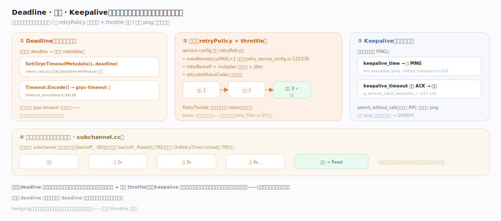
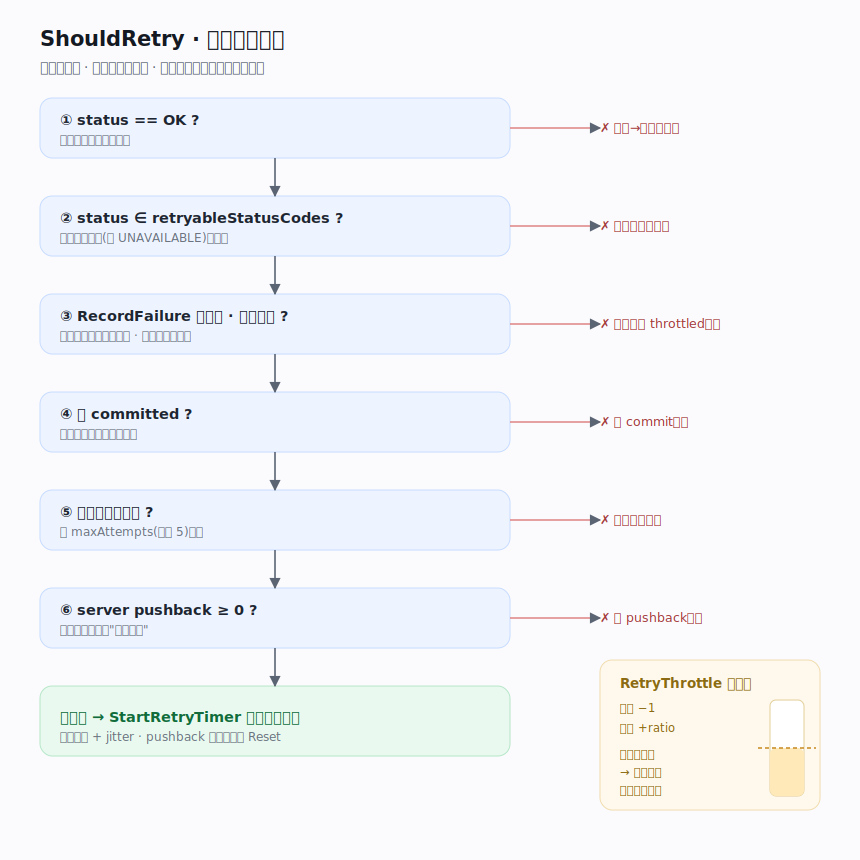

# gRPC 核心原理 · 支撑能力域 · Deadline 重试与 Keepalive

**定位**：gRPC 的可靠性四件套——**deadline** 定"等多久"（端到端超时）、**重试**定"可恢复失败后再试几次"（retryPolicy 退避 + throttle 限流）、**keepalive** 定"连接还活着吗"（周期 ping）、**退避重连**定"断了怎么重连"（subchannel backoff）。这四条机制分别作用在**调用**与**连接**两个粒度上、彼此正交，让 gRPC 在网络抖动下既有弹性又不放大故障。核实基准：`src/core/call/client_call.cc`、`src/core/lib/surface/call.cc`、`src/core/lib/transport/timeout_encoding.h`、`src/core/client_channel/retry_service_config.cc`、`retry_filter.cc`、`retry_filter_legacy_call_data.cc`、`retry_throttle.cc`、`ext/transport/chttp2/transport/chttp2_transport.cc`、`ping_abuse_policy.cc`、`client_channel/subchannel.cc`。

## 一、四条可靠性机制

**① Deadline**：客户端设 deadline，构造调用时若 `deadline != Timestamp::InfFuture()`（`src/core/call/client_call.cc:124`）则 `send_initial_metadata_->Set(GrpcTimeoutMetadata(), deadline)`（`src/core/call/client_call.cc:125`）并 `UpdateDeadline(deadline)`（`src/core/call/client_call.cc:126`）挂本地定时器。deadline 经 `Timeout::FromDuration()`（`src/core/lib/transport/timeout_encoding.h:34`）与 `Timeout::Encode()`（`src/core/lib/transport/timeout_encoding.h:38`）编成 `grpc-timeout` 头随请求上送；服务端收到后据此本地取消——**超时是端到端的**，非客户端单方计时。

**② 重试**：service config 下发 `retryPolicy`——`maxAttempts`（`src/core/client_channel/retry_service_config.cc:122`，`<=1` 报错、超上限 `MAX_MAX_RETRY_ATTEMPTS=5`（`src/core/client_channel/retry_service_config.cc:39`）在 `src/core/client_channel/retry_service_config.cc:141-144` 被截断）、`initialBackoff × backoffMultiplier` 指数退避 + jitter、`retryableStatusCodes`（`src/core/client_channel/retry_service_config.cc:182`）命中才重试；`RetryThrottler`（`src/core/client_channel/retry_filter.cc:97` `GetObjectRef<RetryThrottler>()`）是令牌桶，失败扣、成功补、见底停，**防重试风暴**。

**③ Keepalive**：空闲连接按 `keepalive_time` 周期发 PING（`init_keepalive_ping`，`src/core/ext/transport/chttp2/transport/chttp2_transport.cc:225`），`keepalive_timeout` 内无 ACK 判连接死（默认值见 `src/core/ext/transport/chttp2/transport/chttp2_transport.cc:147-155`）；`permit_without_calls` 控制无活跃 RPC 时是否仍 ping，过激会被对端判滥用回 GOAWAY。

**④ 退避重连**：连接失败后 subchannel 按指数退避重连（`backoff_` 初始化 `src/core/client_channel/subchannel.cc:653`；`next_attempt_time_ = now + backoff_.NextAttemptDelay()` 在 `src/core/client_channel/subchannel.cc:883`；`ResetBackoff` 手动重置 `src/core/client_channel/subchannel.cc:792`）。

**四者正交**：重试针对"一次调用"、退避重连针对"一条连接"；deadline 约束总耗时（重试不突破整体截止时间）；keepalive 独立探活。

## 二、重试决策链与令牌桶

`ShouldRetry` 是一条**有序短路**链，顺序即语义（见图）：成功即停并补令牌 → 状态码不在 `retryableStatusCodes` 即停 → 扣令牌、桶跌破半满即 throttled 停 → 已 commit / 次数用尽 / 服务端负 pushback 各自即停。扣令牌**必须排在状态码检查之后**，只有可重试失败才计数，避免 `INVALID_ARGUMENT` 这类请求错误也耗桶。全通过才 `StartRetryTimer`：有正 pushback 就用它并 Reset 退避，否则走 `NextAttemptDelay` 的指数退避 + jitter。右下**令牌桶**是防重试风暴的核心——失败扣 1、成功补 `tokenRatio`（通常 0.1，补得慢扣得快），服务端持续故障时令牌迅速见底、重试被自动掐断。hedging（对冲）是变体：靠 `per_attempt_recv_timeout` 不等失败就并发多份取最快，同受 throttle 与 `maxAttempts` 约束。

## 深化 · Deadline 定时器路径

deadline 不是轮询到期，而是挂在 EventEngine 上的一次性定时任务，客户端/服务端走同一底座。

| 阶段 | 落点 | 语义 |
|---|---|---|
| 编码上送 | `client_call.cc:124-126` · `timeout_encoding.h:34/38` | `deadline != InfFuture` 则 Set `GrpcTimeoutMetadata` 编成 `grpc-timeout` 头，超时端到端传递 |
| 单调收紧 | `Call::UpdateDeadline` `surface/call.cc:362` · 判定 `:367` | 新 deadline 不比当前早则忽略——只能提前不能推后，父子调用取 min |
| 已过期即取消 | `surface/call.cc:370` | `deadline < Now()` 不排定时器，直接 `CancelWithError(DeadlineExceeded)` |
| 排定时器 | `RunAfter(...,this)` `surface/call.cc:382` | Call 本身即 Closure，到点回调；重排前先 Cancel 旧 task |
| 到期撕调用 | `Call::Run` `:399` · `CancelWithError` `:403` | 用 `DEADLINE_EXCEEDED` 撕掉整条 call spine |
| 正常收尾拆表 | `Call::ResetDeadline` `:386` · 触发 `client_call.cc:189/451` | 收到 trailing metadata / 完成时 Cancel 定时器并解引用 |

## 深化 · Keepalive 触发与滥用检测

空闲连接周期 PING 探活；服务端反向用 strike 计数防客户端 ping 过勤，构成一对"惩罚—退让"协议。

| 机制 | 落点 | 说明 |
|---|---|---|
| 默认值 | `chttp2_transport.cc:147-155` | 客户端 `keepalive_time` 默认 Infinity（**默认关闭**），timeout 20s；服务端 time 2h、timeout 20s；`permit_without_calls` 两侧默认 false |
| 触发发 ping | `init_keepalive_pings_if_enabled_locked` `:572` · `RunAfter` `:579` · `init_keepalive_ping` `:225` | `time != Infinity` 则置 WAITING 定时发 PING；timeout 内无 ACK 判连接死。与 BDP ping 复用底层 ping、目的不同 |
| 滥用判定 | `ping_abuse_policy.cc:53` · 间隔 `:28`（默认 5min）· strike 上限 `:29`（默认 2）· 空闲放宽 2h `:76-79` | 两次 ping 间隔过小则 `++ping_strikes_`，超上限判滥用 |
| GOAWAY 踢连 | `exceeded_ping_strikes` `:2216` · GOAWAY `too_many_pings` `:2219` | 发 `ENHANCE_YOUR_CALM` + `too_many_pings` 关 transport |
| 客户端退让 | `KEEPALIVE_TIME_BACKOFF_MULTIPLIER` `:1423-1444` | 收到 too_many_pings 后新连接 `keepalive_time` 翻倍，自动退让 |

## 深化 · retryPolicy 关键字段

| 字段 | 作用 | 约束 |
|---|---|---|
| maxAttempts | 最大尝试次数（含首次） | `>1` 生效，超上限 5 截断（`src/core/client_channel/retry_service_config.cc:141-144`） |
| initialBackoff / maxBackoff | 退避区间 | 指数增长 + jitter，必须 `>0` |
| backoffMultiplier | 每次退避倍增 | 通常 2 |
| retryableStatusCodes | 哪些状态码可重试 | 只重试可恢复错误如 UNAVAILABLE（`src/core/client_channel/retry_service_config.cc:182`） |
| retryThrottling(maxTokens/tokenRatio) | 令牌桶限流 | 失败扣 1、成功补 ratio，低于半满停（`src/core/client_channel/retry_throttle.cc:113`） |

## 深化 · 四机制职责边界

| 机制 | 粒度 | 回答的问题 | 关键符号 |
|---|---|---|---|
| Deadline | 每次调用 | 等多久后放弃 | GrpcTimeoutMetadata · Call::UpdateDeadline · RunAfter |
| 重试 | 每次调用 | 失败后再试几次 | retryPolicy · ShouldRetry · RetryThrottler |
| Keepalive | 每条连接 | 连接还活着吗 | keepalive_time/timeout · PING · PingAbusePolicy |
| 退避重连 | 每条连接 | 断了怎么重连 | subchannel backoff · NextAttemptDelay |

## 调优要点

- deadline 必设：无 deadline 的调用可能永久挂起、耗尽资源；deadline 只能收紧不能放宽（`src/core/lib/surface/call.cc:367`），父子调用取 min。
- retryPolicy 只对幂等或可重放操作开启；配合 throttle（半满阈值）防止级联放大故障。
- keepalive 参数与中间设备（LB/NAT）空闲超时协调；客户端默认关闭 keepalive，开启时 ping 过勤会触发服务端 `too_many_pings` GOAWAY 反而断连。
- 服务端 `min_recv_ping_interval_without_data` 与 `max_ping_strikes` 要与客户端 `keepalive_time` 相容，否则连接被反复踢。
- hedging（对冲）用于尾延迟敏感场景：靠 `per_attempt_recv_timeout`（`src/core/client_channel/retry_filter_legacy_call_data.cc:147`）不等失败就并发多份取最快，同受 throttle 与 maxAttempts 约束。

## 常见误区

- **deadline 是客户端本地超时**：会编码进 metadata 端到端传递（`src/core/call/client_call.cc:125`），服务端也据此取消。
- **重试对所有错误生效**：只重试 retryableStatusCodes 命中的可恢复错误（`src/core/client_channel/retry_filter_legacy_call_data.cc:547`），且受 throttle 限。
- **throttle 只是简单计数**：本质是"失败扣 1、成功补 tokenRatio、低于半满禁止重试"的加权令牌桶，扣得快补得慢。
- **keepalive 越勤越好**：过激 ping 累计 strike 后被判滥用回 GOAWAY（`src/core/ext/transport/chttp2/transport/chttp2_transport.cc:2216`），客户端还会自罚把 keepalive_time 翻倍。
- **重试可以无限延长调用**：总耗时受 deadline 约束，重试不会突破整体截止时间。

## 一句话总纲

**Deadline/重试/Keepalive 是 gRPC 的可靠性机制群：deadline 把超时编进 metadata 端到端传递、并以 EventEngine 定时器（`Call::UpdateDeadline`→`RunAfter`→`Call::Run`）在到点撕掉调用；重试按 retryPolicy 指数退避、走 `ShouldRetry` 有序短路链、且受 RetryThrottler 半满令牌桶限流防风暴；keepalive 周期 PING 判连接死活、并以 PingAbusePolicy 的 strike 计数 + `too_many_pings` GOAWAY 制约滥用；subchannel 退避重连管断线恢复——四条机制在"调用"与"连接"两个粒度上正交协作，让 gRPC 在网络抖动下既有弹性又不放大故障。**
