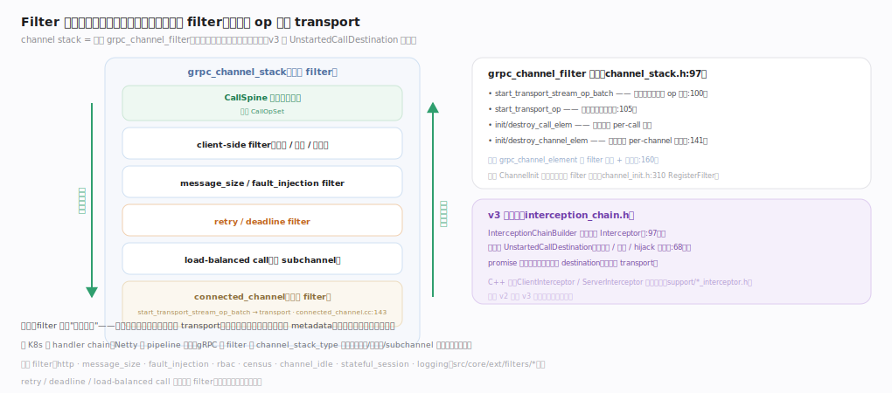
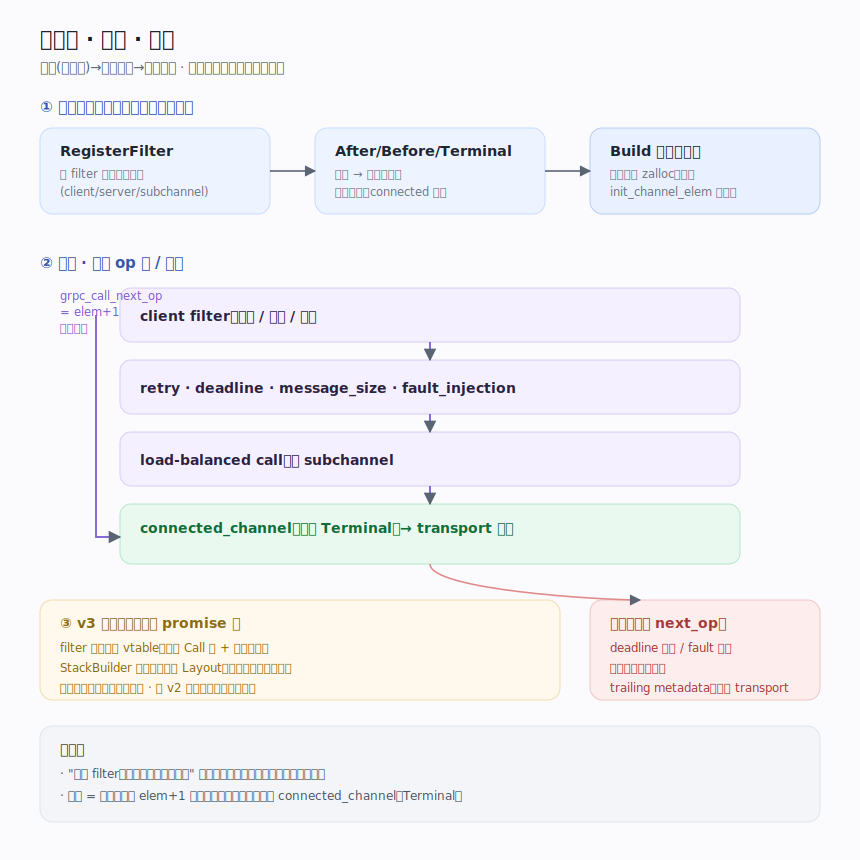

# gRPC 核心原理 · 支撑能力域 · Filter 栈与拦截链

> **定位**：gRPC 的"洋葱模型"——每个 Channel/连接是一列 `grpc_channel_filter` 组成的 channel stack，一次调用从最外层穿到栈底 transport、响应原路穿回；每层可读写 metadata、拦截、短路、注入错误。这是三处可插拔策略的第三处，也是重试/超时/LB 选路等机制的装配位。新一代（v3）用 `UnstartedCallDestination` 拦截链 promise 化实现同一语义。核实基准：`src/core/lib/channel/channel_stack.h`、`src/core/lib/channel/connected_channel.cc`、`src/core/lib/surface/channel_init.h`、`src/core/call/interception_chain.h`、`src/core/ext/filters/`。

## 一、洋葱模型：栈与 filter 结构

**channel stack** 是一列 filter：调用从 CallSpine 入口进入，依次穿过 client-side filter（鉴权/统计/压缩）、message_size/fault_injection、retry/deadline、load-balanced call（选 subchannel），最后到栈底 `connected_channel`（`src/core/lib/channel/connected_channel.cc:78`，`connected_channel_channel_data`），其 `connected_channel_start_transport_stream_op_batch`（`src/core/lib/channel/connected_channel.cc:143`）把一批 op 交给 transport；响应沿原路向上穿回。

每个 filter 是一个静态 vtable `grpc_channel_filter`（`src/core/lib/channel/channel_stack.h:97`），暴露 `start_transport_stream_op_batch`（`src/core/lib/channel/channel_stack.h:100`，处理一次调用的 op 批下行）、`start_transport_op`（`src/core/lib/channel/channel_stack.h:105`，通道级操作如优雅关闭/连接管理）、`init_call_elem`/`destroy_call_elem`（`src/core/lib/channel/channel_stack.h:118`、`src/core/lib/channel/channel_stack.h:128`，per-call 状态起止）、`init_channel_elem`/`destroy_channel_elem`（`src/core/lib/channel/channel_stack.h:141`、`src/core/lib/channel/channel_stack.h:149`，per-channel 状态）以及 `get_channel_info`（`src/core/lib/channel/channel_stack.h:152`，查询目标 URI/连接态）。vtable 是无状态的、被所有实例共享；真正的每层状态挂在 `grpc_channel_element`（`src/core/lib/channel/channel_stack.h:160`，持 filter 指针 + `channel_data` 指针）与其 per-call 对应物上。整条栈由 `grpc_channel_stack`（`src/core/lib/channel/channel_stack.h:176`）描述，一次调用的每层状态则由 `grpc_call_stack`（`src/core/lib/channel/channel_stack.h:231`）连续排布。

关键在于内存布局：`grpc_channel_stack` 头部之后紧跟一段 `grpc_channel_element` 数组，再拼接各 filter 的 `channel_data`；`grpc_call_stack` 同理，一次分配、连续排布，避免逐 filter 指针追逐。这正是"洋葱"能高效层层穿过的物理基础——穿到下一层只需 `elem + 1`。

## 二、栈的装配、穿行与短路

栈的成员与顺序不是硬编码，而是**约束驱动**（见图①）：每个 filter 用 `RegisterFilter` 声明属哪叠栈（client/server/subchannel），再用 `After`/`Before`/`Terminal` 声明相对次序——`ChannelInit` 据此**拓扑排序**得确定序列，retry/deadline/message_size 靠约束落在固定相对位，`connected_channel` 用 `Terminal` 永远压栈底。物化时 `Build` 算总大小、`gpr_zalloc` 一整块连续内存、逐层 `init_channel_elem` 把各 `channel_data` 指到偏移——"哪些 filter、什么顺序、各占多大"通道创建时一次性定型，每次调用复用同一布局。穿行（图②）不是虚调用而是**数组步进**：filter 处理完调 `grpc_call_next_op` 取 `elem+1` 推向栈底，直到 transport。一层要**短路**（deadline 超、fault 命中）就不调 `next_op`、直接回填错误 trailing metadata——调用到不了 transport，这就是"拦截/注入错误"的实现。响应方向逐层穿回，每层可读写 server metadata 与 message。v3（图③）把洋葱重构成 promise 组合：filter 提供 `Call` 类 + 六个拦截点，`StackBuilder` 按事件预聚成 `Layout` 顺序遍历免指针追逐，与 v2 栈并存等价、逐步迁移。

## 深化 · 装配与穿行落点

| 阶段 | 落点 | 说明 |
|---|---|---|
| 收集/注册 | `ChannelInit` `channel_init.h:67` · `Builder::RegisterFilter` `:310` | 按 `grpc_channel_stack_type` 分三叠 |
| 次序约束 | `FilterRegistration` `channel_init.h:175` · `After` `:210` · `Before` `:216` · `Terminal` `:236` | 约束非序号，拓扑排序得序列 |
| 栈底终结 | `RegisterConnectedChannel` `connected_channel.cc:302` | `Terminal` 保证 connected 永远最后 |
| 物化栈 | `ChannelStackBuilderImpl::Build` `channel_stack_builder_impl.cc:54` · `grpc_channel_stack_init` `channel_stack.cc:114` | 一块内存 + 逐层 init + 统一 post_init |
| 下行步进 | `grpc_call_next_op` `channel_stack.cc:293` · `grpc_channel_next_op` `:308` | 取 `elem+1` 推 op 批往栈底 |
| 栈底出口 | `connected_channel_channel_data` `connected_channel.cc:78` · `start_transport_stream_op_batch` `:143` | 把 op 批交给 transport |

## 深化 · grpc_channel_filter 的回调面

| 回调 | 行锚 | 时机 | 用途 |
|---|---|---|---|
| start_transport_stream_op_batch | `src/core/lib/channel/channel_stack.h:100` | 每次调用的 op 批下行/回程 | 读写 metadata / message、拦截、短路 |
| start_transport_op | `src/core/lib/channel/channel_stack.h:105` | 通道级操作 | 连接管理、优雅关闭、探活 |
| init_call_elem / destroy_call_elem | `src/core/lib/channel/channel_stack.h:118`（destroy 见 `:128`） | 每次调用起止 | 分配/回收 per-call 状态 |
| init_channel_elem / destroy_channel_elem | `src/core/lib/channel/channel_stack.h:141`（destroy 见 `:149`） | 通道建/毁 | per-channel 初始化 |
| get_channel_info | `src/core/lib/channel/channel_stack.h:152` | 查询通道信息 | 目标 URI、连接态等 |

## 深化 · v3 拦截链落点

| 组件 | 落点 | 职责 |
|---|---|---|
| 六拦截点约定 | `call_filters.h:50` 起头部文档 | OnClientInitialMetadata / OnServer… / OnClientToServerMessage 等，类型即语义(NoInterceptor 零开销 / 改值 / 可失败 / 返 promise) |
| 编排 | `CallFilters` `call_filters.h:1720` · `StackBuilder` `:1745` · `StackData/Layout` `:1082` | 把同一事件在各 filter 的处理预聚成一条 Layout |
| 运行期 | `CallFilters::Start` `call_filters.cc:32` · `OperationExecutor::Start` `call_filters.h:1457` · 析构 `call_filters.cc:120` | 一次分配 per-call 数据，沿 Layout 逐步跑 promise，错误即短路 |
| 拦截/hijack 组装 | `InterceptionChainBuilder` `interception_chain.h:154` · `StartCall` `:101` | 串 `UnstartedCallDestination`，bottom-out 在 LB/transport |

## 深化 · 内置 filter 一览

| filter | 目录 | 作用 |
|---|---|---|
| http | `src/core/ext/filters/http` | HTTP/2 语义适配、压缩 |
| message_size | `src/core/ext/filters/message_size` | 收发消息大小限制 |
| fault_injection | `src/core/ext/filters/fault_injection` | 故障注入（延迟/中断） |
| rbac | `src/core/ext/filters/rbac` | 基于角色的访问控制 |
| census / logging | `src/core/ext/filters/census` · `logging` | 观测、调用日志 |
| channel_idle | `src/core/ext/filters/channel_idle` | 空闲通道回收 |
| stateful_session | `src/core/ext/filters/stateful_session` | 会话亲和 |

（retry / deadline / load-balanced call 也是特殊 filter，靠 `After`/`Before` 约束装配在栈的固定相对位置。）

## 五、C++ 层 interceptor 与 core filter 的关系

面向应用作者的是 **C++ interceptor**：实现 `Interceptor` 的唯一方法 `Intercept`，在 `InterceptorBatchMethods` 提供的一批 hook 点（`InterceptionHookPoints` 枚举：`PRE_SEND_INITIAL_METADATA`/`PRE_SEND_MESSAGE`/`POST_RECV_MESSAGE`/`PRE_SEND_CANCEL` 等）上被回调。它比 core filter **高层**：不感知 channel stack 内存布局，只在调用生命周期的语义点被通知，客户端还可对首元数据做 hijack。分工清晰——core filter 面向协议级机制（压缩、消息大小、故障注入、LB 选路），与 transport 紧邻、性能敏感；C++ interceptor 面向业务横切（认证、审计、日志、指标），部署简单、按需插拔，其逻辑最终也落在栈的相应层被触发。

## 深化 · C++ interceptor 落点

| 元素 | 落点 | 说明 |
|---|---|---|
| 接口 | `Interceptor::Intercept` `include/grpcpp/support/interceptor.h:218` | 应用实现的唯一方法 |
| hook 面 | `InterceptorBatchMethods` `include/grpcpp/support/interceptor.h:95` | 一批可读写 metadata/message 的回调入口 |
| hook 枚举 | `InterceptionHookPoints` `include/grpcpp/support/interceptor.h:56` | PRE/POST × SEND/RECV × metadata/message/cancel |

## 调优要点

- filter 越多单次调用开销越大；只注册需要的 filter，避免全局启用重型 filter；`ExcludeFromMinimalStack` 可让 filter 不进入精简栈。
- 自定义 filter 应无阻塞、无锁热路径；`start_transport_stream_op_batch` 内不得同步阻塞，重活交后台或异步 promise。
- interceptor（C++）适合业务横切（认证/日志），core filter 适合协议级机制。
- 顺序敏感：鉴权应在业务 filter 之前、压缩在序列化之后；不写死序号，用 `After`/`Before` 声明约束，由拓扑排序确定最终顺序。

## 常见误区

- **filter 只处理请求**：是双向"洋葱"，响应/trailing metadata 也沿栈回程穿回，回程同样可读写与短路。
- **所有调用走同一套 filter**：按 `grpc_channel_stack_type` 区分，客户端/服务端/subchannel 栈不同，注册时即已声明归属。
- **注册顺序就是执行顺序**：注册顺序无关，`ChannelInit` 依 `After`/`Before` 约束做拓扑排序得出确定序列。
- **拦截器能改变已发出的字节**：只能在 op/metadata 穿过时改写，已交 transport 的帧不可回改。
- **v3 拦截链替代了所有 v2 filter**：两者并存，迁移进行中，语义等价。

## 一句话总纲

**Filter 栈是 gRPC 的洋葱模型：每个 Channel 是一列 `grpc_channel_filter`，由 `ChannelInit` 按 `After`/`Before` 约束拓扑排序、`ChannelStackBuilderImpl::Build` 一次性连续分配定型；调用从最外层用 `grpc_call_next_op` 逐层步进穿到栈底 `connected_channel` 再交 transport、响应原路穿回，每层可读写 metadata、拦截、短路、注入错误；重试/超时/LB 选路都是装配在固定相对位置的特殊 filter，用户横切逻辑经 C++ interceptor 接入，新一代则由 `CallFilters`/`InterceptionChainBuilder` 把整条洋葱 promise 化——这是"怎么处理每次调用"这一策略维度的可插拔实现。**
