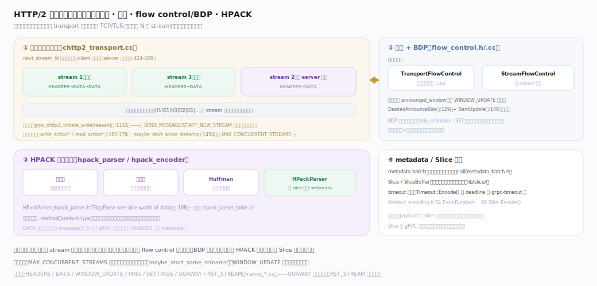
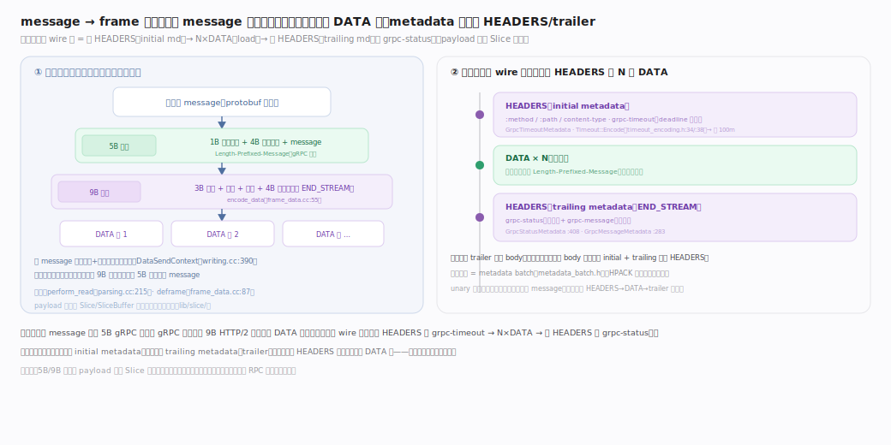
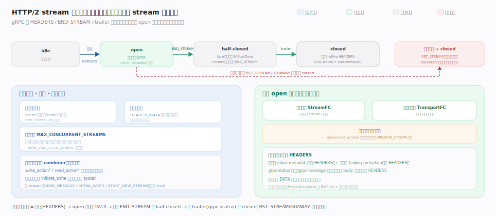

# gRPC 核心原理 · 支撑能力域 · HTTP/2 传输与流控

> **定位**：全库灵魂之一，也是"实现复杂度"张力的所在——客户端与服务端**共用同一 chttp2 transport**，把一条 TCP/TLS 连接复用成 N 个 stream：帧交织传输（无队头阻塞）、两级 flow control + BDP 动态调窗约束发送量、HPACK 压缩头部、Slice 零拷贝流转载荷。核实基准：`src/core/ext/transport/chttp2/transport/chttp2_transport.cc`、`flow_control.h`/`flow_control.cc`、`hpack_parser.h`、`src/core/lib/transport/transport.h`、`src/core/lib/slice/`、`src/core/lib/transport/timeout_encoding.h`。

## 一、多路复用 · 流控 · HPACK

图分三层：**①多路复用**——一条连接承载多个 stream（client 用奇数流号、server 用偶数），HEADERS/DATA 帧交织传输、独立推进，任一阻塞不牵连其他；写意图收敛到 `initiate_write` 做写合并降 syscall，读写状态机全在 combiner 单写者域串行执行以代替加锁。**②两级 flow control**——发送量受连接级与流级两个窗口共同约束，任一耗尽即停发，`announced_window` 掉到目标一半就发 WINDOW_UPDATE 补窗。**③HPACK**——头部用静态表+动态表+Huffman 压缩，`:path`/`content-type` 这类重复头除首次外几乎零字节。

核心不变量：目标窗口非常数——`PeriodicUpdate` 周期性靠 PING 探测 BDP、按"BDP×2 再经内存压力裁剪"重算，故高时延链路窗口自动放大、吞吐随 BDP 自适应，无需人工调初始窗口；新流受对端 `MAX_CONCURRENT_STREAMS` 上限约束，超额者排队待旧流关闭腾配额。

## 二、message→frame 映射与 metadata / Slice

图示载荷的三层包裹与一次调用的 wire 序列：序列化 message 先加 **5 字节 gRPC 前缀**（1 字节压缩标志 + 4 字节大端长度）成 gRPC 帧，再加 **9 字节 HTTP/2 帧头**切成一或多个 DATA 帧（大 message 受流控节流成多帧）；载荷全程以 `Slice`/`SliceBuffer` 引用计数零拷贝流转、切帧只移指针不复制字节。

关键不变量：控制与数据在帧层分离——请求元信息走 **initial metadata**（首 HEADERS，deadline 编成 `grpc-timeout` 如 `100m`）、结果码走 **trailing metadata**（末 HEADERS 即 trailer，`grpc-status` 必有 + `grpc-message` 可选），载荷才走 DATA 帧；故正常调用即使无 body 也至少有 initial + trailing 两次 HEADERS。

## 三、stream 生命周期状态机

一条连接内每个 stream 独立走 `idle → open → half-closed → closed` 状态机：`idle` 收/发首个 HEADERS（initial metadata）转 `open`；一侧发 `END_STREAM`（客户端 `WritesDone`）转 `half-closed`（local/remote 视方向）；收到 trailing HEADERS（`grpc-status`）转 `closed`。`RST_STREAM`（取消单流）与 `GOAWAY`（连接排空、不再收新流）可把任意状态直接撕到 `closed`。客户端用奇数流号、服务端用偶数（`next_stream_id` 校验低位，`chttp2_transport.cc:424-429`）；新流受对端 `MAX_CONCURRENT_STREAMS` 上限约束、超额者由 `maybe_start_some_streams`（`chttp2_transport.cc:1454`）排队待旧流关闭腾配额。**每个 `open` 流各占一份流级 + 连接级两级流控窗口**，任一耗尽即停发；读写状态机全跑在 combiner 单写者域、写意图收敛到 `initiate_write` 做写合并降 syscall。

## 深化 · 关键帧类型

| 帧 | 源文件 | 作用 |
|---|---|---|
| HEADERS | frame（hpack_encoder） | 携带 HPACK 压缩的 metadata（initial + trailing） |
| DATA | frame_data.cc:55（encode）· :87（deframe） | 携带 5B 前缀的 message；收侧还原 |
| WINDOW_UPDATE | frame_window_update.cc | 流控窗口回补 |
| SETTINGS | frame_settings.cc | 连接参数协商（窗口/流数） |
| PING | frame_ping.cc | keepalive / BDP 探测（start_bdp_ping :3172） |
| GOAWAY | frame_goaway.cc | 优雅关闭连接（不再收新流） |
| RST_STREAM | frame_rst_stream.cc | 取消/重置单个 stream |

## 深化 · 传输与流控关键锚点

| 机制 | 类/函数 | 位置 |
|---|---|---|
| 流号奇偶定死 | next_stream_id(is_client?1:2) / 校验低位 | chttp2_transport.cc:740 · :424-429 |
| 写合并入口 | grpc_chttp2_initiate_write（按 reason 合并 flush） | chttp2_transport.cc:1132 |
| 写触发原因 | SEND_MESSAGE / INITIAL_WRITE / START_NEW_STREAM | chttp2_transport.cc:713 · :825 · :1489 |
| 读写状态机回调 | write_action*/read_action*（跑在 combiner） | chttp2_transport.cc:163-176 |
| 可写流入队 | GRPC_CHTTP2_LIST_WRITABLE / list_add_writable_stream | stream_lists.cc:171 |
| 并发流限流 | maybe_start_some_streams（超 MAX_CONCURRENT_STREAMS 排队） | chttp2_transport.cc:1454 |
| 连接级流控 | TransportFlowControl | flow_control.h:202 |
| 通告窗口计算 | DesiredAnnounceSize / SentUpdate 记账 | flow_control.cc:129 · :140 |
| 目标窗口 | target_window = 累积已通告 + 目标初始窗口 | flow_control.cc:178 |
| 补窗阈值 | UpdateAction（send_threshold=target/2） | flow_control.cc:186 |
| 目标窗口周期重算 | PeriodicUpdate → 依 BDP×2 + 内存压力裁剪 | flow_control.cc:289 · :199 |
| BDP 探测 | start_bdp_ping → StartPing（estimator 句柄） | chttp2_transport.cc:3172 · flow_control.h:331 |
| HPACK 解析 | HPackParser::Parse（逐 slice 增量续解） | hpack_parser.h:53 · :108 |
| HPACK 编码 | EmitIndexed（命中）/ EncodeAlwaysIndexed（字面量+插表） | hpack_encoder.h:83 · :96 |
| 载荷写侧 | DataSendContext（按流控配额）→ 编码 | writing.cc:390 · :425 |
| 载荷编码/解帧 | grpc_chttp2_encode_data / grpc_deframe_unprocessed | frame_data.cc:55 · :87 |
| 收侧读循环 | grpc_chttp2_perform_read / parse_frame_slice | parsing.cc:215 · :102 |
| deadline / 状态码编码 | GrpcTimeout/Status/MessageMetadata | metadata_batch.h:75 · :408 · :283 |
| grpc-timeout 编码 | Timeout::FromDuration / Encode（如 100m） | timeout_encoding.h:34 · :38 |

## 深化 · 两级流控职责

| 层级 | 类 | 约束对象 | 回补 |
|---|---|---|---|
| 连接级 | TransportFlowControl | 整条连接总发送量 | 连接级 WINDOW_UPDATE |
| 流级 | StreamFlowControl | 单个 stream 发送量 | 流级 WINDOW_UPDATE |
| 自适应 | BdpEstimator | 动态调整目标窗口 | 依带宽×时延估计 |

## 调优要点

- 初始窗口（initial window size）过小会限制高 BDP 链路吞吐；BDP 探测可自动放大。
- MAX_CONCURRENT_STREAMS 限单连接并发流；高并发可增大或多连接（结合 LB）。
- HPACK 动态表大小影响压缩率与内存；超大 metadata 削弱压缩收益。
- 大 message 走多个 DATA 帧且受流控节流，超大 payload 建议流式分片。

## 常见误区

- **每个 RPC 一条 TCP 连接**：一条连接多路复用 N 个 stream，连接由 subchannel 复用。
- **HTTP/2 无队头阻塞**：应用层各 stream 互不阻塞，但同一 TCP 上仍受 TCP 层 HoL 影响（QUIC 才彻底解决）。
- **flow control 只在应用层做**：gRPC 用 HTTP/2 帧级两级窗口 + BDP，独立于 TCP 拥塞控制。
- **HPACK 是普通 gzip**：HPACK 是专为头部设计的索引 + Huffman 方案，有静态/动态表，非通用压缩。

## 一句话总纲

**HTTP/2 transport 是 gRPC 的高效传输灵魂：客户端/服务端共用一套实现，把一条连接复用成 N 个 stream（帧交织、无应用层队头阻塞），发送量受连接级 + 流级两级 flow control 窗口约束并由 BDP 估计动态调窗，头部经 HPACK 静态/动态表 + Huffman 压缩、载荷以 Slice 零拷贝流转——正是"多路复用与流控的实现复杂度"换来了单连接的高并发吞吐。**
