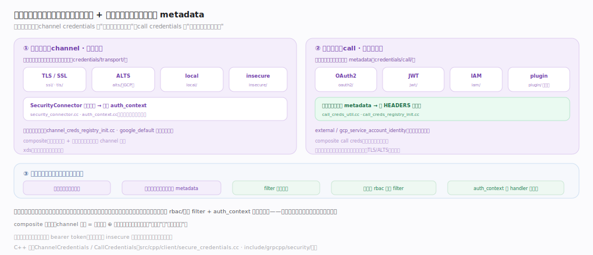
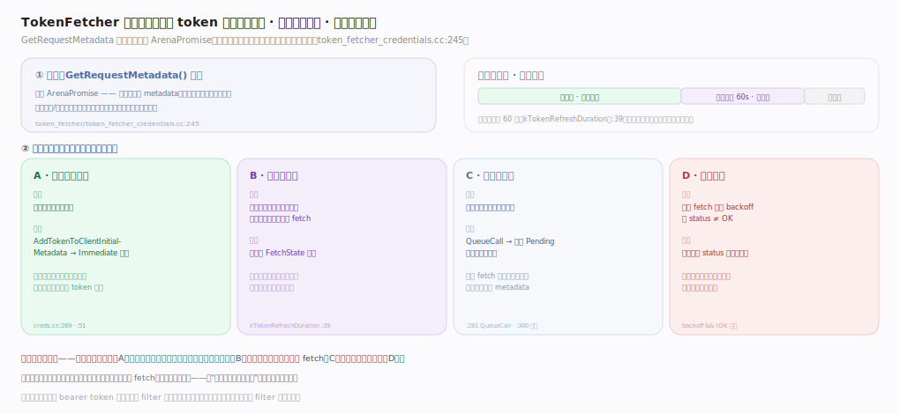

# gRPC 核心原理 · 支撑能力域 · 凭证与安全

> **定位**：gRPC 的横切安全机制，分两类正交凭证——**传输凭证（channel credentials）**在建连时一次性握手鉴定对端、协商加密（TLS/ALTS/local/insecure）；**调用凭证（call credentials）**在每次调用注入身份令牌到 metadata（OAuth2/JWT/IAM）。二者可 composite 组合，服务端经 rbac/授权 filter + `auth_context` 做访问控制。核实基准：`src/core/credentials/transport/`、`src/core/credentials/call/`、`src/core/transport/auth_context.cc`、`src/cpp/client/secure_credentials.cc`、`include/grpcpp/security/`。

## 一、两类凭证与令牌旅程

图中左右两栏是两条正交凭证：**传输凭证**（连接级、每连接一次）建连时经 `SecurityConnector` 握手鉴定对端、`check_peer` 把对端身份翻译进 `auth_context`；**调用凭证**（每次调用）把 bearer token 写入 metadata 的 `authorization` 头（OAuth2/JWT/IAM）。底部横切条是令牌旅程：建连握手 → 每调用注入 → `ClientAuthFilter` 组合并校验安全级别 → 服务端 rbac 授权 → handler 读 `auth_context`。

关键不变量：调用凭证默认只在安全传输上发送（`min_security_level` 默认 `PRIVACY_AND_INTEGRITY`），通道级别不足则 `ClientAuthFilter` 直接返回 `UnauthenticatedError`、令牌根本不发出；`is_authenticated()` 仅当握手确认了 peer identity 才为真，故 insecure 连接虽能通信却永远 `false`。

## 二、令牌缓存与刷新：TokenFetcher 状态机

对需向外部端点换取短期令牌的凭证（Compute Engine 元数据、OAuth2 refresh token、STS 等），`TokenFetcherCredentials` 用一套四态机管理令牌：**命中缓存**走快路直接复用、**进入到期前 60s 刷新窗口**则后台预刷新（旧令牌仍可用、不阻塞热路径）、**无缓存**则 `QueueCall` 排队等一次 fetch 完成后统一唤醒整队、**退避期**直接以该 status 让调用失败不再打爆令牌端点。

核心不变量：并发命中同一凭证的调用至多触发一次在途 fetch——一次取 token 服务多次调用、到期前提前刷新、失败时集中退避，把分布式系统里最易写坏的令牌管理收敛进一个可复用基类；返回的是可挂起的 `ArenaPromise`，令牌总在「发送前一刻」才拼装，保证过期/刷新逻辑生效。

## 深化 · 两类凭证职责

| 维度 | 传输凭证 (channel) | 调用凭证 (call) |
|---|---|---|
| 粒度 | 每条连接一次 | 每次调用 |
| 回答 | 通道怎么安全建立 | 这次调用带谁的身份 |
| 载体 | 握手协议（TLS/ALTS） | metadata 里的 token |
| 代表 | SSL/TLS · ALTS · local | OAuth2 · JWT · IAM |
| 目录 | credentials/transport/ | credentials/call/ |

## 深化 · 安全相关组件

| 组件 | 位置 | 作用 |
|---|---|---|
| SecurityConnector | src/core/credentials/transport/security_connector.h:58 | check_peer 握手校验、产出 auth_context；CheckCallHost 校验 :authority（:125） |
| ssl check_peer | src/core/credentials/transport/ssl/ssl_security_connector.cc:135 | ssl_check_peer 校 ALPN/主机名，peer_to_auth_context 塞 SAN/CN（:60/:73） |
| SecurityHandshaker | src/core/handshaker/security/security_handshaker.cc:314 | CheckPeerLocked 抽 peer、回调 check_peer、set_protocol（:317/:326/:331） |
| auth_context | src/core/transport/auth_context.h:61 | 身份属性数组；add_property :142；is_authenticated 见 :107 |
| GetRequestMetadata | src/core/credentials/call/call_credentials.h:122 | 调用凭证注入令牌的统一纯虚接口；min_security_level 默认 :115 |
| TokenFetcher 状态机 | src/core/credentials/call/token_fetcher/token_fetcher_credentials.cc:245 | 缓存/预刷新/排队/退避四态；QueueCall :281、唤醒 :300 |
| oauth2 / jwt / iam | src/core/credentials/call/{oauth2,jwt,iam}/ | Append authorization 头（IAM 走 x-goog-iam-* :42） |
| composite call creds | src/core/credentials/call/composite/composite_call_credentials.cc:34 | TrySeqIter 顺序追加多凭证，任一失败即整体失败（:38） |
| ClientAuthFilter | src/core/filter/auth/client_auth_filter.cc:112 | 组合 creds + 安全级别校验（grpc_check_security_level :150/:97） |
| rbac/authz filter | src/core/lib/security/authorization/grpc_server_authz_filter.cc:58 | 服务端 deny/allow 两级授权（OnClientInitialMetadata :93） |
| C++ 凭证 API | src/cpp/client/secure_credentials.cc:297 | AccessToken/IAM/Composite 等封装 |

## 调优要点

- 生产必用 TLS/ALTS，insecure 仅限本地测试；mTLS 双向认证防冒充。
- 调用凭证按需刷新令牌（OAuth2 有过期），避免每调用同步取 token 阻塞。
- composite 组合让"通道加密 + 每调用身份"一次配置，减少易错的手工拼装。
- rbac 授权在服务端 filter 层统一做，别散落到各 handler。

## 常见误区

- **传输凭证也带每调用身份**：传输凭证只在握手鉴定通道，每调用身份靠 call credentials。
- **调用凭证可在任意连接发送**：多数拒绝在 insecure 连接上发 token，防明文泄露。
- **insecure 只是不加密**：它同时不鉴定对端身份，生产不可用。
- **auth_context 是客户端概念**：握手双方都建 auth_context，服务端 handler 读它做授权。

## 一句话总纲

**凭证与安全是 gRPC 的横切防线：传输凭证（TLS/ALTS/local）在建连时一次性握手鉴定对端、协商加密并产出 auth_context，调用凭证（OAuth2/JWT/IAM）在每次调用把身份令牌注入 metadata 随 HEADERS 上送；二者经 composite 组合成 channel 凭证、经注册表插件化，服务端再以 rbac 授权 filter + auth_context 做访问控制——连接安全与调用身份分离且可组合，且 token 默认只在安全传输上发送。**
