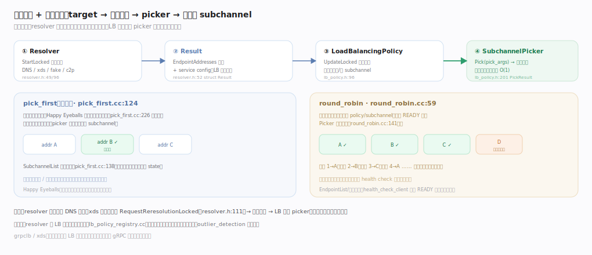
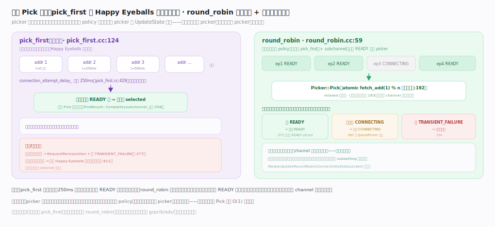

# gRPC 核心原理 · 支撑能力域 · 名字解析与负载均衡

> **定位**：客户端 Channel 的"控制大脑"——**name resolver** 把逻辑 target 解析成端点地址集合 + service config，**load balancer** 据此为端点建/管 subchannel 并产出 `picker`，供每次调用挑一条连接。二者经注册表插件化，是 gRPC 三处可插拔策略中的两处。核实基准：`src/core/resolver/resolver.h`、`src/core/load_balancing/lb_policy.h`、`src/core/load_balancing/pick_first/pick_first.cc`、`src/core/load_balancing/round_robin/round_robin.cc`、`src/core/resolver/resolver_registry.cc`。

## 一、从解析到选路

四步流水线：**Resolver**（DNS/xds/fake/google_c2p 等实现，`StartLocked` 触发一次解析）→ **Result**（携带 `EndpointAddressesList` 与 `service_config` 两条 `StatusOr`，外加 `resolution_note` 便于把"为什么没地址"透传给应用）→ **LoadBalancingPolicy**（消费地址、为端点建/管 subchannel、跟踪健康）→ **SubchannelPicker**（`Pick(args)` 返回 `PickResult`，CallSpine 每次调用调一次）。

关键一环是二者**并不直接握手**，而是各自与 client channel 用回调解耦：resolver 把结果推给 `ResultHandler::ReportResult`，channel 在 `OnResolverResultChangedLocked` 接住、翻译成 LB 的 `UpdateArgs` 后调 `CreateOrUpdateLbPolicyLocked`；resolver 变更（DNS 刷新、xds 下发）经 `RequestReresolutionLocked` 触发重新解析 → LB 重建 picker，全程不打断在途调用。

## 二、resolver：从 target 字符串到端点列表

Channel 拿到 `dns:///my.svc:50051` 这样的 URI，注册表 `ResolverRegistry` 按 scheme 选工厂（`CreateResolver` 查工厂、`IsValidTarget` 先校验）；不含 scheme 时用默认前缀 `dns:///` 补全再重试——这正是"不写 scheme 默认走 DNS"的由来。DNS 解析本身也可插拔：`RegisterDnsResolver` 按平台在 EventEngine DNS / c-ares（支持 SRV/TXT、异步）/ native（`getaddrinfo` 阻塞）间择一。

三者产出统一的 `EndpointAddressesList`，其中每个 `EndpointAddresses` 代表**一个逻辑端点**、可含多个 IP（供 Happy Eyeballs 择优）——这层区分让"一个后端多网卡/双栈"与"多个独立后端"在数据结构上清晰分开。核心差异 **push vs pull**：DNS 是 pull 型（只能靠 `RequestReresolutionLocked` 请求再查、带退避防打爆），xds 是 push 型（控制面主动下发、秒级生效）——这解释了为何生产倾向 xds。

## 三、pick_first vs round_robin：两条 Pick 路径

LB policy 收到 `UpdateArgs` 后经 `ChannelControlHelper`（反向代理）与 channel 通信：建连、上报聚合连通性并附新 picker、请求重解析。图示两条 Pick 路径：**pick_first**（默认）把地址拉平、Happy Eyeballs 并发试连（250ms 交错），第一个 READY 即锁定、此后 `Pick` 恒返回它，适合单后端与连接亲和；**round_robin** 为每健康端点建连、`fetch_add(1)%n` 无锁轮转（随机起点避热点），并按"任一 READY 即整体 READY、有 CONNECTING 则排队、全失败才整体失败"三规则聚合状态。

核心不变量：`SubchannelPicker` **只含数据面状态、不含控制面逻辑**——picker 是不可变快照，每当连通性变化 policy 就生成全新 picker 经 `UpdateState` 换上，在途调用继续用旧 picker、新调用用新 picker，天然无锁。`PickResult` 四态（Complete/Queue/Fail/Drop）正是"连接暂不可用"时 channel 如何处置调用的全部选择。

## 深化 · resolver 关键锚点

| 环节 | 符号 | 位置 |
|---|---|---|
| resolver 抽象 | class Resolver / StartLocked | resolver.h:49 · :96 |
| 解析结果 | struct Result（addresses + service_config + note） | resolver.h:52 |
| 结果回调 | ResultHandler::ReportResult | resolver.h:87 |
| 请求重解析 / 退避重置 | RequestReresolutionLocked / ResetBackoffLocked | resolver.h:111 · :116 |
| 注册表选工厂 | CreateResolver / IsValidTarget / 默认 dns:/// | resolver_registry.cc:88 · :79 · :68 |
| DNS 后端择一 | RegisterDnsResolver（ares/native/EE） | dns_resolver_plugin.cc:32 |
| 端点列表 | EndpointAddressesList / EndpointAddresses | endpoint_addresses.h:106 · :56 |
| channel 接住结果 | OnResolverResultChangedLocked → CreateOrUpdateLbPolicyLocked | client_channel.cc:1152 · :1308 |

## 深化 · LB / picker 关键锚点

| 环节 | 符号 | 位置 |
|---|---|---|
| LB 抽象 | class LoadBalancingPolicy / UpdateArgs | lb_policy.h:96 · :363 |
| 反向代理 | ChannelControlHelper（CreateSubchannel/UpdateState/ReRe） | lb_policy.h:294 · :307 · :312 |
| picker + Pick | SubchannelPicker::Pick | lb_policy.h:282 · :286 |
| PickResult 四态 | Complete/Queue/Fail/Drop | lb_policy.h:201 · :263/:265/:267/:269 |
| channel 侧状态回填 | RequestReresolution / 状态回填 | client_channel.cc:523 · :518 |
| pick_first | 入口 / Pick 恒返回 / 250ms 交错 | pick_first.cc:124 · :358 · :429 |
| pick_first 失败 | 空/全失败转 TF / 断开重跑 | pick_first.cc:477 · :811 |
| round_robin | 入口 / 原子轮转 / 随机起点 | round_robin.cc:59 · :192 · :183 |
| round_robin 三规则聚合 | READY / CONNECTING / TRANSIENT_FAILURE | round_robin.cc:372 · :387 · :394 |

## 深化 · 两种默认策略对比

| 维度 | pick_first | round_robin |
|---|---|---|
| 连接数 | 通常 1 条（选中的） | 每健康端点 1 条 |
| 选路 | 恒返回选中的那个（`pick_first.cc:358`） | READY 端点间原子轮转（`round_robin.cc:192`） |
| 适合 | 单后端 / 连接亲和 | 多副本无状态服务 |
| 端点变更 | 重跑 Happy Eyeballs | 增删子 subchannel + 重算聚合态 |
| 首选机制 | 并发试连（250ms 交错，`pick_first.cc:429`） | 随机起点 + health check 过滤 |
| 整体连通性 | 跟随 selected 单连接 | 三规则聚合（`round_robin.cc:372/387/394`） |

## 深化 · 可插拔扩展点

| 扩展 | 位置 | 作用 |
|---|---|---|
| 自定义 resolver | `resolver_registry.cc:88` 注册工厂 | 支持自有服务发现 |
| 自定义 LB | `lb_policy.h:96` 派生 + 注册 | 加权 / 地域感知等 |
| outlier_detection | `load_balancing/outlier_detection/` | 熔断异常端点 |
| grpclb / xds | `grpclb/` · xds | 外部 LB 协议下发端点 + 权重 |
| health check | `health_check_client.cc` | 只把健康端点纳入选路 |
| DNS 后端切换 | `dns/dns_resolver_plugin.cc:32` | c-ares / native / EventEngine |

## 调优要点

- DNS resolver 有最小刷新间隔与退避（`ResetBackoffLocked`，`resolver.h:116`），避免频繁重解析；生产多用 xds 精确下发。
- round_robin 端点数大时连接与内存线性增长（每端点 1 条 subchannel）；配合 subsetting 限制扇出。
- service config 可从 resolver 下发（`Result` 的 `service_config` 字段，`resolver.h:52`），运行时切换 LB 策略、重试、超时，实现中心化流量策略。
- Happy Eyeballs 的 250ms 交错延迟（`pick_first.cc:429`）可经 channel arg 调整：调大省连接、调小抢首连速度。
- outlier_detection 熔断阈值需谨慎，过激会把健康端点也摘除造成雪崩。

## 常见误区

- **LB 在服务端或独立代理**：gRPC 默认客户端侧 LB，进程内选路、每调用一次 `Pick`（`lb_policy.h:286`）。
- **pick_first 只连第一个地址**：它用 Happy Eyeballs 并发试连（250ms 交错），选最先连上的，非机械取首个。
- **换 LB 策略要改代码**：可经 service config 从 resolver 下发策略名，运行时切换。
- **resolver 出的是最终连接**：resolver 只出地址（`EndpointAddressesList`，`endpoint_addresses.h:106`）+ 配置，建连是 subchannel、选连是 picker。
- **picker 会随连接状态自我修改**：picker 是不可变快照，状态一变就整体换新（`UpdateState`，`lb_policy.h:307`），这才是无锁数据面的关键。

## 一句话总纲

**名字解析与负载均衡是 gRPC 客户端的控制大脑：resolver 按 scheme 经注册表选工厂、把逻辑 target 解析成 `EndpointAddressesList` + service config，经 `ReportResult` 回调推给 channel；load-balancer 据此为端点建/管 subchannel、聚合连通性状态并产出不可变 picker——pick_first 用 Happy Eyeballs 250ms 交错并发试连锁定一条连接、round_robin 在 READY 端点间原子轮转均摊并按三规则聚合整体状态；二者以回调解耦、经注册表插件化，是"选谁连"策略与"怎么建连/传输"机制解耦的关键一环。**
