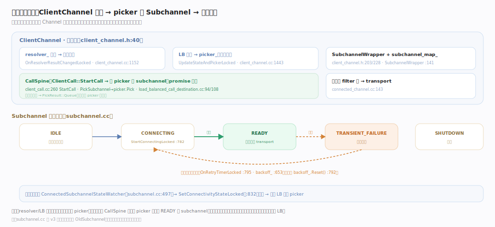
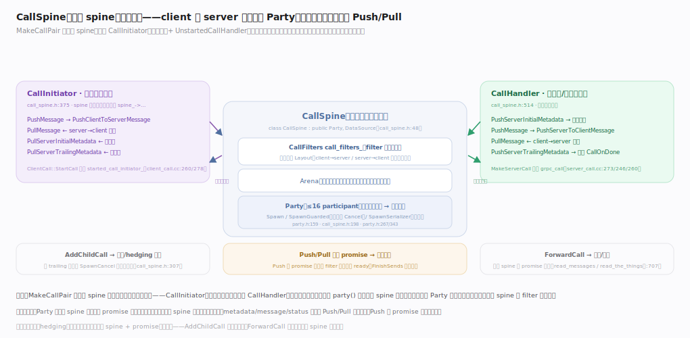

# gRPC 核心原理 · 支撑能力域 · 调用生命周期与 CallSpine

> **定位**：全库灵魂之一——一次调用如何在 `ClientChannel` 内被组织成一条装配线：resolver 结果更新配置、load-balancer 更新出可观察的 `picker`、CallSpine 用 picker 选中一个 `Subchannel`、再下发到 filter 栈与 transport；而 Subchannel 用独立的**连接态机 + 指数退避重连**管理"能不能连上"。核实基准：`src/core/client_channel/client_channel.h`、`client_channel.cc`、`src/core/call/client_call.cc`、`load_balanced_call_destination.cc`、`src/core/client_channel/subchannel.cc`。

## 一、装配线与连接态机

`ClientChannel` 内部三件事持续联动：resolver 出结果更新地址与 service config、load-balancer 消费地址后把新 `picker_`（`PickerObservable`）发布出来、subchannel 由 `SubchannelWrapper` 包装存入 `subchannel_map_`。一次调用经 `ClientCall::StartCall` 发起，`PickSubchannel` 调 `picker.Pick(args)` 选中 subchannel——若无就绪连接返回 `PickResult::Queue`、得新 picker 后重试；选中后经 filter 栈底下发到 transport。

右侧 **连接态机**（Subchannel 独立管理）：`IDLE → CONNECTING → READY`（持一条 transport）或 `→ TRANSIENT_FAILURE → 指数退避后重连 → SHUTDOWN`；连上即 `backoff_.Reset()`，态变化经 watcher 上报触发 LB 重算 picker。核心不变量：控制（选路）与机制（建连）彻底解耦——picker 更新只影响之后的 Pick，已选中连接的在途调用继续在其上跑。

## 二、CallSpine：一个 spine，两侧句柄

真正承载一次调用的骨干是 `CallSpine`（`class CallSpine : public Party, DataSource`，源码称"the common middle part of a call"）：只持一条 `CallFilters`（filter 栈运行态）和一块 `Arena`（与调用同生共死）。`MakeCallPair` 造一个 spine 后切成方向相反的两个视图——`CallInitiator`（客户端持有侧，以客户端立场命名方法）与 `CallHandler`（服务端/下游持有侧，方向恰好相反），两侧从不直接对话、全经 spine 的 filter 栈中转，编译期即杜绝"客户端去写响应头"这类误用。

核心不变量：CallSpine 继承 `Party`——一个 Party 最多 16 个 participant，保证并发但不并行，故 spine 内部状态**无需加锁**；metadata/message/status 沿成对的 Push/Pull promise 双向流动，Push 在下游消费前不 ready 天然形成**背压**，`PushServerTrailingMetadata` 落地即触发 `CallOnDone` 收尾。重试、hedging、代理都是"一条或两条 spine + promise"的组合：`AddChildCall` 派生子调用（父 trailing 落地即 SpawnCancel 全部子调用）、`ForwardCall` 在两条 spine 间搬运消息。

## 深化 · CallSpine / Party 关键锚点

| 环节 | 符号 | 位置 |
|---|---|---|
| spine 本体 | class CallSpine : Party, DataSource | call_spine.h:48 |
| 构造（md + arena 同生死） | CallSpine(ClientMetadataHandle, Arena) | call_spine.h:337 |
| 造 spine 并切两侧 | MakeCallPair → CallInitiatorAndHandler | call_spine.h:682 · :677 |
| 发起侧视图 | CallInitiator | call_spine.h:375 |
| 处理侧视图 | CallHandler / UnstartedCallHandler | call_spine.h:514 · :613 |
| 响应头 Push/Pull | PushServerInitialMetadata / Pull | call_spine.h:149 · :87 |
| 响应消息 Push/Pull | Push/PullServerToClientMessage | call_spine.h:124 |
| 请求消息 filter 落点 | Push/PullClientToServerMessage | call_filters.h:2017 · :2034 |
| 半关闭 / 收尾 | FinishSends / PushServerTrailingMetadata | call_spine.h:137 · :130 |
| 两条消息 Layout | client→server / server→client | call_filters.h:1095 · :1097 · :1720 |
| Party 调度器 | class Party（≤16 participant） | party.h:159 |
| 派发 promise | Spawn / SpawnSerializer | party.h:343 · :267 |
| 守护派发 | SpawnGuarded（失败即 Cancel） | call_spine.h:198 |
| 派生子调用 | AddChildCall（重试/hedging 底座） | call_spine.h:307 |
| 转发调用 | ForwardCall（代理/拦截） | call_spine.h:707 · call_spine.cc:26 |

## 深化 · 装配线关键锚点

| 环节 | 符号 | 位置 |
|---|---|---|
| ClientChannel 本体 | class ClientChannel : Channel | client_channel.h:40 |
| resolver 结果更新 | OnResolverResultChangedLocked | client_channel.cc:1152 |
| LB 更新 picker | UpdateStateAndPickerLocked / picker_ | client_channel.cc:1443 · h:203 |
| subchannel 包装/存池 | SubchannelWrapper / subchannel_map_ | client_channel.cc:141 · h:228 |
| 发起调用 | ClientCall::StartCall / MakeCallPair | client_call.cc:260 · :278 |
| 交下游 | call_destination_->StartCall | client_call.cc:295 |
| 选路 | PickSubchannel / picker.Pick | load_balanced_call_destination.cc:94 · :108 |
| 下发 transport | connected_channel_start_transport_stream_op_batch | connected_channel.cc:143 |
| 服务端造 call | MakeServerCall / Push 响应 | server_call.cc:273 · :246 · :260 |
| 连接态机起连 | StartConnectingLocked | subchannel.cc:782 |
| 退避重连 | OnRetryTimerLocked / backoff_ 初始/Reset | subchannel.cc:795 · :653 · :792 |
| 态上报 | ConnectedSubchannelStateWatcher / SetConnectivityStateLocked | subchannel.cc:497 · :832 |

## 深化 · PickResult 四态

| PickResult | 含义 | CallSpine 动作 |
|---|---|---|
| Complete | 选中一个就绪 subchannel | 在其上创建调用、下发 op |
| Queue | 暂无就绪连接（如都在 CONNECTING） | 挂起，等新 picker 再试 |
| Fail | 不可恢复错误（且非 wait-for-ready） | 立即失败返回状态 |
| Drop | 按策略主动丢弃（如限流） | 直接失败，不重试 |

（`src/core/load_balancing/lb_policy.h:201` `struct PickResult`，Complete :263 / Queue :265 / Fail :267 / Drop :269。）

## 深化 · 通道栈类型（构建期决定装配）

| 栈类型 | 场景 |
|---|---|
| GRPC_CLIENT_CHANNEL | 带 resolver+LB 的完整客户端 Channel |
| GRPC_CLIENT_SUBCHANNEL | subchannel 上的连接级栈 |
| GRPC_CLIENT_DIRECT_CHANNEL | 直连（无 LB）优化路径 |
| GRPC_SERVER_CHANNEL | 服务端连接栈 |

（`src/core/lib/surface/channel_stack_type.h:26` 起。）

## 调优要点

- Subchannel 复用：同一地址的连接由 subchannel 池共享，避免重复建连开销。
- 退避参数（min/max backoff、jitter）影响重连风暴；`min_connect_timeout` 控制单次连接超时。
- wait-for-ready 语义：开启后 Queue 期间调用不立即失败而等待连接就绪，适合弹性服务。
- picker 是"每调用一次 Pick"的热路径，LB 的 Pick 实现应无锁、O(1)。

## 常见误区

- **CallSpine 自己建连接**：CallSpine 只"选"一个已就绪 subchannel，建连是 subchannel 态机独立完成。
- **picker 变化会中断在途调用**：picker 更新只影响之后的 Pick，已选中连接的调用继续在其上跑。
- **连接失败调用立即报错**：默认 Queue/重试，配合退避与 wait-for-ready，短暂抖动可自愈。
- **subchannel 与 Channel 一一对应**：一个 Channel 按解析出的地址持有多个 subchannel，由 LB 在其间选路。

## 一句话总纲

**调用生命周期是 gRPC 的灵魂装配线：ClientChannel 让 resolver/LB 持续把"选谁连"的决策沉淀成可观察的 picker，每次调用经 CallSpine 用当前 picker 挑一个 READY 的 subchannel 再下发到 transport；而 subchannel 用独立的连接态机 + 指数退避重连管理"能不能连上"、并把连接态反馈给 LB——控制（选路）与机制（建连）彻底解耦。**
