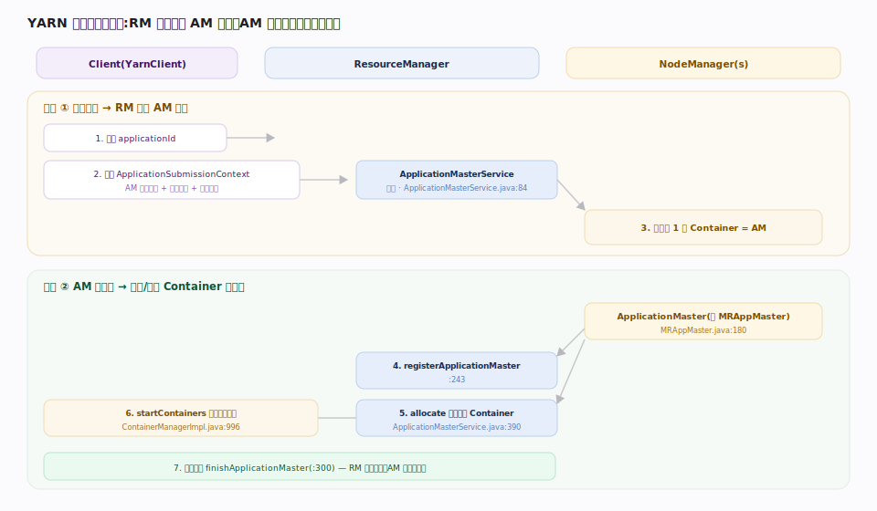

# 接触面 · YARN 应用提交

> **定位**：计算平面的入口。用户程序（MapReduce、Spark、Flink 都一样）经 `YarnClient` 把一个「应用」提交给 ResourceManager，RM 先启动一个 **ApplicationMaster（AM）**容器，之后由 AM 自己向 RM 申请后续资源、由 NodeManager 就地拉起 Container 跑任务。YARN 把「集群资源仲裁」与「应用内部调度」解耦：RM 只管分配资源不管应用逻辑，AM 才懂业务。上承任意计算框架的提交请求，下启 YARN 资源调度与各框架的 AM。

## 应用提交时序 · 两阶段

图示提交的两阶段。**① 提交应用**：client 向 RM 领一个全局唯一 `applicationId`、构造含 AM 启动命令与资源需求的 `ApplicationSubmissionContext` 后提交；RM 经 `RMAppManager` 做队列放置与校验、建 `RMApp` 对象驱动 NEW→SUBMITTED→ACCEPTED 状态机，调度器受理后由 `AMLauncher` 在某个 NodeManager 上启动**第一个 Container 跑 AM**。

**② AM 自调度**：AM 启动后向 RM `registerApplicationMaster` 注册，随后循环 `allocate` 申请/领取 Container（转交调度器，如 `CapacityScheduler`）；拿到 Container 即请对应 NodeManager 就地 `startContainers` 起任务，应用结束调 `finishApplicationMaster`。MapReduce 的 AM 即 `MRAppMaster`，client 侧经 `YARNRunner` 把 job 打包成 YARN 应用。

**不变式**：资源仲裁（RM）与应用调度（AM）彻底解耦——RM 只发 Container、不碰任务逻辑，任何框架实现一个 AM 即可跑在 YARN 上。三处幂等保证重试安全：提交按 `applicationId` 去重、`allocate` 按单调 `responseId` 回放去重、AM 存活靠 `amLivelinessMonitor` 探测。

## 深化 · 提交时序关键入口

| 阶段 | 入口 | 源码 |
|---|---|---|
| 领 appId | `getNewApplication` | `ClientRMService.java:385` |
| 提交（幂等查 :634） | `submitApplication` | `ClientRMService.java:580` |
| 建应用 | `RMAppManager.submitApplication`→`createAndPopulateNewRMApp` | `RMAppManager.java:374`/`444` |
| 启 AM | `AMLauncher.launch`→`startContainers` | `AMLauncher.java:111`/`130` |
| AM 注册 | `registerApplicationMaster` | `ApplicationMasterService.java:243` |
| AM 申请（responseId 幂等 :422） | `allocate` | `ApplicationMasterService.java:390` |
| 起任务 | `ContainerManagerImpl.startContainers` | `ContainerManagerImpl.java:996` |

## 深化 · RM / AM / NM 职责边界

| 角色 | 管什么 | 不管什么 | 源码 |
|---|---|---|---|
| ResourceManager | 全集群资源仲裁、启动 AM、调度 Container | 应用内部任务编排 | `ResourceManager.java:170` |
| ApplicationMaster | 本应用的任务切分、资源申请、失败重试 | 别的应用、物理资源池 | `MRAppMaster.java:180`（MR 的 AM） |
| NodeManager | 本节点资源上报、拉起/监控/杀 Container | 全局调度决策 | `NodeManager.java:100` |

## 失败路径与边界

- **AM 崩溃 → attempt 重试**：AM 失联/退出记一次 attempt 失败，RM 在额度内重拉；上限取 `yarn.resourcemanager.am.max-attempts`（默认 2）与应用自设 `maxAppAttempts` 的较小值，超限则应用置 FAILED。
- **重复提交 → 幂等吸收**：同一 `applicationId` 重复提交只建一次应用，client 因超时重发安全。
- **心跳错位 → 强制重注册**：RM 重启丢 `responseMap` 缓存后，`allocate` 抛 `ApplicationAttemptNotFoundException`/`ApplicationMasterNotRegisteredException`，AM 收到即重新注册续跑。
- **完成态回收**：`RMAppManager` 在完成应用数超 `maxCompletedAppsInMemory` 时淘汰最老者防堆膨胀；重启走 `recoverApplication` 从状态存储回放。
- **资源要不到 → 饿死风险**：`allocate` 只登记需求，队列占满时 AM 长期卡 ACCEPTED/RUNNING，需靠抢占或容量配置化解，非提交链路本身问题。

## 调优要点

- **AM 资源要够但别浪费**：`yarn.app.mapreduce.am.resource.mb` 过小 AM 自身 OOM，过大挤占任务额度。
- **提交端本地资源用共享缓存**：jar/配置作为 LocalResource 分发，`public` 可见性可跨应用复用，减少重复上传。
- **合理设置 AM 最大重试**：`yarn.resourcemanager.am.max-attempts`，AM 挂了 RM 会重拉，但重试上限要匹配作业时长。

## 常见误区

- **误以为 RM 调度任务**：RM 只分配 Container 资源；任务如何切分、跑什么由 AM 决定。这是 YARN 相较老 MRv1 JobTracker 的核心解耦。
- **误以为提交即运行**：提交只是入队；实际运行要等调度器按队列容量分到 Container。
- **误把 AM 当常驻服务**：AM 生命周期 = 应用生命周期，应用结束即退出，不是守护进程。

## 一句话总纲

**YARN 提交是「RM 先给你一个 AM 容器、AM 再自己去要干活的容器」两阶段——资源仲裁与应用调度彻底解耦，任何计算框架只要实现一个 AM 就能跑在 YARN 上。**
