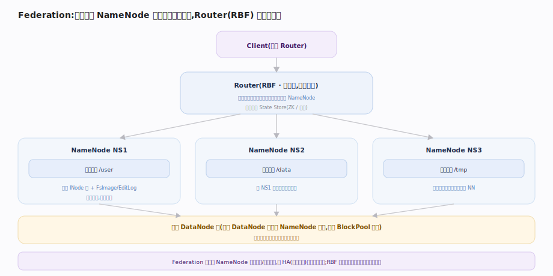

# 支撑 · Balancer 与 Federation

> **定位**：两项让 HDFS 长期健康、横向扩展的运维/架构能力。**Balancer** 解决「各 DataNode 磁盘利用率不均」——把块从满节点搬到空节点，不改副本数、不停服；**Federation（含 Router-based RBF）** 解决「单 NameNode 命名空间与内存上限」——用多个独立 NameNode 各管一部分命名空间，Router 提供统一挂载视图。二者都属后台/扩展能力，被大规模生产集群依赖。

## Balancer · 磁盘利用率均衡

图示 Balancer 的一轮均衡。它是可随时运行的客户端工具（非常驻）：按 `BalancingPolicy`（默认 Node 级）算集群平均利用率，把每个存储组与均值比较，差值超 `threshold`（默认 10%）就归类为**过载 / 高于均值 / 低于均值 / 欠载**四档。

一轮迭代按机架亲和度**分级配对**：先同节点组、再**同机架**（省跨机架带宽）、最后跨机架，配对成功即登记搬迁 `Task` 交给 `Dispatcher`。`Dispatcher` 为每个源节点起并发 mover 线程，每次搬迁封装成 `PendingMove`，走 DataNode 间 `replaceBlock` 拷贝。

**不变式**：搬块在**不破坏放置策略**（两副本不落同机架冲突）前提下「先复制到 under 节点、成功后删原副本」，故中断不丢副本。移动带宽受 `dfs.datanode.balance.bandwidthPerSec` 限流、取块分布经 `getBlocksRateLimiter` 限速，避免打爆 NameNode 与正常读写抢资源。

## Federation 与 Router（RBF）

单 NameNode 的命名空间受限于其内存（所有 INode+块驻堆）。**Federation** 用**多个互相独立的 NameNode**，各管一个 namespace（如 `/user`、`/data`），共享同一批 DataNode。DataNode 侧由 `BlockPoolManager` 为每个 NameNode 维护一个 `BPOfferService`，向所有 NameNode 分别汇报，**块池 BlockPool 按 NN 隔离**（块 id 空间不冲突）。

客户端如何用统一视图？两种：① **ViewFileSystem** 客户端挂载表（`viewfs://`）——挂载点配在客户端；② **Router-based Federation（RBF）**——一层**无状态** Router 服务对客户端「假装」自己就是 NameNode（实现同款 `ClientProtocol`）：每个请求先经 `MountTableResolver` 按**挂载表**把路径解析到目标 namespace，再由 `RouterRpcClient` 转发到正确的 NameNode 并透传结果。挂载表与各 NN 成员信息存在 **State Store**（后端 ZK 或内嵌），Router 无状态可多实例前置负载均衡横向扩展，把挂载逻辑从客户端移到服务端。

## 深化 · RBF 请求路由链

| 环节 | 组件 | 源码 |
|---|---|---|
| RPC 入口（伪装 NameNode） | `RouterRpcServer`（实现 `ClientProtocol`） | `RouterRpcServer.java:235` |
| 路径→namespace 解析 | `MountTableResolver.getDestinationForPath` | `MountTableResolver.java:446` |
| 转发到目标 NN | `RouterRpcClient` | `RouterRpcServer.java:259` |
| 挂载表/成员元数据 | State Store（ZK/内嵌） | `MembershipStore.java` |

## 深化 · Balancer vs Federation

| 能力 | Balancer | Federation/RBF |
|---|---|---|
| 解决什么 | DataNode 磁盘利用率不均 | 单 NameNode 命名空间/内存上限 |
| 改动对象 | 块的物理分布（不改副本数） | 命名空间水平拆分 |
| 形态 | 按需运行的工具 | 多 NameNode + Router 架构 |
| 关键约束 | 不破坏块放置策略 | 各 NN 独立、共享 DataNode |
| 源码 | `Balancer.java:187` | ViewFs / RBF Router |

## 失败路径与边界

- **Balancer 不收敛 / 无进展**：`runOneIteration` 以枚举 `ExitStatus` 表达每轮结果——均衡到位 `SUCCESS`；选不出可搬块 `NO_MOVE_BLOCK`；连续多轮字节无下降 `NO_MOVE_PROGRESS`（防空转）；遇未完成滚动升级 `UNFINALIZED_UPGRADE` 拒绝搬块。外层据此决定再迭代或退出。
- **搬块中途失败可回退**：一次搬迁走「复制到目标 → 成功后删源」，拷贝失败则源副本不删、块位置不变，下一轮重试——对数据安全，不会因中断丢副本。
- **不破坏放置策略是硬约束**：配对时必须保证不把同块两副本挪到同机架/同节点冲突，否则宁可不搬；故高度倾斜且机架受限的集群可能无法完全均衡。
- **Balancer 对 NN 的压力**：取块分布经 `getBlocksRateLimiter` 限速；大集群应低峰运行，否则与正常 RPC 抢 NameNode 处理能力。
- **RBF 的边界**：Router 无状态，单个宕机不影响数据（重连其它 Router）；但 **State Store 不可用**时挂载表无法解析、新请求失败。跨 namespace 的 rename/`getContentSummary` 因涉多个独立 NN 而语义受限或代价高——Federation 各 NN 命名空间独立，**不提供跨 NN 原子事务**。

## 调优要点

- **Balancer 限带宽 + 低峰跑**：`dfs.datanode.balance.bandwidthPerSec` 与 `dfs.balancer.max-size-to-move` 控制影响面；扩容后必跑一次。
- **threshold 按需求设**：默认 10%；追求更均衡设小，但收敛慢、搬得多。
- **Federation 按业务/热度拆命名空间**：把高频小文件目录单独一个 NameNode，隔离内存压力。
- **RBF Router 无状态可多实例**：前置负载均衡横向扩 Router，State Store（ZK/内嵌）存挂载表与配额。

## 常见误区

- **误以为 Balancer 改副本数**：只搬块位置使利用率均衡，副本数不变。
- **误以为 Federation 是 HA**：Federation 是命名空间水平扩展，与 HA（主备容错）正交，可叠加使用。
- **误以为多 NameNode 共享命名空间**：各 NameNode 命名空间**独立不重叠**，靠客户端/Router 挂载拼成统一视图。
- **误以为 Balancer 一次跑完永久均衡**：新写入会再打破均衡，需周期性运行。

## 一句话总纲

**Balancer 在不改副本数的前提下把块从满节点搬到空节点、按机架就近配对求均衡；Federation 用多个独立 NameNode 各管一段命名空间、Router（RBF）拼出统一视图——一个治「数据倾斜」、一个治「命名空间上限」，都与 HA 正交可叠加。**
