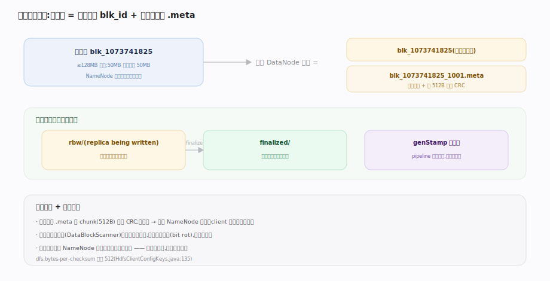
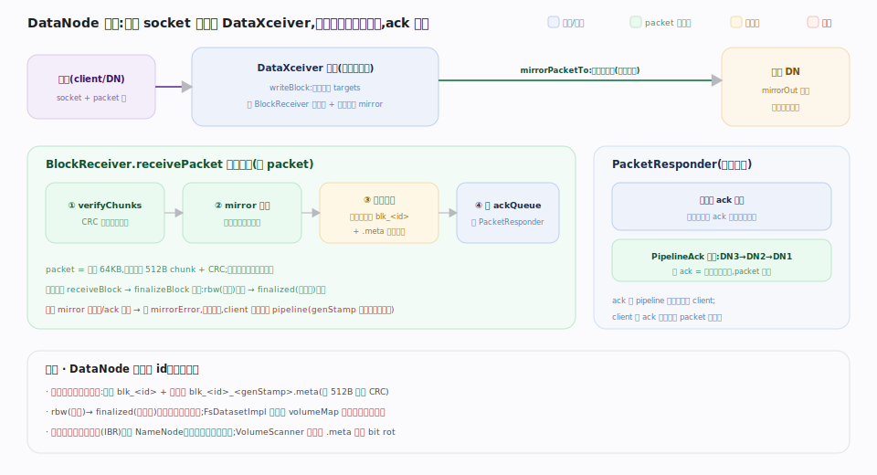

# 支撑 · DataNode 块存储

> **定位**：HDFS 的「体力劳动者」。DataNode 只做一件事——把块（block）的字节存到本地磁盘、按需读出，并向 NameNode 汇报自己有哪些块。它不认识文件、不认识目录，只认识块 id。一个块在磁盘上落成两个文件：数据文件 `blk_<id>` + 校验和文件 `blk_<id>_<gs>.meta`。上承 pipeline 写入的字节流，下启本地文件系统；被文件系统 API、pipeline 写、心跳块汇报强依赖。

## 块的物理布局 · block + .meta

图示一个块在磁盘上的**一对文件**：`blk_<id>`（纯数据）+ `blk_<id>_<genStamp>.meta`（校验和头 + 每 512 字节一个 CRC）。DataNode 主类经 `FsDatasetSpi` 操作块存储，读时用 .meta 逐 chunk 校验、损坏即报坏块切副本。

**不变式**：DataNode 只认块 id 不认文件；块按生命周期分目录（在写 `rbw` / 定稿 `finalized`），`genStamp`（代际戳）随 pipeline 恢复递增以识别过期副本。

## FsDatasetImpl 与卷管理

`FsDatasetImpl` 是 `FsDatasetSpi` 的默认实现，管理本节点所有磁盘（卷 `FsVolumeImpl`）上的块。核心是内存里 blockId→副本元信息（所在卷、状态、字节数）的映射 `ReplicaMap volumeMap`。多块盘时按选卷策略（轮询/可用空间）分散块，充分利用多轴 IO 带宽。

写入先在某卷 `rbw` 目录建临时副本，写满或关闭后 `finalizeBlock` 移到 `finalized` 并加入 `volumeMap`，随后经增量块汇报告诉 NameNode「我这里多了个块」。后台 `VolumeScanner` 扫描线程周期校验 .meta 检出静默损坏（bit rot），可疑块标记优先复查。

## 写块 pipeline · 从 socket 到落盘

图示一条传输连接的写块流水。每条连接起一个 `DataXceiver` 线程，`writeBlock` 解析下游 `targets`、建 `BlockReceiver` 落本地，再向下一 target 建 mirror 连接原样转发，串成 pipeline（client→DN1→DN2→DN3）。核心循环 `receivePacket` 每 packet 四步：**CRC 校验 → 先转发下游 → 本地写数据+.meta → 入 `PacketResponder` 的 ackQueue**；`PacketResponder` 独立线程等下游 ack 到达后合并本节点 ack 逆向回传 client。整块收完 `finalizeBlock` 定稿（rbw→finalized）。

**不变式**：packet 先转发下游再本地写，保证流水线并行推进；ack 逆向逐级合并，全 ack 方为持久。

**不变式**：packet 先转发下游再本地写，保证流水线并行推进；ack 逆向逐级合并，全 ack 方为持久。

## 深化 · 块存储关键机制

| 机制 | 作用 | 源码 |
|---|---|---|
| block + .meta 双文件 | 数据与 CRC 校验和分离，读时逐 chunk 验 | `dfs.bytes-per-checksum=512` |
| rbw / finalized 目录 | 区分在写副本与已完成副本 | `BlockReceiver.java:986` |
| genStamp 代际戳 | 识别 pipeline 恢复后的过期副本 | `BlockReceiver.java` |
| ReplicaMap volumeMap | 内存 blockId→副本位置索引 | `FsDatasetImpl.java:271` |
| 块扫描 | 后台校验和巡检检出 bit rot | DataBlockScanner |

## 失败路径与边界

- **pipeline 中途 DataNode 挂了 → pipeline recovery**：下游 mirror 写失败或 ack 超时时把坏节点踢出，client 侧重建更短 pipeline 续写；恢复时块的 `genStamp` 递增，NameNode 据此作废带旧 genStamp 的过期副本，`rbw` 里对不上的残留被判过期。
- **rbw 未 finalize 的残留**：进程崩溃时 `rbw` 里有半截副本，重启做块恢复对齐长度与 genStamp 后转正，或经 `unfinalizeBlock` 清理，不污染 `finalized`。
- **校验和失配 → 坏块自愈**：读时或后台 `VolumeScanner` 用 .meta 校验发现 CRC 不符即上报 NameNode，从好副本复制补足、删坏副本，无需人工。
- **磁盘/卷故障**：某卷 IO 异常达阈值即标失败、从 `volumeMap` 摘除其上块并汇报丢失触发跨节点复制；`dfs.datanode.failed.volumes.tolerated` 控制容忍几块坏盘后才整节点下线。
- **心跳/块汇报断连**：心跳超时被判 dead，其上块视为丢失并在别处补副本；恢复后全量汇报，多出的副本由 NameNode 调度删除（over-replicated 回收）。

## 调优要点

- **多盘 JBOD 而非 RAID**：HDFS 副本已提供冗余，用 JBOD 让每块盘独立提供 IO 带宽；RAID 反而浪费空间且限速。
- **卷选择策略按可用空间**：盘容量不均时用 AvailableSpaceVolumeChoosingPolicy，避免某盘先满。
- **保留空间给非 HDFS**：`dfs.datanode.du.reserved` 预留系统/临时空间，防写满磁盘。
- **块扫描周期**：`dfs.datanode.scan.period.hours`（默认 3 周）过长则坏块发现慢，过短增 IO。

## 常见误区

- **误以为 DataNode 懂文件**：它只认块 id，文件→块的映射在 NameNode。
- **误以为一个块占满 128MB 磁盘**：块是上限；50MB 文件的块只占 50MB，不预分配。
- **误以为副本损坏要人工修**：读时校验发现坏块→上报 NameNode→自动从好副本复制补齐，无需干预。

## 一句话总纲

**DataNode 只认块不认文件——把每个块存成「数据 + 校验和」一对文件，靠 FsDatasetImpl 的内存 volumeMap 索引多盘副本，写完即增量汇报给 NameNode，坏块靠校验和巡检自愈。**
