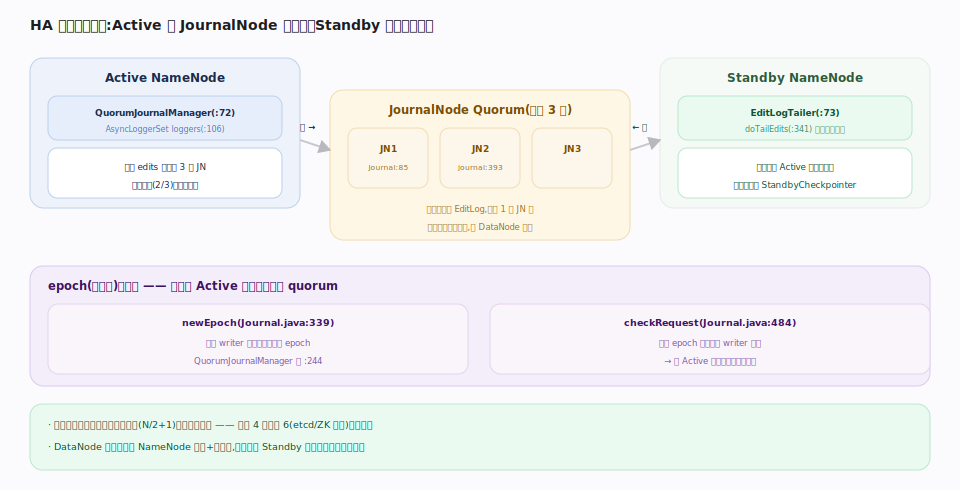
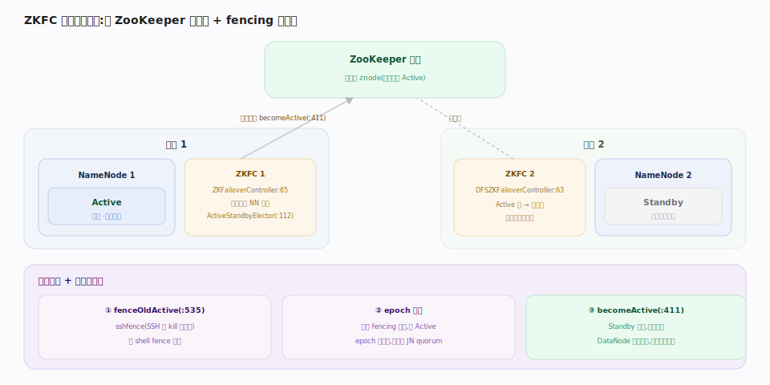

# 支撑 · HA 高可用（Active/Standby + JournalNode + ZKFC）

> **定位**：消除 NameNode 单点故障。HA 让两个 NameNode 一 Active 一 Standby，共享一份通过 **JournalNode 多数派（quorum）**复制的 EditLog；Standby 实时追日志保持内存树同步、随时可接管；**ZKFC** 借 ZooKeeper 做健康监控与自动选主/切换，并用 **fencing** 防脑裂。这是家族 4 与家族 6（etcd/ZK 共识）交汇处——共享编辑日志本质是一个多数派写的复制日志。上承 NameNode 元数据主线，被要求「NameNode 不可单点」的所有生产部署依赖。

## 共享编辑日志 · JournalNode Quorum

Active NameNode 不再只写本地 EditLog，而是通过 `QuorumJournalManager` 把每批 edits **并行写到一组 JournalNode（通常 3 个）**，等待**多数派（N/2+1）**确认才算成功——2/3 成功即可，容忍 1 个 JN 挂。

每个 JournalNode 的 `Journal` 用 **epoch（纪元号）**防脑裂：NameNode 成为 writer 时抢一个更大的 epoch，随后拒绝 epoch 更小的旧 writer 写入——即使旧 Active 未死，它的 epoch 已过期，写不进 quorum，无法产生分裂的日志。

Standby 侧 `EditLogTailer` 循环从 JournalNode 拉取新 edits 重放到自己的内存树，保持与 Active 近实时同步；它同时承担检查点（`StandbyCheckpointer`）。

## ZKFC 自动故障切换 + Fencing

每个 NameNode 旁跑一个 `ZKFailoverController`（HDFS 入口 `DFSZKFailoverController`）：

- **健康监控**：本地探测 NameNode 健康。
- **选主**：用 `ActiveStandbyElector` 在 ZooKeeper 上抢一个临时锁 znode，抢到的晋升为 Active、其余为 Standby。Active 崩溃→锁 znode 消失→Standby 的 ZKFC 感知并抢锁接管。
- **Fencing 防脑裂**：接管前确保旧 Active 不再写——sshfence（SSH 过去 kill 进程）或 shell fence。加上 JournalNode 的 epoch 机制，形成**双重防脑裂**：即便 fencing 失败，旧 Active 也因 epoch 过期写不进 quorum。

DataNode 同时向两个 NameNode 心跳+块汇报，故切换后 Standby 无需重新等块汇报即可服务。

## 深化 · HA 三大件

| 组件 | 职责 | 防脑裂手段 | 源码 |
|---|---|---|---|
| JournalNode Quorum | 多数派复制 EditLog | epoch 递增，拒旧 writer | `Journal.java:85` |
| Standby + EditLogTailer | 追日志保持热同步 + 检查点 | —— | `EditLogTailer.java:341` |
| ZKFC + ZooKeeper | 健康监控 + 选主 + 触发切换 | fencing（sshfence/shell） | `ZKFailoverController.java:411` |

## 调优要点

- **JournalNode 部署奇数个（≥3）**：容忍 `(N-1)/2` 个故障；放在与 NameNode 不同的故障域。
- **fencing 方法要可靠**：sshfence 依赖网络可达，网络分区时可能失败；配 shell fence 兜底，并确保 JN epoch 兜底始终生效。
- **EditLogTailer 追赶延迟**：`dfs.ha.tail-edits.period` 决定 Standby 落后 Active 多久；切换后重放差量即可服务。
- **两 NameNode 堆一致**：Standby 要能装下同样的命名空间，配置对称。

## 常见误区

- **误以为 JournalNode 存数据块**：JN 只存 EditLog（元数据日志），与 DataNode 无关。
- **误以为 fencing 是唯一防脑裂**：epoch 机制才是根本兜底，fencing 是加强；两者叠加。
- **误以为切换要重建块映射**：DataNode 双汇报，Standby 内存已有块映射，秒级接管。
- **误把 Standby 当只读副本对外服务**：默认 Standby 不对外；ObserverNameNode（较新特性）才提供读扩展。

## 一句话总纲

**HDFS HA = 「共享一份 JournalNode 多数派复制的 EditLog + Standby 追日志热同步 + ZKFC 借 ZooKeeper 选主切换」，靠 epoch 递增与 fencing 双重防脑裂——把 NameNode 单点变成秒级可切换的主备。**
