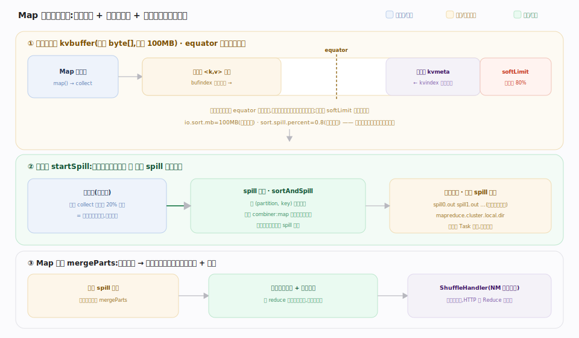

# 支撑 · MapReduce 执行

> **定位**：Hadoop 原生的分布式计算范式，也是「计算贴着数据跑」的典范。一个 MapReduce 作业在 YARN 上表现为一个应用：`MRAppMaster` 作为 AM 向 RM 申请 Container、把作业切成 Map/Reduce Task 调度执行；Map 阶段就近读 HDFS 块、Reduce 阶段经 shuffle 汇聚。它演示了接触面（YARN 提交）+ 存储（HDFS 本地性）+ 调度（YARN）三者如何协同。

## 作业执行流程 · Map → Shuffle → Reduce

client 侧 `JobSubmitter` 先算输入分片（一个 split 通常对应一个 HDFS 块）、把 jar/配置/split 信息上传到提交目录，再经 `YARNRunner` 把作业变成 YARN 应用提交。

RM 启动 `MRAppMaster` 作为 AM：它装配 `RMContainerAllocator` 向 RM 申请 Container，周期心跳 allocate 时**优先申请 split 所在节点/机架**（实现数据本地性），拿到后把 Container 派给待跑的 Map/Reduce Task。每个 Task 容器由 `YarnChild` 作主进程，经 `TaskUmbilicalProtocol` 与 AM 通信领取 Task 并汇报进度，随后跑三阶段：

1. **Map**：每个 split 一个 Map Task，在数据所在（或同机架）节点启动，读块→执行 map→按 key 分区、排序、溢写本地磁盘。
2. **Shuffle**：Reduce 端从各 Map 节点**拉取**属于自己分区的中间数据并归并；Map 端由 NodeManager 的辅助服务 `ShuffleHandler`（默认端口 13562）提供中间文件 HTTP 下载。
3. **Reduce**：拉取+归并后对每个 key 的值集合执行 reduce→输出写回 HDFS（经 pipeline 写，3 副本）。

**不变式**：计算贴着数据跑（Map 就近读块）；中间结果只落 Map 本地磁盘、不进 HDFS，故 shuffle 是 Reduce 端主动 pull。Task 失败由 AM 重试（默认 4 次）；慢 Task 触发**推测执行**（别处跑副本，谁先完成用谁）。

## 深化 · MapReduce 三阶段

| 阶段 | 输入 | 处理 | 输出去向 |
|---|---|---|---|
| Map | HDFS 块（本地读） | map + 分区 + 排序 + 溢写 | Map 节点本地磁盘 |
| Shuffle | 各 Map 的分区数据 | 网络拉取 + 归并排序 | Reduce 节点内存/磁盘 |
| Reduce | 排序后的 <key, values> | reduce | HDFS（pipeline 写 3 副本） |

## 深化 · Map 端环形缓冲区与溢写

图示 Map 输出为何不逐条落盘，而是先进内存**环形缓冲区**再批量排序溢写——MapReduce 性能核心。默认收集器 `MapOutputBuffer`：`io.sort.mb`（默认 100MB）定缓冲大小、`sort.spill.percent`（默认 0.8）定溢写水位。达水位唤醒后台溢写线程、主线程续写剩余空间（写入与溢写并行）；溢写时按 (partition, key) 排序、可选 combiner 做 map 端预聚合压缩量后带校验和写出 spill 文件；Map 结束多路归并成按分区有序的最终文件 + 索引，供 ShuffleHandler 切片下发。

**不变式**：序列化记录与元数据 kvmeta 从 equator 背向共享同一块 `kvbuffer`；溢写与 collect 并行不阻塞主线程；最终输出必按 reduce 分区有序，否则 shuffle 无法按分区切片。

## 深化 · 环形缓冲区参数与阶段

| 环节 | 关键点 | 源码 |
|---|---|---|
| 缓冲大小 | `io.sort.mb` 默认 100MB | `MapTask.java:986` |
| 溢写水位 | `sort.spill.percent` 默认 0.8 | `MapTask.java:985` |
| 触发溢写 | `startSpill` 唤醒后台线程 | `MapTask.java:1601` |
| 排序+预聚合 | `sortAndSpill` + `combinerRunner` | `MapTask.java:1616`/`1675` |
| 归并最终文件 | `mergeParts` 多路归并 | `MapTask.java:1861` |

## 失败路径与边界

- **Task 重试**：单个 Map/Reduce Task attempt 失败（崩溃/异常/心跳超时），AM 在别的节点新起 attempt，上限 `mapreduce.map.maxattempts`/`reduce.maxattempts`（默认 4）；超限则 Task 失败进而作业失败。
- **推测执行（backup task）**：某 Task 明显慢于同批（straggler），AM 在另一节点起**副本 attempt** 并行跑，先完成者采纳、另一个 kill。治慢节点拖尾，但耗资源，非幂等输出场景应关。
- **AM 崩溃 → 作业级恢复**：`MRAppMaster` 也受 YARN 的 `am.max-attempts` 保护；新 attempt 借已完成 Task 的状态（recovery）只补跑未完成部分。
- **shuffle 拉取失败**：Reduce 端拉某 Map 输出连续失败会上报，AM 判该输出不可用（如 NM 宕机）则**重跑对应 Map Task**——这是「中间结果只在本地磁盘」的容错代价。
- **磁盘写满 / spill 失败**：溢写目标是本地盘（`mapreduce.cluster.local.dir`），盘满致 Task 失败并在别处重试；故 shuffle 密集作业要给 NM 配足本地盘。

## 调优要点

- **split 大小定并行度**：一个 split ≈ 一个块，太多小 split 起太多 Map（调度开销），太大丢并行度。
- **combiner 减 shuffle 量**：map 端预聚合（如求和/计数），大幅降低网络传输。
- **推测执行按集群定**：异构/易掉队集群开启治慢节点；资源紧张时关闭省资源。
- **reduce 数量**：太少 reduce 端倾斜，太多小文件多 + 调度开销；按数据量与并行度估。

## 常见误区

- **误以为 Map 数由用户设**：Map 数由输入 split 数决定（≈块数），不是直接配置。
- **误以为 shuffle 是 push**：是 Reduce 端主动 pull 各 Map 的中间结果。
- **误把 MapReduce 当 YARN 的一部分**：MapReduce 是跑在 YARN 上的**一个应用/框架**，MRAppMaster 只是一种 AM；Spark/Flink 同样是 AM。
- **误以为中间数据进 HDFS**：Map 中间输出在本地磁盘，只有最终 Reduce 结果写 HDFS。

## 一句话总纲

**MapReduce 把作业切成「就近读块的 Map + 拉取归并的 Shuffle + 汇聚输出的 Reduce」，由 MRAppMaster 作为 YARN 上的一个 AM 申请 Container 调度执行——它是计算贴着 HDFS 数据跑的范式样板，而非 YARN 的内建能力。**
