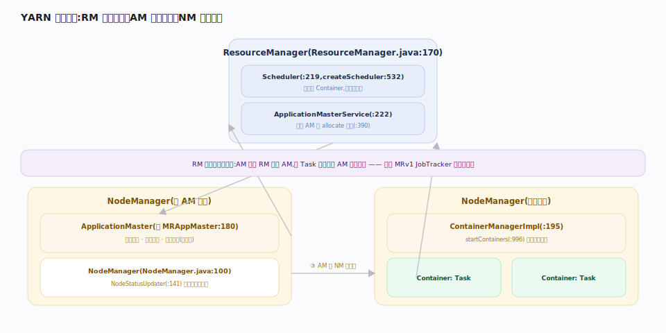
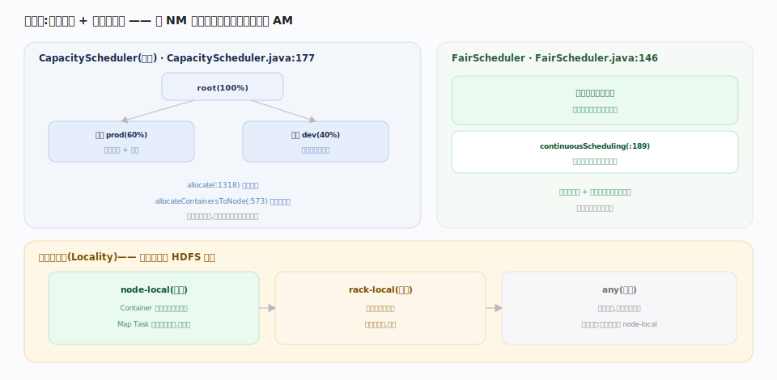

# 支撑 · YARN 资源调度（RM / NM / Scheduler）

> **定位**：Hadoop 的计算平面资源管理层，把「集群资源」抽象成可申请/回收的 **Container**（内存+CPU），在多应用、多队列间公平/按容量分配。核心解耦：**ResourceManager 只管资源仲裁、ApplicationMaster 管应用内部调度、NodeManager 管节点执行**。上承 YARN 应用提交接触面，下启各计算框架（MapReduce/Spark/Flink）的 Container 执行；被 MapReduce 强依赖。

## RM / NM / AM 三方协作

`ResourceManager` 内部 `RMActiveServices` 托管两个关键组件：`ResourceScheduler scheduler`（按配置实例化）与 `ApplicationMasterService masterService`。

三方循环：① `NodeManager` 经 `NodeStatusUpdater` 周期向 RM 心跳，报告本节点可用资源与 Container 状态；② AM 通过 `ApplicationMasterService.allocate` 向 RM 申请资源（要几个 Container、多大、位置偏好）；③ 调度器根据 NM 报上来的可用资源，把 Container 分给 AM，AM 拿到后请 NM `startContainers` 就地拉起进程。

RM **不监控应用内部**——AM 挂了 RM 会重启 AM，但 Task 级失败由 AM 自己处理。

## 调度器 · 队列与容量

调度器是可插拔的，两种主流：

- **CapacityScheduler**（默认）——层级队列，每队列有**容量保证**（如队列 A 40%、B 60%），空闲时可弹性借用别队列资源，繁忙时回收到保证值。它在 NM 心跳（NODE_UPDATE）时把该节点空闲资源分给合适队列的 AM。
- **FairScheduler**——按公平份额动态均分，新应用逐步抢到平均份额；支持 `continuousScheduling` 持续调度而非只在心跳时。

调度考虑**数据本地性**：优先把 Container 分到数据所在节点（node-local）> 同机架（rack-local）> 任意，这样 MapReduce 的 Map Task 能就近读 HDFS 块。

## 深化 · CapacityScheduler vs FairScheduler

| 维度 | CapacityScheduler | FairScheduler |
|---|---|---|
| 分配模型 | 队列容量保证 + 弹性借用 | 公平份额动态均分 |
| 适合场景 | 多租户 SLA、容量隔离 | 交互式 + 批处理混合、快速响应 |
| 抢占 | 支持（回收超用） | 支持（抢回公平份额） |
| 默认 | 是（Hadoop 3.x） | 需显式配置 |
| 源码 | `CapacityScheduler.java:177` | `FairScheduler.java:146` |

## 调优要点

- **队列层级按组织/业务划**：生产队列给容量保证 + 抢占，避免测试作业饿死生产。
- **Container 粒度对齐资源**：`yarn.scheduler.minimum-allocation-mb` 定最小分配单元；过大浪费、过小碎片多。
- **开数据本地性延迟调度**：让调度器为 node-local 等一小会儿，比立刻远程分配更省网络（`yarn.scheduler.capacity.node-locality-delay`）。
- **NM 资源要如实配**：`yarn.nodemanager.resource.memory-mb`/`vcores` 超配会 OOM、欠配会浪费。

## 常见误区

- **误以为 RM 调度 Task**：RM 只分配 Container 资源，Task 编排在 AM。
- **误以为 CapacityScheduler 队列容量是硬上限**：是保证值，空闲时可弹性借用超过保证；繁忙时才回收。
- **误以为 vcore 是物理核绑定**：vcore 是逻辑调度单位，默认不强隔离 CPU（需 cgroup 才硬限）。
- **误以为本地性由 RM 强制**：本地性是 AM 请求的偏好 + 调度器尽力，非保证。

## 一句话总纲

**YARN 把集群资源抽象成 Container，让 RM 只做资源仲裁、AM 做应用调度、NM 做节点执行三权分立；调度器（Capacity 按容量 / Fair 按公平）在 NM 心跳时把空闲资源就近分给 AM——数据本地性让计算贴着 HDFS 块跑。**
