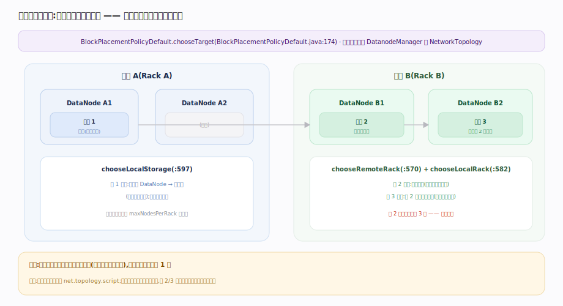
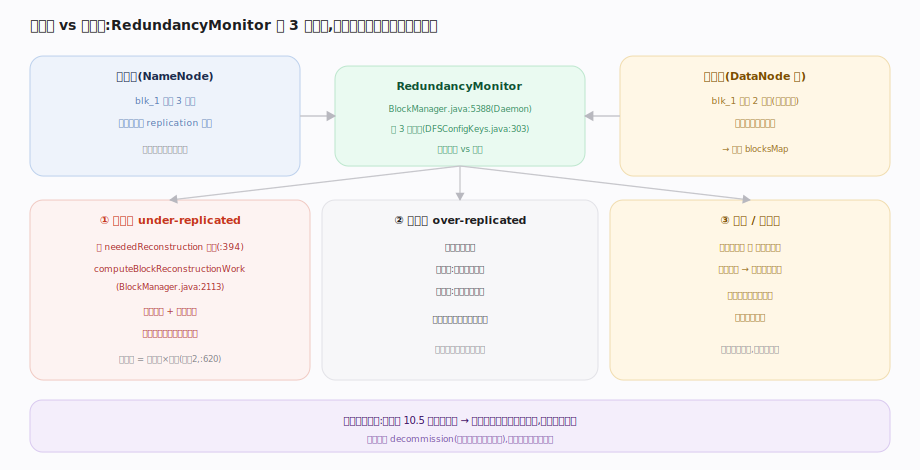

# 支撑 · 块放置与复制策略

> **定位**：决定「一个块的 3 个副本放到哪几台机器」以及「副本少了/多了怎么办」。这是 HDFS 在**可靠性、写带宽、读本地性**之间做权衡的核心策略层，也是家族 4 与计算引擎 tablet 副本调度同构的部分。上承 addBlock 的选点请求，下启 DataNode 存储；被文件系统 API 强依赖、被后台 RedundancyMonitor 持续驱动。

## 默认放置策略 · 机架感知

`BlockPlacementPolicyDefault` 的 `chooseTarget` 实现经典三副本策略：

1. **第 1 副本**：若写入者本身是 DataNode 就放本机（写本地零网络），否则随机一台。
2. **第 2 副本**：放到**另一个机架**的节点（跨机架容灾）。
3. **第 3 副本**：放到第 2 副本**同机架**的另一台（省跨机架带宽）。

这样「一近两远、两机架」：既保证单机架整体故障不丢数据（2 个机架都挂才丢），又把跨机架流量控制在 1 份。每机架副本上限 `maxNodesPerRack` 防过度集中，选点还要过 `isGoodDatanode` 校验（空间、负载、是否退役）。机架信息来自 `DatanodeManager` 的 `NetworkTopology`，由拓扑脚本/表解析。

## 复制监控与欠副本重建

副本数是**期望态**，实际态由块汇报维护，二者靠后台线程对账。`BlockManager` 里的 `RedundancyMonitor`（一个 Daemon 线程）每 3 秒跑一轮：

- **欠副本（under-replicated）**：块进 `neededReconstruction` 队列，选源副本 + 目标节点后下发复制命令（随心跳响应带给 DataNode）。每轮处理量按活节点数 × 倍率（`dfs.namenode.replication.work.multiplier.per.iteration` 默认 2）。
- **过副本（over-replicated）**：删多余副本，优先删磁盘满/同机架冗余的。
- **误副本/损坏**：坏块（读校验失败上报或块扫描发现）标记后从好副本重建。

纠删码（EC）块的重建走类似队列但用编码重构而非整块复制。

## 深化 · 三副本放置逻辑

| 副本序号 | 落点 | 目的 | 源码 |
|---|---|---|---|
| 第 1 | 本地节点（写者是 DN）或随机 | 写本地零网络 | `chooseLocalStorage:597` |
| 第 2 | 另一机架 | 跨机架容灾 | `chooseRemoteRack:570` |
| 第 3 | 第 2 副本同机架另一台 | 省跨机架带宽 | `chooseLocalRack:582` |
| 更多 | 尽量分散、受 maxNodesPerRack 限 | 均衡 + 不过度集中 | `chooseTarget:188` |

## 调优要点

- **必配机架拓扑**：`net.topology.script.file.name` 或 table 映射；不配则全集群一个机架，第 2/3 副本策略退化、无跨机架容灾。
- **复制倍率调重建速度**：大规模节点故障后欠副本多，调大 `replication.work.multiplier` 加快重建，但会占 DataNode 带宽。
- **退役要用 decommission 而非直接下线**：先标 decommission 让 NameNode 把其副本复制走，再停机，避免瞬时欠副本风暴。
- **冷数据用 EC**：纠删码把 3 副本的 200% 开销降到约 50%，代价是重建需读多块 + CPU 编码。

## 常见误区

- **误以为 3 副本放 3 个机架**：默认是 2 个机架（1+2 分布），不是 3 个——为省跨机架带宽。
- **误以为放置在 DataNode 决定**：放置决策全在 NameNode 的 BlockPlacementPolicy，DataNode 只执行。
- **误以为副本恢复是同步的**：欠副本重建是后台异步的，由 RedundancyMonitor 逐轮推进，不阻塞读写。

## 一句话总纲

**块放置 = 「一近两远、跨两机架」的默认策略在可靠性与带宽间取平衡；副本数是期望态，RedundancyMonitor 每 3 秒对账实际态，欠则复制、多则删、坏则重建——全部由 NameNode 决策、DataNode 执行。**
