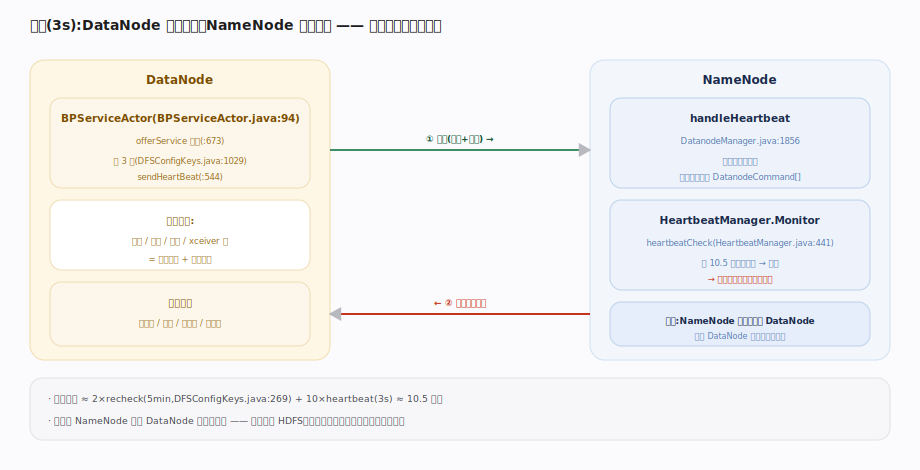
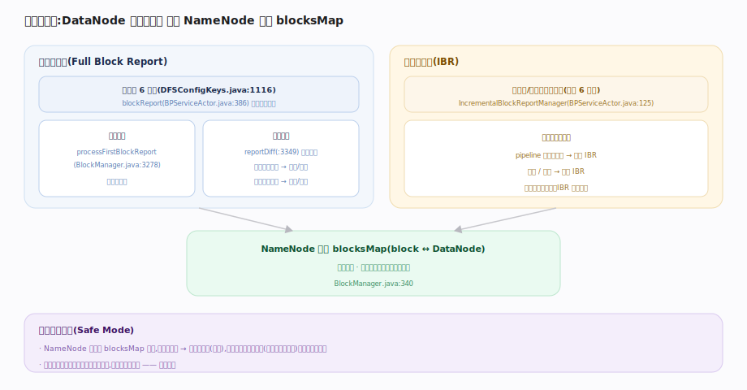

# 支撑 · 心跳与块汇报对账 ★灵魂

> **定位**：NameNode 与 DataNode 之间的「持续对账」机制，是 HDFS 自愈的神经系统。心跳（3 秒）证明 DataNode 活着、顺带背回 NameNode 要它执行的命令；块汇报（全量 6 小时 + 增量即时）让 NameNode 用 DataNode 的**实际持有块**校准内存里的 `block↔DataNode` 映射。这条主线回答了「块映射不持久化，那 NameNode 怎么知道块在哪」——答案就是块汇报重建。被块放置、HA 强依赖，是灵魂主线。

## 心跳 · 保活 + 命令下发

DataNode 侧每个 `BPServiceActor`（一个 actor 对一个 NameNode）在服务循环里每 3 秒（`dfs.heartbeat.interval`）调 `sendHeartBeat` 上报自身容量/使用/剩余/xceiver 数。

NameNode 侧 `DatanodeManager.handleHeartbeat` 更新该节点统计，并**在心跳响应里搭载命令**（`DatanodeCommand[]`）：复制块、删除块、恢复块、重新注册等。这是 NameNode 指挥 DataNode 的**唯一通道**——NameNode 从不主动连 DataNode，全靠「DataNode 来问、NameNode 搭车回令」。

保活判死由 `HeartbeatManager` 的 `Monitor` 线程负责：超过 `2 × recheck(5min) + 10 × heartbeat(3s)`（约 10.5 分钟）没心跳判定 DataNode 死亡，其上所有块进欠副本队列触发重建。

## 块汇报 · 全量 + 增量对账

- **全量块汇报（Full Block Report）**：默认每 6 小时（`dfs.blockreport.intervalMsec`）把本节点所有块列表发给 NameNode。首次汇报直接建映射；后续汇报比对差异——内存有而汇报没有→标记待删/丢失，汇报有而内存没有→加入映射或标记多余。
- **增量块汇报（IBR）**：`IncrementalBlockReportManager` 在块新增/删除时**即时**（不等 6 小时）上报，让映射快速收敛。

启动时 NameNode 进**安全模式**：等块汇报累积到阈值（可用块占比达标）才退出、开放写——因为此时它还不知道块在哪，必须等 DataNode 汇报重建 `blocksMap`。

## 深化 · 心跳 vs 块汇报

| 维度 | 心跳 | 块汇报 |
|---|---|---|
| 周期 | 3 秒 | 全量 6 小时 + 增量即时 |
| 内容 | 存活 + 容量统计 | 持有的块列表 |
| NameNode 动作 | 更新统计、搭车下发命令 | 校准 blocksMap 映射 |
| 缺失后果 | 10.5 分钟判死→块重建 | 映射陈旧、可能误判块位置 |
| 源码 | `BPServiceActor.java:544` | `BPServiceActor.java:386` |

## 深化 · 关键默认值

| 配置 | 默认值 | 源码 |
|---|---|---|
| `dfs.heartbeat.interval` | 3 秒 | `DFSConfigKeys.java:1029` |
| `dfs.blockreport.intervalMsec` | 6 小时 | `DFSConfigKeys.java:1116` |
| `dfs.namenode.heartbeat.recheck-interval` | 5 分钟 | `DFSConfigKeys.java:269` |

## 调优要点

- **大集群错开全量汇报**：数千 DataNode 同时全量汇报会打爆 NameNode，用 `dfs.blockreport.initialDelay` 随机化首次汇报时刻。
- **心跳间隔一般不动**：3 秒是保活与开销的平衡；调小增 RPC 压力、调大延迟故障发现。
- **判死时间可调**：小集群/网络稳定可缩短 recheck 加快故障恢复，但要防网络抖动误判。

## 常见误区

- **误以为 NameNode 主动推命令**：NameNode 永不主动连 DataNode，命令全靠心跳响应搭车下发。
- **误以为块位置持久化**：靠块汇报在内存重建；这就是重启要进安全模式等汇报的原因。
- **误以为全量汇报实时**：全量默认 6 小时一次；实时性靠增量块汇报（IBR）补齐。
- **误把安全模式当故障**：启动时的安全模式是正常的「等块汇报重建映射」阶段，达阈值自动退出。

## 一句话总纲

**心跳（3s）保活 + 搭车下发命令，块汇报（全量 6h + 增量即时）用 DataNode 实际持有块校准 NameNode 内存映射——这套「DataNode 来问、NameNode 回令 + 汇报对账」是块位置不持久化仍能自愈的全部秘密。**
