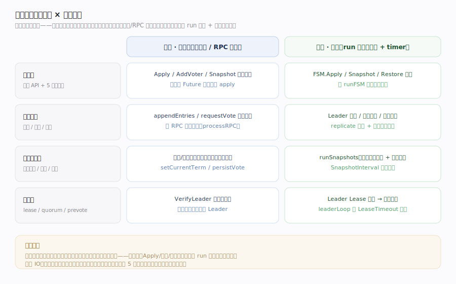
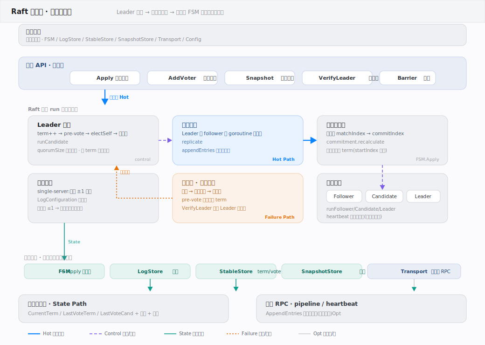
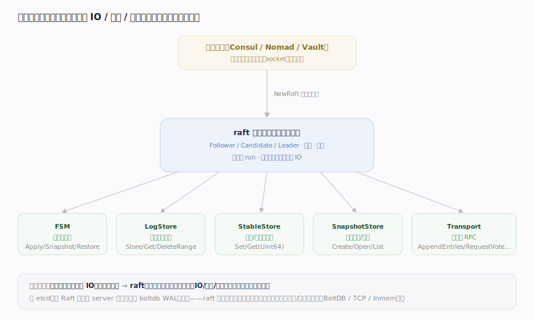
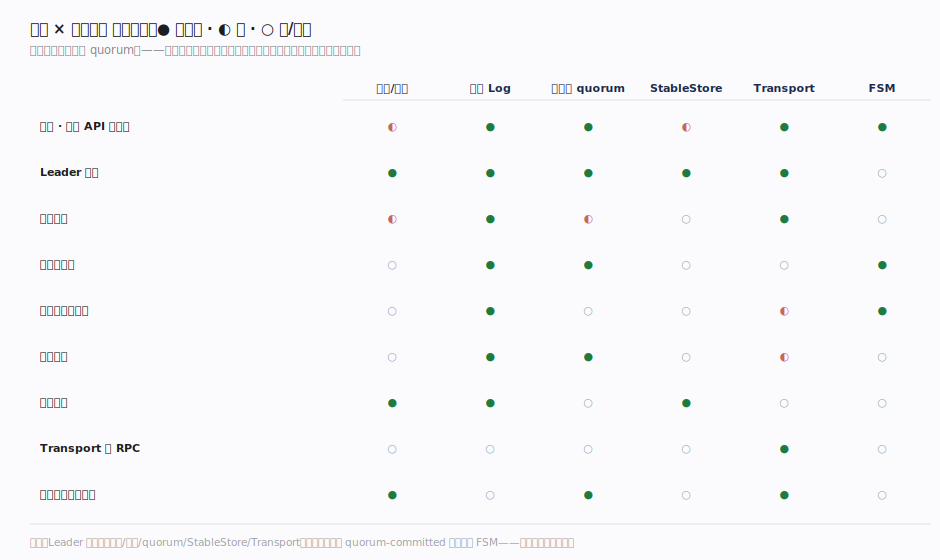
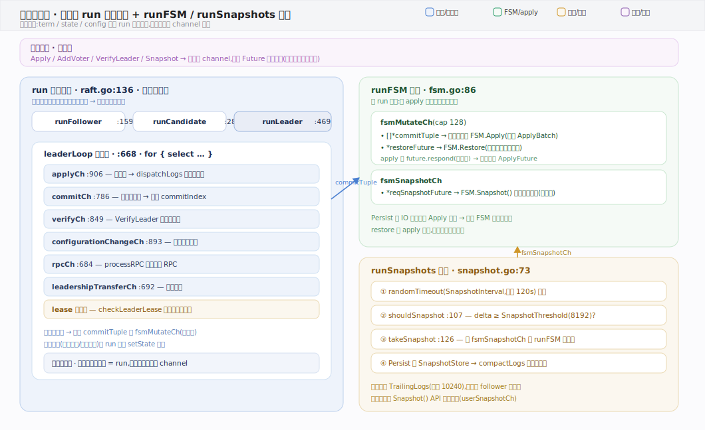

# HashiCorp raft 核心原理 · 全景主线框架

> 统领全部原理文档：HashiCorp raft 的 **1 条接口主线（编程 API 与接口注入）+ 8 条支撑能力域**，既无遗漏也无越界。核实基准 = 本地浅克隆源码 `/tmp/raft-src`（`github.com/hashicorp/raft`，`commit 54badfb`，Go）。raft 是 **可嵌入的 Raft 共识算法库**——不是独立 server，而是被 Consul / Nomad / Vault 等宿主 `import` 后链接进其进程；宿主实现 5 个接口（FSM / LogStore / StableStore / SnapshotStore / Transport）把业务、存储、网络注入进来，库只持有共识状态机。灵魂三条：**多数派日志复制达成线性一致**、**单线程 run 串行驱动三状态机**、**IO/存储/业务全由宿主注入（库不碰真实 IO）**。

## 〇、重要澄清：raft 库 vs etcd 内嵌 Raft（读前必看）

“Raft” 有算法与多个实现，本库指 HashiCorp 的独立库，与 etcd 内嵌的 `go.etcd.io/raft` 定位不同：

| | **hashicorp/raft**（本库） | etcd 的 Raft |
|---|---|---|
| 形态 | **独立可嵌入库**，宿主注入一切 | 内嵌进 etcd server 进程 |
| 存储 | **接口注入**（BoltDB / Inmem 可插拔） | 自带 WAL + boltdb |
| 网络 | **Transport 接口注入**（TCP / Inmem） | 走 etcd 自己的 rafthttp |
| 成员变更 | **单步变更**（一次一个 server） | 支持单步 ConfChange |
| 应用面 | 宿主实现 FSM，`Apply` 提交命令 | etcd 的 MVCC KV apply |

算法本身（选举、日志复制、多数派提交、快照）两者一致；差异在“库 vs 内嵌”“接口注入 vs 自管”。**本库讲 hashicorp/raft。**

---

## 一、双维模型：能力域 × 执行时机

- **能力域**：接口层面向宿主（编程 API + 5 注入接口）；共识核心是选举/复制/提交；状态与存储含持久状态、快照、成员；可靠性域管 lease/quorum/prevote。
- **执行时机**：前台是宿主线程调 `Apply`（阻塞在 Future 上）与 RPC 入站即时应答（`processRPC`）；后台是**单线程 `run`**（`raft.go:136`）跑状态机循环 + 定时器（`randomTimeout(HeartbeatTimeout)` 触发选举、`leaderLoop` 每 `LeaderLeaseTimeout` 自检），以及独立的 `runFSM`、`runSnapshots` 协程（`api.go:636-638`）。**无锁的秘密**：核心状态只由 `run` 单线程改，其余靠 channel 通信。

---

## 二、总架构：库形态 + 接口注入

宿主进程 `import` 本库，用 `NewRaft(conf, fsm, logs, stable, snaps, trans)`（`api.go:508`）注入六件套并启动。核心是 `raft.go` 里的**单线程 `run`**，据当前状态分派到 `runFollower`（`:159`）/ `runCandidate`（`:286`）/ `runLeader`（`:469`）。Leader 通过 `leaderLoop`（`:668`）接收 `Apply` 请求 → `dispatchLogs`（`:1245`）写本地日志并复制到各 follower（`replication.go`）→ `commitment`（`commitment.go`）算出多数派已复制的 index → `processLogs`（`:1296`）把已提交条目送 `fsmMutateCh` → `runFSM`（`fsm.go:86`）调用宿主 `FSM.Apply`。所有真实 IO——日志/元数据/快照落盘、节点间 RPC——都走宿主实现的 `LogStore`/`StableStore`/`SnapshotStore`/`Transport` 接口。

---

## 三、形态：接口注入（宿主提供 IO/存储/业务）

宿主拥有事件循环、磁盘、socket 与业务逻辑；`NewRaft` 注入 5 个接口后，库只依赖接口、不依赖具体实现——测试可注入 `InmemStore`/`InmemTransport`，生产用 `raft-boltdb` + `TCPTransport`。谱系：传统嵌入库自管 IO（难测难嵌）→ **raft 接口注入**（库持共识状态机、IO/存储/业务由宿主实现）→ 与 etcd「内嵌 + 自管 WAL」相对。这种“库形态 + 依赖注入”让同一份共识算法可复用到任意宿主、存储与传输可插拔。

---

## 四、接口 × 核心资源 依赖矩阵

灵魂列是**多数派 quorum**：几乎所有写路径（选举授权、日志提交、成员变更）都强依赖它。日志（Log）与任期（term）是横切一切的骨架资源；Leader 选举踩满任期/日志/quorum/StableStore/Transport 五格；提交与应用把 quorum-committed 的日志喂给 FSM——**多数派是全库咽喉**。

---

## 五、8 条支撑能力域的分层归位

| 层 | 支撑能力域 | 一句话职责 | 源码锚点 |
|---|---|---|---|
| 共识 | **Leader 选举** | term++ / RequestVote / PreVote / 随机超时 / 多数派授权 | `raft.go:1999` electSelf、`:1626` requestVote |
| 共识 | **日志复制** | AppendEntries、nextIndex 回退、pipeline、一致性检查 | `replication.go:137/202`、`raft.go:1458` |
| 共识 | **提交与应用** | 多数派 match 中位数定 commitIndex → FSM.Apply | `commitment.go:88`、`raft.go:1296` |
| 状态 | **快照与日志压缩** | 阈值触发快照、TrailingLogs 保留、InstallSnapshot 追平 | `snapshot.go:73/107`、`raft.go:1837` |
| 状态 | **成员变更** | 单步 AddVoter/RemoveServer，一次一变更（非 joint） | `configuration.go:224`、`raft.go:654/1204` |
| 状态 | **持久状态** | CurrentTerm/LastVote 先落盘、LogStore 存日志 | `raft.go:28-30`、`stable.go:8`、`log.go:112` |
| 传输 | **Transport 与 RPC** | 5 类 RPC 抽象、pipeline、心跳快路径 | `transport.go:31`、`net_transport.go:81` |
| 可靠 | **可靠性与脑裂防护** | Leader Lease、quorum 退位、PreVote、单调任期 | `raft.go:1037` checkLeaderLease、`:1087` quorumSize |

---

## 六、三条贯穿全库的声明

1. **改数据必须走多数派日志复制，元/只读走本地。** `Apply` 把命令编码成日志条目，经 Leader 复制到多数派、`commitment` 确认后才交 `FSM.Apply`；`VerifyLeader` 等线性读前哨向多数派确认自己仍是 Leader，但不写日志。
2. **单线程 run 是无锁的根基。** 核心状态（term、状态、配置）只由 `run` 主线程修改，`Apply`/成员变更/RPC 都投递到 channel 由主线程串行消费；`runFSM`、`runSnapshots` 是分出去的独立协程，用 channel 与主线程解耦。
3. **库只持协议状态机，IO/存储/业务全部注入。** FSM（业务）、LogStore/StableStore/SnapshotStore（存储）、Transport（网络）由宿主实现；库不 new socket、不 open 文件、不定义业务——因此可测、可嵌、存储与传输可插拔。

---

## 七、三协程模型：单线程 run 串行驱动 + runFSM / runSnapshots 旁挂

无锁的根基在这张图里一目了然：**核心状态（term / state / config）只由 `run` 主线程修改**，天然串行、免锁；`Apply`/成员变更/`VerifyLeader`/RPC 全部投递到各自 channel，由 `run` 在 `leaderLoop`（`raft.go:668`）的 `select` 中串行消费。慢活被拆到两个旁挂协程：`runFSM`（`fsm.go:86`）从 `fsmMutateCh` 取已提交日志调 `FSM.Apply`、从 `fsmSnapshotCh` 调 `FSM.Snapshot`，慢 apply 不阻塞共识；`runSnapshots`（`snapshot.go:73`）定时按阈值触发快照并截断日志。三协程只经 channel 通信，是"读多写单、以通信代替共享内存"的教科书式实现。

---

## 常见误区与工程要点

- **把 raft 当独立服务**：它是库，没有 main、没有守护进程；必须被宿主 `import` 并注入接口。
- **以为用 joint consensus**：本库是**单步成员变更**（一次一个 server 增删），靠“上一次配置已提交 + 本任期已提交 no-op”两条件串行化，不是 etcd/论文可选的联合共识。
- **以为库自带存储/网络**：日志、元数据、快照、RPC 全由宿主注入的接口承载；库自身零磁盘、零 socket。
- **把 Apply 返回当“已持久化到多数派后的业务结果”**：`Apply` 返回 Future，需 `.Error`/`.Response` 等待被提交并 apply 后才有结果。
- **忽略 term 与投票必须先落盘**：`setCurrentTerm`/`persistVote` 都是**先写 StableStore 再改内存**（`raft.go` setCurrentTerm 落盘失败直接 panic），否则宕机重启会违反“一任期一票”。

---

## 一句话总纲

**HashiCorp raft 是 Go 的可嵌入 Raft 共识算法库（powers Consul/Nomad/Vault）：宿主用 NewRaft 注入 FSM（业务）+ LogStore/StableStore/SnapshotStore（存储）+ Transport（网络）六件套，库以单线程 run 串行驱动 Follower/Candidate/Leader 三状态机——Leader 把 Apply 的命令写成日志、经 Transport 复制到多数派，commitment 用 matchIndex 中位数定出 commitIndex，已提交条目交 runFSM 调 FSM.Apply；选举靠 term++ 与 RequestVote（PreVote 防扰动）、可靠性靠 Leader Lease + quorum 退位防脑裂、成员靠单步变更、状态靠快照压缩日志——库只持协议状态机，一切真实 IO 由宿主注入，多数派日志复制是达成线性一致的咽喉。**
