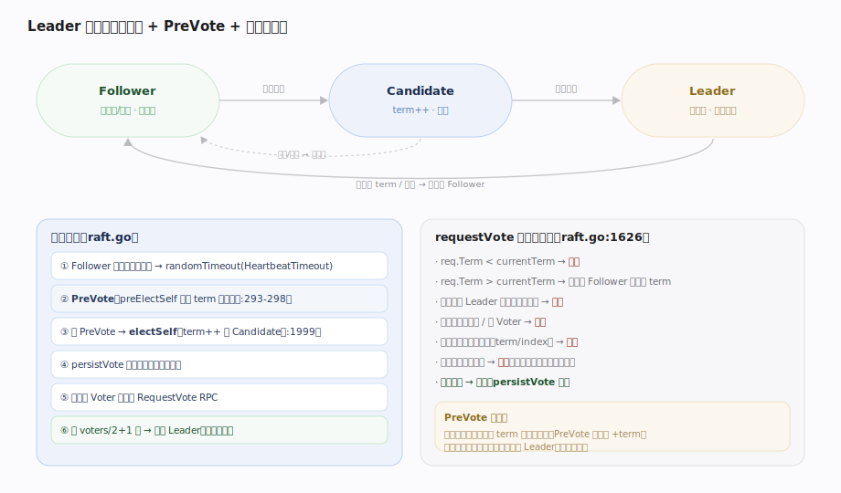

# HashiCorp raft 核心原理 · 支撑能力域 · Leader 选举

> **定位**：共识的起点——保证任一时刻至多一个 Leader。`Follower` 随机超时无心跳 → `Candidate`（`term++`、拉票）→ 得多数派授权 → `Leader`。PreVote 防隔离节点扰动、单调任期 + “一任期一票”保证唯一性。核实基准：`raft.go`（run/runFollower/runCandidate、electSelf:1999、requestVote:1626）、`state.go`、`config.go`。

## 一、三状态机 + PreVote + 多数派授权

**状态机**（`state.go:11-23`）：`Follower`(iota) / `Candidate` / `Leader`，由单线程 `run`（`raft.go:136`）按当前状态分派到 `runFollower`(`:159`)/`runCandidate`(`:286`)/`runLeader`(`:469`)。Follower 在 `randomTimeout(HeartbeatTimeout)`（`:164`）内没收到 Leader 心跳就发起选举。

**PreVote（默认开）**：`runCandidate` 先调 `preElectSelf`（`raft.go:293-298`，`!preVoteDisabled && !candidateFromLeadershipTransfer`）——**不递增 term**，先向多数派探询“若我发起选举能否赢”。赢得 preVote 才真正 `electSelf`（`:1999`）：`term++`、转 Candidate、`persistVote` 先给自己投票（落盘）、向所有 `Voter` 并发发 `RequestVote`。得 `voters/2+1` 票即成为 Leader、立即发心跳压制其他候选人。

**接收方裁决**（`requestVote`, `raft.go:1626`）逐条否决：`req.Term < currentTerm` 拒；`req.Term > currentTerm` 先退位为 Follower 并更新 term；已有已知 Leader 且非领导权转移则拒（避免打扰稳定的 Leader）；候选人不在配置 / 非 Voter 拒；**候选人日志不比自己新拒**（比 LastLogTerm，再比 LastLogIndex，保证只有含全部已提交日志的节点能当选）；本任期已投过别人拒（一任期一票，`keyLastVoteTerm`/`keyLastVoteCand` 落盘保证重启不违反）。

---

## 拓展 · 选举相关状态与超时

| 项 | 值/机制 | 源码 |
|---|---|---|
| 初始状态 | Follower | `state.go:17` |
| HeartbeatTimeout | 默认 1000ms（follower 无心跳阈值） | `config.go` DefaultConfig |
| ElectionTimeout | 默认 1000ms（candidate 无进展阈值） | `config.go` DefaultConfig |
| 随机化 | randomTimeout 在 [T, 2T) 取值 | `raft.go:164` |
| PreVote | 默认开，可 PreVoteDisabled 关 | `config.go:236` |
| 投票持久化 | LastVoteTerm / LastVoteCand | `raft.go:29-30` |
| 当选票数 | voters/2+1 | `raft.go:1087` quorumSize |

---

## 调优要点

- **HeartbeatTimeout / ElectionTimeout**：跨机房高延迟网络需调大（建议远大于 RTT），否则抖动即误判失联、频繁选举。
- **随机化**是防分票的关键：多个 Follower 同时超时会分票，随机区间让它们错峰。
- **PreVote 保持开启**：网络分区恢复时避免旧节点带着高 term 回来强迫现任 Leader 退位。
- **只有 Voter 参与选举**：Nonvoter/Staging 不投票、不被计入 quorum（`electSelf` 只遍历 `Suffrage==Voter`）。

---

## 常见误区与工程要点

- **以为谁先超时谁当选**：还要日志足够新 + 拿到多数票；日志落后的候选人会被拒。
- **忽略“一任期一票”落盘**：`persistVote` 先写 StableStore，宕机重启才不会一个任期投两票。
- **PreVote 会不会拖慢选举**：它只多一轮探询，代价小，换来分区场景的稳定性。
- **把 term 当逻辑时钟以外的东西**：term 只单调递增、用于比新旧与检测过期 Leader，不是时间。
- **Candidate 见到合法 AppendEntries 不退位**：只要对方 term ≥ 自己就退位为 Follower（`appendEntries` 里处理）。

---

## 一句话总纲

**Leader 选举保证至多一个 Leader：Follower 随机超时（HeartbeatTimeout≈1s）无心跳先 PreVote 探路（不加 term、默认开、防隔离节点扰动），赢了才 electSelf——term++、给自己投票并落盘、向所有 Voter 发 RequestVote；接收方按 term 高低、是否已有 Leader、候选人是否在配置且日志足够新、本任期是否已投票逐条裁决，得 voters/2+1 票即成为 Leader 并立即发心跳——单调任期 + 一任期一票 + 日志新度约束共同保证选出的 Leader 含全部已提交日志。**
