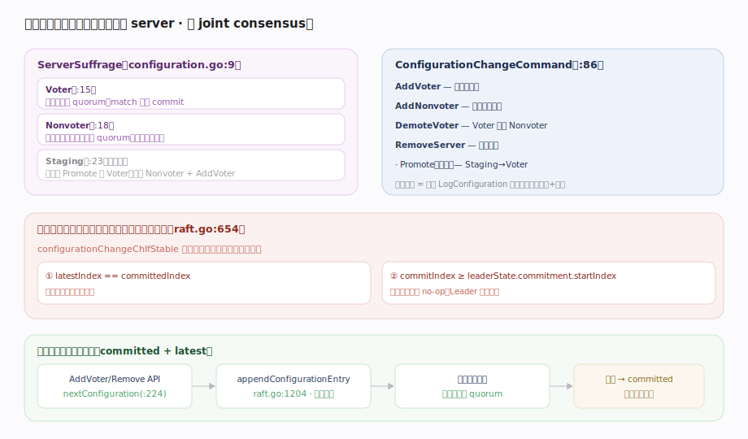

# HashiCorp raft 核心原理 · 支撑能力域 · 成员变更

> **定位**：安全地增删集群成员——本库用 **单步变更（single-server change）**，一次只加/删一个 server，**不是 joint consensus（联合共识）**。靠“上一次配置已提交 + 本任期已提交 no-op”两条件串行化，保证任意相邻配置的多数派必有交集。核实基准：`configuration.go`（ServerSuffrage:9、ConfigurationChangeCommand:86、nextConfiguration:224）、`raft.go`（configurationChangeChIfStable:654、appendConfigurationEntry:1204）。

## 一、单步变更、成员角色与串行化门

**成员角色**（`ServerSuffrage`, `configuration.go:9`）：`Voter`（`:15`，计入选举与 quorum、match 影响 commit）、`Nonvoter`（`:18`，收日志但不投票不计 quorum，适合只读副本/新节点预热）、`Staging`（`:23`，已弃用，追平后 Promote 成 Voter——现改用 `AddNonvoter` 预热后 `AddVoter`）。

**变更命令**（`ConfigurationChangeCommand`, `configuration.go:86`）：`AddVoter`/`AddNonvoter`/`DemoteVoter`/`RemoveServer`/`Promote`（弃用）。每条变更编码成一条 `LogConfiguration` 日志，走正常的复制 + 提交路径。

**串行化门（安全的核心）**（`configurationChangeChIfStable`, `raft.go:654`）：Leader 仅当**两条件同时满足**才接受新配置变更——① `latestIndex == committedIndex`（上一次配置变更已提交）；② `commitIndex >= leaderState.commitment.startIndex`（本任期已提交一条 no-op，Leader 已确立）。这保证**任一时刻至多一个未提交的配置变更**，相邻配置只差一个 server、多数派必有交集，无需 joint consensus 就安全。

**变更流程（两配置追踪）**：`nextConfiguration`（`:224`）由当前配置 + 变更请求算出新配置 → `appendConfigurationEntry`（`raft.go:1204`）写日志并**立即生效**（配置一经追加就用，不等提交——采用 committed + latest 两配置追踪）→ 按新配置复制、计 quorum → 提交后 latest 成为 committed，方可接下一变更。若日志被覆盖回退，`latest` 也回退到 `committed`（见日志复制）。

---

## 拓展 · 成员变更要点

| 项 | 机制 | 源码 |
|---|---|---|
| 变更粒度 | 单 server（非 joint） | `configuration.go:224` |
| 串行化条件① | 上次配置已提交 | `raft.go:654` |
| 串行化条件② | 本任期已提交 no-op | `raft.go:654` |
| 配置生效时机 | 追加即生效（不等提交） | `raft.go:1204` |
| 两配置 | committed + latest | `configuration.go` |
| CAS 保护 | prevIndex 校验 | `configuration.go:224` |
| 移除自己 | Leader 提交后退位 | `leaderLoop` stepDown |

---

## 调优要点

- **加成员先 AddNonvoter 预热**：新节点用 Nonvoter 拉日志/快照追平，再 `AddVoter` 提升，避免拉低可用性。
- **prevIndex 做 CAS**：`AddVoter(id, addr, prevIndex, timeout)` 传上次配置 index，防并发变更相互覆盖。
- **一次一个**：批量换机器要逐个 add/remove，等每步提交；同时改多个会被串行化门挡住。
- **移除 Leader 自己**：会触发 Leader 提交后 stepDown，宿主需处理领导权转移（可先 LeadershipTransfer）。

---

## 常见误区与工程要点

- **以为用 joint consensus**：本库明确是单步变更；joint 是论文/etcd 的另一路线，这里靠串行化门达到同等安全。
- **一次改多个成员**：不允许——串行化门保证同时至多一个未提交变更。
- **配置等提交才生效**：相反，配置**追加即生效**（两配置追踪），这是单步变更安全的前提。
- **Nonvoter 影响 quorum**：不影响——只有 Voter 计入 `quorumSize`（`raft.go:1087`）。
- **忘了 no-op 前提**：新 Leader 未提交本任期 no-op 前不能做成员变更（条件②）。

---

## 一句话总纲

**成员变更用单步变更而非 joint consensus：Voter/Nonvoter/Staging 三种角色，AddVoter/AddNonvoter/DemoteVoter/RemoveServer 各编码成一条 LogConfiguration 日志；Leader 靠“上次配置已提交 + 本任期已提交 no-op”两条件串行化，保证任一时刻至多一个未提交配置变更、相邻配置只差一个 server 故多数派必有交集；nextConfiguration 算出新配置后 appendConfigurationEntry 追加即生效（committed+latest 两配置追踪，回退时 latest 跟着回退），提交后方可接下一变更——预热用 Nonvoter、prevIndex 做 CAS 防并发。**
